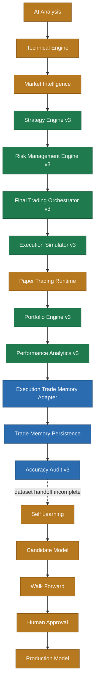

# Phase9 Architecture Audit

## Scope

This audit records Ark Terminal's integration state before Phase9 runtime-mode implementation.

The primary rule is to connect and refactor existing engines rather than introduce duplicate engines.

## Status legend

- **COMPLETE**: implementation exists and focused tests are confirmed
- **CONNECTED**: data flows into the next runtime component
- **IMPLEMENTED_NOT_MERGED**: implementation and CI exist on an open PR, but the change is not yet in `main`
- **PARTIAL**: implementation exists, but runtime, UI, persistence, or downstream integration is incomplete
- **DUMMY**: placeholder or simulated-only implementation
- **NOT_CONNECTED**: component exists but is not wired into the application flow
- **NOT_IMPLEMENTED**: no confirmed implementation found

## Current architecture



## Executive conclusion

The main Phase9 problem is no longer a missing trading engine.

The existing trading core already covers:

```text
Strategy Engine
→ Risk Management
→ Order Proposal
→ Execution Simulator
→ Portfolio Update
→ Performance Analytics
```

Phase8 PR #25 adds and tests:

```text
Execution Result
→ Execution-derived Trade Memory
→ Persistence
→ Accuracy Audit v3 input
```

That PR passed the `Predict Tests` GitHub Actions workflow, but it is still open and not merged into `main`. Therefore the architecture is implemented and tested on the Phase8 branch, but not yet part of the production baseline.

The remaining Phase9 bottleneck is application-level runtime control:

```text
AI / Strategy decision
→ Paper mode gate
→ Safety checks
→ Submit or simulate only
→ Paper execution
→ UI state and audit log
```

## Confirmed findings

### 1. Trading core exists and must be reused

`predict/paper/final-trading-orchestrator-v3.js` already instantiates and uses:

- `StrategyEngineV3`
- `RiskManagementEngineV3`
- `PortfolioEngineV3`
- `PerformanceAnalyticsEngineV3`
- `ExecutionSimulatorV3`
- `TransactionCostEngineV3`

It already supports:

- strategy evaluation
- risk evaluation
- order proposal creation
- order submission
- simulated market processing
- buy/sell portfolio updates
- transaction-cost estimation
- equity-curve updates
- kill switch
- event logging

Phase9 must not introduce a second orchestrator.

### 2. Phase8 execution-memory integration is implemented and tested

PR #25 adds:

- `predict/trading/execution-trade-memory-v1.js`
- `predict/paper/trade-memory-connected-orchestrator-v1.js`
- `predict/analysis/trade-memory-accuracy-v1.js`
- execution-memory unit tests
- persistence-to-accuracy integration tests
- a dedicated `Predict Tests` workflow

The workflow failed once because the YAML referenced a nonexistent `predict/package-lock.json` cache path. The workflow was corrected, and run #2 completed successfully.

Current status: **IMPLEMENTED_NOT_MERGED**.

### 3. Accuracy Audit v3 separates operational and trading metrics

The existing audit separates:

- prediction accuracy
- trade win rate
- BUY performance
- SELL performance
- NO_TRADE counts
- pending outcomes
- reverse-strategy diagnostics

Resolved BUY/SELL outcomes are used for trade performance. NO_TRADE remains visible but is excluded from the trade-win-rate denominator.

### 4. Runtime owner is still incomplete at application level

The engine can analyze, submit, process simulated market data, and update the in-memory portfolio. However, the production UI/runtime still needs one shared owner that determines whether a decision is:

- blocked
- dry-run only
- awaiting manual approval
- automatically submitted to paper execution

This owner should wrap the existing connected orchestrator after PR #25 is merged.

### 5. Learning connection remains partial

The repository contains substantial learning infrastructure, including candidate evaluation, walk-forward validation, promotion gates, rollback, drift detection, and learning reports.

What is not yet confirmed end-to-end is the production runtime handoff:

```text
Execution-derived closed trades
→ approved learning dataset
→ Candidate
→ Walk Forward comparison
→ Human approval
→ Production
```

Automatic production promotion remains prohibited.

## Component status

| Component | Implementation | Tests | Runtime connection | Status |
|---|---:|---:|---:|---|
| AI Analysis | Confirmed | Partial/varied | Partial | PARTIAL |
| Technical Engine | Confirmed | Confirmed in analysis suite | Partial | PARTIAL |
| Market Intelligence v3 | Confirmed | Confirmed | Partial | PARTIAL |
| Strategy Engine v3 | Confirmed | Confirmed | Connected to orchestrator | COMPLETE |
| Risk Management v3 | Confirmed | Confirmed | Connected to orchestrator | COMPLETE |
| Final Trading Orchestrator v3 | Confirmed | Confirmed | Connected internally | COMPLETE |
| Execution Simulator v3 | Confirmed | Confirmed | Connected to orchestrator | COMPLETE |
| Paper Trading runtime mode owner | Not confirmed | Not confirmed | Not connected | NOT_IMPLEMENTED |
| Portfolio Engine v3 | Confirmed | Confirmed | Connected internally | COMPLETE |
| Performance Analytics v3 | Confirmed | Confirmed | Connected internally | COMPLETE |
| Execution-derived Trade Memory | PR #25 | CI success | Branch only | IMPLEMENTED_NOT_MERGED |
| Trade Memory persistence | PR #25 | CI success | Branch only | IMPLEMENTED_NOT_MERGED |
| Accuracy auto-refresh adapter | PR #25 | CI success | Branch only | IMPLEMENTED_NOT_MERGED |
| Accuracy Monitor UI | Confirmed | Audit tests confirmed | Partial | PARTIAL |
| Self Learning | Confirmed | Multiple learning tests | Execution-ledger handoff incomplete | PARTIAL |
| Candidate/Promotion | Confirmed | Confirmed | Separate learning runtime | PARTIAL |

## Accuracy audit observations

No single root cause is asserted.

### Evaluation count

Total evaluations must remain separate from resolved trades. A dashboard count can be large while the actual resolved trade sample remains too small for reliable PF or win-rate conclusions.

### Win-rate calculation

Trade win rate should use only resolved BUY/SELL outcomes. NO_TRADE, HOLD, BLOCK, PENDING, and CANCELLED must not enter the denominator.

### NO_TRADE

NO_TRADE should remain visible as an operational metric because excessive NO_TRADE can indicate thresholds, data quality, market regime, or strategy selectivity issues. It must not be interpreted as a loss.

### Strategy Engine

Phase9 should add distribution reporting for:

- BUY / SELL / HOLD / NO_TRADE / BLOCK frequency
- blocker frequency
- confidence distribution
- AI score distribution
- threshold rejection reasons
- regime-specific outcomes

## Phase9 implementation order

### Part 1 — Architecture Audit

- Update this document after Phase8 CI completion
- Distinguish branch-complete work from `main`
- Confirm the runtime bottleneck
- Freeze the rule that existing engines must be wrapped, not duplicated

### Part 2 — Paper Trading Modes

Add one shared runtime mode:

- `OFF`
- `DRY_RUN`
- `MANUAL_APPROVAL`
- `AUTO_PAPER`

Default: `DRY_RUN`.

Expected behavior:

| Mode | Analyze | Create proposal | Submit paper order | Require approval |
|---|---:|---:|---:|---:|
| OFF | No | No | No | No |
| DRY_RUN | Yes | Yes | No | No |
| MANUAL_APPROVAL | Yes | Yes | Only after approval | Yes |
| AUTO_PAPER | Yes | Yes | Yes | No |

### Part 3 — Safety Layer

Connect or verify:

- Kill Switch
- maximum order count
- maximum holding amount
- minimum confidence
- minimum AI score
- allow list
- duplicate-order prevention
- market-hours gate
- anomaly stop
- persistent order audit log

### Part 4 — Execution Integration

Connect the mode owner to the existing orchestrator and the Phase8 adapter:

```text
Mode Owner
→ FinalTradingOrchestratorV3
→ ExecutionSimulatorV3
→ PortfolioEngineV3
→ TradeMemoryConnectedOrchestratorV1
→ Accuracy Audit
```

### Part 5 — Accuracy Dashboard v4

Display:

- Prediction Accuracy
- Trade Win Rate
- BUY Win Rate
- SELL Win Rate
- Pending
- NO_TRADE
- PF
- Sharpe
- DD
- Reverse Strategy
- resolved-trade sample warning

### Part 6 — Learning Pipeline

Connect execution-derived closed trades to:

```text
Candidate Dataset
→ Walk Forward
→ Candidate comparison
→ Human approval
→ Production
```

No automatic Production update is allowed.

### Part 7 — System Integration Test

Required coverage:

- OFF blocks all actions
- DRY_RUN creates no order
- MANUAL_APPROVAL requires approval
- AUTO_PAPER submits only paper orders
- safety gates block invalid orders
- simulated fills update Portfolio
- fills persist to Trade Memory
- Accuracy refreshes from persisted records
- no broker or real-account path is reachable

## Part 1 Definition of Done

- Architecture diagram updated
- Components classified by implementation and connection status
- Phase8 branch-complete work distinguished from `main`
- Runtime bottleneck identified
- No new engine introduced
- Phase9 Parts 2-7 ordered
- Known limitations documented
- PR summary updated
- Documentation-only change reviewed
