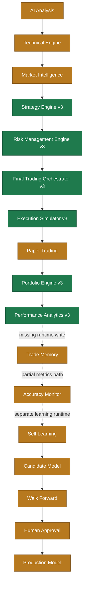

# Phase9 Architecture Audit

## Scope

This audit records the current integration state of Ark Terminal before additional Phase9 implementation.

The goal is to connect and refactor existing engines rather than create duplicate engines.

## Status legend

- **COMPLETE**: implementation exists and has focused tests
- **CONNECTED**: data flows into the next runtime component
- **PARTIAL**: implementation exists, but runtime, UI, persistence, or downstream integration is incomplete
- **DUMMY**: placeholder or simulated-only implementation
- **NOT CONNECTED**: component exists but is not wired into the production application flow
- **NOT IMPLEMENTED**: no confirmed implementation found

## Current architecture



## Confirmed findings

### 1. Trading core exists

`predict/paper/final-trading-orchestrator-v3.js` already instantiates and uses:

- `StrategyEngineV3`
- `RiskManagementEngineV3`
- `PortfolioEngineV3`
- `PerformanceAnalyticsEngineV3`
- `ExecutionSimulatorV3`
- `TransactionCostEngineV3`

The orchestrator already supports:

- strategy evaluation
- risk evaluation
- order proposal creation
- order submission
- simulated market processing
- buy/sell portfolio updates
- transaction-cost estimation
- equity-curve updates
- kill switch
- event logging

Therefore, Phase9 should not introduce another trading orchestrator.

### 2. Core trading flow is connected inside the engine

The following internal flow is confirmed:

```text
Strategy Engine
→ Risk Management
→ Order Proposal
→ Execution Simulator
→ Portfolio Update
→ Performance Analytics
```

This is currently an in-memory engine flow. The remaining issue is application-level orchestration and persistence.

### 3. Accuracy Audit v3 exists

`predict/analysis/accuracy-audit-v3.js` already separates:

- prediction accuracy
- trade win rate
- BUY performance
- SELL performance
- NO_TRADE counts
- pending outcomes
- reverse-strategy diagnostics

It also emits warnings for insufficient trade samples and negative expectancy risk.

### 4. Trade Memory exists, but serves a different input path

The current Trade Memory implementation stores AI trade-gate review history in browser local storage.

Confirmed characteristics:

- records are generated from AI gate review results
- duplicate AI-review records are blocked
- records start as pending
- current UI states that realized PnL evaluation is a later step

This is not yet the same as a complete execution-derived trade ledger.

### 5. Main integration gap

The core missing runtime path is:

```text
Final Trading Orchestrator execution
→ persistent Paper Trade record
→ Trade Memory execution result
→ Accuracy Audit input
→ Self Learning dataset
```

The trading core can simulate orders and update an in-memory portfolio, but no confirmed production application path currently persists those executions and automatically feeds the downstream accuracy and learning layers.

## Component status

| Component | Implementation | Internal tests | Runtime connection | Current status |
|---|---:|---:|---:|---|
| AI Analysis | Confirmed | Partial/varied | Partial | PARTIAL |
| Technical Engine | Confirmed | Confirmed in existing analysis suite | Partial | PARTIAL |
| Market Intelligence v3 | Confirmed | Confirmed | Partial | PARTIAL |
| Strategy Engine v3 | Confirmed | Confirmed | Connected to orchestrator | COMPLETE |
| Risk Management v3 | Confirmed | Confirmed | Connected to orchestrator | COMPLETE |
| Final Trading Orchestrator v3 | Confirmed | Confirmed | Connected internally | COMPLETE |
| Execution Simulator v3 | Confirmed | Confirmed | Connected to orchestrator | COMPLETE |
| Paper Trading UI/runtime | Exists | Not fully confirmed | Not confirmed end-to-end | PARTIAL |
| Portfolio Engine v3 | Confirmed | Confirmed | Connected internally | COMPLETE |
| Performance Analytics v3 | Confirmed | Confirmed | Connected internally | COMPLETE |
| Trade Memory | Confirmed | Confirmed | AI-review path only | PARTIAL |
| Accuracy Monitor | Confirmed | Accuracy audit tests confirmed | Not confirmed from executions | PARTIAL |
| Self Learning | Confirmed | Multiple learning tests exist | Not confirmed from execution ledger | PARTIAL |
| Candidate/Promotion | Confirmed | Confirmed | Separate learning runtime | PARTIAL |

## Accuracy audit observations

No root cause is asserted yet.

### Evaluation count

The audit warns below 30 trade records. The dashboard's larger total evaluation count may include NO_TRADE and non-executed predictions, so total evaluations and resolved trades must be displayed separately.

### Win-rate calculation

Trade win rate should use only resolved BUY/SELL trades. NO_TRADE, HOLD, BLOCK, PENDING, and CANCELLED should not be included in the trade-win-rate denominator.

### NO_TRADE

NO_TRADE should remain visible as an operational metric, but it should not inflate or reduce trade win rate.

### Strategy Engine

The Strategy Engine requires a separate distribution audit for:

- BUY / SELL / HOLD / NO_TRADE / BLOCK frequency
- blocker frequency
- confidence distribution
- score thresholds
- regime-specific outcomes

## Phase9 implementation priority

### Part 1 — Architecture audit

- Preserve this document as the baseline
- Verify production entry points and UI imports
- Identify the actual Paper Trading runtime owner

### Part 2 — Paper Trading modes

Add one shared runtime mode:

- `OFF`
- `DRY_RUN`
- `MANUAL_APPROVAL`
- `AUTO_PAPER`

Default: `DRY_RUN`

The mode must wrap the existing `FinalTradingOrchestratorV3`; it must not duplicate it.

### Part 3 — Safety and audit layer

Connect or verify:

- Kill Switch
- maximum order count
- maximum holding amount
- minimum confidence
- minimum AI score
- allow list
- duplicate-order prevention
- market-hours gate
- anomaly stop
- persistent order audit log

### Part 4 — Execution-derived Trade Memory

Extend the current Trade Memory schema to support actual simulated executions:

- symbol
- action
- quantity
- entry
- exit
- pnl
- holding period
- AI score
- confidence
- risk
- strategy reasons
- technical snapshot
- market intelligence snapshot
- model version
- order id
- cycle id
- timestamps

Do not delete the existing AI-review memory path. Normalize both paths behind one shared record model where practical.

### Part 5 — Accuracy and learning connection

Execution-derived closed trades should feed:

```text
Trade Memory
→ Accuracy Audit
→ Candidate Dataset
→ Walk Forward
→ Human Approval
→ Production Model
```

No automatic Production update is allowed.

## Definition of Done for the next implementation PR

- Existing engines are reused
- No second orchestrator is introduced
- Runtime mode defaults to `DRY_RUN`
- No broker or real-account code is called
- Duplicate orders are blocked
- Simulated fills update Portfolio
- Closed simulated trades persist to Trade Memory
- Accuracy Audit consumes execution-derived records
- Unit tests pass
- Integration tests pass
- Regression tests pass
- CI result is reported
- PR summary lists changed files and known limitations
