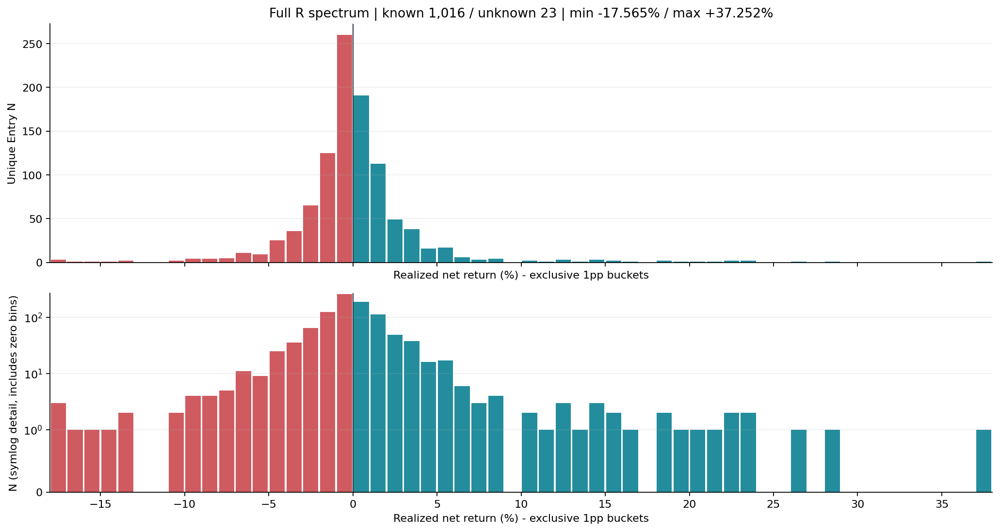
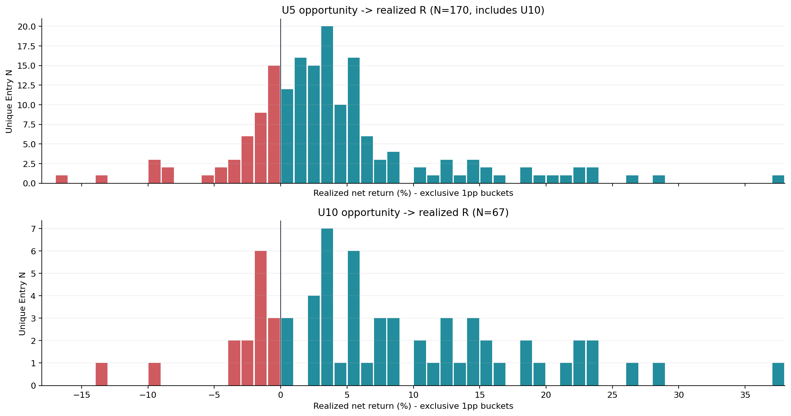
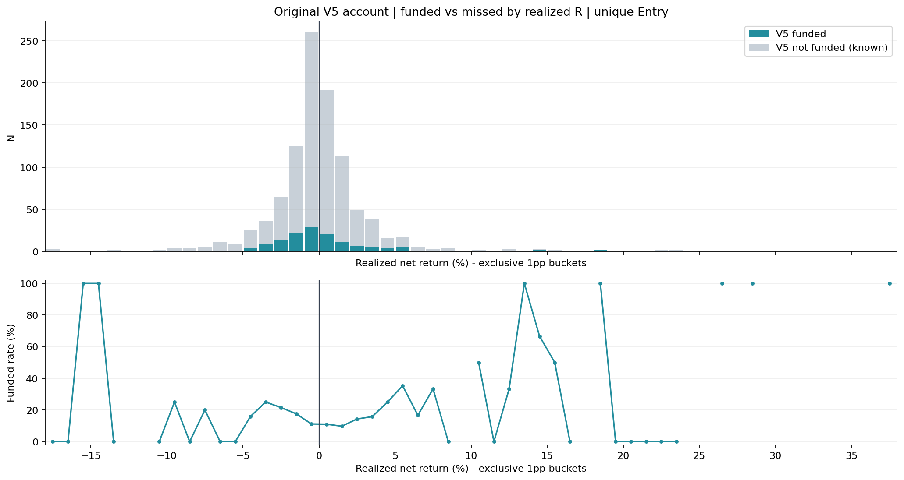
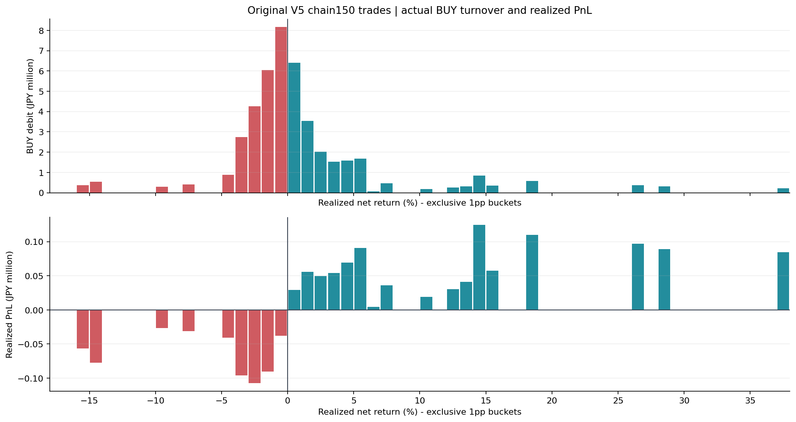
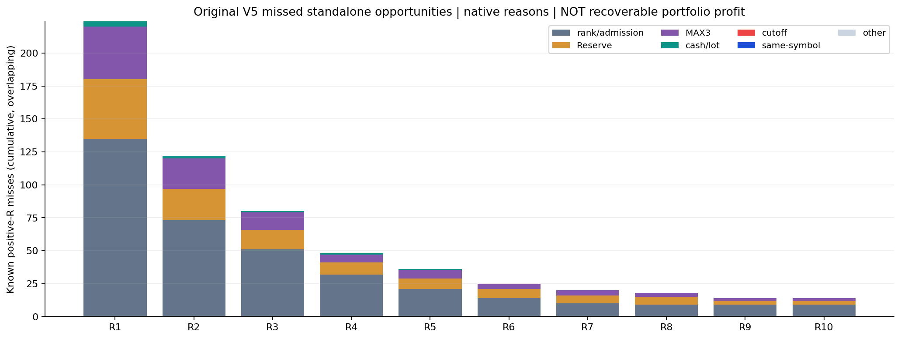
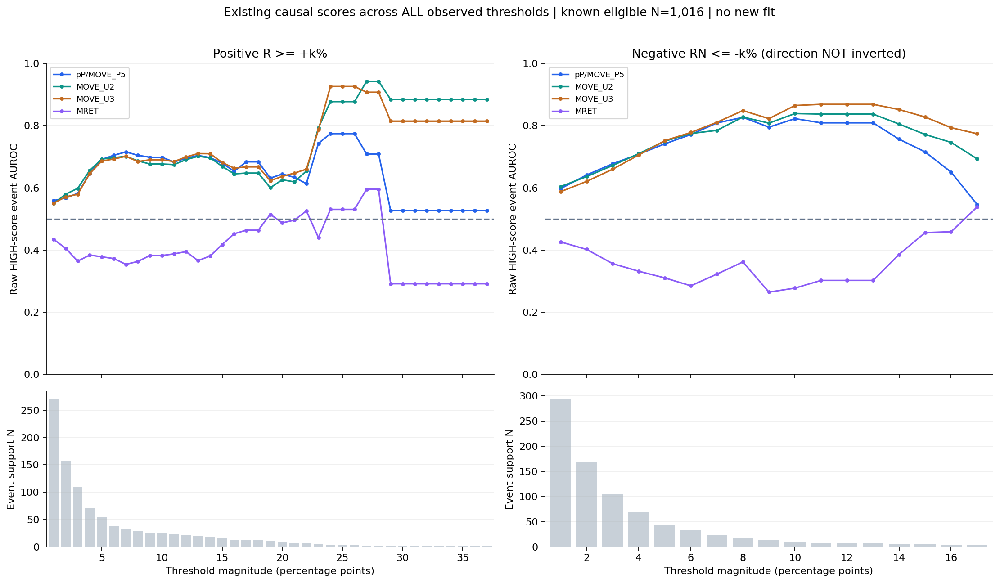

# 📊 Capital Full R-Spectrum Anatomy — 最終報告

実時計JST: 2026-10-06T07:49:45.901859+09:00  
判定: **R_SPECTRUM_INCONCLUSIVE / DIAGNOSTIC_COMPLETE / V5.2未実行**

## 🎯 冒頭回答

R1〜R10、RN1〜RN10の全件数は下表。全Frozen Entry 1,039件のうちknown1,016・unknown23。実観測は−17.565%〜＋37.252%までで、**−18〜＋37の56個の1pp bucketとR37/RN17までの累積grid**を機械生成した。positive462、negative554、exact0は0。平均＋0.1434%だが中央値−0.09995%。これはEntry単体returnであり、portfolio wealthではない。

U5 170件の43件、U10 67件の15件がnegativeへ着地。U5のRN5は8件・RN10は2件、U10のRN5は2件・RN10は1件。U5とU10の最悪はそれぞれ−16.9990%・−13.9279%。Opportunityは実現利益の保証ではない。

V5はnegativeへBUY debit23,691,039.60円、損益−564,508.65円を投じた。全positiveへ20,733,961.80円、利益＋1,041,944.80円。R1/R2/R3/R4/R5/R10の実購入件数・株数・missを全表へ保存。R+ missの最大理由は全帯でrank/admission。rank-pass内ではReserve/MAX3が主要で、closed routeを再開する根拠にはしない。

既存pP/U2/U3はR4〜R10へ順位情報が強まる一方、RN1〜RN10も高score側へ寄る。全曲線から見えるのは正負tail双方の大きさへの情報であり、Win/Lossを安全に分ける証明ではない。MRET原向きは実行適格母集団のR1〜R10とRN1〜RN10でAUROCが0.5未満。さらに遠いtailでは0.5を超える箇所もあるがsupportが小さい。向き反転を行わずrelative diagnosticに留める。V5 funded内では向き・強さが変わり、選択条件による偏りもある。

次の課題はnegativeへの追加lot集中を抑え、既存ゲートを通るpositive全帯への配分を維持できるか。草案は追加lot集中上限1個のみ。ただし良いtailも削るため、V5.2を今すぐ作る価値はまだ立証されていない。新fit、新Capital/EXIT Replay、provider、protected、order、merge、Claudeはすべて0。

## 🧮 全域censusとcontinuous統計

|累積条件|全known N|rank-pass N|V5 funded N|実購入株数|miss N|
|---|---|---|---|---|---|
|R1|271|136|47|46900|224|
|R2|158|85|36|36500|122|
|R3|109|58|29|31400|80|
|R4|71|39|23|25400|48|
|R5|55|34|19|20800|36|
|R6|38|24|13|9100|25|
|R7|32|22|12|9000|20|
|R8|29|20|11|8600|18|
|R9|25|16|11|8600|14|
|R10|25|16|11|8600|14|

|累積条件|全known N|V5 funded N|BUY debit円|実現PnL円|
|---|---|---|---|---|
|RN1|294|53|15,523,557.90|-526,360.25|
|RN2|169|31|9,488,241.75|-436,170.05|
|RN3|104|17|5,232,214.80|-328,867.70|
|RN4|68|8|2,487,743.25|-232,871.25|
|RN5|43|4|1,608,703.95|-191,912.70|
|RN6|34|4|1,608,703.95|-191,912.70|
|RN7|23|4|1,608,703.95|-191,912.70|
|RN8|18|3|1,197,098.25|-160,916.60|
|RN9|14|3|1,197,098.25|-160,916.60|
|RN10|10|2|900,149.85|-134,033.10|

|指標|Entry実現net return|
|---|---|
|平均|0.1434%|
|中央値|-0.1000%|
|最悪|-17.5650%|
|最高|37.2521%|
|Q1|-9.6515%|
|Q5|-4.6351%|
|Q10|-3.1085%|
|Q25|-1.2455%|
|Q75|1.1246%|
|Q90|3.1082%|
|Q95|5.1113%|
|Q99|18.8311%|

累積R/RNは重複する。R10はR5の内数、RN10はRN1の内数で、列を足して機会数や資金を求めない。全tailと空bucketをR_FULL_CENSUS.json/CSVへ保存し、tailを一括化していない。unknownをevent/non-event/Loserへ入れていない。

0付近は−1〜<0%が260件、0〜<1%が191件。raw価格が同じ場合の費用だけによるnet −2/2001（約−0.09995%）と一致するpoint massは62件。exact0がないのは観測結果であり、Loser<=0とRNEG<0の定義は別のまま。

## 🔥 U Opportunity → R Realization

|U群|N|R known|unknown|R1|R2|R3|R4|R5|R10|RNEG|RN1|RN2|RN3|RN5|RN10|0〜<1%|
|---|---|---|---|---|---|---|---|---|---|---|---|---|---|---|---|---|
|ALL_KNOWN_U5|170|170|0|115|99|84|64|54|25|43|28|19|13|8|2|12|
|U5_NOT_U10|103|103|0|66|50|39|26|17|1|28|16|13|9|6|1|9|
|U10|67|67|0|49|49|45|38|37|24|15|12|6|4|2|1|3|
|NON_U5|869|846|23|156|59|25|7|1|0|511|266|150|91|35|8|179|
|U_UNKNOWN|0|0|0|0|0|0|0|0|0|0|0|0|0|0|0|0|

ALL_KNOWN_U5はU10を含む。U5非U10/U10/non-U5/U unknownがUの排他的分割。U5/U10は全件R knownで、R unknown23件はnon-U5に属する。U unknownは0件であり、0補完したものではない。U unknown群の全bucketも保存した。U5/U10をR予測精度と呼ばない。

## 💴 V5資金・数量・拘束時間

|実funded帯|N|株数|BUY debit円|PnL円|拘束分合計|資金×拘束時間 円分|
|---|---|---|---|---|---|---|
|RPOS|68|63600|20,733,961.80|1,041,944.80|12388|3,860,665,568.10|
|RNEG|82|93700|23,691,039.60|-564,508.65|14241|3,824,125,307.10|
|RN1|53|60600|15,523,557.90|-526,360.25|10508|2,849,592,984.45|
|RN2|31|32900|9,488,241.75|-436,170.05|7203|2,092,479,416.85|
|RN3|17|23200|5,232,214.80|-328,867.70|3443|931,347,040.80|
|RN5|4|9200|1,608,703.95|-191,912.70|885|316,339,590.75|
|RN10|2|5100|900,149.85|-134,033.10|389|149,102,814.15|
|R1|47|46900|14,327,760.30|1,012,865.55|9328|2,920,305,022.80|
|R3|29|31400|8,764,079.85|907,282.05|5534|1,710,307,426.35|
|R5|19|20800|5,652,524.85|783,955.30|2998|897,997,374.30|
|R10|11|8600|3,451,825.05|652,821.60|2080|718,437,239.10|
|0〜<1%|21|16700|6,406,201.50|29,079.25|3060|940,360,545.30|

元V5旧chainの一意Entry150件・157,300株をreuse。BUY debit総額44,425,001.40円は38 selected sessionsにわたる繰返し売買のturnoverであり、同時保有資金でも20連続営業日の月次値でもない。実現PnLは＋477,436.15円、recycle cash使用6,728,380.05円。資金×拘束時間の単位は円分。funded slotは1/2/3が41/59/50件で、各BUY直後のconcurrent occupancy。時刻は固定の時刻帯で集計した。

0〜<1%帯へのdebit6,406,201.50円から利益29,079.25円。小幅利益は一律悪い候補ではない。どの帯も実quantityのcredit/debitで分類し、100株referenceと実funded returnの一致を確認した。slot、時刻、native allocation band、recycle、拘束の全facetはV5_R_CAPITAL_FLOW.jsonに保存した。

保有全期間のconcurrent occupancyも保存curveへjoinした。tradeごとのholding minuteで平均2.3494、BUY debit×拘束時間で重み付けすると2.3237。全R帯の値はV5_R_OCCUPANCY.json/CSVへ保存。position-minuteは保有tradeの観測単位で、portfolio minuteの独立標本ではない。

未funded候補には実購入quantityがないため、回収可能株数はnull。reference100株はlabel単位であり、全missを同時に購入できた量や回収可能利益ではない。

## 🚧 Positive R miss reason

|条件|miss N|rank/admission|Reserve|MAX3|cash/lot|cutoff|same-symbol|その他|
|---|---|---|---|---|---|---|---|---|
|R1|224|135|45|40|4|0|0|0|
|R2|122|73|24|23|2|0|0|0|
|R3|80|51|15|13|1|0|0|0|
|R4|48|32|9|6|1|0|0|0|
|R5|36|21|8|6|1|0|0|0|
|R6|25|14|7|4|0|0|0|0|
|R7|20|10|6|4|0|0|0|0|
|R8|18|9|6|3|0|0|0|0|
|R9|14|9|3|2|0|0|0|0|
|R10|14|9|3|2|0|0|0|0|

各known R+は現在実行適格。cutoff0件という表示は、cutoff以降11件のRがunknownであることと分離する。unknown by native reasonは{"CAPITAL_EOD_ENTRY_CUTOFF": 11, "MAX_POSITION_CAP": 2, "UPWARD_BELOW_BASELINE": 10}。nativeの最初の阻害reasonを保存し、二次的な原因や全回収可能性を推定していない。

## 🧠 既存causal scoreの全曲線

|event|N|pP|MOVE_U2|MOVE_U3|MRET|
|---|---|---|---|---|---|
|R1|271|0.559286|0.549776|0.550970|0.434478|
|R2|158|0.567518|0.579822|0.571236|0.405705|
|R3|109|0.582301|0.598485|0.579327|0.364332|
|R4|71|0.646203|0.656383|0.646158|0.383784|
|R5|55|0.691552|0.692801|0.686406|0.378261|
|R6|38|0.704983|0.697180|0.692821|0.372619|
|R7|32|0.715606|0.701474|0.701632|0.353976|
|R8|29|0.704958|0.686965|0.684729|0.363344|
|R9|25|0.698446|0.676771|0.690373|0.382321|
|R10|25|0.698446|0.676771|0.690373|0.382321|
|RN1|294|0.597645|0.604377|0.587752|0.426108|
|RN2|169|0.641561|0.636447|0.620966|0.401948|
|RN3|104|0.677716|0.672297|0.660162|0.356159|
|RN4|68|0.708380|0.710257|0.705836|0.331782|
|RN5|43|0.741748|0.750305|0.752050|0.310428|
|RN6|34|0.771654|0.774979|0.778304|0.284953|
|RN7|23|0.808923|0.785104|0.811025|0.322606|
|RN8|18|0.826987|0.827989|0.848809|0.361612|
|RN9|14|0.795480|0.808383|0.822854|0.264614|
|RN10|10|0.822863|0.839264|0.865109|0.277535|

分母はknown実行適格1,016。rank-pass内492・funded150の全曲線も保存。原score高方向でRN event AUROCを計算し、逆数や-scoreへ切り替えていない。特にRNの高AUROCは「高scoreほど損失eventへ順位が寄る」という意味。

既存pP training-rank HIGH/LOWでは、R3率13.04%/8.37%、RN3率15.37%/4.98%。低score側に深いRNが増えるという仮説は支持されない。pPのRN3とRN5は8/8 blockで原向きAUROC>0.5、RN10は定義可能5/5 block。R5も8/8で>0.5。両側の順位情報を同時に保持して読む。

R1〜R3は全母集団のAUROCが概ね0.55〜0.60、R4〜R10では概ね0.65〜0.72へ強まるが、positive supportは271→25へ減る。極端なtailはR37=1件、RN17=3件で新Gateの根拠にできない。MRET fixed-rM HIGH側はRN率が低いがpositiveも低く、funded subsetでは逆にR1の原向きAUROC0.5555となる。選択・support・方向の変化をabsolute-loss defense成立へ読み替えない。

SCORE_R_STRATA.csvに原8block/session別のknown/unknown・event率・全4頭AUROC、SCORE_R_FIXED_BUCKETS.csvにnative S/A/B/C・既存pP band・training由来r/rM halfの全event率を保存。q2/q3には正式固定rank bucketがないため、新quantileを作らなかった。既存R5/R10の744個のAUROCセルをreuseし、新fit/再認証/bootstrapは0。

## 🔁 保存RESET20との接続

|window|final cash円|RNEG debit比率|R3+比率|R5+比率|R10+比率|
|---|---|---|---|---|---|
|W13|1,126,452.85|51.93%|18.01%|11.91%|4.11%|
|W14|1,145,355.75|51.07%|19.80%|12.21%|4.83%|
|W15|1,199,393.40|52.38%|16.89%|10.77%|4.91%|
|W16|1,239,139.15|51.21%|17.76%|11.62%|6.39%|
|W17|1,249,800.75|51.90%|18.99%|12.49%|7.00%|
|W18|1,288,307.35|49.31%|21.27%|12.75%|7.29%|
|W19|1,303,682.80|46.19%|21.25%|12.20%|7.53%|
|W20|1,256,361.35|49.36%|18.50%|11.82%|6.99%|
|W21|1,245,688.10|52.16%|19.53%|10.78%|7.41%|

予定21窓を保持し、12coverage-blockedはR_flow/final cash=null。7月11日・14日の調査は反復していない。新reset Replayは0。9口座は重複する市場期間なので独立標本ではない。記述Pearson相関はRNEG debit比率対cash−0.6285、R3+＋0.5263、R5+＋0.2023、R10+＋0.9425。R10を新Gateとして選んだり、因果効果・有意差・将来性能を主張しない。

## 🔍 独立監査・実施量

独立経路はsaved debit/creditを整数の比へ直し、cross multiplicationで全境界と負のfloorを再判定。known partition、累積単調性、U row totals、quantity/debit/PnL、holding、slot、全reset終点、unknown mask、既存R5/R10一致を確認した。main analytical関数・EXIT/Capital engine・allocatorをimportしていない。全4raw scoreのR1/RN1はpairwise AUROCで照合。

|確認|結果|
|---|---|
|独立チェック|82,100項目・不一致0|
|known/unknown|1,016/23|
|V5 trade|150件|
|reset complete/blocked|9/12|
|mechanical derived labels|1 logical batch・1 completed output|
|技術修復|unknown metadata読取り1回、旧public session summary→既存private full support読取り1回|
|新fit/refit/calibration|0|
|新Capital candidate/Replay・EXIT rematerialization|0/0/0|
|provider/protected/order/main merge/force push/Claude|すべて0|

技術修復はTECHNICAL_RECEIPT.jsonに保存。成功済みderived1039行を再生成せず、strategy・mask・固定grid・原本Rを変えなかった。修復後は既存完成Rを読み、表作成を続けた。元providerのhistorical arrivalはUNKNOWNのままで、verifiedへ昇格していない。

## 🧭 次の1機構と終了判定

**R_SPECTRUM_INCONCLUSIVE**。Economic relevanceとsupportは十分あるが、既存scoreで悪いR帯を選んで資金を抜き、良いR帯へ増額する因果的な分離が弱い。拒否済みV5.1・closed Reserve・Rank cutoff・Quality Pareto・MRET throttleは保持。

草案は初回BUY内の100株を超える追加lot集中上限のみ。ACTUAL_LOT_TRANCHE_FLOW.jsonは実約定済みtrancheを分離した記述表で、新上限のwealthではない。上限値・式は未固定。NEXT_CAPITAL_DECISION.mdにdonor/receiver、cashのみ解放する制約、利益tailを削る副作用、次Workの未決事項を記載した。今回はV5.2を実装・Replayしない。V5 baseline維持、productionReady=false、改善・200万円到達の新claimなし。

実購入の100株超部分は、RNEGではdebit18,089,040.00円・PnL−441,768.05円、RPOSではdebit13,917,655.35円・PnL＋721,721.30円。native water-fillそのものは全150件で700株・debit269,134.50円に留まる。従って問題をwater-fillだけと決め打ちしない。これらは既存約定を部分へ分解した値であり、数量変更後の新しいcash/購入集合/最終資産ではない。

## 💾 保存

JSON/CSVを数値正本、上図を補助とする。private identity/symbol別のjoinはprivate ZIPへ隔離し、公開GitHubはaggregateのみ。開始・contract、census、score/capital、finalを実時計JST付きcheckpointへ保存し、actual GETのcommit/tree/blob/本文検証をGITHUB_READBACKS.jsonと最終receiptへ記録する。旧V5/V5.1 Evidenceはread-only。
