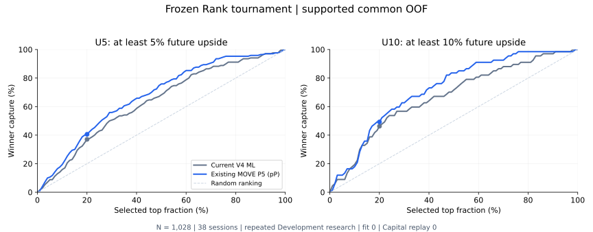

| Rank | U5 AUC | U5 PR-AUC | U10 AUC | U10 PR-AUC | Top20 U5 | Top20 U10 | Top20 <2 | Status |
|---|---:|---:|---:|---:|---:|---:|---:|---|
| LEGACY_CURRENT (N=1039) | 0.6642388141 | 0.2523417924 | 0.6863829003 | 0.1325809992 | 30.2885% | 14.9038% | 42.7885% | 原値固定 |
| SUPPORTED_ONLY_CURRENT (N=1028) | 0.6604278075 | 0.2524176053 | 0.6831037321 | 0.1326034946 | 30.5825% | 15.0485% | 42.2330% | Control保持 |
| EXISTING_MOVE_P5 / pP (N=1028) | 0.7096462361 | 0.3052111937 | 0.7402425956 | 0.1591181324 | 33.4951% | 16.0194% | 39.3204% | RANK_VNEXT_STRONG |
| PRR_HEAD5 | — | — | — | — | — | — | — | NOT_COMPARABLE |
| PRR_HEAD10 | — | — | — | — | — | — | — | NOT_COMPARABLE |

最終statusは **RANK_VNEXT_STRONG**。`selectedRankCandidate = EXISTING_MOVE_P5`。保存済みU5モデルの`pP`順をRank Research Candidateとして固定した。新fit **0/8**、Capital / Control / MAX3 replay **0**。Stage BのMOVE_P10とBIGWIN_DUAL_RANKは生成していない。

作成: 2026-10-05T01:17:23.164218+09:00。既存58 Development sessionsの20 warmup /38 OOFを再利用したITERATIVE_DEVELOPMENT_EVIDENCEであり、fresh/OOSの成功は主張しない。Selector / Entry / EXITは永久Freeze、変更0。

同一identity・同一teacher・同一maskで比較した。Current1039件のlegacy値は完全再現した。Primaryはpre15:20の1,028件（U5=170件、U10=67件）。全pre-cutoff候補1,578件のうち550件はwarmupで、score未保存のためOOF比較対象ではない。旧ML<1、C、Liquidity rejectは除いていない。

A1は保存済み`pP`（直接U5 score）を使う。既存MovementのP-AUCが使ったfieldに対応する。以前のCapital score `pP/baseP`や既存Top20 enrichmentの並びを、この比較へ置き換えていない。pPは順位付け専用で、確率校正・Capital sizing・admission・新rank-bandの権限は与えない。

U5/U10の全point gate、low-upside guard、6/8 block改善、catastrophic block failure 0、integrity gateを通過した。block1/2のU5は小幅悪化を維持し、結果救済を行っていない。

| Block | N | Current U5 AUC | MOVE U5 AUC | ΔU5 | Current U10 AUC | MOVE U10 AUC |
|---|---:|---:|---:|---:|---:|---:|
| 1 | 133 | 0.604013 | 0.574529 | -0.029484 | 0.739247 | 0.692652 |
| 2 | 133 | 0.743363 | 0.731858 | -0.011504 | 0.717687 | 0.716553 |
| 3 | 136 | 0.498018 | 0.641081 | +0.143063 | 0.713867 | 0.779297 |
| 4 | 131 | 0.592920 | 0.715831 | +0.122911 | 0.668182 | 0.792424 |
| 5 | 132 | 0.703773 | 0.843503 | +0.139730 | 0.648185 | 0.791331 |
| 6 | 146 | 0.703175 | 0.774206 | +0.071032 | 0.540476 | 0.758333 |
| 7 | 140 | 0.758391 | 0.760127 | +0.001736 | 0.707541 | 0.713883 |
| 8 | 77 | 0.718821 | 0.751701 | +0.032880 | 0.597959 | 0.732653 |

catastrophicの事前定義: U5またはU10のblock AUCがCurrent>=0.5からcandidate<0.5へ落ち、delta<=−0.10。定義はR4で固定した。

| Session-cluster bootstrap delta (MOVE−Current) | Point | 95% CI | Positive replicates |
|---|---:|---|---:|
| U10_AUC | +0.057139 | [-0.000316, +0.115546] | 97.3487% |
| U10_PR_AUC | +0.026515 | [-0.028216, +0.067762] | 83.0415% |
| U5_AUC | +0.049218 | [+0.010152, +0.088643] | 99.4497% |
| U5_PR_AUC | +0.052794 | [+0.002397, +0.098321] | 98.0990% |

38 session単位のpaired bootstrap、seed=5701005、1999/1999 valid。U5 AUC CI下限>0で指定のSTRONG条件を満たす。U10のCIは0を跨ぐため、U10の改善はpoint比較として報告する。これは新しい独立データでの検証ではない。

| Rank | Top fraction / K | U5 density | U10 density | <2 contamination | U5 capture | U10 capture | NDCG |
|---|---|---:|---:|---:|---:|---:|---:|
| Current | 10% / 103 | 26.2136% | 12.6214% | 45.6311% | 15.8824% | 19.4030% | 0.272429 |
| Current | 20% / 206 | 30.5825% | 15.0485% | 42.2330% | 37.0588% | 46.2687% | 0.386727 |
| Current | 30% / 309 | 27.8317% | 12.2977% | 45.9547% | 50.5882% | 56.7164% | 0.433862 |
| MOVE P5 | 10% / 103 | 32.0388% | 11.6505% | 38.8350% | 19.4118% | 17.9104% | 0.334325 |
| MOVE P5 | 20% / 206 | 33.4951% | 16.0194% | 39.3204% | 40.5882% | 49.2537% | 0.444825 |
| MOVE P5 | 30% / 309 | 30.7443% | 13.5922% | 41.1003% | 55.8824% | 62.6866% | 0.500426 |

Top K=ceil(fraction×N)。NDCGはordinal gain=0,1,3,7,15、discount=1/log2(rank+1)。診断指標であり、winner priorityの変更には使っていない。

| Ordinal bucket | Population N | Current Top20 density | MOVE Top20 density | Current mean rank percentile | MOVE mean rank percentile |
|---|---:|---:|---:|---:|---:|
| >=10 | 67 | 15.0485% | 16.0194% | 0.671337 | 0.724803 |
| 5-<10 | 103 | 15.5340% | 17.4757% | 0.609760 | 0.642847 |
| 3-<5 | 127 | 16.5049% | 16.9903% | 0.574282 | 0.563701 |
| 2-<3 | 135 | 10.6796% | 10.1942% | 0.527390 | 0.540019 |
| <2 | 596 | 42.2330% | 39.3204% | 0.439738 | 0.427403 |

両scoreの平均rank percentileは >=10 > 5–<10 > 3–<5 > 2–<3 > <2。個々の候補が完全にこの順序へ分離するという意味ではない。

| Rank | Session Top K | Selected N | U5 density | U10 density |
|---|---:|---:|---:|---:|
| Current | 3 | 114 | 29.8246% | 13.1579% |
| Current | 5 | 190 | 31.0526% | 15.2632% |
| MOVE P5 | 3 | 114 | 33.3333% | 16.6667% |
| MOVE P5 | 5 | 190 | 33.1579% | 14.7368% |

Session top3/top5は全日候補を順位付けしたdiagnostic only。時刻順のMAX3競合、cash/lot、Allocation、Capital returnは評価していない。

| Teacher support | U5 | U10 |
|---|---:|---:|
| OOF1039: KNOWN_POSITIVE | 170 | 67 |
| OOF1039: KNOWN_NEGATIVE_COMPLETE_CAPTURE | 858 | 961 |
| OOF1039: UNSUPPORTED_UNKNOWN | 0 | 0 |
| OOF1039: NOT_MATURE | 11 | 11 |
| OOF1039: SOURCE_UNAVAILABLE | 0 | 0 |
| OOF1039: CONTRACT_AMBIGUOUS | 0 | 0 |

Strictly-later actual Highのない54件は全てcomplete capture・terminal pagination・Entry sourceを持つ。32件のpre-cutoffは原本契約のempty-future complete-capture規則でKNOWN_NEGATIVE_COMPLETE_CAPTURE、22件のcutoff以降はNOT_MATUREとしてPrimaryから除いた。OOF内の該当29件は18件の確認済みnegativeを保持し、11件を除外した。UNKNOWN→0補完0、teacher上書き0。

Entry boundaryはFrozen fill timestampのまま。first intentより遅いEntryは608件あるが、Rankを過去のfirst intentへbackdateしていない。Core bar_end<=Entry、Movement source minute<Entry、prior session<Entry sessionを監査した。historical actual arrivalはUNKNOWNのままで、継承済みbar_end availability仮定のもとでの因果監査である。live as-of実証は行っていない。

PRR canonical 1614件のうちCurrent1028件とsession/symbol/minuteだけが一致する候補は260件（90件は複数arm row）。しかしteacher分母がeffective Entry、今回はraw Entryであり、policy/fold lineageも異なる。両headは全Current候補についてNOT_COMPARABLE。無理なjoin・target変換・PRR再fit0。既存POTENTIAL_SKILL_FAILを維持する。

| Calibration diagnostic (associated U5 head only) | Brier | Logloss |
|---|---:|---:|
| Current saved p5 | 0.13761998 | 0.51478929 |
| MOVE saved pP | 0.13460027 | 0.50992794 |

MLは確率ではないためML自体にBrier/loglossを当てていない。U10学習headは作っていないためU10 Brier/loglossはnull。CalibrationをRank選定Primaryへ使っていない。

| Prior work | Existing Evidence | This Work policy |
|---|---|---|
| capital-bigwinner-one-shot-20261004-v1 | S Winner5=23.53%, A=31.39%; nonmonotone high band | CORE U5 logistic refit forbidden; fit/replay0 |
| capital-vnext-v2-movement-20261004-v1 | Saved CORE/MOVE P-AUC 0.653023/0.709646; MOVE_P5 reused | MOVE_P5 and MOVE_R refit forbidden; fit/replay0 |
| capital-max3-top3-quality-v3-20261004-v1 | Q1-Q8 FAIL; TOP3_SELECTION_WORSE; CAPITAL_QUALITY_V3_WORSE | HF1/HL0/Q rescue forbidden; fit/replay0 |
| capital-max3-upward-staircase-v4-20261004-v1 | Current exact ML legacy U5 AUC=.6642388140526637, U10=.6863829003132487 | Current H2/H3/H5 refit forbidden; fit/replay0 |
| capital-v4-rank-cutoff-independent-20261004-v1 | A U5/U10 density exceeds S; Rank and Capital policy distinct | S_ONLY/A_PLUS/B_PLUS replay forbidden; fit/replay0 |
| phase57-prr-numerical-recovery | 1614 IM/R1, canonical ranking PASS; probability skill FAIL remains | 566-feature refit and forced join forbidden; fit/replay0 |
| capital-v5-max3-slot-intelligence-20261004-v1 | Existing slot-reserve research fixed; out of Rank-only scope | Reserve/replay changes forbidden; fit/replay0 |
| capital-v6-counterfactual-slot-value-20261004-v1 | CAPITAL_V6_RECOVERY_D11_CLOSED_FIXED_STOP; final receipt-only records retained | Dynamic Slot Value fit/replay/teacher regeneration forbidden; fit/replay0 |

| Lineage | SHA256 |
|---|---|
| Current frozen score | `c446633dec923e3a80a534b19325ccff49f769a2ff1d29c7af1202202de614d4` |
| MOVE frozen score | `14c48e61554bd58c6d5289b410d6a8c859cb37efd0dbc5d98987fcb440aac2ed` |
| Frozen teacher | `005e194cae26898d74ea95c3aea8464517f7b71d330e53d1a2ad05c767b89322` |
| Common mask | `e369d4000ec1c9083cc428a3a318c5d936763ee5497f2dca06213e52ec9e89d8` |
| Ordered common identity | `57f3dd7d400072c82611e769bf5102dfd096a68f82e6c1c6a089db7eebd63d56` |
| Feature manifest | `efba2449967d937b6fd5b45067cbb4237fea8ede7e66905c148ba0b756769235` |
| Selected Rank contract | `6e8687f36f6f60fc9e9921e1ef29e0520cf1ea8bc01f14386963f1020b209518` |
| Independent audit | `786023537004c97ab5adf0ea45265318155f2826ce3e95c896ddc823441dc92c` |
| MOVE_P_BLOCK_01.json | `06d02117257e680fcdb6b8466e68ffe24c53def7c163dc3187ec7fcde24c735d` |
| MOVE_P_BLOCK_02.json | `b66b79491db7f82e17cecb9121845ef52732fc73e19465e7f5778e4fff10b8e5` |
| MOVE_P_BLOCK_03.json | `35a43ae0c8a9390e2ab8b18ae741f05d0149582c000cc9a186f6e4869d9c1403` |
| MOVE_P_BLOCK_04.json | `287b177dfe5db98998270af3f1591ff158ccdb1ce34318027d0cd8043dee2db6` |
| MOVE_P_BLOCK_05.json | `eb5a9bb3452234b6db8ce125afe03b7f4b1a9cbde6f7722f4b56bd0571c56e65` |
| MOVE_P_BLOCK_06.json | `fa7246fd8ecc09f060e3e2133da8d4e7ddddb62cfecfbfed64f49c46448d49f8` |
| MOVE_P_BLOCK_07.json | `bdb1902a0c23f1eed8aa32368adbcc28ba77b28e8551d7ff2c63d21e2bbc2272` |
| MOVE_P_BLOCK_08.json | `b3f58f92a16fe70c5726d4029cdd3ffca355c064bf87ed7e27ced3387d5467b8` |

別経路Fraction/scalar audit: **37,518 checks、mismatch 0**。Primary evaluatorをimportせず、identity、known/unknown、OOF、保存score hash、順序/tie、ROC/AP、Top10/20/30、contamination、NDCG、capture curve、block、bootstrap input/CI、statusを再計算した。float tolerance=1e−12、count/order/identity tolerance=0。train-percentile/dualはStage B未実行のためNOT_APPLICABLE。

共有されたFrozen source・fitted artifacts・RNG APIのI/O依存は残る。独立計算一致は外部source真実性やproduction certificationの保証ではない。

| Budget / Safety | Result |
|---|---|
| Existing MOVE_P5 fits | 8 historical artifacts reused; refit 0 |
| New fits / MOVE_P10 / search / retune | 0 / 0 / 0 / 0 |
| Capital / Control / MAX3 / MAX4–5 replay | 0 / 0 / 0 / 0 |
| Selector / Entry / EXIT changes | 0 / 0 / 0 |
| Provider / Claude / protected / fresh / holdout / validation / OOS / prospective open | all 0 |
| Orders / main merge / force push | 0 / 0 / 0 |
| executionAllowed / brokerWriteAllowed / excelOrderWriteAllowed / rssOrderFunctionAllowed | all false |
| liveTradingAllowed / paperTradingAllowed / automaticPromotionAllowed / productionUpdateAllowed / transmitted / productionReady | all false |

次Workテーマは「Frozen Rank vNextを使い、MAX3で大Winnerを落とさないAllocation」。その別Workで初めてcurrent/later candidate、slot opportunity cost、U5/U10 preservation、MAX3 conflict、rolling20を評価する。ここで固定したpP順・feature/model/split/teacherとSelector / Entry / EXITは変更しない。Rankからadmission/slot reserveの閾値は新設していない。次Workはlatest GET、既存Evidence監査、Allocation policyのprecommitから開始する。

このWorkのNorth Starは維持したが、100万円→20 sessionsや38-session Final Equityを新candidateで計算していない。

**Rankだけ固定した。Allocator/Capitalの価値はまだ未評価**
