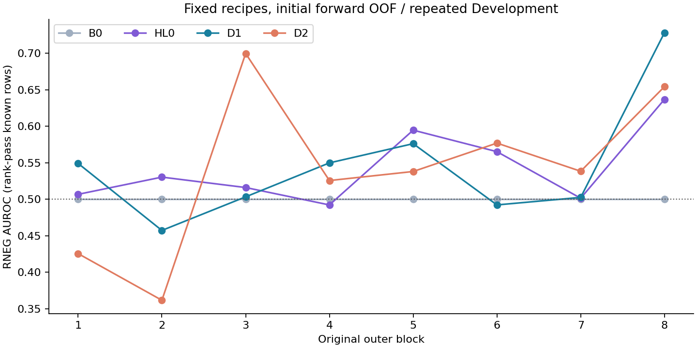
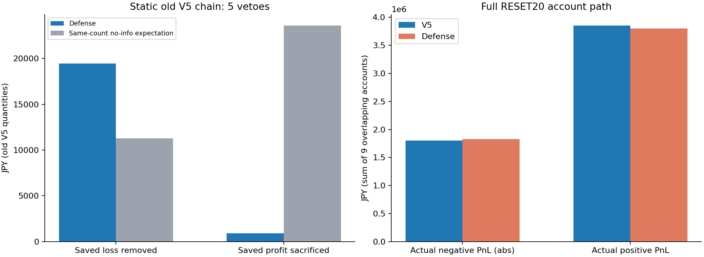
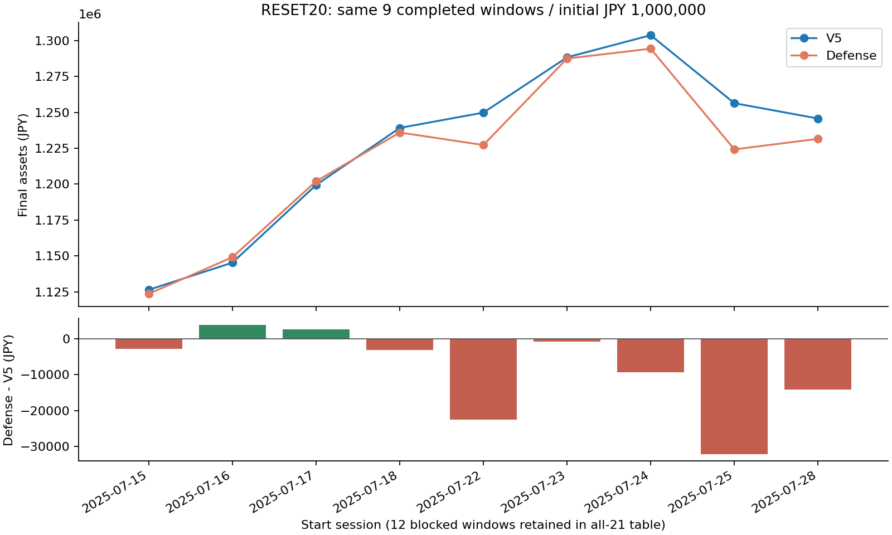

# 🛡️ RNEG Defense 有限実験の結果

実時計JST: `2026-10-06T09:27:25+09:00`  /  判定: **`DEFENSE_REJECTED`**  /  Control: **V5を保持**

旧HL0は保存済み8モデルとOOFを再利用し、再fitは0。新規変更は同じState9/Path入力の非線形interaction（D1）と、凍結P0の購入前context108列追加（D2）の固定2構成だけ。各8fitを実施した。

購入前の全1,039 Entryでは45件のRNEGを見送り対象にし、正R26件も巻き込んだ。実行適格・rank通過集合では負21件／正15件、旧V5の150購入では負4件／正1件（保存数量で正利益913円）を見送り対象にした。後者の静的損失除去19,463.40円を新口座利益へ読み替えない。

過去OOFだけで有効になったDefenseを最大1候補として接続し、RESET20を1正式batch測定した。9完了窓の口座全経路では負PnL絶対額が24,682.50円増え、正PnLは53,951.30円減った。最終資産中央値は18,441.25円、平均は8,737.09円低下。**Defense不採用で有限終了する。**

## 🧠 入力・識別・校正

State9/Pathは既存COREから継承し、ID・gap・segment・pivotの意味は変更していない。CORE 1,600行／58sessions、warmup20／OOF38／8blockを維持。D2はP0 numeric110からclockMinuteとactiveMinutesSinceSelectorの2重複をmetadataで除外した108列。正確なFrozen first-intent row_id・row_indexへ接続し、全8blockの適格行で接続100%。追加feature生成は0batch。

購入判断は元fill時刻、SELL/cash解放と元admissionの後、V5のoccupancy・数量決定より前。閉じたState prefixとfirst-intent snapshotのみを使う。fill raw open quoteの可用性は元V5の仮定を継承し、fill barのH/L/C/volumeを使用しない。**HISTORICAL_ASSUMED_AVAILABILITY**で、actual arrivalはUNKNOWN。学習済みEntry score依存のtrain ID・cutoffを確認し、外側test教師混入0。既存定義・モデル選定のDevelopment exposureは残る。

| 母集団 | 全行 | R既知 | R不明 | 負 | 正 |
|---|---:|---:|---:|---:|---:|
| ALL_ENTRY | 1039 | 1016 | 23 | 554 | 462 |
| EXECUTION_ELIGIBLE | 1028 | 1016 | 12 | 554 | 462 |
| OLD_V5_FUNDED | 150 | 150 | 0 | 82 | 68 |
| RANK_PASS | 494 | 492 | 2 | 273 | 219 |

known target全1,560行（warmup544＋OOF1,016）、unknown40行はruntimeから削除せず教師／採点から分離。厳密r=0はwarmupを含め0行。HL0の<=0と今回<0の実データラベル差0。原debit/creditから費用1回、EXIT＋EODの原Rをreuseし、新しいR materializationは0。

| 母集団 | predictor | N | AUROC | AP | Brier | log loss |
|---|---|---:|---:|---:|---:|---:|
| ALL_ENTRY | B0 | 1016 | 0.491453 | 0.534730 | 0.248135 | 0.689417 |
| ALL_ENTRY | D1 | 1016 | 0.529334 | 0.575106 | 0.252447 | 0.699601 |
| ALL_ENTRY | D2 | 1016 | 0.521678 | 0.565803 | 0.254193 | 0.704057 |
| ALL_ENTRY | HL0 | 1016 | 0.502645 | 0.558154 | 0.263080 | 0.732658 |
| EXECUTION_ELIGIBLE | B0 | 1016 | 0.491453 | 0.534730 | 0.248135 | 0.689417 |
| EXECUTION_ELIGIBLE | D1 | 1016 | 0.529334 | 0.575106 | 0.252447 | 0.699601 |
| EXECUTION_ELIGIBLE | D2 | 1016 | 0.521678 | 0.565803 | 0.254193 | 0.704057 |
| EXECUTION_ELIGIBLE | HL0 | 1016 | 0.502645 | 0.558154 | 0.263080 | 0.732658 |
| OLD_V5_FUNDED | B0 | 150 | 0.539993 | 0.581108 | 0.247563 | 0.688260 |
| OLD_V5_FUNDED | D1 | 150 | 0.454537 | 0.546477 | 0.255993 | 0.705047 |
| OLD_V5_FUNDED | D2 | 150 | 0.495696 | 0.548139 | 0.260219 | 0.717286 |
| OLD_V5_FUNDED | HL0 | 150 | 0.513271 | 0.601037 | 0.257161 | 0.707523 |
| RANK_PASS | B0 | 492 | 0.517144 | 0.558020 | 0.247017 | 0.687171 |
| RANK_PASS | D1 | 492 | 0.528811 | 0.582680 | 0.252869 | 0.700741 |
| RANK_PASS | D2 | 492 | 0.538261 | 0.582241 | 0.252922 | 0.701912 |
| RANK_PASS | HL0 | 492 | 0.520548 | 0.600368 | 0.257586 | 0.713222 |

全既知RのAUROCはD1がHL0より0.026689高いが、Brier/log lossではD1/D2とも過去率B0を上回らない。D2もD1を上回らない。出力を校正済み損失確率と認定せず、全期間AUROCで配備modelを選び直していない。

## 🚫 過去だけで固定した見送り

各block開始時のCAL_PASTは、それ以前の初回OOFがある成熟・適格・rank通過行だけ。warmup in-sampleと現在／未来blockは0。指示書のsupport、正件数10%／正unit利益10%、precision、純価値、任意1session除外を適用。同score一括のdistinct tau、recall→precision→tau→D1/D2順という1手続きを使用。各blockのmodel/tauはGitHubへ保存・読み戻し後にCapitalを測定した。

| block | 状態 | model | tau | 過去CAL行 | 過去CAL負 | 過去CAL非負 |
|---:|---|---|---:|---:|---:|---:|
| 1 | DEFENSE_OFF | — | — | 0 | 0 | 0 |
| 2 | DEFENSE_OFF | — | — | 61 | 38 | 23 |
| 3 | DEFENSE_OFF | — | — | 109 | 63 | 46 |
| 4 | ACTIVE | D1 | 0.6514891848453168 | 179 | 105 | 74 |
| 5 | ACTIVE | D1 | 0.6534978432985917 | 252 | 147 | 105 |
| 6 | ACTIVE | D1 | 0.665212103266463 | 313 | 181 | 132 |
| 7 | ACTIVE | D1 | 0.6783130392715787 | 376 | 216 | 160 |
| 8 | DEFENSE_OFF | — | — | 449 | 250 | 199 |

第1〜3blockと第8blockはOFF、4〜7はD1でACTIVE。第8blockを結果を見て救済しなかった。全OFF期間も分母と口座経路に残した。

| 母集団 | 見送り負／正 | precision | 負回避recall | 正件数誤拒否率 | 正unit利益巻込み | non-veto coverage |
|---|---:|---:|---:|---:|---:|---:|
| ALL_ENTRY | 45 / 26 | 63.38% | 8.12% | 5.63% | 5.42% | 93.17% |
| EXECUTION_ELIGIBLE | 45 / 26 | 63.38% | 8.12% | 5.63% | 5.42% | 93.09% |
| OLD_V5_FUNDED | 4 / 1 | 80.00% | 4.88% | 1.47% | 0.09% | 96.67% |
| RANK_PASS | 21 / 15 | 58.33% | 7.69% | 6.85% | 8.11% | 92.71% |

未来rank-passのunit純価値は−0.201560。正利益8.11%以内でも金額の大きな正Rを失う問題が残った。残した群のRNEG率55.26%。

| rank-pass tail | 母数 | 見送り |
|---|---:|---:|
| RN1 | 163 | 9 |
| RN10 | 7 | 0 |
| RN3 | 66 | 2 |
| RN5 | 30 | 2 |

| 正Rの帯域（%） | 母数 | 見送り |
|---|---:|---:|
| 0超〜1未満 | 83 | 7 |
| 1〜3未満 | 78 | 4 |
| 3〜5未満 | 24 | 2 |
| 5〜10未満 | 18 | 0 |
| 10以上 | 16 | 2 |

## 📊 同数の無情報見送り・依存度

| 集合 | 見送りN | 実負見送り | 無情報の期待負 | 実損失除去 | 期待損失除去 | 実正利益巻込み | 期待正利益巻込み |
|---|---:|---:|---:|---:|---:|---:|---:|
| OLD_V5_CHAIN | 5 | 4 | 2.762 | 19,463.40円 | 11,278.16円 | 913.00円 | 23,622.33円 |
| W13 | 4 | 3 | 2.162 | 14,215.80円 | 7,374.72円 | 913.00円 | 20,359.95円 |
| W14 | 5 | 3 | 2.629 | 13,794.60円 | 9,574.62円 | 9,646.00円 | 26,130.29円 |
| W15 | 5 | 4 | 2.912 | 17,942.50円 | 10,343.17円 | 1,141.25円 | 22,691.75円 |
| W16 | 5 | 4 | 2.762 | 15,862.00円 | 9,464.47円 | 1,141.25円 | 22,564.84円 |
| W17 | 5 | 4 | 2.762 | 15,440.80円 | 9,329.44円 | 913.00円 | 21,962.75円 |
| W18 | 6 | 5 | 3.345 | 15,707.00円 | 12,426.57円 | 913.00円 | 38,619.89円 |
| W19 | 4 | 3 | 2.415 | 9,392.00円 | 9,015.86円 | 913.00円 | 22,775.58円 |
| W20 | 4 | 3 | 2.383 | 9,622.00円 | 8,571.26円 | 913.00円 | 23,435.51円 |
| W21 | 5 | 3 | 2.882 | 9,622.00円 | 10,930.03円 | 9,646.00円 | 27,831.70円 |

block×native rankごとに同数を無情報に除く保存台帳のanalytic expectation。無作為Portfolio Replayは0。rank-passでは実負見送り21件／期待19.603件、unit損失実0.346698／期待0.468500、unit正利益実0.548258／期待0.417903。件数だけでは改善を認定しない。

38sessionを全件評価。session別見送りunit純価値は-0.152511〜0.052838。rank-pass全310symbolを対称に1つずつ除外した残り純価値は-0.294963〜0.025832、正になるのは1/310。全symbol表はprivate、全38session表と全8block診断は保存済み。都合の良いsubsetの再選択は0。

## 💴 RESET20：口座全経路の比較

各口座100万円・保有0、20sessions。歴史時点のmodel・policyはresetしない。全予定21窓を保持し、W01〜W12は7/11・7/14の既存coverage不足でBLOCKED_COVERAGE。0-return補完は0、片側未完了0。W13〜W21の9完了窓・180口座session-daysだけをpaired比較する。窓は重複したDevelopmentで、独立した9か月や全期間の成績ではない。

| 指標 | V5 | Defense | Defense − V5 |
|---|---:|---:|---:|
| 購入数 | 730 | 709 | -21 |
| 負取引数 | 403 | 392 | -11 |
| 正取引数 | 327 | 317 | -10 |
| 負率 | 55.21% | 55.29% | +0.0837pt |
| 負PnL絶対額 | 1,800,953.20円 | 1,825,635.70円 | 24,682.50円 |
| 正PnL総額 | 3,855,134.70円 | 3,801,183.40円 | -53,951.30円 |
| 純PnL総額 | 2,054,181.50円 | 1,975,547.70円 | -78,633.80円 |
| 最終資産 Min | 1,126,452.85円 | 1,123,656.90円 | -2,795.95円 |
| Mean | 1,228,242.39円 | 1,219,505.30円 | -8,737.09円 |
| Median | 1,245,688.10円 | 1,227,246.85円 | -18,441.25円 |
| Max | 1,303,682.80円 | 1,294,307.30円 | -9,375.50円 |
| 200万円到達口座 | 0/9 | 0/9 | 0 |
| worst MaxDD | 9.39% | 9.50% | +0.1102pt |
| 平均cash資金利用 | 0.416677 | 0.411046 | -0.005632 |
| 平均slot占有 | 1.672626 | 1.664613 | -0.008013 |

中央値同士の差 **-18,441.25円** と、paired差の中央値 **-3,191.50円** は別の値。改善2／同額0／悪化7口座。

| RN tail | V5件数／損失額 | Defense件数／損失額 |
|---|---:|---:|
| RN1 | 233 / 1,596,478.10円 | 228 / 1,627,008.65円 |
| RN3 | 66 / 780,507.55円 | 75 / 905,213.00円 |
| RN5 | 4 / 183,097.00円 | 13 / 314,702.20円 |
| RN10 | 2 / 132,044.60円 | 2 / 132,044.60円 |

9口座の旧数量上の明示VETOは延べ43件（負32／正11）。静的損失除去121,598.70円／正利益巻込み26,139.50円。これは重複口座の静的金額であり、実損失削減ではない。

| 取引・数量差分 | 延べ件数 | 純PnL差寄与 |
|---|---:|---:|
| COMMON_IDENTICAL | 628 | 0.00円 |
| COMMON_QUANTITY_CHANGE | 55 | -47,228.25円 |
| DEFENSE_ONLY | 26 | -126,486.10円 |
| V5_ONLY | 47 | 95,080.55円 |

V5-onlyの減少効果を、共通購入の数量差とDefense-onlyの損失が打ち消した。VETOは仮slotから除外し、後続の合法Entryにも同じDefenseを適用。旧150購入IDをwhitelistにせず、EXIT・Reserve・allocationは凍結コードをそのまま利用した。

| 窓 | 開始〜終了 | V5状態 | Defense状態 | V5最終 | Defense最終 | 差 |
|---|---|---|---|---:|---:|---:|
| W01 | 2025-06-27〜2025-07-25 | BLOCKED_COVERAGE | BLOCKED_COVERAGE | UNKNOWN | UNKNOWN | UNKNOWN |
| W02 | 2025-06-30〜2025-07-28 | BLOCKED_COVERAGE | BLOCKED_COVERAGE | UNKNOWN | UNKNOWN | UNKNOWN |
| W03 | 2025-07-01〜2025-07-29 | BLOCKED_COVERAGE | BLOCKED_COVERAGE | UNKNOWN | UNKNOWN | UNKNOWN |
| W04 | 2025-07-02〜2025-07-30 | BLOCKED_COVERAGE | BLOCKED_COVERAGE | UNKNOWN | UNKNOWN | UNKNOWN |
| W05 | 2025-07-03〜2025-07-31 | BLOCKED_COVERAGE | BLOCKED_COVERAGE | UNKNOWN | UNKNOWN | UNKNOWN |
| W06 | 2025-07-04〜2025-08-01 | BLOCKED_COVERAGE | BLOCKED_COVERAGE | UNKNOWN | UNKNOWN | UNKNOWN |
| W07 | 2025-07-07〜2025-08-04 | BLOCKED_COVERAGE | BLOCKED_COVERAGE | UNKNOWN | UNKNOWN | UNKNOWN |
| W08 | 2025-07-08〜2025-08-05 | BLOCKED_COVERAGE | BLOCKED_COVERAGE | UNKNOWN | UNKNOWN | UNKNOWN |
| W09 | 2025-07-09〜2025-08-06 | BLOCKED_COVERAGE | BLOCKED_COVERAGE | UNKNOWN | UNKNOWN | UNKNOWN |
| W10 | 2025-07-10〜2025-08-07 | BLOCKED_COVERAGE | BLOCKED_COVERAGE | UNKNOWN | UNKNOWN | UNKNOWN |
| W11 | 2025-07-11〜2025-08-08 | BLOCKED_COVERAGE | BLOCKED_COVERAGE | UNKNOWN | UNKNOWN | UNKNOWN |
| W12 | 2025-07-14〜2025-08-12 | BLOCKED_COVERAGE | BLOCKED_COVERAGE | UNKNOWN | UNKNOWN | UNKNOWN |
| W13 | 2025-07-15〜2025-08-13 | COMPLETE | COMPLETE | 1,126,452.85円 | 1,123,656.90円 | -2,795.95円 |
| W14 | 2025-07-16〜2025-08-14 | COMPLETE | COMPLETE | 1,145,355.75円 | 1,149,163.90円 | 3,808.15円 |
| W15 | 2025-07-17〜2025-08-15 | COMPLETE | COMPLETE | 1,199,393.40円 | 1,202,031.25円 | 2,637.85円 |
| W16 | 2025-07-18〜2025-08-18 | COMPLETE | COMPLETE | 1,239,139.15円 | 1,235,947.65円 | -3,191.50円 |
| W17 | 2025-07-22〜2025-08-19 | COMPLETE | COMPLETE | 1,249,800.75円 | 1,227,246.85円 | -22,553.90円 |
| W18 | 2025-07-23〜2025-08-20 | COMPLETE | COMPLETE | 1,288,307.35円 | 1,287,443.35円 | -864.00円 |
| W19 | 2025-07-24〜2025-08-21 | COMPLETE | COMPLETE | 1,303,682.80円 | 1,294,307.30円 | -9,375.50円 |
| W20 | 2025-07-25〜2025-08-22 | COMPLETE | COMPLETE | 1,256,361.35円 | 1,224,201.40円 | -32,159.95円 |
| W21 | 2025-07-28〜2025-08-25 | COMPLETE | COMPLETE | 1,245,688.10円 | 1,231,549.10円 | -14,139.00円 |

## 🔍 監査・予算・現在地

独立原BUY/SELL会計は9口座ともPASS、差分0。各ending_cash = 1,000,000 + sum(actual_trade_pnl)、全EOD決済、費用1回、同時刻SELL先行、MAX3、100株lot、cash・同銘柄制約を検算した。OOFモデル再推論／train-only前処理／成熟ラベル／過去だけの独立tau選定／予測とVETOの不変性はPASS。合成12テストと元最初の1日だけのDefense OFF互換性もPASS。r=0／微小正負／unknown／元COREの実future suffixを破壊した不変性も確認。

| 処理 | 実績 |
|---|---:|
| D1 / D2新fit | 8 / 8（合計16） |
| HL0、旧State／Entry／EXIT refit | 0 |
| full-data最終fit／calibration fit／探索 | 0 |
| fit技術再試行／Replay再起動 | 0 / 0 |
| 新Capital候補／正式batch | 1 / 1 |
| 全Control Replay | 0（互換性診断のみ1日） |
| 新R materialization／凍結feature補足生成 | 0 / 0 |
| provider価格／protected／注文／main merge／force push／Claude | 全て0 |

**方針:** V5をControlとして保持。V5.1や旧負結果も上書きしない。この固定2recipe＋過去選択手続きはDefense改善を確認できず不採用。第三recipe・別target・tau救済・EXIT改変へ進まない。新しい判断の前に必要なのは、既存12窓のcoverageを解消する原sourceと、この反復Development期間から独立した確認データ。今回の9完了窓をproductionReadyや全期間成功へ昇格しない。最上位の100万円→約200万円／20sessions目標は未達。

GitHubには開始、fit前の入力・recipe固定、全8policyのReplay前固定を保存し、actual GET本文・blob・tree・branch HEADを照合済み。今回のReplay/会計・最終reportも同じ研究branchへ保存しactual GETで照合する。privateのEntry/symbol別入力、初回予測、16モデル、全口座ledger・数量差は公開GitHubへ置かず、private handoffへ収録する。

再利用原本とハッシュはSOURCE_BINDING／REUSE_MATRIX／RNEG_TARGET_BINDING、全診断はLOSS_DEFENSE_DIAGNOSTIC、全21窓はRESET20_ALL21_WINDOWS.csv、会計はDEFENSE_INDEPENDENT_ACCOUNTINGを参照。既存Full R Spectrum一式は再生成していない。

最終現在地の実時計JST: `2026-10-06T09:29:38+09:00`。Replay/会計checkpointは `3bd9d4852661a094804e4dcf6e5397c32677ea67` に保存し、actual GET本文・git blob SHA・tree・branch HEAD一致を確認済み。最終commitの読み戻しreceiptはprivate handoffへ収録し、再帰commitは作らない。
