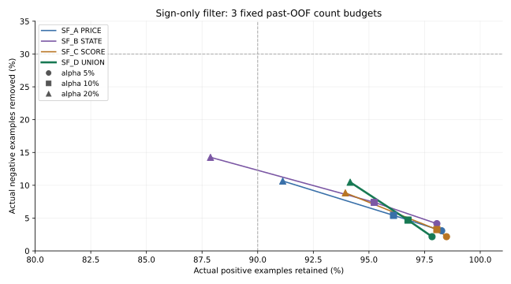
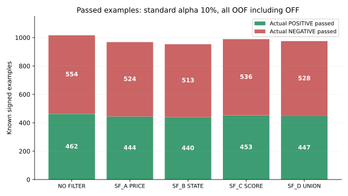
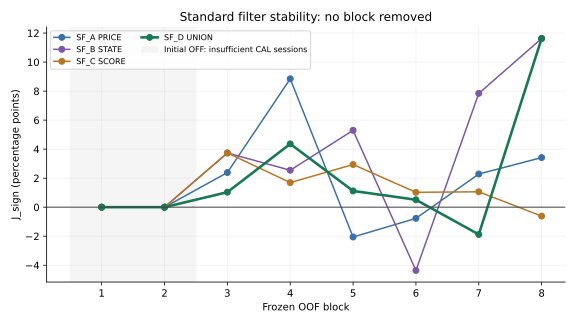

| 固定0.5の二値予測 | 実マイナスを正しく予測 | 実プラスを正しく予測 | balanced accuracy | 有効予測coverage |
|---|---:|---:|---:|---:|
| B0 過去負率 | 554/554 | 0/462 | 50.00% | 100.00% |
| HL0 reuse | 366/554 | 153/462 | 49.59% | 100.00% |
| 旧D1 reuse | 410/554 | 132/462 | 51.29% | 100.00% |
| 旧D2 reuse | 410/554 | 122/462 | 50.21% | 100.00% |
| SF_A PRICE | 430/554 | 104/462 | 50.06% | 100.00% |
| SF_B STATE | 437/554 | 100/462 | 50.26% | 100.00% |
| SF_C SCORE | 387/554 | 145/462 | 50.62% | 100.00% |
| SF_D UNION | 416/554 | 124/462 | 50.97% | 100.00% |

| 構成・強度 | PASSの実プラス | PASSの実マイナス | REJECTの実プラス | REJECTの実マイナス | プラス保存率 | マイナス除去率 | 通過後マイナス率 |
|---|---:|---:|---:|---:|---:|---:|---:|
| 無フィルター | 462 | 554 | 0 | 0 | 100.00% | 0.00% | 54.53% |
| SF_A PRICE 保守5% | 454 | 537 | 8 | 17 | 98.27% | 3.07% | 54.19% |
| SF_A PRICE 標準10% | 444 | 524 | 18 | 30 | 96.10% | 5.42% | 54.13% |
| SF_A PRICE 強20% | 421 | 495 | 41 | 59 | 91.13% | 10.65% | 54.04% |
| SF_B STATE 保守5% | 453 | 531 | 9 | 23 | 98.05% | 4.15% | 53.96% |
| SF_B STATE 標準10% | 440 | 513 | 22 | 41 | 95.24% | 7.40% | 53.83% |
| SF_B STATE 強20% | 406 | 475 | 56 | 79 | 87.88% | 14.26% | 53.92% |
| SF_C SCORE 保守5% | 455 | 542 | 7 | 12 | 98.48% | 2.17% | 54.36% |
| SF_C SCORE 標準10% | 453 | 536 | 9 | 18 | 98.05% | 3.25% | 54.20% |
| SF_C SCORE 強20% | 434 | 505 | 28 | 49 | 93.94% | 8.84% | 53.78% |
| SF_D UNION 保守5% | 452 | 542 | 10 | 12 | 97.84% | 2.17% | 54.53% |
| **SF_D UNION 標準10% Primary** | 447 | 528 | 15 | 26 | 96.75% | 4.69% | 54.15% |
| SF_D UNION 強20% | 435 | 496 | 27 | 58 | 94.16% | 10.47% | 53.28% |

🛡️ **Capital 第1審査・符号専用フィルター／終了判定 `SIGN_FILTER_TRADEOFF_ONLY`**
実時計JST: `2026-10-06T11:42:58.651902+09:00`。Primaryは事前固定のSF_D＋標準alpha10%、全38 OOF sessionsの実行適格集合。初期OFFも含む。上2表は同一の既知1,016件（マイナス554・プラス462）で、未知教師を正負に補完していない。
**プラス447件を保存し15件を誤拒否、マイナス26件を除去し528件が通過した。** マイナス除去率4.69%は事前目安30%未達。通過後負率は無フィルター54.53%から54.15%へ小幅低下した。REVIEW_CANDIDATEにはしない。

### 🎯 評価範囲とcoverage

| 集合 | 全行 | プラス | マイナス | EXACT_ZERO | UNKNOWN |
|---|---:|---:|---:|---:|---:|
| CORE全期間 | 1,600 | 706 | 854 | 0 | 40 |
| warmup全Entry | 561 | 244 | 300 | 0 | 17 |
| warmup実行適格 | 550 | 244 | 300 | 0 | 6 |
| OOF全Entry | 1,039 | 462 | 554 | 0 | 23 |
| OOF実行適格（Primary） | 1,028 | 462 | 554 | 0 | 12 |
| Rank通過（補助） | 494 | 219 | 273 | 0 | 2 |
| 旧V5購入（補助） | 150 | 68 | 82 | 0 | 0 |

既存件数と一致。全Entryの不適格11件、教師UNKNOWN23件は別集計。実行適格UNKNOWN12件のうち標準で11件PASS、1件REJECT。標準の全適格判定はPASS986／REJECT42、正負既知だけならPASS975／REJECT41。UNKNOWNを成功例に数えない。
初期OFFはblock1/2の10 sessions、実行適格266件（既知261・UNKNOWN5）。これらをPASS_UNASSESSEDとして通過側へ計上した。OFFを予測POSITIVEと呼ばず、ACTIVEだけの成績へPrimaryを差し替えていない。予測自体は全適格1,028件に有効なモデル出力があり、欠落／baseline fallbackは0。B0のcoverage100%は過去率baselineが存在する意味で、Primaryのモデルcoverageへは算入しない。

### 🧠 固定0.5を隠さない符号診断

| 構成 | AUROC負 | AP負 | AP正 | Brier | log loss | accuracy | 負precision | 負recall | 正precision | 正recall |
|---|---:|---:|---:|---:|---:|---:|---:|---:|---:|---:|
| B0 過去負率 | 0.491453 | 0.534730 | 0.453199 | 0.248135 | 0.689417 | 54.53% | 54.53% | 100.00% | null | 0.00% |
| HL0 reuse | 0.502645 | 0.558154 | 0.455989 | 0.263080 | 0.732658 | 51.08% | 54.22% | 66.06% | 44.87% | 33.12% |
| 旧D1 reuse | 0.529334 | 0.575106 | 0.473879 | 0.252447 | 0.699601 | 53.35% | 55.41% | 74.01% | 47.83% | 28.57% |
| 旧D2 reuse | 0.521678 | 0.565803 | 0.470044 | 0.254193 | 0.704057 | 52.36% | 54.67% | 74.01% | 45.86% | 26.41% |
| SF_A PRICE | 0.493583 | 0.545466 | 0.455206 | 0.256092 | 0.707335 | 52.56% | 54.57% | 77.62% | 45.61% | 22.51% |
| SF_B STATE | 0.526791 | 0.580825 | 0.469603 | 0.253474 | 0.701759 | 52.85% | 54.69% | 78.88% | 46.08% | 21.65% |
| SF_C SCORE | 0.505693 | 0.566025 | 0.465422 | 0.257520 | 0.709641 | 52.36% | 54.97% | 69.86% | 46.47% | 31.39% |
| SF_D UNION | 0.522135 | 0.561528 | 0.475312 | 0.254635 | 0.705039 | 53.15% | 55.17% | 75.09% | 47.33% | 26.84% |

Primaryの固定0.5混同行列は、実マイナス→負416／正138、実プラス→正124／負338。accuracyは53.15%, balanced accuracyは50.97%。全マイナスの無情報判定はaccuracy54.53%・balanced accuracy50%、全プラスはaccuracy45.47%・balanced accuracy50%。0.5の判定とREJECT閾値を混同しない。
AUROCはscore_negが高いほどNEGATIVEの向きを保持。SF_AのAUROCが0.5未満でも反転0。scoreは未校正であり、数値をそのまま将来損失確率と解釈しない。AP正はy_posと1-score_negで算定。すべて件数の等重み。B0はfoldごとの過去負率が変わるためpool AUROCが0.5に一致しない。

### ⚖️ フィルターと安定性

| SF_D 強度 | 正例誤拒否率 | 見送りprecision | 通過率（正負既知） | J_sign | filter balanced accuracy |
|---|---:|---:|---:|---:|---:|
| 保守5% | 2.16% | 54.55% | 97.83% | 0.00% | 50.00% |
| 標準10% | 3.25% | 63.41% | 95.96% | 1.45% | 50.72% |
| 強20% | 5.84% | 68.24% | 91.63% | 4.63% | 52.31% |

過去CALの正例誤拒否件数予算だけでtauを決めた。distinct scoreを昇順で検査し、score>=tauの同点は一括REJECT。floor(alpha×過去正例数)、ALL_PASS sentinel、最小tauを保存した。現在blockの分布・教師を見る前にsnapshotを固定し、block中の変更0。正例保存率の将来保証ではない。

| block | CAL support／標準tau | PASS正 | PASS負 | REJECT正 | REJECT負 | 正保存率 | 負除去率 | J_sign |
|---|---|---:|---:|---:|---:|---:|---:|---:|
| 1 | OFF_SUPPORT_ALL_PASS／ALL_PASS | 52 | 78 | 0 | 0 | 100.00% | 0.00% | 0.00% |
| 2 | OFF_SUPPORT_ALL_PASS／ALL_PASS | 65 | 66 | 0 | 0 | 100.00% | 0.00% | 0.00% |
| 3 | ACTIVE／0.7424995609579397 | 59 | 72 | 1 | 2 | 98.33% | 2.70% | 1.04% |
| 4 | ACTIVE／0.7262791212387122 | 53 | 69 | 2 | 6 | 96.36% | 8.00% | 4.36% |
| 5 | ACTIVE／0.7201540113189324 | 60 | 64 | 3 | 4 | 95.24% | 5.88% | 1.12% |
| 6 | ACTIVE／0.7146612094153166 | 62 | 74 | 3 | 4 | 95.38% | 5.13% | 0.51% |
| 7 | ACTIVE／0.7013429571396411 | 62 | 67 | 6 | 5 | 91.18% | 6.94% | -1.88% |
| 8 | ACTIVE／0.7013429571396411 | 34 | 38 | 0 | 5 | 100.00% | 11.63% | 11.63% |

CAL supportと評価側正負各10件を満たした6block中5blockでJ_sign>0（5/6）。4block以上・75%以上の安定性条件は満たすが、全OOF負例除去30%条件は未達。全8blockの全構成・全alphaはBLOCK_METRICS.csvに残した。

| 事前終了条件 | 実測／判定 |
|---|---|
| source／符号／as-of／時間順監査 | PASS（歴史的可用性仮定の範囲） |
| モデル自身の有効予測coverage ≥95% | 100%（1,028/1,028）PASS |
| 全OOFプラス保存率 ≥90% | 96.75% PASS |
| 全OOFマイナス除去率 ≥30% | 4.69% FAIL |
| 通過後負率 < 無フィルター | 54.15% < 54.53% PASS |
| 評価可能block ≥4 | 6 PASS |
| その75%以上でJ_sign>0 | 5/6 PASS |

### 📈 3つの固定図

各図は保存済み予測・閾値だけから作図。図を見て新たなruntime閾値や採用先を選んでいない。図1の破線は今回の事前目安で、統計的保証ではない。初期OFFを図3から除外していない。

### 🧩 情報群・再利用・不足Evidence

| 構成 | 入力 | 新fit | 役割／再利用との違い |
|---|---|---:|---|
| SF_A | 108 numeric、categorical0 | 8 | Frozen P0の価格／出来高／VWAP／ボラ／経路、Entry自身の時刻・遅延 |
| SF_B | 18 numeric＋7 categorical | 8 | COREのState9／Path／方向／dwell／stop／gap・観測情報 |
| SF_C | 13 numeric、categorical0 | 8 | Frozen P1 score／threshold、Selector context、pP／MOVE_U2／MOVE_U3／MRETの保存済み初回OOF |
| SF_D | 139 numeric＋7 categorical | 8 | A＋B＋Cの固定和集合、元D2列順の後ろに4score。唯一のPrimary |

元metadata・生成コードの意味で所属を固定。Selector anchorの価格進行／clock／delay／refreshはSelector contextに属し、Entry自身のclock／delayは価格・時刻群に属する。BへCORE全列を一括混入していない。重複clockMinute／activeMinutesSinceSelectorは元receipt通り各1回、UNRESOLVED列0。旧566列・新市場feature・銘柄embedding追加0。
旧HL0／D1／D2もすでに正負を学習していた。新しい検証は情報群を分離すること、符号だけの読出しへ統一すること、Capital口座変化から切り離すこと。符号ラベル名の変更だけでは再fitしていない。旧24モデルの初回OOFは比較用にreuseし、元モデルは不変。今回A/B/C/Dの列順・入力値集合はどれも旧D1/D2と完全一致しない。SF_Dは4つの保存scoreを追加した別構成であり、同じD2の改名ではない。32新fit・各1attempt、技術再試行0。
58 sessions／warmup20／OOF38／元8blockを維持。全過去の実行適格かつ成熟した正負を学習し、旧V5購入150件だけへ絞らない。sample_weight=None／class_weight=None、各行1件。欠測は0＋indicator、標準化・categorical vocabularyはtrain-only。numericのみ／categoricalのみのshape処理を補う以外は旧前処理を保持。Random state57、旧小型HistGradientBoostingClassifierの全パラメータ・scikit-learn1.8.0を固定。追加fit・seed・hyperparameter・calibration・stacking・inner fit0。
scoreはP1の5producer graphとpP／MOVE_U2／MOVE_U3／MRETの32保存producerについて、train ID、cutoff、外側testの除外、行時点の生成可能性を照合。pP／MOVE_U2／MOVE_U3／MRETが存在しないwarmup561行は欠測のまま。未来producerでの再採点・in-sample scoreによる穴埋め・producer新fit0。旧Qualityのbaseline integrity incidentと旧MRETの数値FAILは履歴として残し、今回は独立OOF認証済みproducer／scoreだけを回収した。baseline失敗ファイル・旧金額政策は使わない。
価格OPEN quoteは元fillの購入直前・数量確定前の可用性仮定を継承。閉じたState prefixとFrozen first-intent snapshotを読む。fill足H/L/C/volume、将来EXIT可用性はXへ入れず、Entry延期0。as-of時間とsource可用順は別々に検査したが、actual arrivalはUNKNOWNのためHISTORICAL_ASSUMED_AVAILABILITYを維持し、実受信PITへ昇格しない。
符号は元sell_credit／buy_debitのFraction比較だけ。費用は元実効価格に1回含まれ、追加適用0。厳密0は独立、UNKNOWNも独立。微小正負を0へ丸めない。教師viewは6列だけ、学習／閾値／評価は符号view以外のoutcomeを読まない。購入前の価格・出来高入力は数値のまま許可する。
新箇所の合成テスト621件PASS。追加の独立AP／Brier／log loss、全補助slice／全blockの件数、退化予測・coverage・PASS引き渡し検算426件もPASS。独立監査は66,041項目、mismatch0、監査refit0。符号を保った原結果の大きさの変更1,560件で、source_hashは別記し、学習要求payload／重み／閾値／評価／終了判定は不変。保存modelを独立に前処理・推論して初回OOFと一致。current／future test教師を変えてもprediction／tauは不変で評価だけが変化。tie／floor／ALL_PASS／ゼロ分母／初期OFF／欠測coverage、退化判定の非成功を検算。巨大な既存State／R全域監査は再実行しない。

この全期間は反復利用済みDevelopmentである。旧sign成績とexpert成績を知って本設計を作ったexposureを保存しており、precommit・時間順OOF・別ラベル名でFresh/OOSへ戻したとは言わない。未知期間の一般化、受信時刻PIT、将来の正例誤拒否率の保証、経済価値は不足Evidence。CIは未計算、救済Gateとして使用0。

### 🔒 終了点と引き渡し

Selector／Entry／EXIT／State定義・元Capitalコードおよび旧RNEG evidenceのhash不変。Capital／RESET20／Replacement Replay0、第2審査0、数量配分変更0、provider0、注文0、main merge0、force push0、Claude0。金額・平均R・R階層・RN tail・U5/U10・最終資産は今回の成績欄として未計算で、終了判定に使用0。旧RNEG Defense=DEFENSE_REJECTED、旧V5.1=REJECTEDのclosureは保持した。
成果物はMODEL_PRECOMMIT、FEATURE_FAMILY_MAP、ASOF_AND_SCORE_LINEAGE、SOURCE_BINDING、REUSE_MATRIX、符号契約／件数、FIT_LEDGER、8block閾値、混同行列／FILTER_COUNTS／BLOCK_METRICS／SIGN_METRICS、独立監査、MANIFEST。Entry／symbol別入力・sign view・モデル・初回OOF・action・学習payload・学習IDはprivate成果物へ分離し、GitHubは契約・集約・hash・状態だけを保存する。
privateのOOF_PASS_HANDOFFは、当時のSF_D標準フィルターがPASSした候補986件（実行適格UNKNOWN込み）を保存した。実POSITIVEだけのoracle抽出ではなく、既知実NEGATIVE528件も残る。将来の別Workに渡す場合にこの当時のPASS集合を使う。今回、第2審査は実装しない。

**回答:** State／Path単独はAUROC0.526791で弱い識別差があるが、明確な有用性は未確認。PRICE単独0.493583、SCORE単独0.505693、UNION0.522135。統合の明確な改善は確認できず、旧D2の0.521678からの差も小さい。標準ではプラス447件を残し、マイナス26件を除いた。PrimaryはSIGN_FILTER_TRADEOFF_ONLYで終了。保存scoreや符号性能から資産増加を主張しない。

`productionReady=false / executionAllowed=false / automaticPromotionAllowed=false`。良い補助sliceや別構成へ採用先を変更0。次方針はこのcycleを閉じ、残存負率54.15%と未達Evidenceを次の設計へ渡すこと。Capital接続や経済検証には別Workが必要。

設計根拠: WORK_REQUEST.mdのS1〜S3、旧RNEG REPORT／fit_rneg.py／source契約。実装参考S4はscikit-learn公式[threshold](https://scikit-learn.org/1.8/modules/classification_threshold.html)、[HistGradientBoostingClassifier](https://scikit-learn.org/1.8/modules/generated/sklearn.ensemble.HistGradientBoostingClassifier.html)、[train-only pitfalls](https://scikit-learn.org/1.8/common_pitfalls.html)。特徴群、alpha、support、到達目安は本Workの設計選択で、公式推奨の最適値や達成済みの経済結果ではない。

保存時のactual GETで別Workの設計文書 `independent-entry-exit-sign-20261006-v1` を検出した。設計は上書きせず保持した。本cycleの32fitsは検出前に完了しており、追加fit0で監査・集計・閉鎖だけを保存。別Workの学習は未開始。
