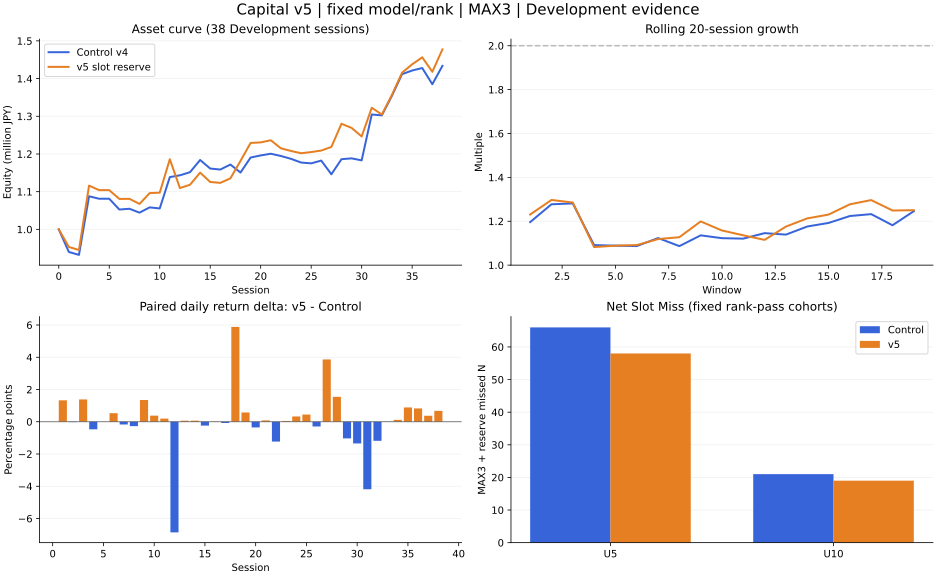

Capital v5 MAX3 Slot Intelligence — CLOSED / STOP

作成: 2026-10-04T21:51:26.727982+09:00。Repo: Iam-2squared/ark-terminal。Branch: capital-state9-vnext-20261004。instruction basis: `45d98b6338c1fd7d40b9b26f8ba433dba964e0c5`。Policy: `CAPITAL_MAX_CONCURRENT_3_RESEARCH_POLICY_V1` / `CAPITAL_MAX3_SLOT_RESERVE_V1`。

| 指標 | 保存済みControl v4 Main/B_PLUS | v5 one-shot |
| --- | --- | --- |
| Daily geometric | 0.9526% | 1.0324% |
| rolling20 median | 1.14584896x | 1.19915419x |
| rolling20 max | 1.28138096x | 1.29703103x |
| Final Equity | ¥1,433,740.25 | ¥1,477,436.15 |
| MaxDD（分足MTM） | 11.5772% | 10.2253% |
| U5 funded | 42 | 50 |
| rank-pass U5 conversion | 42/113 = 37.1681% | 50/113 = 44.2478% |
| U5 MAX3 missed | 66 | 28 |
| U5 reserve-rejected | 0 | 30 |
| U5 Net Slot Miss | 66 | 58 |
| U5 cash/lot missed | 5 | 5 |
| U10 funded | 23 | 26 |
| rank-pass U10 conversion | 23/47 = 48.9362% | 26/47 = 55.3191% |
| U10 MAX3 missed | 21 | 9 |
| U10 reserve-rejected | 0 | 10 |
| U10 Net Slot Miss | 21 | 19 |
| U10 cash/lot missed | 3 | 2 |
| Medium（3–<5%） | 31 | 27 |
| <2% funded N / rate | 77 / 44.7674% | 58 / 38.6667% |
| <3% funded N / rate | 99 / 57.5581% | 73 / 48.6667% |
| Loser（realized<=0） | 93 / 54.0698% | 82 / 54.6667% |
| Mean utilization | 49.1563% | 41.9868% |
| Total funded | 172 | 150 |

| Oracle / recovery | 結果 |
| --- | --- |
| Oracle max feasible rank-pass U5 | 104/113 |
| Oracle U10 at maximum U5 | 47/47 |
| Oracle Medium at maximum U5/U10 | 52 |
| Control recovery | 42/104 = 40.3846% |
| v5 recovery | 50/104 = 48.0769% |
| remaining oracle gap | 54 |

**判定はSLOT_INTELLIGENCE_IMPROVED、CAPITAL_V5_IMPROVES。P1–P7、E1–E3はすべてPASS。North Starのrolling20 2倍は未達。** MAX3 blockerを減らしただけではなく、reserve reject込みのNet Slot MissもU5 66→58、U10 21→19に減った。U5のMAX3 miss38件減のうち30件はreserve rejectへ移り、差し引き8件が実際のfunded増となった。cash/lot U5は5件のまま。U10はMAX3 miss12件減、reserve10件増、Net改善2件とcash/lot改善1件によりfundedが3件増えた。

Oracleはevaluation-onlyの物理上限。Entry/EXIT時刻、MAX3、現金、100株単位、same-symbol、15:20 cutoff、実行sourceを守る。v4のrank別capital capとutilizationは実戦policyの制約として緩和しているため、104件がそのまま実戦policyで達成可能という意味ではない。全38日を100万円から現金で連結し、U5→U10→Medium→turnoverのlexicographic最適化を行った。物理上限ではU5の9件が保有重なりで不可避、U5/U10のcount上限への追加cash missは0。Mediumも最大52件、最小turnoverは¥38,951,252.65。Oracle資産成績をPrimary成績に使わず、閾値選びにも使っていない。

Oracle v1は100株固定でU5=104/U10=47を確認したが、Mediumがcash-relaxed52件に対して50件だったため全lexicographic目的の認証を停止した。履歴を残したうえで、oracle_v2の整数lot数量で104/47/52を認証した。独立実装は3-unit min-cost flowと別の整数計画で同じ上限・最小turnoverを再確認した。無効実行2 candidateは<2% cohortであり、113 U5/47 U10の母数に影響しない。

**A. slot1 / slot2 / slot3品質**

slot番号はBUY成功時の実際の1st/2nd/3rd位置で、再利用後もその時点の空き順で付与する。Control ledgerも同じ定義でread-only分析した。

| arm | slot | N | S/A/B | U3 | Medium | U5 | U10 | <2 | realized>=+1% | loser | mean | median | actual PnL |
| --- | --- | --- | --- | --- | --- | --- | --- | --- | --- | --- | --- | --- | --- |
| Control | 1 | 40 | 8/22/10 | 21 | 8 | 13 (32.50%) | 8 (20.00%) | 15 (37.50%) | 13 | 19 (47.50%) | 1.5866% | 0.2640% | ¥249,185.75 |
| Control | 2 | 47 | 2/20/25 | 20 | 7 | 13 (27.66%) | 9 (19.15%) | 21 (44.68%) | 15 | 24 (51.06%) | 1.7864% | -0.1000% | ¥252,083.05 |
| Control | 3 | 85 | 8/26/51 | 32 | 16 | 16 (18.82%) | 6 (7.06%) | 41 (48.24%) | 24 | 50 (58.82%) | -0.2547% | -0.1000% | ¥-67,528.55 |
| v5 | 1 | 41 | 8/22/11 | 22 | 9 | 13 (31.71%) | 8 (19.51%) | 15 (36.59%) | 14 | 20 (48.78%) | 1.5660% | 0.2506% | ¥253,568.65 |
| v5 | 2 | 59 | 7/44/8 | 34 | 13 | 21 (35.59%) | 11 (18.64%) | 17 (28.81%) | 21 | 28 (47.46%) | 1.6858% | 0.1776% | ¥251,494.05 |
| v5 | 3 | 50 | 14/33/3 | 21 | 5 | 16 (32.00%) | 7 (14.00%) | 26 (52.00%) | 12 | 34 (68.00%) | -0.0527% | -0.5731% | ¥-27,626.55 |

3rd-slotはfunded85→50、U5件数16→16、U5率18.82%→32.00%、U10 6→7、PnL −¥67,528.55→−¥27,626.55。**3rd-slot品質はMIXED**：<2%率48.24%→52.00%、loser58.82%→68.00%、中央値−0.1000%→−0.5731%は悪化し、PnLも依然マイナス。slot2でU5が13→21へ増えたことが全体改善に寄与する。slotごとの異なる取引集合であり、効果を一意に因果帰属できない。

**B. B reservation — funded vs reserve rejected**

| B群 | N | U3 | Medium | U5 | U10 | <2 | realized mean | median | loser | actual PnL |
| --- | --- | --- | --- | --- | --- | --- | --- | --- | --- | --- |
| Control B funded | 86 | 28 | 14 | 14 / 16.2791% | 5 / 5.8140% | 42 / 48.8372% | -0.6161% | -0.1000% | 58.1395% | ¥-118,966.75 |
| v5 B funded | 22 | 9 | 4 | 5 / 22.7273% | 2 / 9.0909% | 8 / 36.3636% | 0.7856% | 0.2862% | 45.4545% | ¥50,683.60 |
| v5 B reserve rejected | 181 | 52 | 22 | 30 / 16.5746% | 10 / 5.5249% | 94 / 51.9337% | -0.2644% | -0.1000% | 53.0387% | — |

reserve181件の理由はSLOT2_RESERVE_FOR_FUTURE_QUALITY=76、SLOT3_RESERVE_FOR_FUTURE_QUALITY=105。Rejected BにはU5 30件、U10 10件、Medium22件を含む。rejectedのrealizedはFrozen EXITの評価専用returnであり、実際の投資PnLではない。全B297件のtimestamp/ML/rank/occupancy/quantiles/remaining probabilities/decision/reasonを保存し、U3/U5/U10/bucket/realizedは判断後にjoinした。MAX3/cash/lotによるB拒否はreserve拒否と分けて保存した。

実装上の事前固定した解釈：同時Entry batchはv4順序を維持し、slot admission時のoccupancyは「既存position + 先にslot admissionを通過した同batch候補」。その後、v4の同時ML proportional allocation / water-fillをそのまま適用する。cash/lot不足でも後続候補をbackfillしない。BUY成功による実occupancyも別に記録する。これによりv4のbatch配分とno forced backfillを維持した。

training-only arrivalは各blockの保存済みH2/H3/H5でそのblockの過去training candidateだけを再scoreした推論で、新規fitは0。これはtraining内のresubstitution推定であり、到来推定そのもののfresh/OOS精度を示さない。全training日を含め、残存0日も母数に算入した。固定30分bucketの表示分布は下端時刻をanchorにするが、判断では実際の現在分tから15:20未満までの残存curveを用いた。同時刻を含む `t<=arrival<920` として事前固定し、test-sessionの実際の後続arrivalは見ていない。A+はS/A（ML>=1.5）、B quantileはprecutoffの1<=ML<1.5をlinear type7で算出した。

| block | train sessions | train candidate N | B N | B median ML | B p75 ML |
| --- | --- | --- | --- | --- | --- |
| 1 | 20 | 550 | 136 | 1.22902935 | 1.33998418 |
| 2 | 25 | 683 | 170 | 1.26320476 | 1.35544097 |
| 3 | 30 | 816 | 220 | 1.25572419 | 1.38404119 |
| 4 | 35 | 952 | 291 | 1.25369314 | 1.36380566 |
| 5 | 40 | 1083 | 352 | 1.25913807 | 1.37907553 |
| 6 | 45 | 1215 | 383 | 1.24429670 | 1.37581874 |
| 7 | 50 | 1361 | 447 | 1.24328293 | 1.35923617 |
| 8 | 55 | 1501 | 478 | 1.23807617 | 1.35869607 |

**C. opportunity cost / Oracle gap**

| arm | cohort | rank-pass N | arrived free | arrived occupied | later free | later occupied | HELD_SLOT_BLOCKED | reserve reject | cash/lot |
| --- | --- | --- | --- | --- | --- | --- | --- | --- | --- |
| Control | U10 | 47 | 26 | 21 | 14 | 21 | 21 | 0 | 3 |
| Control | U5 | 113 | 47 | 66 | 27 | 66 | 66 | 0 | 5 |
| v5 | U10 | 47 | 38 | 9 | 26 | 9 | 9 | 10 | 2 |
| v5 | U5 | 113 | 85 | 28 | 65 | 28 | 28 | 30 | 5 |

laterは同sessionの最初のfunded Entryより後の時刻。HELD_SLOT_BLOCKEDは、MAX3拒否・前batchからのpositionあり・当該batchのrank-pass上位3候補という固定診断定義。実際のheld IDも保存する。Oracle gapはControl62件→v5 54件。score未達U5 57件、U10 20件の救済は行っていない。

**D. Entry→High buckets（funded）**

| Entry→High % | all OOF candidate N | Control funded | v5 funded | Control mean realized | v5 mean realized | Control actual PnL | v5 actual PnL |
| --- | --- | --- | --- | --- | --- | --- | --- |
| <1 | 410 | 38 | 27 | -2.3387% | -1.9398% | ¥-225,918.05 | ¥-153,339.35 |
| 1-<2 | 197 | 39 | 31 | -0.7326% | -1.4098% | ¥-72,166.70 | ¥-174,327.05 |
| 2-<3 | 135 | 22 | 15 | -1.0283% | -0.2195% | ¥-53,520.55 | ¥-1,199.90 |
| 3-<4 | 73 | 18 | 18 | 0.4339% | 0.3613% | ¥-315.15 | ¥20,189.40 |
| 4-<5 | 54 | 13 | 9 | 0.1947% | 0.0455% | ¥8,570.60 | ¥-872.70 |
| 5-<10 | 103 | 19 | 24 | 1.9390% | 1.6648% | ¥80,292.05 | ¥95,948.05 |
| >=10 | 67 | 23 | 26 | 9.5070% | 8.2128% | ¥696,798.05 | ¥691,037.70 |

U3=297件、Medium=127件、U5=170件、U10=67件という全OOF母数を維持。評価teacherとHigh定義はv4原本のまま。strictly later actual Highなしのfallback0など、既存のteacher support制限も変更していない。

**E. daily / rolling20 / asset curve**

| 経済指標 | Control | v5 |
| --- | --- | --- |
| 有効日数 | 38 | 38 |
| daily arithmetic | 1.0224% | 1.1079% |
| daily median | 0.1930% | 0.1882% |
| rolling20 valid | 19 | 19 |
| rolling20 min | 1.08669814x | 1.08236628x |
| rolling20 mean | 1.16573674x | 1.19064601x |
| rolling20 2x N/rate | 0/19 / 0.0000% | 0/19 / 0.0000% |
| earliest 2x | なし | なし |
| ¥1m rolling20 median | ¥1,145,848.96 | ¥1,199,154.19 |
| ¥1m rolling20 max | ¥1,281,380.96 | ¥1,297,031.03 |
| Final return | 43.3740% | 47.7436% |
| median utilization | 58.6366% | 48.2602% |
| time utilization>=80% | 0.0000% | 0.0000% |
| time utilization>=90% | 0.0000% | 0.0000% |
| minimum cash | ¥214,408.85 | ¥221,811.10 |
| turnover | ¥89,919,260.65 | ¥89,327,438.95 |
| recycled cash used | ¥7,020,365.35 | ¥6,728,380.05 |
| funded/session | 4.526316 | 3.947368 |
| max concurrent | 3 | 3 |
| Frozen EXIT sells | 77 | 81 |
| EOD regular/auction | 83/12 | 63/6 |

paired daily delta：38日、平均0.0855pp、中央値0.0669pp、v5優位22日／劣位15日／同値1日。Final差は¥43,695.90。全38日の資産・returnと全19 rolling窓はPAIRED_DAILY.csv / PAIRED_ROLLING20.csvに保存。daily medianは小幅低下し、平均稼働率は7.17pp低下。Mediumは4件減（31→27）、全体loser率は0.60pp悪化した。これらは今回の改善判定と併記する代償であり、結果を受けた再調整は行わない。

**F. integrity / exposure / safety**

独立監査：core 148,581項目、supplement 2,362項目、合計150,943項目でmismatch0。Oracle別実装もmismatch0。Primary policy/replay codeのimport0。training8,161行とOOF1,039行をscalar inference、別PAVA projection、linear quantileで確認し、slot判断、ordering、quantity、allocation、BUY/SELL、MTM、cash recycling、daily/rolling20、conversion、MAX3/reserve/Net missを照合した。Controlは保存済みledgerのread-only再集計のみでreplay0。金額ledger/quantity/decisionの差は0、floating summary許容1e-12、desired/金額summary許容1e-8。

因果Canary 29 PASS / FAIL0。test future arrival、未来teacher/High、未来EXIT、未来State/Path suffix、same-batch outcomes、Liquidity mutationで現在判断不変。コード・source・model・score・precommit identityを確認。全stream deterministic rerunは結果・decisions・trades・frames・intentsともbyte identity。no forced backfill、MTMでequityだけ変化しcash不変、valid EOD SELLだけcash解放、duplicate sell0をsynthetic executionで検査した。Primary one-shot replay1、Independent replay1、deterministic full canary rerun1、causal/synthetic day mini-replay6。verificationは同一policyの照合であり、新policyやretuneを含まない。

H2/H3/H5・PAVA・ML・S/A/B・feature manifest・Liquidity OFF・Entry/EXIT/MTM/EOD/cost・100-share・LONG cash-only・MAX3は固定。new fit0 / rank変更0 / Movement0 / HF1-HL0 use0 / MAX4-MAX5 0 / position replacement0 / provider取得0 / retune0 / Claude0。BUY raw×1.0005、SELL valid source×0.9995、commission0、15:20 Entry funding0、later topup0。旧Evidence上書き0。GitHub checkpoint V0–V10と各postcommit actual GET receiptは別ファイルに保存する。未来SHAは予測しない。

ExposureはITERATIVE_DEVELOPMENT_EVIDENCE。58 Development sessionsは反復利用済みで、38 OOF daysをfresh/OOSと呼ばない。Protected/Holdout/Fresh/Validation/OOS/Prospective開封0。Safety全false、orders0 / main merge0 / force push0 / productionReady=false。

| criterion | 結果 |
| --- | --- |
| P1_U5_conversion | PASS |
| P2_U5_MAX3_miss | PASS |
| P3_U5_Net_Slot_Miss | PASS |
| P4_U10_funded | PASS |
| P5_U10_MAX3_miss | PASS |
| P6_U10_Net_Slot_Miss | PASS |
| P7_below2_contamination | PASS |
| E1_daily_geom | PASS |
| E2_rolling20_median | PASS |
| E3_final_equity | PASS |

**結果固定・STOP。** Oracle + precommitted policy1本 + audit + reportで終了する。MAX3 blockerを減らしただけでなくreserve reject込みのNet Slot Missも減った。ただしoracle gap54件、3rd-slot contamination/loser悪化、Medium減、低稼働率、North Star未達が残る。同cycleでarrival threshold/time boundary/B quantile/Winner model/rank/Movement/Liquidity/MAX/replacement/Entry/EXIT/result rescueを変更しない。
