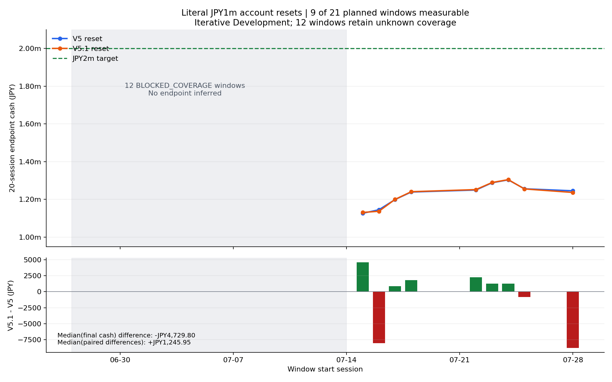
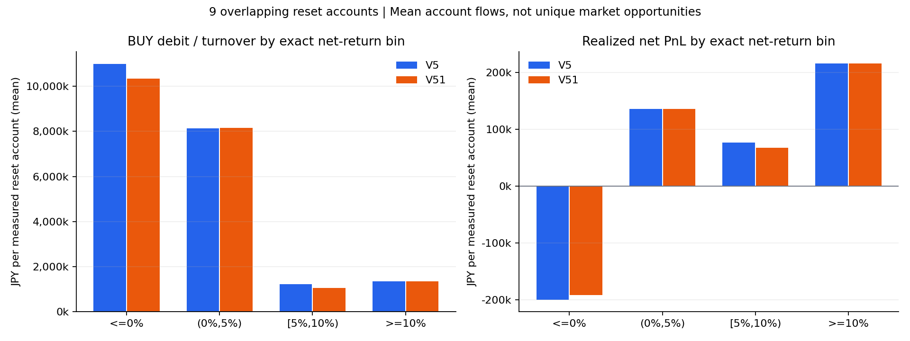

# 📊 Capital V5.1 — 最終結果

実時計JST: 2026-10-06T00:54:07.342911+09:00

**V5.1は不採用。測定可能な同一9窓で最終資産中央値が低下した。** 予定21窓のうち12窓はcoverage不明のまま残したため、全予定集合の月次評価は未成立。

## 💴 最終資産比較

各窓はcash100万円・保有0から開始し、20営業日内では複利連結。以下は両policyが完了した9窓のDevelopment診断。旧LEGACY_NORMALIZED20の19窓とは初期条件・母集団が異なり、同じ改善率として比較しない。

|指標|V5 RESET20|V5.1 RESET20|差 V5.1−V5|
|---|---:|---:|---:|
|最小|¥1,126,452.85|¥1,131,061.20|¥4,608.35|
|平均|¥1,228,242.39|¥1,227,619.57|¥-622.82|
|**中央値**|¥1,245,688.10|¥1,240,958.30|¥-4,729.80|
|最大|¥1,303,682.80|¥1,304,928.75|¥1,245.95|
|200万円到達|0/9（0%）|0/9（0%）|0|
|中央値の目標不足|¥754,311.90|¥759,041.70|¥4,729.80|
|予定／完了／coverage不明|21／9／12|21／9／12|同一|

paired差の中央値は¥1,245.95。上表の中央値差¥-4,729.80と区別する。改善／同値／悪化は6／0／3窓。

最小・最大は上昇した一方、平均・中央値は低下し、最悪MaxDDは9.3935%→9.4592%へ悪化。

## ✅ 実際に完了した作業

最新HEADと既存Evidenceをactual GET。完全指示書SHA256 `2cb3fbdfb66033373a081a2c60a3a59f01e1db941eb389f5f5e5215b94abbe07`を照合し、旧model/OFF/Oracle/AUC/bootstrapをreuse。V5のコードは原本commitに一致し、Selector／Entry／EXIT・古い負結果を変更していない。

営業日を公式の休日規則・2025年祝日から独立生成。元OOF38の範囲に40営業日、21窓を列挙した。7月11日・14日は休場でも候補0でもなくUNKNOWN_REASON。受領済みV4 manifestは7月14日への言及を含むが、全source完備・凍結Entry処理0の証明にならない。今後同じ探索を反復しない。

reset12テスト、境界3テスト、candidate11テストが通過。人工fixture修復と空JSONL読取りの修復を行ったが、strategyや比較basisを変えず、正式batch再起動は0。保存V5最初の1日でdecision・数量・取引・MTM・日次の完全一致を確認。正式実行は各policy1batch・9窓・180日。独立会計はraw O/C・費用・数量からcash、日次carry、SELL/BUY順、MTM、保有、終点を再構成し、両policyで不一致0。

## 🏷️ R5/R10・既存scoreの診断

U5/U10のEntry→Highはそのまま保持。Rは現行Capitalの固定EXIT＋EODとBUY1.0005／SELL0.9995にbindingし、100株単体referenceを1回だけmaterializeした。分類はDecimal/Fraction原本、費用は1回のみ。Structural EXITの保存returnは別列。未知はnull。

|母集団|N|R known|R unknown|R5|R10|
|---|---:|---:|---:|---:|---:|
|全Frozen Entry|1,039|1,016|23|55|25|
|実行適格|1,028|1,016|12|55|25|
|rank-pass・実行適格|494|492|2|34|16|

既存U5=170、U10=67。known U5のうちR5=54・R10=25・Loser=43。known U10のうちR5=37・R10=24・Loser=15。Uは利益化の保証にならない。

旧chain台帳を再利用した捕捉はR5=19/34（55.88%）、R10=11/16（68.75%）。funded precisionは19/150（12.67%）、11/150（7.33%）。これは旧chainの購入品質であり、新しいR予測モデルのaccuracyではない。resetのN・資金・利益寄与は各窓別JSONへ保存し、重複Entryを独立機会として合算しない。

|固定score・元の向き|R5 AUROC|R10 AUROC|
|---|---:|---:|
|MOVE_U2|0.692801|0.676771|
|MOVE_U3|0.686406|0.690373|
|MRET|0.378261|0.382321|
|pP/MOVE_P5|0.691552|0.698446|

すべてknownラベルを持つ実行適格1,016件への追加順位診断。元のU5 AUC認証は再実行していない。block別・session別Nと偏りを保存。MRETの向きを反転して救済せず、absolute-loss defenseはINCONCLUSIVEのまま。scoreをR5確率と呼ばない。

補助指標は9口座の平均（重複窓の市場機会数とは区別）。Loserへの投入と損失は減っても、R5区分の利益寄与が減り最終資産は改善しなかった。Loserの資金×拘束時間は16.17億円分→16.47億円分へ増加した。

|平均口座flow|V5|V5.1|
|---|---:|---:|
|LoserへのBUY debit（20営業日累計）|¥10,983,789.15|¥10,340,867.85|
|Loser net損益|¥-200,105.91|¥-191,955.96|
|R5 net利益寄与（R10含む）|¥292,576.83|¥283,425.53|

## 🔧 唯一の変更機構と最初の実差分

候補V5.1はV5の同じ現在batch・購入ゲート・target・capを使う。各候補に買える最初の100株を既存raw pP順で配り、その後の追加lotを同順でcapまで配分する。従来ML比例のdesired budgetをこの整数数量配分へ置換した。新係数・新閾値・blend・Reserve救済・買い増し・過去Entry復活は0。未知scoreはnative allocationへbatch単位で戻す。

同batchの具体的なcash→追加lot経路は6組（重複window44回）。初回0株を既存残余から水増しするだけの案には発火根拠がなく、その案をReplayしなかった。band capの最低lot未達には、resetで一意2件の経路しかなくR5/R10は0件だったため、単純cap緩和を採用していない。資金が残ることだけで改善とせず、今回の最終資産で判断した。

最初の実差分: 2025-07-22 10:35 JST・W13。同じEntryの数量 2200→3400株、debit ¥288,344.10→¥445,622.70。時刻順の最初で固定し、好成績例を選んでいない。詳細identityはprivate、公開はSHA256。

## ⚠️ 未測定・不確実性・副作用

12窓の欠測を0%で埋めず、途中資産・最後の価格・未決済を正式終点へ置換していない。両policyとも実行対象9窓では未決済・execution block0、片方だけ完了した窓0。12件の将来EXIT/EOD不足はラベルをnullにし、現在購入対象の除外条件には使用していない。11件のcutoff以降Entryは実行不適格として別mask。

重複窓は口座状態が独立なだけで、独立した月次標本ではない。通常CI・有意差は出していない。全期間のR診断を見た後の設計であり、事前commitしてもFresh/OOSに変わらない。元provider到着時刻はUNKNOWNで、既存の想定可用時刻を継承した。

## 💾 保存と次の1手

V5.1は中央値・平均を改善しなかったため不採用。V5をbaselineとして保持し、V5.2・新model・threshold救済を同cycleへ追加しない。次の1手は7月11日・14日の既存source/universeと凍結Selector/Entry処理完了・0件／除外receiptを回収すること。再生成が必要なら、その不足原本と上流範囲を明示した別Workが必要。

詳細はFINAL_COMPARISON.json、全21窓のCSV、R_LABEL_CENSUS.json、CAPITAL_DIAGNOSTIC.json、INDEPENDENT_ACCOUNTING_AUDIT.json、CURRENT_STATE.jsonに保存。commit/tree/blob/本文のactual GET receiptを最後に追加する。privateラベル・取引台帳は公開GitHubへ載せない。research-only、productionReady=false、実注文・main merge・Claudeはすべて0。
