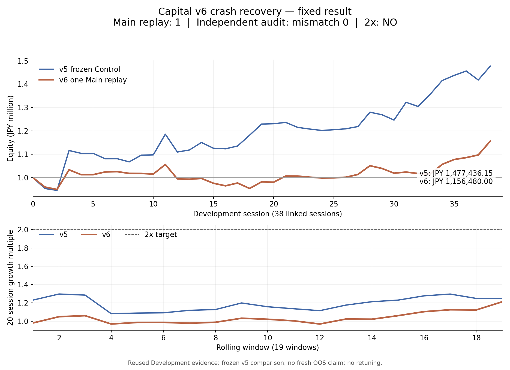

# Ark Terminal — Capital v6 Crash Recovery 結果固定報告

作成時刻: 2026-10-04T23:52:28.535648+09:00  
Repo: Iam-2squared/ark-terminal / Branch: capital-state9-vnext-20261004  
Profile: COUNTERFACTUAL_SLOT_VALUE_V6_MAX3  
CURRENT STATE: CAPITAL_V6_RECOVERY_D11_CLOSED_FIXED_STOP

v6は凍結した成功条件を満たさなかった。U5 fundedはv5の50から33、Net Slot Missは58から77となった。最終資産は¥1,156,480、日次幾何平均は+0.383314116%、20日medianは1.021525653x。2x到達はNO。計算の整合性は独立監査mismatch0で確認した。結果は再調整せず固定する。

## 必須比較

Rank-pass U5=113、physical Oracle feasible U5=104、unavoidable overlap=9。Rank-pass U10=47、Oracle ceiling=47。Oracleは凍結済みのphysical MAX3/cash/100株/same-symbol/Entry-EXIT/15:20条件の評価上限で、runtimeの配分cap・utilizationを緩和する。runtimeへ未来情報を返していない。

| 指標 | v5 frozen | v6 | v6−v5 |
|---|---:|---:|---:|
| U5 funded | 50 | 33 | −17 |
| U5 Oracle recovery | 48.076923% | 31.730769% | −16.346154pt |
| U5 MAX3 miss | 28 | 4 | −24 |
| U5 Reserve reject | 30 | 73 | +43 |
| U5 Net Slot Miss | 58 | 77 | +19 |
| U5 cash/lot miss | 5 | 3 | −2 |
| U10 funded | 26 | 18 | −8 |
| U10 MAX3 miss | 9 | 1 | −8 |
| U10 Reserve reject | 10 | 26 | +16 |
| U10 Net Slot Miss | 19 | 27 | +8 |
| U10 cash/lot miss | 2 | 2 | 0 |

U5 conservation: 33+4+73+3=113。U10 conservation: 18+1+26+2=47。

## A. Model quality

LogisticRegression 1 family、threshold0.5、8 rolling-origin modelsをbyte/hash一致で再利用した。supportは全8 blocks PASS、合計3,636 training-block examples。追加fit0、Winner fit0、within-block refit0。U5 Priority Amendmentはteacher生成/fit/Main前の確定記録を再利用した。

| Block | Train N | ACCEPT | RESERVE | lbfgs iterations |
|---|---:|---:|---:|---:|
| 1 | 212 | 83 | 129 | 61 |
| 2 | 287 | 105 | 182 | 67 |
| 3 | 342 | 120 | 222 | 72 |
| 4 | 429 | 125 | 304 | 86 |
| 5 | 516 | 148 | 368 | 86 |
| 6 | 561 | 174 | 387 | 78 |
| 7 | 622 | 178 | 444 | 90 |
| 8 | 667 | 211 | 456 | 90 |

p_acceptは凍結teacherのACCEPT class確率であり、U5や利益の校正済み確率を意味しない。OOF teacher-target accuracy/AUCは今回再生成していない。既存training state/teacherのprivate行を作り直さず、凍結hash/support/model preprocessingと、実際のruntime特徴量・確率・actionの整合性を確認した。下流のU5 capture改善は不成立。occupancyごとの確率・action集計はMODEL_QUALITY_AND_ACTION_DIAGNOSTICS.jsonに記録した。

## B. False Reserve vs Bad Fill

FALSE_RESERVE_U5=73。そのうち保存されたcausal stateでcurrent+pendingの最低100株ずつを現金で賄えるものは70。BAD_FILL_BLOCKED_U5=2で、実際にfundedされた<2% potential occupantを持つU5 MAX3 rejectも2。判定定義はMain前にprecommitした。

False ReserveはU5を見送ったという評価上の記述であり、未実行のtest teacherやaccept継続経路の最適性証明ではない。Bad Fillは保持期間の重なりによる診断であり、一意の因果責任やreplacement後の利益を示さない。pendingとactual fundedを分けた詳細行を保存した。新しいtest teacher/Oracle solve、replacement replayはいずれも0。

MAX3 missの減少だけでは改善にならなかった。観測された拒否理由では、Reserve rejectの増加43がMAX3 miss減少24を上回り、Net Slot Missは19増加した。

## C. Oracle gap

U5 recovery=33/104=31.730769%、remaining physical Oracle gap=71。U10 recovery=18/47=38.297872%、gap=29。凍結Oracle104/47とoverlap9は変更0。physical ceilingとruntime allocatorとの差も残るため、このgap全体をmodel errorとは断定しない。

## D. Slot 1 / 2 / 3

open0はmodelなしACCEPT、open1/2はp_accept>=0.5 ACCEPT、open3はMAX_POSITION_CAP。same-minuteはv4順序とsequential pending occupancyを再利用。下表のslotは実際にfundedされたslot。

| Slot | Funded N | U5 | U10 | <2% potential | Medium3–<5% | Actual PnL JPY |
|---|---:|---:|---:|---:|---:|---:|
| 1 | 49 | 14 | 9 | 18 | 10 | 105,104.55 |
| 2 | 50 | 15 | 7 | 13 | 15 | 82,027.15 |
| 3 | 22 | 4 | 2 | 12 | 3 | -30,651.70 |

## E. Rank action

Winner/rankは固定。S/A/B別rerun0、MAX4/5=0。全1039候補に対する結果はFUNDED121、Reserve320、MAX337、cash/lot16、below baseline534、15:20 cutoff11。

| Rank | Candidate N | Funded | U5 | U10 | <2% potential |
|---|---:|---:|---:|---:|---:|
| A | 154 | 69 | 20 | 11 | 27 |
| B | 297 | 22 | 3 | 2 | 6 |
| C | 545 | 0 | 0 | 0 | 0 |
| S | 43 | 30 | 10 | 5 | 10 |

## F. Medium / <2 / <3 / Loser

Funded121中Medium3–<5%=28（23.140496%）、<2%=43（35.537190%）、<3%=60（49.586777%）。実現net<=0のLoserは68（56.198347%）。<2% contaminationはv5の38.666667%から35.537190%へ減少したが、U5/U10 captureと経済結果の成功条件は満たさなかった。potentialと実現netを混同せず集計した。

## G. Economics / Asset curve

38 OOF Development sessionsを¥1,000,000から連結。全38日COMPLETE、execution unresolved0、19 rolling20 windows。v5 Controlはsaved resultを再利用し、再replay0。

| 指標 | v5 frozen | v6 |
|---|---:|---:|
| Daily geometric | +1.032420041% | +0.383314116% |
| Daily arithmetic | +1.107940337% | +0.415497499% |
| Daily median | +0.188227951% | −0.008823134% |
| Rolling20 min | 1.082366275x | 0.969210177x |
| Rolling20 mean | 1.190646013x | 1.036560407x |
| Rolling20 median | 1.199154192x | 1.021525653x |
| Rolling20 max | 1.297031026x | 1.212701318x |
| 2x windows | 0 / 19 | 0 / 19 |
| Final Equity | ¥1,477,436.15 | ¥1,156,480.00 |
| Final Return | +47.743615% | +15.648000% |
| MaxDD (minute MTM) | 10.225325014% | 11.202401121% |
| Mean utilization | 41.986826971% | 34.864336944% |
| Mean idle cash | 58.013173029% | 65.135663056% |
| Turnover | ¥89,327,438.95 | ¥66,639,905.10 |
| Recycled cash used | ¥6,728,380.05 | ¥4,911,990.90 |
| Funded / session | 3.947368 | 3.184211 |

v6最低現金¥203,685.70。v5 paired daily delta平均−0.692442839pt、median−0.167468790pt、改善16日/悪化21日/同値1日。Final Equity差−¥320,956.15。Historical best CORE_P5 MAX3 Liquidity OFFの日次+1.095962620%、最終約¥1,513,160も上回らない。

ASSET_CURVE_DAILY.csv、ROLLING20.csv、全decision/trade/MTM/EOD ledgerを保存した。

## H. Integrity / frozen criteria

独立実装165,881比較でmismatch0。Primary runtime/replay/evaluator import0。凍結model identity、特徴量/preprocessing、p_accept/action、same-batch occupancy、allocation/quantity、BUY/SELL、MTM/cash、daily/rolling20、U5/U10理由、False Reserve/Bad Fill/Oracle gapを照合した。Decimal money・quantityはexact、float/probability/featuresのprecommit toleranceは1e-12。

原本D0–D6、8models、既存checkpoints/receipts、D3 Block07 failure、v1–v5 Evidenceを含む520件のremote metadata identity確認がPASS。WORK_STATUS_LOG旧54行のbyte prefixも一致。旧recordの初期復旧anchorと現行進度の区別はappend-only補足で明記した。

| 固定成功条件 | 結果 |
|---|---|
| V6_SLOT_VALUE_IMPROVED: U5 funded>50 AND Net Slot Miss<58 | FALSE |
| V6_SLOT_VALUE_STRONG: Improved AND recovery>=60% AND U10>=26 AND <2<=38.6667% | FALSE |
| CAPITAL_V6_IMPROVES: daily geom>1.0324% AND 20日median>1.19915419x AND Final>¥1,477,436.15 | FALSE |

全基準はMain前の定義から変更0。結果救済/retune0。独立監査は同じ入力の実装・計算整合性を検証するもので、外部sourceの真実性やfresh OOSの成績を認定するものではない。

## I. Recovery provenance

開始時latest GET: bedc63ba49a184594cf26f84e1562ce9d5b7e472 / tree7517b7fcf4214246391669e09130af4332d86bb8。D0–D6 complete、D7 STARTのみ、Main0、fits8を確認しCase Aで再開した。R0/R1/R2をappendしてactual GET receiptを保存。添付v4 nested archiveの必要29ファイルだけをGitHub D1のSHA256で照合し、既完了教師・fitは再生成していない。

D7のsingle execution claimを先にcommit/GETしてから、D6のreplay.pyを1回実行した。途中で再クラッシュした場合にもclaimを重複実行せず曖昧状態としてSTOPできる記録を残した。

D10の独立engine attempt1は計算後のreport writerでPath未定義により保存前に失敗。失敗artifactを保存し、凍結audit engineのhashを変更せず、Pathだけをnamespaceに補うwrapperをprecommitしてattempt2で完了した。**Mainは1回、独立engineは2 attempts、完成した保存済み独立監査は1件**。判定条件・model・feature・threshold・入力・audit toleranceの変更0。

件数: Slot既存fit8、追加fit0、Winner fit0、teacher再生成0、Control replay0、retune0、orders0、main merge0、force push0。Protected/Holdout/Fresh/Validation/OOS/Prospective開封0、new provider0。Safety10項目はすべてfalse。ExposureはITERATIVE_DEVELOPMENT_EVIDENCEでfresh OOS claimなし。

CURRENT STATE: CAPITAL_V6_RECOVERY_D11_CLOSED_FIXED_STOP  
NEXT POLICY: 凍結結果とappend-only Evidenceを保持してSTOP。  
DO NOT: 再実行、再fit、教師再生成、threshold/feature/U5 amendment/Winner/rank/Entry/EXIT/MAX/Liquidity変更、救済retune、protected開封、orders、main merge、force push。  
CURRENT JST: 2026-10-04T23:52:28.535648+09:00
