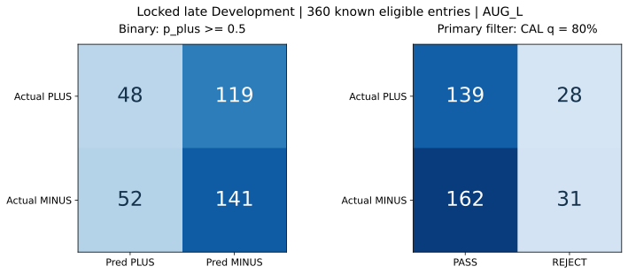
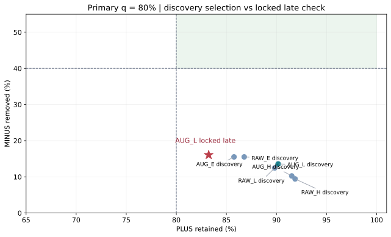
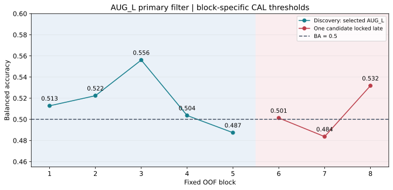

# 🛡️ Independent Entry→EXIT Sign Classifier V1 — 実行報告

対象は後半ロック確認の符号既知・実行適格360件。教師は固定Entry→固定EXIT/EODの費用後PLUS／MINUSのみ、各Entryを1件として数えた。

**PLUS／MINUS × 生二値予測**

| 実際の費用後符号 | 予測PLUS：p≥0.5 | 予測MINUS：p<0.5 | 計 |
| --- | --- | --- | --- |
| PLUS | 48 | 119 | 167 |
| MINUS | 52 | 141 | 193 |

**PLUS／MINUS × 主filter（CAL PLUS保存条件80%）**

| 実際の費用後符号 | PASS_CANDIDATE | REJECT_CANDIDATE | 計 |
| --- | --- | --- | --- |
| PLUS | 139 | 28 | 167 |
| MINUS | 162 | 31 | 193 |

旧成果との保存値比較：

| 参照filter | 区間／既知数 | PLUS通過 | MINUS除去 | 通過MINUS率 | BA |
| --- | --- | --- | --- | --- | --- |
| 旧Stage1 primary（保存済み） | OOF38／1016 | 447/462 | 26/554 | 54.15% | 0.5072 |
| 旧Stage1 primary（保存済み） | 後半13 sessions／360 | 158/167 | 14/193 | 53.12% | 0.5093 |
| 今回AUG_L 主q80 | 後半13 sessions／360 | 139/167 | 31/193 | 53.82% | 0.4965 |

**後半status：`SIGN_NOT_SEPARATED_IN_THIS_RUN`。** PLUS139件を残し、28件を拒否。MINUS31件を除き、162件を通過させた。PLUS保存率83.23%、MINUS除去率16.06%。通過MINUS率はフィルター前53.61%から53.82%へ**上昇**した。通過集合は実際のPLUS確定集合ではない。

主filter BA=0.496479、MCC=-0.009488。事前固定したBA≤0.5／MCC≤0の負結果条件に該当する。旧Stage1は90%保存制約・異なるFIT／表現を使ったため、上表は同一訓練条件の優劣判定ではない。旧完了成果32fit、旧不採用判定、V5保持をそのまま保存・再利用した。

## 📊 母集団・実測図

| 区間 | 全Entry | 実行適格 | 符号既知 | PLUS | MINUS | 厳密0 | 不明：全／適格 | 適格予測可能 | ABSTAIN | sessions |
| --- | --- | --- | --- | --- | --- | --- | --- | --- | --- | --- |
| DISCOVERY・全6候補共通 | 670 | 665 | 656 | 295 | 361 | 0 | 14／9 | 665 | 0 | 25 |
| LATE・固定AUG_L | 369 | 363 | 360 | 167 | 193 | 0 | 9／3 | 363 | 0 | 13 |

適格の予測coverageは両区間とも100%。符号不明は予測行として保持し、正負採点から除外。厳密0は0件。元OOF38全体は1,039件、適格1,028件、既知1,016件（PLUS462／MINUS554）、不明23件（適格12件）。58 sessionsのruntime1,600件とwarmup20の既知544件を原本のまま継承した。

## 🔒 固定条件・時間順分割・独立性

Selector、FIRST ENTRY v2 P1_Q70、Structural EXIT v3、EOD／費用／約定、State9 RC2／Path、既存Winner Rankとproducerを保持した。実験コードは独立directoryに追加し、Capital engineをimportしない。推論は`predict_sign(snapshot, model_artifact, threshold_artifact)`。教師、true R、future EXIT、口座資金、数量を引数へ渡せない。出力は同じEntry ID・p_plus・二値符号・研究用PASS/REJECT・hash・cutoff・availability・exposure。将来のRank joinはID契約だけを保存し、adapter接続は0。

原debit/creditのexact比較でPLUS=1／MINUS=0を作る監査adapter以外には、金額・return原値を渡さない。教師viewは6列allowlist、等重み、sample_weight=None、class_weight=None。費用再控除、EXIT再計算、epsilon帯、未知営業日補完は0。結果の大きさを符号不変で変える3,120ケースを独立検算した。

原58 sessions／warmup20／OOF38・8blocksを保持。各blockは過去末尾5sessionsをCAL、それ以前をFIT。FIT教師はCAL開始前、CAL教師はTEST開始前の成熟だけ。前処理はFIT-only（固定0補完＋全数値の欠測indicator、FIT平均／標準偏差、FIT辞書＋UNKNOWN one-hot）。CALでtauを決めた同じモデルをTESTへ使い、CAL後refit・TEST内更新は0。FIT最低100既知／10sessions／各class20、CAL最低50既知／3sessions／各class10を全条件で満たした。

主tauはCALのユニークp_plus＋0＋1超sentinelから、PLUS保存≥80%の中でexact件数BA最大、MINUS除去最大、tau最小の順。CAL BA≤0.5はALL_PASS。生二値p≥0.5と主filterを別評価した。ABSTAINは生二値で正解に数えず、filterでは運用PASSとして残す。

実市場期間は**HISTORICALLY_EXPOSED_DEVELOPMENT**。後半は`LATE_DEV_LOCKED_CHECK`でありFresh／holdout／新しいOOSではない。元のfirst-intent ID、closed prefix、same-time順序とproducer成熟監査を引継ぎ、hash・row identity・FIT producerにCAL/TEST依存0を再照合。historical availabilityは**HISTORICAL_ASSUMED_AVAILABILITY**、actual arrivalはUNKNOWNのまま。

## 🧠 事前固定6候補の比較と1候補ロック

RAWは価格106数値＋State/Path18数値・7カテゴリ＋context9数値＝133数値・7カテゴリ。学習scoreを含まない。AUGは合法な保存済みP1 score／thresholdの2列のみ追加（135数値・7カテゴリ）。両列は全FIT/CAL/TESTで接続100%、追加producer学習0。pP／MOVE_U2／MOVE_U3はwarmup等の接続不足で全区分95%条件未達のため事前除外。MRET、HL0/D1/D2のstack、新しいDaily等は追加しない。

L＝Logistic C0.1／lbfgs／max_iter2000、H＝HistGradientBoosting lr0.05／100iterations／7leaves／depth3／l2=1／early_stopping=False、E＝ExtraTrees300／depth6／leaf10／max_features0.5／bootstrap=False。seed57、全resolved parametersと環境versionを`MODEL_PRECOMMIT.json`に事前固定した。性能を見て設定変更していない。

DISCOVERYは2025-06-27〜2025-08-05の25sessions、共通既知656件。主q80の比較：

| 候補 | block平均BA：選択用 | 最小block BA | pool BA | MCC | Brier | PLUS保存 | MINUS除去 | active blocks | coverage |
| --- | --- | --- | --- | --- | --- | --- | --- | --- | --- |
| AUG_L | 0.516462 | 0.487395 | 0.5187 | 0.0575 | 0.2987 | 90.17% | 13.57% | 5 | 100.00% |
| RAW_L | 0.509873 | 0.478875 | 0.5115 | 0.0359 | 0.2716 | 89.83% | 12.47% | 5 | 100.00% |
| AUG_H | 0.509087 | 0.491830 | 0.5089 | 0.0302 | 0.2603 | 91.53% | 10.25% | 4 | 100.00% |
| RAW_E | 0.504513 | 0.429487 | 0.5115 | 0.0324 | 0.2518 | 86.78% | 15.51% | 4 | 100.00% |
| RAW_H | 0.504034 | 0.473273 | 0.5064 | 0.0225 | 0.2611 | 91.86% | 9.42% | 5 | 100.00% |
| AUG_E | 0.500780 | 0.413462 | 0.5064 | 0.0178 | 0.2526 | 85.76% | 15.51% | 5 | 100.00% |

coverage≥95%、active blocks≥3を全6候補が満たした。選択順はblock平均BA→最悪block BA→pool MCC→低Brier→RAW→L/H/E。最高の**AUG_L**を1候補へ固定した。前半block平均BAのRAW_Lとの差は0.006589。pool BAとblock平均BAは別値であり、選択には後者だけを主順位として使った。旧32fitはCALを学習に含む等の非等価条件なので新FITへ流用せず、原本・保存予測・監査・baselineに再利用した。

候補ロックはGitHub commit `3983c8c6ff2ddb028dc497ff8eb462607d00e433`へ保存し、actual GETで本文・blob・HEADを読み戻した後に後半を開始。後半に走らせたのはAUG_Lだけ3blocks。全後半predict／policy保存後に採点し、candidate交換0。前半開始前commitは`2d8062e2d1a29100d5f1e27c7249942c24c970e5`。

## 📉 後半ロック確認と不確実性

後半は2025-08-06〜2025-08-25の13sessions、全369件・適格363件・既知360件。BA CI95%は[0.470703, 0.520849]。前半の小さなfilter差を後半で確認できなかった。

| 後半指標 | 生二値p≥0.5 | 主filter q80 |
| --- | --- | --- |
| balanced accuracy | 0.5090 | 0.4965 |
| MCC | 0.0200 | -0.0095 |
| accuracy | 0.5250 | 0.4722 |
| PLUS precision | 0.4800 | 0.4618 |
| PLUS recall／保存 | 0.2874 | 0.8323 |
| MINUS precision | 0.5423 | 0.5254 |
| MINUS recall／除去 | 0.7306 | 0.1606 |
| AUROC（共通スコア） | 0.5177 | 0.5177 |
| PLUS AP（共通スコア） | 0.5081 | 0.5081 |
| MINUS AP（共通スコア） | 0.5447 | 0.5447 |
| Brier（共通スコア） | 0.2634 | 0.2634 |
| log loss（共通スコア） | 0.7827 | 0.7827 |

生二値のBAは僅かに0.5超だが、PLUSを48／167件しかPLUS予測できない。主filterの負結果をこの別指標で救済しない。確率Brierは同じFIT過去PLUS率B0より悪く、確率品質にも改善を確認できない。p_plusは未校正スコア。

| 主filterの指標 | 後半実測 | session bootstrap 95%区間 | 有効／NA |
| --- | --- | --- | --- |
| BA | 0.4965 | [0.4707, 0.5208] | 2000／0 |
| PLUS保存率 | 0.8323 | [0.7407, 0.9212] | 2000／0 |
| MINUS除去率 | 0.1606 | [0.0979, 0.2275] | 2000／0 |
| 通過MINUS率 | 0.5382 | [0.4799, 0.5987] | 2000／0 |

session単位2,000回、seed20261006、各sessionの全Entryをまとめて再標本化。モデルrefit・tau再選択0。全指標2,000有効、片class／ゼロ分母NA0。各候補・区間のCIは保存JSONにあり、ここでは後半主結果を示した。CIは期間反復露出・モデル選択・全ての時間依存を補正しない。

| 固定条件 | 実測 | 確認 |
| --- | --- | --- |
| PLUS保存 ≥80% | 0.8323 | 達成 |
| MINUS除去 ≥40% | 0.1606 | 未達 |
| BA ≥0.60 | 0.4965 | 未達 |
| MCC >0 | -0.0095 | 未達 |
| coverage ≥95% | 1.0000 | 達成 |
| BA >0.5のblock ≥2/3 | 2.0000 | 達成 |
| 既知 ≥100件 | 360.0000 | 達成 |
| 各class ≥30件 | 167.0000 | 達成 |
| sessions ≥10 | 13.0000 | 達成 |
| BA CI下限 >0.5 | 0.4707 | 未達 |

| block／区間 | FIT／CAL／TEST既知 | CAL q80 tau | CAL status | TEST PLUS保存 | TEST MINUS除去 | TEST BA |
| --- | --- | --- | --- | --- | --- | --- |
| 1／探索 | 399／145／130 | 0.27298757 | ACTIVE | 80.77% | 21.79% | 0.5128 |
| 2／探索 | 544／130／131 | 0.02982137 | ACTIVE | 95.38% | 9.09% | 0.5224 |
| 3／探索 | 674／131／134 | 0.32370737 | ACTIVE | 95.00% | 16.22% | 0.5561 |
| 4／探索 | 805／134／130 | 0.34512802 | ACTIVE | 92.73% | 8.00% | 0.5036 |
| 5／探索 | 939／130／131 | 0.31814590 | ACTIVE | 85.71% | 11.76% | 0.4874 |
| 6／後半 | 1069／131／143 | 0.23852283 | ACTIVE | 93.85% | 6.41% | 0.5013 |
| 7／後半 | 1200／143／140 | 0.34465172 | ACTIVE | 66.18% | 30.56% | 0.4837 |
| 8／後半 | 1343／140／77 | 0.29521271 | ACTIVE | 97.06% | 9.30% | 0.5318 |

補助q90／q70は事前固定した別保存条件で、後半の都合で主q80を差し替えていない。

| CAL保存条件 | PLUS通過／167 | MINUS除去／193 | PLUS保存 | MINUS除去 | BA | 通過MINUS率 |
| --- | --- | --- | --- | --- | --- | --- |
| q=0.9 | 139 | 31 | 83.23% | 16.06% | 0.4965 | 53.82% |
| q=0.8 | 139 | 31 | 83.23% | 16.06% | 0.4965 | 53.82% |
| q=0.7 | 123 | 55 | 73.65% | 28.50% | 0.5108 | 52.87% |

q90とq80の後半実行結果が同じでも、CAL制約と保存されたtauは別に監査した。q70はMINUS除去が増える一方、PLUS保存80%に届かない。この補助結果で候補／合否を変更しない。

## 🧬 情報群の寄与・学習状況・旧参照

後半結果と無関係に、選んだLogisticの設定を保持して探索5blocksのみを比較：

| 探索5blocks・Logistic固定 | block平均BA | full−除外 BA | 新規fit | 等価再利用 |
| --- | --- | --- | --- | --- |
| full AUG_L | 0.516462 | — | 既存前半5 | 0 |
| DROP_G_PRICE | 0.505202 | 0.011260 | 5 | 0 |
| DROP_G_SCORE | 0.509873 | 0.006589 | 0 | 5 |
| DROP_G_STATE | 0.511272 | 0.005190 | 5 | 0 |

G_PRICE／G_STATE／G_SCOREの存在は前半で小さなBA差に対応したが、相関のある群を除く比較であり因果効果や未知期間の有効性とは言わない。G_SCORE除外は同じ前半RAW_LとFIT payload・列・教師・設定が一致したため5fitを再利用。ablationで主モデル／後半／閾値を交換していない。

生二値p≥0.5のFIT／CAL／TEST診断：

| block | FIT N／BA | CAL N／BA | TEST全Entry／BA | 数値欠測：FIT／CAL／TEST |
| --- | --- | --- | --- | --- |
| 1 | 399／0.7031 | 145／0.5498 | 134／0.5064 | 53.41%／52.04%／50.43% |
| 2 | 544／0.6788 | 130／0.4679 | 136／0.4925 | 53.05%／50.44%／54.16% |
| 3 | 674／0.6470 | 131／0.5117 | 137／0.5453 | 52.54%／53.73%／52.05% |
| 4 | 805／0.6301 | 134／0.5187 | 131／0.4806 | 52.74%／51.74%／50.26% |
| 5 | 939／0.6239 | 130／0.4988 | 132／0.5067 | 52.59%／50.14%／52.02% |
| 6 | 1069／0.6137 | 131／0.5275 | 147／0.4846 | 52.30%／51.92%／52.93% |
| 7 | 1200／0.6144 | 143／0.4962 | 144／0.5127 | 52.25%／53.00%／50.99% |
| 8 | 1343／0.6079 | 140／0.5212 | 78／0.5609 | 52.33%／51.04%／53.93% |

FIT BAは0.7031〜0.6079、CAL/TESTは概ね0.5付近。過適合の兆候は考えられるが原因を断定しない。保存数値には欠測が多い（全適格runtimeのG_PRICE 62.57%、G_STATE 24.90%）。完全欠落列は0。固定した欠測処理で扱い、結果後の穴埋めや追加特徴は0。TEST件数欄は全Entryで、BAの採点は既知・適格のみ。

| 後半・生二値参照 | BA | MCC | AUROC | Brier |
| --- | --- | --- | --- | --- |
| 今回AUG_L | 0.5090 | 0.0200 | 0.5177 | 0.2634 |
| ALL_MINUS | 0.5000 | 0.0000 | 0.5000 | 0.4639 |
| ALL_PLUS | 0.5000 | 0.0000 | 0.5000 | 0.5361 |
| B0 | 0.5000 | 0.0000 | 0.5001 | 0.2489 |
| FIT_MAJORITY | 0.5000 | 0.0000 | 0.5000 | 0.4639 |
| HL0（保存予測） | 0.4796 | -0.0491 | 0.4998 | 0.2539 |
| OLD_D1（保存予測） | 0.5291 | 0.0643 | 0.5380 | 0.2507 |
| OLD_D2（保存予測） | 0.5060 | 0.0134 | 0.5537 | 0.2483 |

B0は同じFITだけの成熟過去PLUS率を使い、同じCAL手続きで全block ALL_PASS、主filter BA0.5。ALL_PLUS／ALL_MINUS／FIT多数派は生二値の参照。B0のpool AUROCが0.5と僅かに異なるのはblockごとに過去率が異なるため。HL0／D1／D2は保存p_negを1−p_negに向け直しただけで再fit0。旧学習は今回CALの日付を含むため、今回との同一訓練条件比較には使えない。

結果固定後の補助subset（モデル選択・主判定に不使用）：

| 後半・補助subset | 全Entry／適格／既知 | PLUS保存 | MINUS除去 | BA | 通過MINUS率 | 適格coverage |
| --- | --- | --- | --- | --- | --- | --- |
| OLD_V5_PURCHASED | 52／52／52 | 80.00% | 14.81% | 0.4741 | 53.49% | 100.00% |
| RANK_PASS | 180／180／179 | 80.46% | 17.39% | 0.4893 | 52.05% | 100.00% |

既存Rank／旧V5 membershipを集計にだけ利用。少数subsetの結果は全体成功やRank再学習の根拠にしない。

## 🔍 検算・技術修復・保存実績

独立監査は主model／policy／metrics処理をimportせず、保存符号＋予測からexact件数、pairwise AUROC、grouped AP、fsum Brier／log lossを再構成。43モデル・48trial条件、CAL tau tie／support／ALL_PASS、前処理FIT-only、成熟境界、予測保存後採点、1候補、3block、後半bootstrap、合否を照合。**1303項目、mismatch=0、PASS**。独立推論APIの全1,039保存予測一致、禁じた教師・金額・future EXIT・資金・数量の入力拒否、future source→ABSTAIN/PASSを別確認した。合成契約テスト12件PASS。

意味不変の技術修復を明示する。①mutable ledgerの後半block8の1記録欠落を、immutable model・開始claim・sealed予測・閾値・FIT IDから復元。元ledger記録時刻とwarningsは不明として保持し、元実験の時刻を創作しない。②DISCOVERY_RAW_E_BLOCK_04のtraining gzip1件が途中で切れていたため、元の凍結view＋immutable FIT IDから再構成。805行のcanonical payload hashは元signatureと一致し、残存746行も一致。欠損gzipはrepairに保存した。③旧action名のadapterを保存済みPASS系／REJECTへ正しく対応させた。全て修復receiptを保存し、model／primary予測／教師／tau／candidate／合否の変更0、追加fit0。

| 実行内容 | 実績 |
| --- | --- |
| 前半6候補×5blocks | 30 |
| 固定1候補・後半3blocks | 3 |
| 情報群除外・新規fit | 10 |
| 情報群除外・等価fit再利用 | 5 |
| 新規教師model fit合計／上限 | 43／48 |
| 全trial条件数 | 48 |
| 前処理fit（別counter） | 23 |
| 技術model fit retry／上限 | 0／2 |
| 旧Sign-only追加fit／producer fit／calibration fit／full-data最終fit | 0／0／0／0 |
| Capital接続／Replay／第2層fit／注文 | 0／0／0／0 |
| 原R再生成／新市場特徴／provider取得／保護データ開封 | 0／0／0／0 |
| main merge／force push／Claude | 0／0／0 |

開始checkpoint実時計JST：`2026-10-06T11:54:33.813797+09:00`。独立監査完了：`2026-10-06T12:17:11.566483+09:00`。報告書作成：`2026-10-06T12:23:43.504653+09:00`。basis HEAD `4a0b6d5fef69ecee34a05c36789c57478ab37a7a`、tree `7e544213be9d97a966649c4317c6032e609a3ce6`。開始保存時には旧writerの完了commit `07324ba54fc44a7c03ce7702c62bc7484aecf4cc`をparentとしてその成果を保持。競合をleaseで拒否して読み直し、force push0。

開始、入力固定、探索ロック、後半／ablation／独立検算の保存はactual GETで本文・blob・branch HEADを確認した。直近検算checkpoint commitは`09f99aa819cfcfc0e5e5a6101fb0d2222618db8e`。final保存の正確なcommit／tree／実時計／読み戻しは`DELIVERY_RECEIPT.json`と`readbacks/`に追記する。`FROZEN_UPSTREAM_AUDIT.json`では旧研究33件、旧Evidenceの自module以外、root／docsの関連外subtreeのsha一致を確認。final treeについても再照合し、旧成果と凍結コードを保持する。

publicは定義・集計・hash・コード・検算、privateは行別入力・教師・モデル・予測・原ZIP・修復原本を分離。`FIRST_PREDICTIONS.jsonl.gz`はprivateに保存しpublic descriptorでhashと行数を固定。private ZIPに原旧Sign-only ZIPを同じhashのまま含め、最終GitHub commitと再開手順を記録する。

## 🎯 終了方針

指定した独立モジュール、有限比較、1候補ロック、後半確認、寄与分析、独立検算を完了した。今回の表現・family・期間では、PLUS保存80%とMINUS除去40%を同時に実証できず、Sign審査として採用へ進めない。これは全モデル・全情報で予測不可能という結論ではない。既存Entry／EXITの責任へ戻さず、今後の検討は別設計で購入前情報の品質・欠測原因の確認と未閲覧期間の検証を事前固定する範囲に限る。本Workの追加探索は終了。既存Rankを保持し、Capital接続・Replay・第2層学習へ進めない。`productionReady=false`、自動昇格なし。
