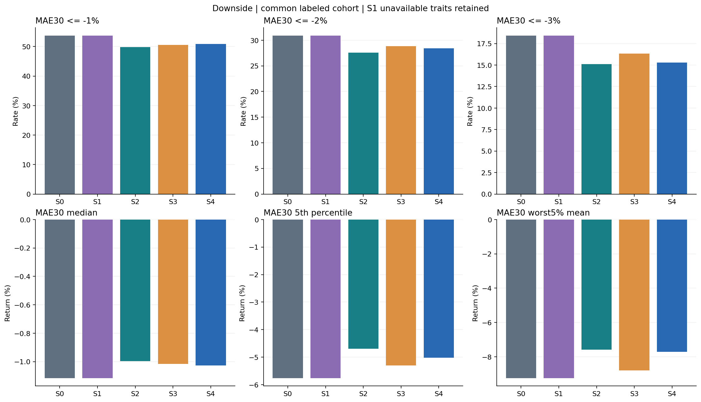
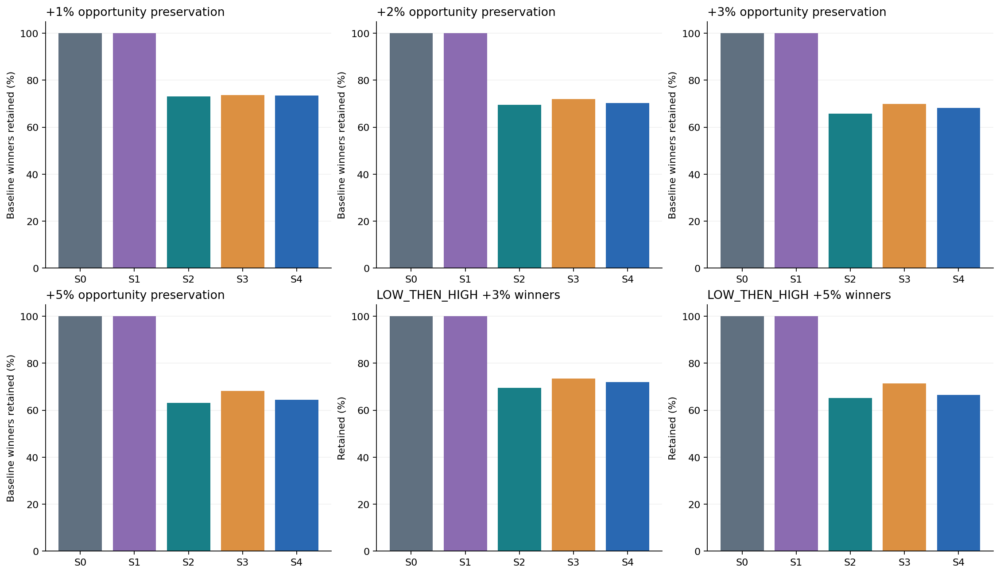
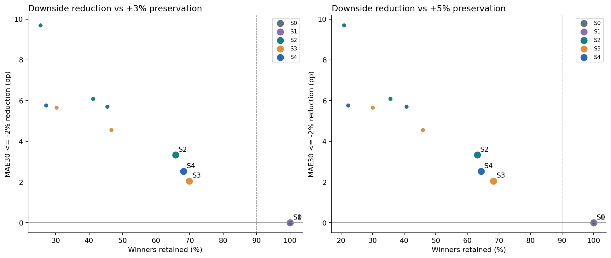
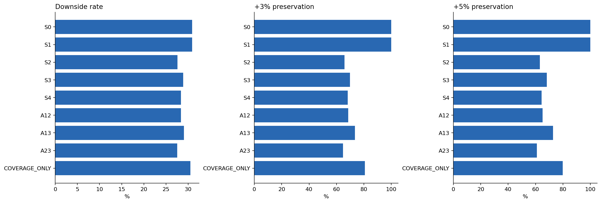
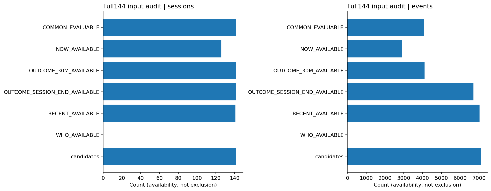
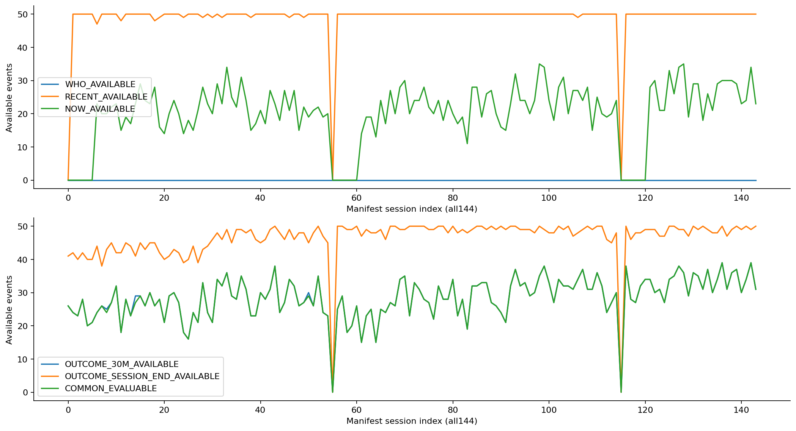
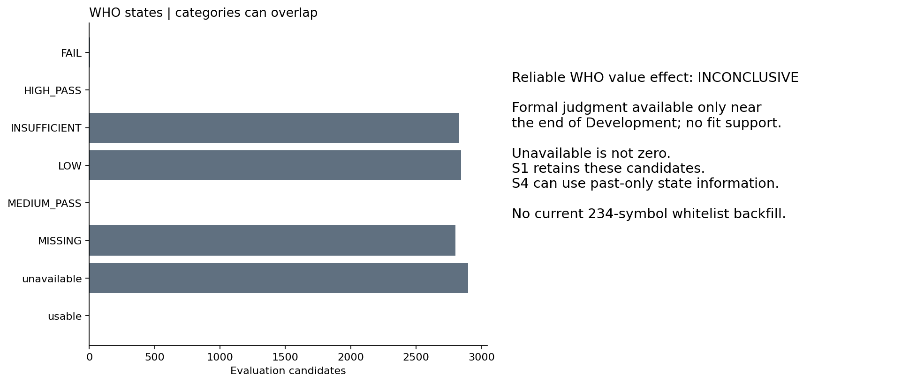
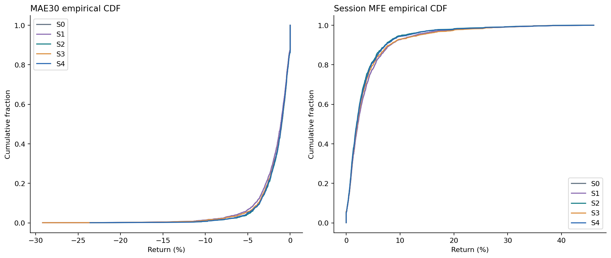
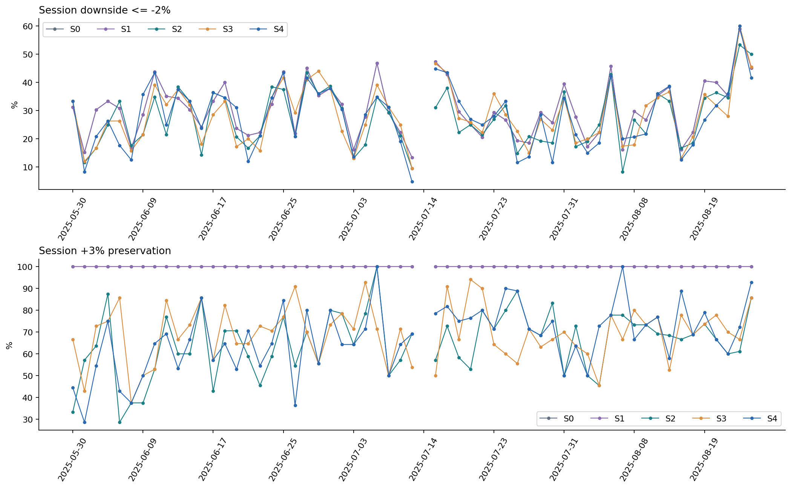
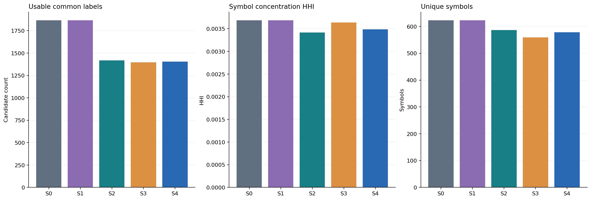

# Phase57 Full144 Development Remeasurement

FULL144_INPUT_COMPARISON_COMPLETE_WITH_EXPLICIT_AVAILABILITY_LIMITS

144日すべてを入力監査。候補生成 142日 / 7100件、全期間の共通outcome 142日 / 4100件。

時系列分割は事前固定: fit80日（〜2025-05-22）・embargo5日・evaluation59日（2025-05-30〜2025-08-25）。下表はevaluation候補2900件を母集団とする。全144日のin-sample性能との混同を避け、fit期間の成績は合算しない。

## 原因と修正

55日制限は144日manifestではなく既存76日candidate ledgerとのintersectionを採用したため。保存55日のidentity/score/priceはそのまま継承し、追加日は既存Frozenモジュールを呼び出して推論。直前の正確な営業日が許可データにない日は、欠測理由を台帳に保存して候補生成UNAVAILABLEとする。sealed前日や古い終値で補完しない。

元分足の全144日response hashとTime分布をsource-only auditで先に固定。15:25〜15:29は通常の取引バーがないプレ・クロージングであり、15:30引けは独立約定。存在しない5分足は作らない。実1分足からのOHLCV集約は既存仕様のまま。

[JPX売買成立方法](https://www.jpx.co.jp/equities/trading/domestic/04.html) / [J-Quants分足仕様](https://jpx-jquants.com/ja/spec/eq-bars-minute)

修正評価は通常立会終了（旧15:00、新15:25）と引け板寄せ（旧15:00、新15:30）を分離。session-endは元minuteのvolume合計・high/lowとdailyの一致、実引け約定、decision後pathを必須とする。全取引sourceが整合する場合の取引なし区間は補間せず、観測約定だけからextremaを測る。30/60分はwall-clock、昼休み跨ぎ不可、必要5分slot・endpointの実観測を要求。独立horizon集計も保存し、引け欠測が30分集計を消さない。

## 共通比較

主保持率80%、補助40/60/100%は前回から不変。全Variantに同じ候補・fit/eval・特徴・ridge lambda10・判定閾値。S1はWHO利用不能を理由に削除しないため実保持率が異なりうる。S4はWHO coverageで母集団を絞らない。risk=-MAE30で順位付け、quality=MFEは別保存。high touchは収益・約定ではない。

| Metric | S0 Selector | S1 WHO | S2 RECENT | S3 NOW | S4 ALL |
|---|---:|---:|---:|---:|---:|
| Candidate population | 2900 | 2900 | 2900 | 2900 | 2900 |
| Retained candidates | 2900 | 2900 | 2320 | 2320 | 2320 |
| Common evaluable population | 1866 | 1866 | 1866 | 1866 | 1866 |
| Retained common evaluable | 1866 | 1866 | 1417 | 1396 | 1405 |
| MAE30 median % | -1.116 | -1.116 | -0.998 | -1.017 | -1.027 |
| MAE30 p05 % | -5.761 | -5.761 | -4.698 | -5.300 | -5.022 |
| MAE30 worst5 mean % | -9.240 | -9.240 | -7.589 | -8.784 | -7.700 |
| -1% downside rate % | 53.751 | 53.751 | 49.824 | 50.573 | 50.890 |
| -2% downside rate % | 30.922 | 30.922 | 27.594 | 28.868 | 28.399 |
| -3% downside rate % | 18.435 | 18.435 | 15.102 | 16.332 | 15.302 |
| +1% preservation / winner retention % | 100.000 | 100.000 | 73.188 | 73.696 | 73.551 |
| +2% preservation / winner retention % | 100.000 | 100.000 | 69.587 | 71.903 | 70.393 |
| +3% preservation / winner retention % | 100.000 | 100.000 | 65.826 | 69.888 | 68.207 |
| +5% preservation / winner retention % | 100.000 | 100.000 | 63.171 | 68.293 | 64.390 |
| LOW_THEN_HIGH +3% retention % | 100.000 | 100.000 | 69.548 | 73.477 | 71.906 |
| LOW_THEN_HIGH +5% retention % | 100.000 | 100.000 | 65.246 | 71.475 | 66.557 |
| MFE session median % | 2.168 | 2.168 | 1.923 | 2.075 | 1.988 |
| MAE session median % | -2.149 | -2.149 | -1.905 | -2.025 | -1.961 |
| MAE60 median % | -1.642 | -1.642 | -1.467 | -1.544 | -1.509 |
| Return30 mean % | 0.091 | 0.091 | 0.116 | 0.104 | 0.130 |
| Return30 median % | 0.000 | 0.000 | 0.000 | 0.000 | 0.000 |
| Session return mean % | -0.197 | -0.197 | -0.099 | -0.029 | -0.039 |
| Session return median % | -0.435 | -0.435 | -0.312 | -0.379 | -0.312 |
| Positive30 rate % | 48.660 | 48.660 | 48.271 | 48.066 | 49.110 |
| Downside utility mean % | -1.714 | -1.714 | -1.451 | -1.571 | -1.468 |

## 判定 / ablation

| Variant | 判定 | 理由 |
|---|---|---|
| S1 | INCONCLUSIVE | Reliable WHO values have no fit-period support; only late formal availability can be described. State-only score is auxiliary; unavailable candidates retained. |
| S2 | DOWNSIDE_REDUCTION_COSTS_TOO_MUCH_UPSIDE | Positive downside separation but +3/+5 retention below precommitted90%. |
| S3 | DOWNSIDE_REDUCTION_COSTS_TOO_MUCH_UPSIDE | Positive downside separation but +3/+5 retention below precommitted90%. |
| S4 | DOWNSIDE_REDUCTION_COSTS_TOO_MUCH_UPSIDE | Positive downside separation but +3/+5 retention below precommitted90%. |

事前条件: 同保持予算Frozen順位対照比、-2%下落率改善2pp以上、session block5 bootstrap95%下限>0、+3/+5保持率各90%以上。S4 incrementalはS2/S3/A23比も必要。Development再利用の記述的比較であり独立OOS検定ではない。

| Arm | Reduction vs matched Frozen pp | Block95% CI |
|---|---:|---|
| A12 | 3.432 | [2.120591555198162, 4.9408734543701] |
| A13 | 2.915 | [1.0561504334412006, 4.889992088068899] |
| A23 | 4.121 | [2.6637146218513994, 5.809395200655814] |
| COVERAGE_ONLY | 1.265 | [-0.017682553020013668, 2.701113026620765] |
| S1 | 0.955 | [0.23000620119471823, 1.697266586666629] |
| S2 | 4.178 | [2.93320869653924, 5.558126665954627] |
| S3 | 3.051 | [1.5458174842335968, 4.544462059396124] |
| S4 | 3.443 | [2.066420876604384, 4.960534143713493] |
| S4_vs_A23 | -0.677 | [-2.3783865876512253, 0.8418866235875577] |
| S4_vs_S2 | -0.735 | [-2.2012239814761934, 0.629737454791738] |
| S4_vs_S3 | 0.392 | [-0.8798492807341148, 1.532961971484219] |

## 144日funnel・availability

下表の入力availabilityは並列条件であり、WHOなし→候補除外という連続filterではない。正式比較からの除外は共通outcome可用性のみ。日別・event別の理由はmeasurement/availability-reasons.jsonに全件保存。

| Stage | Sessions with events | Events |
|---|---:|---:|
| Development input | 144 | — |
| COMMON_EVALUABLE | 142 | 4100 |
| NOW_AVAILABLE | 126 | 2907 |
| OUTCOME_30M_AVAILABLE | 142 | 4104 |
| OUTCOME_SESSION_END_AVAILABLE | 142 | 6706 |
| RECENT_AVAILABLE | 141 | 7034 |
| WHO_AVAILABLE | 0 | 0 |
| candidates | 142 | 7100 |

## WHO coverageと制約

正式Temporal状態は2025-08-21終了後にのみ利用可能。traitValue・confidence・uncertainty・nEffは毎decision前日のprefixから再計算。最終profileの値や234銘柄whitelistはbackfillしない。LOW/FAIL/INSUFFICIENT/MISSINGは保持、信頼できる数値入力valueはHIGH/MEDIUM+PASSに限定。fit期間に正式数値がないため、WHOの信頼できるtrait値の追加効果はINCONCLUSIVE。WHO状態を使うS4等の差と、正式trait値の効果を混同しない。

| WHO group (overlap possible) | Eval candidates | Symbols |
|---|---:|---:|
| FAIL | 5 | 5 |
| HIGH_PASS | 0 | 0 |
| INSUFFICIENT | 2832 | 928 |
| LOW | 2843 | 933 |
| MEDIUM_PASS | 0 | 0 |
| MISSING | 2800 | 933 |
| unavailable | 2900 | 950 |
| usable | 0 | 0 |

## 検証・境界

Focused tests 267 PASS、全regression PASS。substrate・measurementを各2回生成しmanifest完全一致。144日を全件監査、common cohort同一hash、因果的追加入力、no synthetic/forward fill、Frozen資産不変を確認。

Common Holdout244とその他sealedの追加開封0。Safety9フラグ全false。追加provider取得0。Frozen Selector本体・Dictionary Gate/Temporal thresholdは変更なし。

限界: Frozenモデル/特徴定義はDevelopmentで既に研究済み。既存Frozen L0 admissionは同日Dailyの有効性・corporate action・adjustment情報を使う既存仕様を継承しており、上流全体の独立PIT認証を新たに主張しない。今回のno-future監査はWHO/RECENT/NOW追加入力と下流fit/eval境界。取得時点PITも未認証。

実行HEAD `ba83f98c31ed39fdfe7864d53a82a58c00d3c95a` / [CI](https://github.com/Iam-2squared/ark-terminal/actions/runs/35494300770)。PR587 Draft・未merge。

STOP。NEW Entry / NEW EXIT学習・自動昇格は実施しない。WHO不足や期待した保持率を満たさない場合も、結果に合わせた再調整は行わない。
