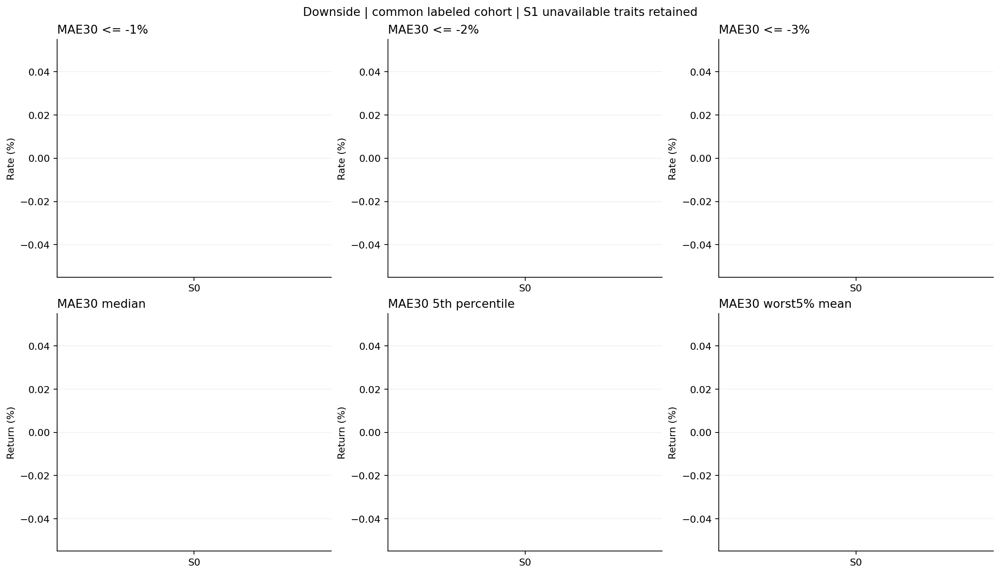
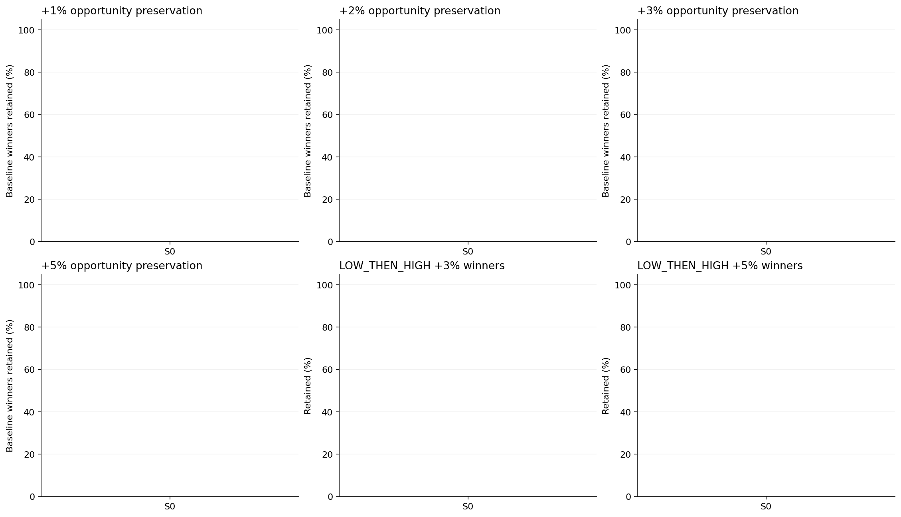
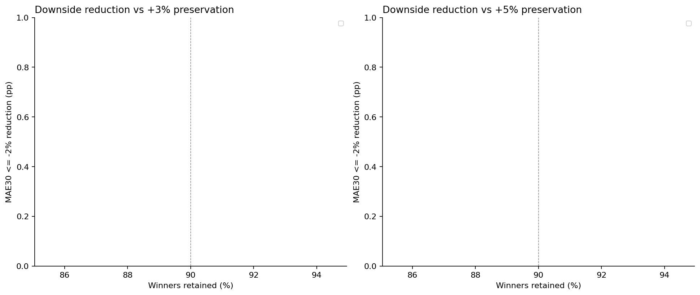
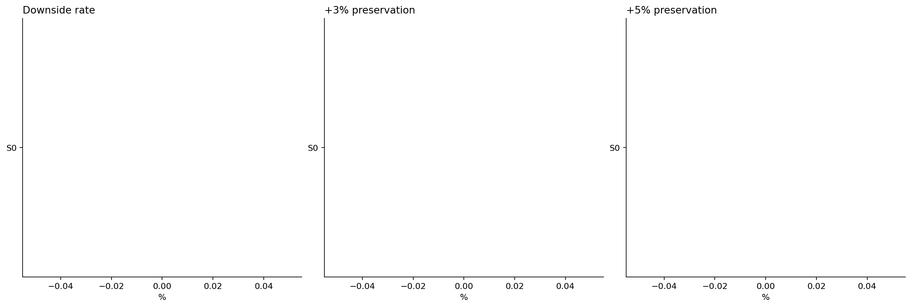
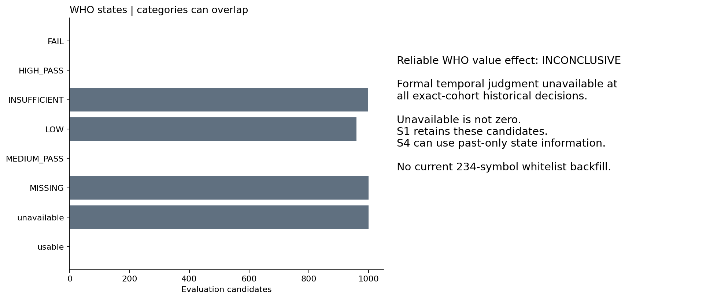
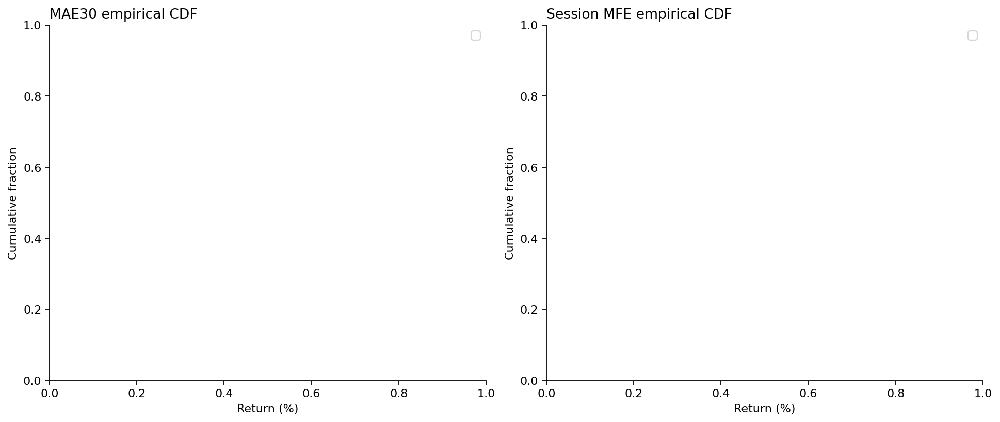
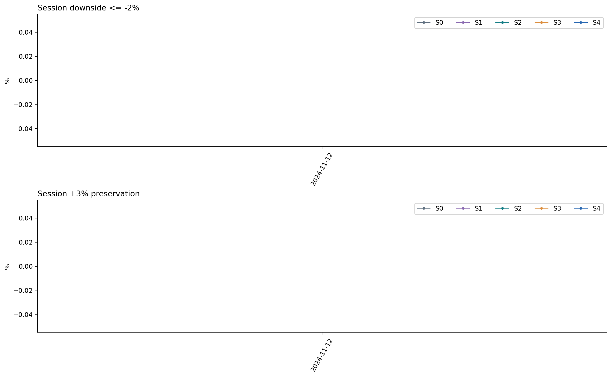
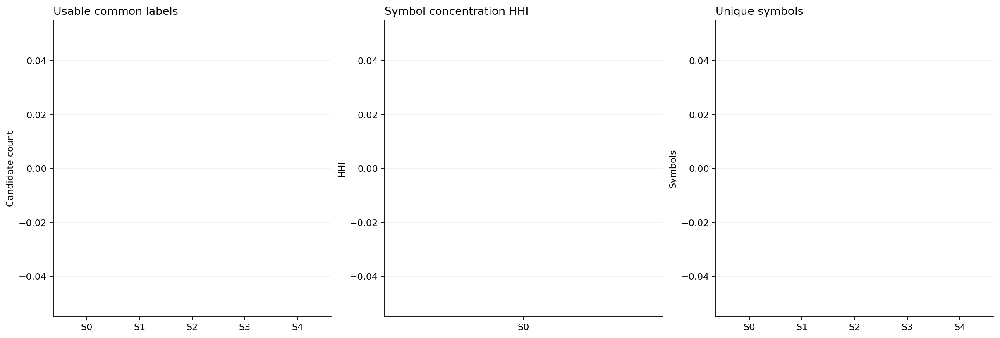

# Frozen Selector × Behavior Intelligence — Development diagnostic

**PARTIAL_RESEARCH_COMPLETE_ENTRY_DEVELOPMENT_BLOCKED**

S0〜S4の固定候補55日で比較を実行。許可144日全体の完了とは扱わない。WHOの正式trait値が過去decision時点で利用不可のため、Dictionaryの追加価値はINCONCLUSIVE。Entry/EXITは開始しない。

候補 2750件。fit 30日・1500件 → embargo5日 → evaluation 20日・1000件。fit終端 2024-11-01、evaluation 2024-11-12〜2024-12-09。

## 比較条件

Frozen台帳を同一identity・score・decisionPriceのまま再利用。結果を見たcohort/window/feature/model/threshold変更なし。主保持率80%（各時刻ceil(n×0.8)）、補助40/60/100%。S0は全候補。S1はDictionary利用不能を理由にDROPしないため全候補を保持。S1と他Variantの保持件数差を効果と解釈しない。

Risk: -MAE30の固定Ridge、quality: session MFEの別Ridge。lambda10、学習時中央値補完＋欠測indicator、標準化はfitのみ。raw payloadのnullを数値0へ変換しない。品質scoreは保存のみで主ランキングに不使用。勝者選び直しなし。

主評価は30分＋session-endが共に評価可能なcommon complete-case cohort。選択自体は全候補に適用してから評価可否を判定。Outcome欠測候補も台帳に保存。MAE60は追加の観測可能性条件があり、サンプル数を別保存。30/60分はwall-clock・昼休み跨ぎ不可・連続5分スロット必要。session-endは旧anatomyの全regular slots必須、同一5分足内の高安順序はUNKNOWN。High touchは約定・利益ではない。

## S0〜S4 主比較

| Metric | S0 | S1 WHO | S2 RECENT | S3 NOW | S4 ALL |
|---|---:|---:|---:|---:|---:|
| Candidates | 1000 | 1000 | 800 | 800 | 800 |
| Usable common samples | 0 | 0 | 0 | 0 | 0 |
| MAE30 median % | N/A | N/A | N/A | N/A | N/A |
| MAE30 p05 % | N/A | N/A | N/A | N/A | N/A |
| -1% downside rate % | N/A | N/A | N/A | N/A | N/A |
| -2% downside rate % | N/A | N/A | N/A | N/A | N/A |
| -3% downside rate % | N/A | N/A | N/A | N/A | N/A |
| +1% preservation / winner retention % | N/A | N/A | N/A | N/A | N/A |
| +2% preservation / winner retention % | N/A | N/A | N/A | N/A | N/A |
| +3% preservation / winner retention % | N/A | N/A | N/A | N/A | N/A |
| +5% preservation / winner retention % | N/A | N/A | N/A | N/A | N/A |
| LOW_THEN_HIGH +3% retention % | N/A | N/A | N/A | N/A | N/A |
| LOW_THEN_HIGH +5% retention % | N/A | N/A | N/A | N/A | N/A |
| Return30 mean % | N/A | N/A | N/A | N/A | N/A |
| Return30 median % | N/A | N/A | N/A | N/A | N/A |
| Return30 positive % | N/A | N/A | N/A | N/A | N/A |
| MAE60 median % | N/A | N/A | N/A | N/A | N/A |
| Session MAE median % | N/A | N/A | N/A | N/A | N/A |
| Session return mean % | N/A | N/A | N/A | N/A | N/A |
| Downside adjusted utility % | N/A | N/A | N/A | N/A | N/A |

## 固定判定・対照

意味ある追加情報の事前条件: 同件数Frozen score対照に対し-2%下落率を2pp以上改善、session block5 bootstrap95%下限>0、+3/+5 preservation各90%以上。bootstrapは再利用Developmentの記述的感度分析であり、confirmatory significance・多重検定済み保証ではない。S4 incrementalはS2/S3/A23すべてに同条件を要求。

| Variant | 判定 | 理由 |
|---|---|---|
| S1 | INCONCLUSIVE | No causally available formal traits in exact frozen cohort; state-only score is auxiliary and WHO-only keeps unavailable candidates. |
| S2 | INCONCLUSIVE | Insufficient paired sessions or winner denominator. |
| S3 | INCONCLUSIVE | Insufficient paired sessions or winner denominator. |
| S4 | INCONCLUSIVE | Insufficient paired sessions or winner denominator. |

| Comparison | Paired sessions | -2% downside reduction pp | Block95% CI |
|---|---:|---:|---|
| A12 | 0 | N/A | None |
| A13 | 0 | N/A | None |
| A23 | 0 | N/A | None |
| COVERAGE_ONLY | 0 | N/A | None |
| S1 | 0 | N/A | None |
| S2 | 0 | N/A | None |
| S3 | 0 | N/A | None |
| S4 | 0 | N/A | None |
| S4_vs_A23 | 0 | N/A | None |
| S4_vs_S2 | 0 | N/A | None |
| S4_vs_S3 | 0 | N/A | None |

| Matched budget control | Common N | -2% downside % | +3% retention % | +5% retention % |
|---|---:|---:|---:|---:|
| FROZEN_SCORE | 0 | N/A | N/A | N/A |
| HASH_RANDOM | 0 | N/A | N/A | N/A |

## WHO coverage / PIT

日別profile/peer/uncertainty/confidenceはdecision前日のmatrix prefixだけで再生成。最終234銘柄・293traitのホワイトリストは使用しない。Temporal判定は2025-08-21終了後にしか利用できず、今回の55日（2024年）ではMISSING_NOT_YET_AVAILABLE。LOW・INSUFFICIENT・Temporal FAIL・MISSINGは別表現を保持し、未判明のFAIL/PASSを過去へ戻さない。値の効果は検証不可。S4やA12/A13に差が出ても、それは過去時点の標本/不確実性状態の効果であり、信頼できる性格値の効果とは言わない。

Coverage-conditioned空群はN/A。欠測の候補をcommon cohortから除外しない。LOW/INSUFFICIENT等は重複可能で合算しない。

## 検証と残課題

Focused 257 PASS。全回帰PASS（詳細ci-receipt.json）。特徴量substrateと測定それぞれ2回再生成manifest完全一致。未来matrix suffix変更不変・future/stale Reader拒否・previous-day-only・欠測と0・共通母集団・fit-only前処理をテスト。

Common Holdout244/その他sealedの追加開封0。既存暗号化rawは55許可日だけ選択復元し、input-ledgerに記録。保存済みmatrix全体は許可Developmentのみで構成、日別特徴量はprefixに制限。過去exposure台帳不変。Frozen Selector/registry/Gate/Capital/実売買系は不変。安全9フラグは全false。

この診断では追加89日のFrozen候補再推論を未実施。144日全体の比較・WHO正式値効果・ALLの正式値によるincremental効果は未完了。結果を理由に既存Dictionary windowを変更しない。全144への拡張は、固定Selectorの再推論台帳とその価格/causal契約の同一性を別途固定・監査する必要がある。

全体のno-future-leakageは独立OOS認定ではない。ここで検証したのは追加特徴量・下流fit/evaluationの時間境界。上流Frozen Selector/Dictionary定義はDevelopmentを既に利用済み、取得時刻のPIT証明もない。性能主張を将来収益に拡張しない。

Execution HEAD `9ef190dfe7d1b094d3d4c220f42fd00aed828275` / PR587 Draft未merge / CI 35492365603。保存HEADは実行commitの子孫。

STOP。NEW Entry/EXIT本格学習は開始しない。
