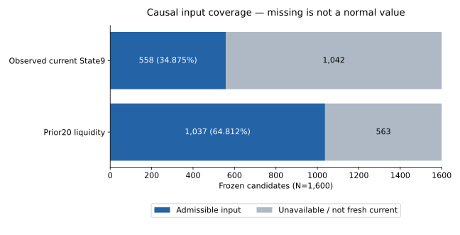
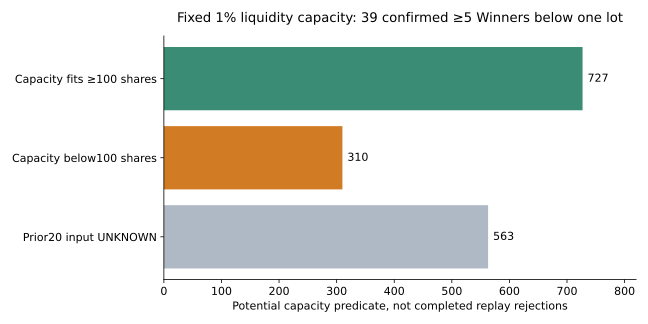
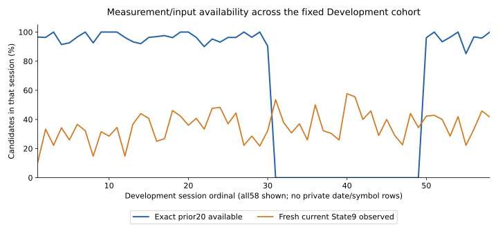
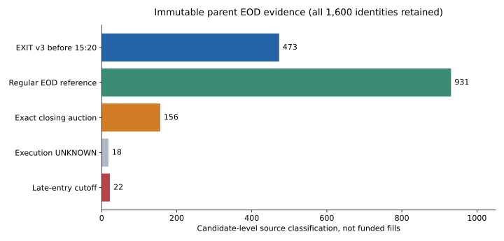
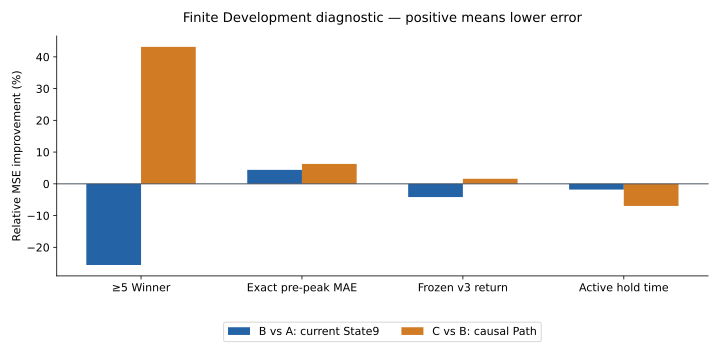
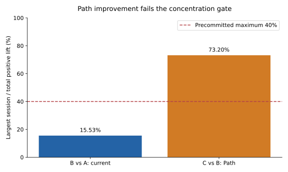
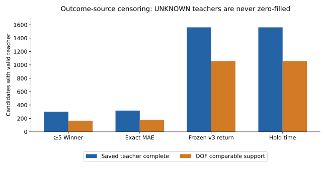

# 🧭 Capital vNext closure — 旧Adaptive mechanics × State9 / Path × Liquidity × Same-Day EOD

作成JST: 2026-10-04T12:05:56+09:00  
Repo: Iam-2squared/ark-terminal  
Research branch: capital-state9-vnext-20261004  
開始HEAD: 1b10d36b51955b851f89cddc44095edc1d72a93a  
Report生成basis HEAD: f65d3ed2bfe92e4a71285925f0fad23c8144eb40  
実C10 result commitはcommit成立後の [closure receipt](receipts/CAPITAL_CLOSURE_RECEIPT.json) へ追記する。未来SHAを記載しない。

## 🛑 結論

**CAPITAL_VNEXT_NO_FREEZE_CANDIDATE**。C2は新しいfunding-conditional contractでPASSし、確認待ちなくC3へ復帰した。旧18 execution-UNKNOWN全件の追加取得は行わず、Current/Fixed MAX3/4/5の6armを実行した。

ただし、最初のfunded positionに必要なexact MTM sourceを欠くため、6arm全てで完全Portfolio測定はBLOCKED。既存の元provider response-token prefixでも当該exact sourceは存在せず、price imputationやMTM contract緩和は行っていない。

C4のcausal observed current State9は558/1,600=34.875%。独立snapshot照合mismatch0。C5の有限診断ではcurrent State9がGate FAIL。Pathには改善傾向があるが1session依存73.197%が事前40%上限を超え、promotion FAIL。State-aware Capital Rankerは作らない。

この結果は「ArkのNorth Starが不可能」「1か月で2倍に届かなかった」という成績判定ではない。Final Equity、rolling20/22/24、MaxDD、utilizationは**未測定 / null**。現時点でCapital候補をFreezeできず、Integrated versionは開始しない。

## ✅ 進行・Gate

| Phase | Status | 根拠 |
|---|---|---|
| S0 latest audit | PASS | 開始HEAD1b10d36b...と一致、Frozen3refs unchanged |
| S1 four contracts / MTM / baseline precommit | PASS | 数値を見る前のGit receipt a50c560c... |
| S2/S3 C2 readmission | PASS | 12,881 checks / mismatch0; CAPITAL_C2_CONTRACT_PASS |
| C3 Fixed/current MAX3/4/5 | BLOCKED | 6arm実行、最初のfunded MTM missingで停止 |
| C4 current State9 / Path join | PASS | 558 /1600 observed; independent mismatch0 / asof violation0 |
| C5 State9 / Path incremental | FAIL | 42 /48 fits; current平均-6.786%; Path single-session73.197% |
| C6 fitted State-aware Rank precommit | NOT EXECUTED | C5 Gate failed、救済仕様を作らない |
| C7 State-aware Capital | NOT EXECUTED | State/Path runtime ranker fit0 |
| C8 MAX3/4/5 | INCONCLUSIVE | Fixed/currentは6arm測定BLOCKED; State-awareは未実行 |
| C9 independent audit | PASS / scoped | 101,580 checks / mismatch0、full performance証明ではない |
| C10 closure | NO FREEZE | CAPITAL_VNEXT_NO_FREEZE_CANDIDATE / STOP |

C2 PASSは全candidateの将来source完全性やlive execution認証ではなく、causal BUYとfunded-only strict measurementの境界が成立したという意味。C9 PASSも既知prefix/原本/teacher/診断を再構成できたというscopeで、Final EquityやMaxDDのPASSではない。

## 🧬 Controlling lineageと旧Capital再利用

| Controlling source | HEAD | 変更 |
|---|---|---|
| FIRST ENTRY v2 P1_Q70 official freeze | 4a2d6f35946b16820a13449a9288a6685a5c283c | 0 |
| Structural EXIT v3 Local Guard | c7a5e5c25eb19cbd58b45c3e4ffff977f4648fad | 0 |
| Formal EXIT v3 Freeze receipt | 1ecbcc43f75279fa302f19fd896add2aac15b537 | 0 |

最終read-only branch-ref照合で3本同一。Frozen Entry/EXITのsource gz SHA256も原本と同一。Re-entryはEvidence-only、EXIT v4は拒否維持。15:29 negativeおよび既存15:20 parentは上書き0。

旧Fixed Lane CはEquity/N sizing、Adaptive v2はquality/rank/score weight、candidate cap、dynamic utilization、reserve、concurrent capを組み合わせた。Adaptive PR496=f13cc42515df3b1e1b60de7181fdf89f1a9255f9、Realtime R6 PR532=e198040c8224fd4f7a61410b416f767638fb473c。別Capital v3/後続LONG-only rankのclosureやnegative evidenceも旧lineage auditとして継承し、旧winnerやFresh/OOS成績を現行cohortへ移植していない。

12/16=75%は以前のmechanics候補互換性のcomponent countで、コード行再利用率ではない。本cycleはそのmechanicsをcurrent cash LONGの別実装へ適合させたが、完全Portfolio監査を完了したarmは0/6。旧scorer/数値直接採用0。詳細は [Legacy lineage](LEGACY_CAPITAL_LINEAGE.md) / [Reuse matrix](LEGACY_MECHANICS_REUSE_MATRIX.md)。

旧confidence/probability/SelectorOpportunity/SelectorV2の同義fieldは現行1,600で0、LEGACY_FEATURE_UNAVAILABLE。Frozen P1 scoreを旧probabilityなどへ読み替えない。現行baselineはCURRENT_CAUSAL_CAPITAL_BASELINEであり「旧Adaptive v2そのもの」ではない。

## 🔒 新contract / accounting

| Contract | 固定した内容 | 境界 |
|---|---|---|
| CAPITAL_FUNDING_CONDITIONAL_EXECUTION_ADMISSION_V1 | causal funding後、fundedだけexecution/MTM要求 | future source statusはBUY/Rank inputではない |
| CAPITAL_ENTRY_CUTOFF_1520_V1 | Entry<15:20のみfund可、≥15:20 funding0 | 22件をFrozenから削除しない |
| CAPITAL_SIMPLE_LIQUIDITY_CAP_V1 | exact prior20 daily Va medianの1% | 全arm共通、Rank featureではない、sweep0 |
| LIMIT_UP_HOLD_TO_CLOSING_AUCTION_V1 | 15:20 causal confirmedのみ15:25 TSE auction intent | historical flag不明なら通常EOD、dailyHigh/ULから逆算しない |
| CAPITAL_CASH_LONG_MTM_REFERENCE_V1 | 5minute gridの最後のexact1minute closed Close | 必要funded mark missingならnull/BLOCKED、last close等なし |

Current baseline adaptiveはscore s=Frozen P1 output、weight=0.5+s、candidate equity fraction=.20+.20s、target utilization=min(.90,.60+.25bestScore+.02(breadth−1))。single finite operational formulaとして結果前に固定し、旧S/A/B/C thresholds/capsは転記していない。S/A/B/Cは今回未採用、continuous score interfaceを使用。

MAX3/4/5はconcurrent position capのみ。Adaptive targetを1/Nへ置換0。Fixed sanityだけEquity/N。Liquidity/cash/equity cap/100株floorは共通。

Broker commission=0 JPY。BUY=raw Open×1.0005、SELL=valid source×.9995は**execution/slippage convention**をeffective price内で一回だけ適用する。旧round-trip fee/R34 costを足さない。Cash endpoint=initial−effective BUY debit+effective SELL credit、trade PnL=quantity×(effective SELL−effective BUY)。旧reported realizedPnL二重Entry feeバグは継承しない。

Cash releaseはvalid reference fillのsource assumed_available_at（reference fill+1minute）だけ。Frozen reference timestampを動かさず、source-known時刻へbackdateしない。actual historical arrivalはUNKNOWN。Entry debitはFrozen reference contractのtimestamp。これらはhistorical counterfactualで、live full-fill/arrival認証ではない。

Policy core hash: 2b7279e55d9e32098424a8ea5d16172b61f0a03a28254de771c276b3d25a0579  
Source・contract・実receiptは [SOURCE_MANIFEST_FINAL](SOURCE_MANIFEST_FINAL.json) / [CAPITAL_POLICY](CAPITAL_POLICY.json) / [CHECKPOINT_RECEIPTS](CHECKPOINT_RECEIPTS.json)。

## 💧 Liquidityと入力coverage

既存encrypted raw archive18を元のconfigured Actions環境で復元し、provider requests/new market acquisitionは0。keyを抽出/移送していない。初回はNON_DEVELOPMENT_DATE guardでsource bodyを開く前にfail-closed。次のsafe scopeは79必要calendarを変更せず、78既存Development日だけ読む。Protected/purged1日は未開封、別の日で埋めない。

Source exportは元watch identityのsuperset950 symbols /73,736 daily rows。local adapterでは現行774 symbols /60,251 rowsへ限定。Rankに使うのは各Entry前のexact20 Vaだけ。1日前の値を20日中央値と偽らない。

| Input / capacity | N | 比率または注記 |
|---|---:|---|
| exact prior20容量KNOWN | 1,037 | 64.8125% |
| prior20容量INPUT_UNKNOWN | 563 | 35.1875%; 薄商い判定ではない |
| protected/purged必要日が未開封の影響 | 521 | 563内。その他欠測が同時にある可能性は残る |
| その他exact history不足 | 42 | 563内。no-trade/IPO等と断定しない |
| capacityだけで100株未満 | 310 | theoretical capacity predicate、実replay reject数ではない |
| 上記のEntry<15:20 | 303 | 共通capでfund不能 |
| 上記で確認済み≥5 Winner | 39 | eligible全39; thresholdは変更しない |

Daily source gz SHA256: df91cb78343cf1f1e925a56c8389902c4dec5a56844c998f6287dea709998a37。Vaはraw JPY Trading Value、prior daily publication16:30は研究assumptionでactual arrival receiptではない。

この固定1%のcapacityは確認済み大Winner39件も購入不能にするため、winner preservation上のtrade-offがある。「Liquidityを追加すれば大Winnerへ必ず資金が増える」とは言えない。結果を見て2%/5%へ救済しない。

## ⏰ Cutoff / Normal EOD / limit-up exception

| Immutable parent classification | N | 今回の扱い |
|---|---:|---|
| 15:20前 Frozen EXIT v3 | 473 | 元fillを保持 |
| 15:20–15:25 regular reference EOD | 931 | 通常overlayのexecution outcome |
| valid exact15:30 auction fallback | 156 | 通常overlayのfallback; funded fill実績とは別 |
| execution source UNKNOWN | 18 | 元status維持、Rank/BUYへ渡さない |
| Entry≥15:20 | 22 | CAPITAL_EOD_ENTRY_CUTOFF、funding0 |
| Total | 1,600 | identitiesを保持 |

旧Frozen UNRESOLVED39は39のまま。別EOD overlayで19件のsame-day reference closureを確認した旧Evidenceを継承。残りsourceUNKNOWN18/late2。旧39をFrozen上FILLEDへ書き換え0。Normal/limit-up policyは全open positionsで同じrule、旧39だけの救済ではない。

Late22はexact15:20が6、later16。cutoff future評価では確認済み≥5=0、≥5UNKNOWN=12。保存sourceで観測したEntry→High平均+.3551%（N20）、Selector→High平均+2.8845%（N20）。これはfuture teacher側の観測値で、cutoff選択の根拠に使っていない。source-censoredなためforegone opportunityが0と断言しない。

| Limit-up evidence / actual prefix | N | 解釈 |
|---|---:|---|
| causally confirmed current flag | 0 | source証明が0、実市場発生0ではない |
| current flag availability UNKNOWN | 1,600 | dailyHigh/ULを代用しない |
| funded limit-up exception observed prefix | 0 | full trace実績ではない |
| funded closing-auction fills observed prefix | 0 | 実際のtrade prefixclose0 |

Historical limit-up証明不能時は事前固定の通常EOD route。normal15:20 SOR market DAY、causal-confirmed exception15:25 TSE normal market DAYでauction参加、valid fill後のみcash release。source absent時はEOD_UNEXECUTED_FAIL_CLOSED /LIMIT_UP_EOD_UNEXECUTED_FAIL_CLOSED。注文送信/RSS/Excel0。

## 🧾 C3 baseline / MAX3–4–5 / funded UNKNOWN

| Arm | accepted prefix | cutoff reject | after-block未評価 | max concurrent prefix | full status | Final Equity | MaxDD | utilization |
|---|---:|---:|---:|---:|---|---|---|---|
| Fixed MAX3 | 1 | 22 | 1,577 | 1 | BLOCKED | 未測定 | 未測定 | 未測定 |
| Fixed MAX4 | 1 | 22 | 1,577 | 1 | BLOCKED | 未測定 | 未測定 | 未測定 |
| Fixed MAX5 | 1 | 22 | 1,577 | 1 | BLOCKED | 未測定 | 未測定 | 未測定 |
| Current adaptive MAX3 | 1 | 22 | 1,577 | 1 | BLOCKED | 未測定 | 未測定 | 未測定 |
| Current adaptive MAX4 | 1 | 22 | 1,577 | 1 | BLOCKED | 未測定 | 未測定 | 未測定 |
| Current adaptive MAX5 | 1 | 22 | 1,577 | 1 | BLOCKED | 未測定 | 未測定 | 未測定 |

6armは最初のfunded positionでMISSING_FUNDED_EXACT_5M_MARK。distinct identity1/session1、必要exact sourceはFrozen compact rawにも元response-token prefixにも0件で、within-prefixの時刻範囲確認も独立一致。candidate holding-window missing1420を事前BUY inputやcandidate除外に使っていない。

各arm1600 decision rows、計9600。late quantity0、それ以外の未評価1577はquantity=nullで、reject=0に変えない。54個の既知prefix curve framesはPrivateに保存するが、full equity curveとして描かない。closed trades/recycling observed0。full turnover/cost/holding/concentration/stabilityも未測定。

| UNKNOWN18への評価 | N / status |
|---|---|
| BUY/RANKへexecution statusを渡した件数 | 0 |
| observed prefixで実際にfunded | 0 |
| completed full funding traceでの実績 | 未確定（trace停止） |
| 現Inputでcap<100株 | 7 |
| 現Inputでprior20 capacity UNKNOWN | 11 |
| 現Input/common fixed capでの理論的funding上限 | 0（事後のcapacity論理、完全replay実績ではない） |
| UNKNOWN18の追加provider取得 | 0 |

11件はinput incompleteであって薄商い/売却不能/悪いEntryの証明ではない。7件も「将来sourceが無いから除外」ではなく、全1600共通の因果的prior capacity条件によるもの。現在sourceのままなら18にfundできないが、完全replayが完走したという主張はしない。

North Star ¥1m→¥2m、rolling20/22/24最大multiple、最短doubling、geometric/session、session wins/losses、utilization≥80/≥90、MaxDDはnull。これらの図は0を代入したり既知prefixを伸ばしたりせず、作成0。MAX-Nのreturn/risk差、Pareto、loso portfolio robustnessもINCONCLUSIVE/NOT_MEASURABLE。

## 🧪 C4/C5 State9 / Path — Capital layerだけのincremental value

P1自体がState9 current/historyを利用済みなので「Stateなしvsあり」ではない。Aはsaved causal P0 numeric110 fields+Frozen P1 output、BはA+fresh current State9/availability/age、CはB+causal Path last3/dwell/transition5/10/20/prefix support/gap/reset。これは診断のfeature setで、C3 runtime baselineを勝手に110feature rankerへ置き換えたわけではない。

| C4 join | N / status |
|---|---|
| observed fresh current | 558 (34.875%) |
| display / stale only | 882 |
| no usable current source | 160 |
| observed sessions | 58 |
| independent original snapshot mismatch | 0 |
| asof violation | 0 |
| prefix future-suffix canaries | 1,600 / mismatch0 |
| raw P1 labelとのfresh資格差 | 98、direct currentへ補完0 |

Sourceは元Frozen v2/v3 FULL_TRACEのclosed prefix、bar_end<=Entry。fresh guard=current_semantics_observed && ACCEPTED && observed_at==as_of && Primary_or_null非null。old exit final State、Entry後State、session-end、future High/Low/Close、PnLをruntime inputにしない。実arrivalはUNKNOWN、historical completed-bar contract下の検証でありlive PIT到着認証ではない。

| Diagnostic comparator | 平均relative MSE改善 | 改善teacher | positive folds | 最大1session positive lift share | Gate |
|---|---:|---:|---:|---:|---|
| B current vs A | -6.786% | 1/4 | 0/4 | 15.531% | FAIL |
| C Path vs B | +11.014% | 3/4 | 3/4 | 73.197% | FAIL: 40%上限超過 |

| Teacher | 完全/既知teacher N | OOF同一評価N | B vs A relative改善 | C vs B relative改善 |
|---|---:|---:|---:|---:|
| ≥5 Winner regression teacher | 301 | 166 | -25.572% | +43.156% |
| exact pre-peak MAE | 317 | 180 | +4.401% | +6.270% |
| Frozen EXIT v3 realized return | 1,561 | 1,058 | -4.168% | +1.594% |
| Frozen EXIT v3 active hold time | 1,561 | 1,058 | -1.805% | -6.963% |

Winner AUC A=.840934 /B=.837912 /C=.854945。binary-teacher Ridge ranking diagnosticで、probability calibrationやBrierではない。

Session-forward4fold、initial18、各test10session、last prior1session purge。target-wise同じcomplete masks、Ridge alpha10固定、train-only imputer/standardizer/category vocabulary。max48 fit中42、最初foldのWinner/MAEはtrainN<100で全arm同時skip。threshold/feature追加/alpha search0。保存済みmodel再inference、teacher、MSE/AUC/session concentrationをPrimary importなしで独立確認。

Hold teacherはFrozen reference Entry→SELLを09:00–11:30 /12:30–15:25のactive-market minutesで測るproxyであり、pre-closing待ちやsource-confirmation遅延を含む実cash-lock wall-clockではない。実Portfolio capital recyclingは未測定として分離し、このproxy改善をcash効率改善とは呼ばない。

Pathの見える改善は棄却せず数値として残すが、事前stability Gate不成立でCapitalへ昇格しない。current FAILでもあり、current PASSを要するPath promotionは不可。C6ファイルは「precommit NOT CREATED」という非実行記録であって、偽のfitted rank freezeではない。

### 🔎 記述差とsupport（rank序列ではない）

| State9 fresh label | N | 確認済≥5 | ≥5UNKNOWN | observed Entry→High mean% (N) | exact pre-peak MAE mean% (N) |
|---|---:|---:|---:|---|---|
| DROP | 267 | 57 | 201 | 3.688 (267) | 1.156 (75) |
| DROP_STOP | 2 | 0 | 2 | 2.145 (2) | 0.422 (1) |
| PULLBACK | 59 | 13 | 38 | 3.077 (59) | 0.949 (25) |
| RANGE | 45 | 8 | 29 | 3.354 (45) | 0.945 (25) |
| REBOUND | 50 | 9 | 40 | 3.441 (50) | 0.773 (9) |
| RISE | 75 | 10 | 60 | 2.735 (75) | 0.933 (20) |
| RISE_STOP | 3 | 0 | 3 | 1.487 (3) | 0.050 (1) |
| SHARP_DROP | 56 | 13 | 37 | 3.557 (56) | 0.832 (20) |
| SHARP_RISE | 1 | 0 | 1 | 0.449 (1) | — (0) |
| __UNKNOWN_CURRENT__ | 1042 | 143 | 888 | 2.775 (1037) | 1.065 (141) |

これらはsource-censoredなteacher記述差。SHARP_RISE1/DROP_STOP2/RISE_STOP3等の薄いsupportからS/A/B/C序列を作らない。Observed Highは完全な将来Highの証明ではなく、exact MAEは対象Nが限られる。

| Upside evaluation | confirmed positive | known negative | UNKNOWN | full funding capture |
|---|---:|---:|---:|---|
| ≥1% | 976 | 25 | 599 | 未測定 |
| ≥2% | 679 | 38 | 883 | 未測定 |
| ≥3% | 466 | 41 | 1093 | 未測定 |
| ≥4% | 336 | 46 | 1218 | 未測定 |
| ≥5% | 253 | 48 | 1299 | 未測定 |

≥5はconfirmed253、known negative48、UNKNOWN1299。OOF Winner評価はpositive140/negative26で選択的。missing teacherを0にせず、current/Pathの一般的な価値全体やFresh/OOSを結論しない。Path Quality、time-to-high、exit reasonの記述aggregateはDESCRIPTIVE_OUTCOME_AUDITに保存。全future qualityはevaluation/teacherのみ。

## 🔍 Independent audit / Safety / exposure

| Audit | 比較・canary | mismatch | Scope |
|---|---:|---:|---|
| Immutable parent source/admission | 54,400 /14,957 | 0 | 旧source identity/cost/EOD reconstructionの再利用 |
| New C2 contract | 12,881 | 0 | 1600 identity/cutoff + synthetic invariants |
| C4 prefix | 1600 suffix canaries /snapshot1600 | 0 | exact causal guard / original snapshot |
| C9 final independent | 101,580 | 0 | prior20、9600 decisions、known cash/MTM prefix、42 saved models、teacher/MSE/AUC、original exact gap |

Primary moduleをimportせず独立raw/exits/entriesとoriginal manifest/hashを使用。cash>=0、100株、MAXcap、LONG cash、missing fill cash0、funded UNKNOWN PnL null、future source/high/nextday suffix不変、State prefix不変、cash release源時刻、fee一回はcontract/observed scopeでPASS。実prefixにEXIT cash releaseは0なので、full real recycling eventを検証したとは言わない。

| Budget / operation | Consumption |
|---|---:|
| new diagnostic fit / ceiling | 42 /48 |
| new Capital ranker fits | 0 |
| registered Fixed/current arm replay | 6 |
| State-aware portfolio replay | 0 |
| independent unique prefix reconstructions | 6（auditor最終run） |
| independent process attempts | 4（technical failures2/success2、完了prefix reconstruction instances18） |
| rank/liquidity/deadline/hyperparameter sweeps | 0 |
| Entry / EXIT replay / State engine run | 0 /0 /0 |
| provider request / new market rows | 0 /0 |
| Protected /Holdout/Fresh/OOS/Prospective source開封 | 0 |
| broker/RSS/Excel order / paper/live | 0 |
| main merge /force push /Claude | 0 /0 /0 |

Safety executionAllowed/brokerWriteAllowed/excelOrderWriteAllowed/rssOrderFunctionAllowed/liveTradingAllowed/paperTradingAllowed/automaticPromotionAllowed/productionUpdateAllowed/transmitted/productionReadyは全false。source回収だけに既存configured keyを使い、credential extraction0。broker commission0とexecution frictionを分離。real execution/live full-fill certificationはfalse。

## 📦 保存 / source / receipts

| Artifact class | Public repo | Private artifact |
|---|---|---|
| Start、4contracts、C2、C5、C9、closure / handoff | aggregate /contract/hashのみ | 必要原本dependency receipt |
| Original Entry/EXIT/raw/source tokens | hashes /authoritative refsのみ | frozen gz /独立抽出原本 |
| State9 join / source rows | coverage/hashのみ | STATE9_ENTRY_ROWS.jsonl.gz |
| Capital funding rows | N /reason aggregate | CAPITAL_DECISIONS.jsonl.gz=9600 rows |
| Portfolio curves | full曲線未作成を明示 | KNOWN_PREFIX_ONLY=54 frames |
| Prior20 Va/Vo /capacity | coverage/hashのみ | exact selected source/capacity/receipt |
| Diagnostic models/OOF/teachers | Gate /scores/support aggregate | 42 model files、NPZ、OOF、train reference |
| Charts | real aggregate SVG7 +CHART_DATA | 数値row-level sourceはPublicへ出さない |

Private packageは新作成して原本STOPを上書きしない。Public GitHub-backed source/docを別storageへ二重保存せず、private非repo source evidenceだけを永続保存する。Final package hash/locationはpost-publication delivery receiptで保存。

| Checkpoint | Git exact JST | Confirmed result commit |
|---|---|---|
| S0_START | 2026-10-04T11:06:35+09:00 | 7b87c9b53a43234ef51118cbe12fed4195d8c5a6 |
| S1_PRECOMMIT | 2026-10-04T11:08:05+09:00 | a50c560cfa05262354d36498b9be19c7cc13bc00 |
| C2_CONTRACT_PASS | 2026-10-04T11:11:31+09:00 | 0296da8bfc8b62d3a0cd00c684e4b5f83ed61ed7 |
| DAILY_SOURCE_GUARD_JOB | 2026-10-04T11:20:04+09:00 | 7d85f21c587e043e6bbbdbbac406b172c28e14e3 |
| C5_SPEC_PRECOMMIT | 2026-10-04T11:21:26+09:00 | 2cf5fb5e279aa8490f7710036c65a7a46c16f3e7 |
| DAILY_SAFE_SOURCE_JOB | 2026-10-04T11:25:16+09:00 | f0c72bf11e4b26f30995c1e876607bada2288c2f |
| C3_BASELINE_C4_JOIN | 2026-10-04T11:38:20+09:00 | ee92a0344d991a0905380d31255b1f5b455228dc |
| C5_DIAGNOSTIC_GATE | 2026-10-04T11:42:56+09:00 | 1ecae19d939200f06476f5c084c103b82057c418 |
| C9_INDEPENDENT_AUDIT | 2026-10-04T11:51:01+09:00 | f65d3ed2bfe92e4a71285925f0fad23c8144eb40 |

S1 fileのprovisional11:09はGit実precommit11:08:05と不一致だったため、TIMESTAMP_RECEIPT_CORRECTIONでappend-only訂正。contract内容や結果前固定の順序は変更0。C10 /deliveryの実commitは成立後receipts/へ追加。force push、main merge、旧Evidence上書き0。

## ❓ 最終29問

| # | 問い | 回答 |
|---|---|---|
| 1 | Latest HEAD | 開始1b10d36b...、Report生成basis f65d3ed2bfe92e4a71285925f0fad23c8144eb40。最終closure/delivery actual SHAはpost-commit receiptsとbranch latestで確定 |
| 2 | Frozen変更0か | Entry/EXIT/source/receipt変更0、最終refsと3原本SHA一致 |
| 3 | 22 late処理 | cutoff1520でfunding0、exact6/later16、identities保持 |
| 4 | UNKNOWN18をfuture inputへ使ったか | 0、BUY allowlistと1600 mutation canaryで確認 |
| 5 | UNKNOWN18の実funded | observed prefix0、完全trace未実行で実績未確定。current capの理論上限0=below-lot7+missing-input11、実replay完走0とは区別 |
| 6 | Liquidity式/source/hash | 1%×exact prior20 Va median、既存J-Quants saved daily、gz hash df91cb78343cf1f1e925a56c8389902c4dec5a56844c998f6287dea709998a37 |
| 7 | Liquidity skip | observed replay prefix0、full未測定。capacityだけのpotential310（eligible303）は実reject数と別 |
| 8 | ≥5 Winner Liquidity skip | observed実skip0、potential39 confirmed winnersはcapacityで買えない。full captureは未測定 |
| 9 | limit-up confirmed | causal証明0 /flagUNKNOWN1600、実際の市場limit-up発生Nは不明 |
| 10 | exception | observed funded prefix0、通常routeを使用。架空confirmedなし |
| 11 | auction fill | immutable candidate reference156、funded observed prefix0。fulltrace未測定 |
| 12 | baseline成績 | 6arm全てfunded exact MTM BLOCKED、Final/Return/DD/util null |
| 13 | current incremental | 本有限Gateでは未示。平均relative MSE改善-6.786%、1/4teacher改善、0/4fold positive |
| 14 | Path incremental | B比+11.014%傾向だがsingle-session73.197%>40%でGate FAIL、promotionなし |
| 15 | 新Rank改善 | fitted State-aware Rankを作成0、runtime/Portfolio改善を主張しない |
| 16 | MAX3/4/5差 | concurrent capのみ。Fixed budgetは1/N、adaptiveはscore/util/cap/liquidity。実performance差はBLOCKEDで未確定 |
| 17 | Final Equity | 全armnull、initial¥1,000,000だけ既知 |
| 18 | rolling20最大倍数 | null /NOT_MEASURABLE |
| 19 | 1か月2倍区間 | 未測定、届かなかった/不可能とは判定しない |
| 20 | geometric/session | null |
| 21 | ≥80/90 utilization | null、event平均/prefix値で代用しない |
| 22 | ≥5 Winner capture | full未測定、confirmed candidate253、observed funded confirmed0（未知teacherをnegativeにしない） |
| 23 | MaxDD | null |
| 24 | funded UNKNOWN block arm/session | execution-UNKNOWNがfundedされたobserved実例0。別理由のfunded MTMで6arms/1session/1identity停止。full tailは未評価 |
| 25 | Freeze Candidate | なし、CAPITAL_VNEXT_NO_FREEZE_CANDIDATE |
| 26 | Integratedへ進めるか | いいえ、自動開始0。新mark契約/必要Evidenceの判断が必要 |
| 27 | Claude | 0、通常独立監査を本Workで実施 |
| 28 | Safety/orders/merge/force | Safety全false、orders/main merge/force push0 |
| 29 | append-only Git保存 | 各実施checkpointをJST/HEAD/status/結果/未解決/次方針と保存。未実行phaseはGate failure理由を明記 |

## ➡️ STOP / 次の最小方向

現在SOURCE_MARKの完全performance測定とState昇格Gateの2つが成立していない。今cycleのC2は解決済みとして閉じ、18件source全取得待ちへ戻らない。

次に必要なのは**実fundedのexact MTM Evidenceまたは明示された別mark measurement contract**の判断。既存original token lookupにはexact barがない。saved native5m closed-barを使う場合も、現exact1m-final markと同じとは言えず、新cycleでsource/known-at/gap semanticsを監査し、結果前precommitが必要。新intraday MTM取得はEOD-only既存許可と別で、Protected開封、1%変更、feature/threshold救済は行わない。

[NEW_MARK_MEASUREMENT_CONTRACT_DRAFT](NEW_MARK_MEASUREMENT_CONTRACT_DRAFT.md)はPROPOSED_NOT_AUTHORIZED。replay/fit0。これを理由にcurrent/Path Gateを上書きしない。Capital closure後のIntegratedは人間判断までSTOP。
