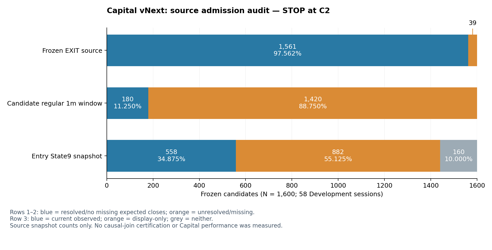

# 🛑 Ark Terminal — Capital vNext：C2停止Report

作成：2026-10-04T01:11:04.521686+09:00  
Repo：`Iam-2squared/ark-terminal`  
研究branch：`capital-state9-vnext-20261004`  
実在basis／C2 result HEAD：`c55b2b2134f79cbe33085b6757337048d150c2cb`

**結論：`CAPITAL_ADAPTER_MISMATCH`。指示書20.BでSTOP。Capital Freeze候補はなく、Integrated versionは未開始。**

最新GitHubとhandoffのcontrolling Entry／EXITは一致した。旧Capitalを回収し、18本の原テストと別経路のsource検算を完了した。1,600全候補を同じFrozen Entry／EXITと厳密なcash／MTMで比較する入力admissionが未成立のため、C3以降のfit／Portfolio replayは0。これはCapitalやState9の性能FAILを示す結果ではない。

## 🔒 Controlling strategyとlineage

| 項目 | authoritative identity／判定 |
|---|---|
| FIRST ENTRY v2 P1_Q70 | `4a2d6f35946b16820a13449a9288a6685a5c283c`／OFFICIAL FREEZE |
| Structural EXIT v3 Local Guard | `c7a5e5c25eb19cbd58b45c3e4ffff977f4648fad`／変更0 |
| v3正式Freeze receipt | `1ecbcc43f75279fa302f19fd896add2aac15b537` |
| 既存Capital開始checkpoint | `d26c733407577cf72fff75a9abfa4c8c2b0f3cbe`／引継ぎ |
| Re-entry／EXIT v4 | Re-entry Evidenceのみ、v4拒否維持。統合への採用0 |
| Side／account | LONG-only／cash-equity-only |

handoffのFixed MAX3/4/5-only範囲は、今回の明示WorkでAdaptive研究へ拡張された。Frozen Entry／EXITとExposureは拡張していない。Entry旧FINAL_HANDOFFのBLOCKED記録は、その後のcorrected-lineage freeze receiptで解決された履歴として保持し、最新statusに混同しない。

P1_Q70は既にState9 current＋past-only historyを含む。将来「current Entry features only」にP1 scoreを使う場合、追加State9入力のないCapital baselineではあるが、戦略全体からState9を除いたcontrolとは呼べない。

## 🧩 旧Capital回収：PASS、旧成績の移植0

| 系統 | 機構 | closure／現在への適用 |
|---|---|---|
| Fixed Lane C | Current MTM Equity/N、MAX10/4/3/2、100株lot、cash分離、exact timestamp order | sanity機構。今回のAdaptive主方式にはしない |
| Adaptive v2／PR#496 | causal quality、S/A/B/C、EQUAL/RANK/SCORE、candidate cap、dynamic deployment/reserve、cap9 | 正式winner未確認。旧4features・score weights・rank thresholds・capsを直接採用しない |
| Realtime R6／PR#532 | 28cell、Frozen Entry event、append-only/idempotent ledger、cash／mark | 機構を回収。旧Shadow／SHORTの権限・計算は現在へ移さない |
| 旧MSH/Risk v3 | 七つのclosed5mのvolatility、MSH Entry、EXIT v5 | 09-13 Development MAX_3 Freezeはbudget divisor3／同時保有10。今回のMAX3と別 |
| 後続LONG Capital v2/v3／Replacement | IM/R1 Entry、R35 control、R50等、旧Development | Capital v2未選定、v3 0/2 PASS、Replacement未選定。negativeを維持 |

Reuse Matrixの16component中12が互換／条件付き候補＝75%。等重みcomponent countであり、実装移植完了率ではない。現行engine移植完了0%、旧パラメータ直接採用0%。

**旧Adaptive報告上の修復点：** synthetic one-tradeでcash endpoint増分3,799JPYに対しreported realizedPnLは3,699JPY。Entry fee100JPYがreported PnLで二重控除される。現金端点自体は一致する。旧sourceは変更していない。再利用時の最小修正は、Entryでfeeを計上済みならEXITのportfolio realizedPnLへ`gross−exitCost`だけを加え、trade単位では`gross−entryCost−exitCost`を保持すること。旧Adaptive utilizationはevent-sample平均であり、要求された時間加重utilizationではない。

## 🔎 現在1600 source／adapter監査

| 検査 | 数値 | 判定 |
|---|---:|---|
| Frozen watch／FIRST ENTRY | 2,155／1,600 | PASS |
| Development sessions | 58 | PASS：Fresh/OOSではない |
| original private component hash | 3,211検査／不一致0 | PASS |
| Entry／EXIT identity join | 1,600／不一致0 | PASS |
| source price arithmetic | 1,600 BUY＋1,561 confirmed SELL／不一致0 | PASS |
| Frozen EXIT FILLED | 1,561／1,600＝97.5625% | source確定 |
| Frozen EXIT UNRESOLVED | 39／1,600＝2.4375% | **BLOCKED**：29sessions |
| regular1m source欠測を含む候補保有窓 | 1,420／1,600＝88.75% | MTM source制約 |
| その窓の欠測expected regular1m closes | 113,303 | 補完0 |
| 旧confidence／probability／Selector opportunity／Selector v2同義fields | 各0／1,600 | LEGACY_FEATURE_UNAVAILABLE |
| State9 snapshot current observed primary | 558／1,600＝34.875% | C4正式join coverageではない |
| State9 display-only／どちらもなし | 882／160 | 正常Stateへの補完0 |

「保有窓」はFrozen個別Entry→EXITのsource completenessであり、仮想Capitalが実際に買った保有株のcoverageではない。Allocationは実行していない。State9 current observed primaryはFrozen snapshotのsource事前確認だけで、as-of join／Path prefixの認証ではない。display_primaryをcurrent primaryへ置換すると欠測を隠すため、行わない。

## 🚧 C2で止める理由と技術修復の境界

確認済み価格・identityのschema mappingは可能で、import/path問題ではない。Legacy Lane-Cは全tradeにfinite EXIT timestamp／priceとentry/exit reference==close markを要求し、39未約定をそのまま表現できない。raw Closeとeffective execution priceも別物なので、合成Closeを挿入して同一にしない。

既存LONG-only null-aware ledgerは未約定をlocked obligationとして保持できる。この機構も回収したが、未約定を確定売却に変えたり、未証明の跨日markを復元したりはできない。39件を全てCapitalが購入するという予測はしていない。ただし全1,600を保持した比較入力の完全性が未成立であり、完結したEquity／DD／Freeze evidenceを事前に確保できない。会計censoringだけの部分再生を、完全比較の代用として黙って開始しない。

**禁止した救済：** UNRESOLVED39件の未来結果による除外、last-observed Close／ゼロによる売却価格補完、未約定cash release、架空の跨日mark、旧scoreの代用品、旧fee追加、Gate緩和。いずれも0。

現行BUYはraw Open×1.0005、SELLはraw Open／exact auction Close×0.9995、commission0。旧round-trip0.05%やR34 sell0.05%を加えると、Frozen cost contractを変える。確定SELL1,561件のsource assumed_available_atはreference fill timestampより1分後で、実際のhistorical arrivalはUNKNOWN。これは継承されたreference-fill／データarrivalの限界であり、このWorkが新たにFrozen EXITのlookaheadを証明したという意味ではない。Current allocatorのknown-at／cash event contractへ無説明でbackdateしたり、Frozen fillを移動したりしない。

既に凍結されたadmissible source／receiptのread-only回収で解決できるならlineageを記録してC2を再開する。新市場データ、fill/cash時刻変更、null-aware部分比較の新protocolが必要なら、今回の停止EvidenceとFreezeを保持して別の明示contractとして扱う。結果を見てthresholdやfeatureを追加する修復はしない。

## 🧪 独立監査と工程status

Primary：展開済みZIP→hash／identity／Decimal。
Independent：元添付nested ZIP bytes→SQLite join／集計→Fraction price計算。Primaryコードをimportしない。不一致0。**PASSはsource adapter監査だけで、C9 full portfolio audit PASSではない。**

| 工程 | status | 実行内容 |
|---|---|---|
| C0 | PASS | latest refs／PR／Actions／controlling status／Exposure |
| C1 | PASS | source・旧policy・closure・再利用候補、18原テスト |
| C2 | **BLOCKED** | source identity/hash/confirmed price PASS、all1600 admission STOP |
| C3〜C8 | NOT EXECUTED | baseline／join／incremental／precommit／rank／MAX3/4/5すべて未実行 |
| C9 | NOT EXECUTED：full portfolio | independent source検算のみ完了 |
| C10 | STOP closure | 本Report、handoff、status付き未実行成果物、private evidence |

current Final Equity／MaxDD／utilization80/90／winner capture／rank allocation／robustnessは**未測定null**。空のEquity curveや仮数値のPortfolioグラフは作成しない。`CAPITAL_DECISIONS.jsonl.gz`と`PORTFOLIO_CURVES.jsonl.gz`はPrivate package内の0-record containerで、未実行を表す。0%成績やゼロPnLを表さない。

GitHub最新Actionsのread-only確認は済み。この研究branchにActions実行0件、追加CI-green claimなし。18原テストはlocal PASS。source独立検算はPASS。新モデル／strategy replayをCIで走らせていない。

## 📋 最後の20質問

| # | 問い | 回答 |
|---:|---|---|
| 1 | 旧Capitalの正式lineage | Fixed:4646d303…／Adaptive v2:f13cc425…(#496)／Realtime:e198040c…(#532)。後続のMSH/Risk v3、LONG-only Capital Rank v2/v3、Replacement、09-27報告closureを区別して保存。Adaptive v2の正式winnerは確認されない。 |
| 2 | FixedとAdaptiveの違い | FixedはCurrent MTM Equity/N。Adaptive v2はcausal quality→rank/score weight→candidate cap＋dynamic utilization＋reserve。旧Adaptiveの最大同時保有は9。 |
| 3 | mechanics再利用率 | 列挙16component中12を互換／条件付き候補として回収＝75%。コード行数の再利用率ではない。現行engineへの移植完了0%、旧数値直接採用0%。 |
| 4 | 旧confidence/probability/Selector score | Frozen current1600 recordsに同義4fieldsは各0件。P1 scoreはU/Q/D percentileの複合で、旧probabilityの代用ではない。LEGACY_FEATURE_UNAVAILABLE。 |
| 5 | Entry時点State9 joinとcoverage | C4正式as-of joinは未実行、coverage未確定。Frozen snapshotの事前確認では558/1600＝34.875%にobserved current primary。display-only882、どちらもない160。表示名を補完しない。 |
| 6 | current label incremental value | 未測定。State9に価値がないという結論ではない。P1 Entry score自体が既にState9 current/historyを含む点も将来の比較で管理する。 |
| 7 | Path prefixの追加価値 | 未測定。Full trace1600本の存在・hashは確認したが、prefix contract/join/diagnosticは未実行。 |
| 8 | 新Capital future leakage0か | 新Capitalは未構築・decision0。current joint canary/証明は未実行なので認証しない。旧sourceのfuture-isolation testsと事前canaryはPASS。 |
| 9 | 旧Adaptive型baselineの成績 | 現行cohortでは未実行。旧成績を移植しない。完全旧scorer再現不可、mechanics-only baselineも未precommit。 |
| 10 | State9-aware Capitalの成績 | 未実行。Final Equity／DD／utilization等はnull。 |
| 11 | MAX3/4/5で変わったこと | 現在の比較は未実行。旧MSH MAX_3はbudget Equity/3＋同時保有10で、今回のcap3と別。 |
| 12 | Adaptiveを1/Nへ置換したか | 置換0。現在MAX-Nはconcurrent capacityという指示を維持。Fixed Equity/Nは将来sanityに限る。 |
| 13 | utilization80%/90%達成 | 未測定。旧Adaptiveのunweighted event平均をtime-weighted値として流用しない。 |
| 14 | ≥5 winner capture/reject | 未測定。Allocation decision0に対してcapture/reject率0%を捏造しない。 |
| 15 | return/DD/cost/utilization/stability | 現在のtrade-offは評価不能。旧feeを重ねるとcost double countになるため採用していない。 |
| 16 | Capital Freeze可能か | 不可。CAPITAL_ADAPTER_MISMATCH。No Capital Freeze Candidate。 |
| 17 | blocker | 39未約定、候補保有窓の欠測MTM、未証明の跨日valuation、reference fillとsource known-atの境界。旧features不足はLegacy scorerの再現blockerであり、mechanics再利用自体を否定しない。 |
| 18 | Claude使用 | 0回。外部AI使用0。 |
| 19 | orders/main merge/Safety | orders0、main merge0、force push0、Safety9＋productionReadyすべてfalse。Frozen strategy変更0。 |
| 20 | Integratedへ進めるか | 進めない。C2入力admissionを解決し、必要なbaseline／State9 diagnostic／precommit／comparison／auditを終えてからCapital判定。Integratedは未開始。 |

## 🛡️ Exposure／Safety／次方向

新fit0、新Ranker0、threshold search0、Capital replay0、Entry／EXIT replay0、provider0、新market data0、Protected／Holdout／Fresh／Validation／OOS／Prospective opens0。以前からoutcome-exposedのDevelopment source／execution metadataのみを監査した。

execution／broker／Excel order／RSS order／live／paper／automaticPromotion／productionUpdate／transmitted／productionReadyはすべてfalse。orders0、main merge0、force push0、Claude0。旧sourceと他branchのEvidence上書き0。

**次方向はC2 source／MTM／known-at admissionの解決。C3以降のresearchとIntegratedを自動開始しない。** 現在のCapital成績やState9価値は未判定のまま保持する。Result commit receiptはcommit後に別append-only receiptで保存し、未来SHAを記載しない。
