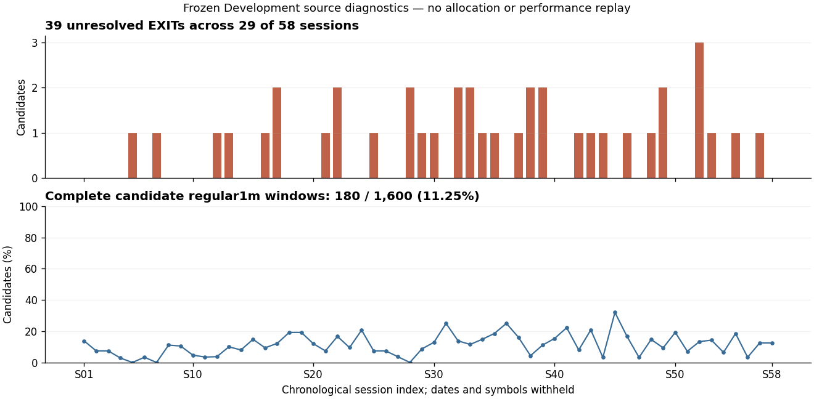

# 🧭 Capital vNext C2 Recovery — 最終Report

保存JST: 2026-10-04T02:19:13.803807+09:00 / basis HEAD: `8bce9810eecea68c71f227ee0d705fbf2480b916`

**CAPITAL_C2_NEW_ADMISSION_CONTRACT_REQUIRED / R7-B・草案のみ・STOP。**

C2はPASSしていない。10条件中7条件PASS・3条件BLOCKED、Primary / Independent mismatch=0。既存sourceだけで39件を新たに解決できた件数は**0件**。Capital replay、fit、C3再開は0。

既存5分MTM・funded-only・null-aware accountingのmechanicsは回収できた。このため「candidate全1,600件のfull1m欠損」を単独の必須Gateにはしない。ただし現在Frozenへのcash / mark / unresolved・cross-sessionの適用契約は一意にならなかった。新しい解釈を採用せず、`PROPOSED_NOT_AUTHORIZED`草案を保存した。

保存JST・basis HEAD・source hashesは[FINAL_CHECKPOINT_METADATA.json](FINAL_CHECKPOINT_METADATA.json)、成立後のresult commitは[CHECKPOINT_RECEIPTS/R7_RESULT_COMMIT.json](CHECKPOINT_RECEIPTS/R7_RESULT_COMMIT.json)に記録する。研究branchは`capital-state9-vnext-20261004`。結果は既にoutcome-exposedのDevelopment入力監査であり、Fresh/OOS性能Evidenceではない。

## 🔒 Controlling lineage

| 対象 | Authoritative HEAD / receipt |
|---|---|
| 指示書C2 STOP basis/result | `c55b2b2134f79cbe33085b6757337048d150c2cb` |
| 旧STOP closure | `5ea05867b2220ad991b7db5d1786396f4d96d3b1` |
| Recovery開始時latest | `9bf49e9ee7fe5a836d45c2b6aad86bf11023d456` |
| Frozen FIRST ENTRY v2 P1_Q70 | `4a2d6f35946b16820a13449a9288a6685a5c283c` |
| Frozen Structural EXIT v3 Local Guard | `c7a5e5c25eb19cbd58b45c3e4ffff977f4648fad` |
| Formal EXIT v3 Freeze | `1ecbcc43f75279fa302f19fd896add2aac15b537` |
| 今回C2再監査result | `8bce9810eecea68c71f227ee0d705fbf2480b916` |

旧STOPを上書きしていない。新cycleにlineage差分を追記した。LONG-only / cash-equity-only、Re-entry Evidence-only、EXIT v4拒否を維持した。

Private parent STOP ZIPは187,396 bytes、SHA256 `097e6b7e572d2c8e63da8ead67477da4e0602bd039a6d0f9802a3f819dad2392`。提供環境で取得できた元の同一receipt一致ファイルを使用した。指示書の`(1)`付きrenameコピーのbytesを別途認証したとは主張しない。

## 📊 C2 STOP → Recoveryの差分

| 項目 | 旧STOP | Recovery後 | 判定・意味 |
|---|---:|---:|---|
| Frozen watch / FIRST ENTRY | 2,155 / 1,600 | 2,155 / 1,600 | PASS・保持 |
| Entry/EXIT identity mismatch | 0 | 0 | PASS・official Entry overlayとも一致 |
| BUY価格検算 | 1,600 / mismatch0 | 1,600 / mismatch0 | PASS |
| SELL価格検算 | 1,561 / mismatch0 | 1,561 / mismatch0 | PASS |
| FILLED | 1,561（97.5625%） | 1,561（97.5625%） | Frozen status維持 |
| UNRESOLVED | 39（2.4375%） | 39（2.4375%） | BLOCKED・既存sourceによる新解決0 |
| affected sessions / symbols | 29 / 38 | 29 / 38 | 同じ母集団 |
| full regular1m欠損window | 1,420（88.75%） | 1,420（88.75%） | source診断。単独のadmission Gateではない |
| candidate missing regular1m rows | 113,303 | 113,303 | 原本一致 |
| SELL assumed availability | reference+1分 | reference+1分・1,561件 | 改変0、runtime cash-known未認証 |
| actual historical arrival | UNKNOWN | UNKNOWN | 新known-at生成0 |
| funded subset | 未実行 | 未実行 | 必要mark coverageも未確定 |
| Capital decisions / curves | 0 / 0 | 0 / 0 | NOT EXECUTED |

## 🗂️ Source discoveryと回収の成否

| 調査・回収 | 結果 | Current Frozenへの意味 |
|---|---|---|
| GitHub branch refs | 738件、pagination完了 | 関連branch・履歴・source treeを追跡。全無関係payloadを読んだとは主張しない |
| 既存添付archive | unique34、lineage36、member16,768、source metadata173 | 原本のsource/split/receiptを探索。Protected/Fresh market・teacher payloadは未開封 |
| 未収録の既存依存archive | 3件回収、formal receiptのhash一致 | official Entry overlay、base saved source、既存SafeUpside package |
| 元saved export | 4,931 watches / 133 Development sessions | 新provider取得ではない。対象1,600/58のsourceだけ監査 |
| Current today raw | 263,087 rows / 1,600候補 / 58sessions | STOP subsetとの差分0、追加today raw0 |
| 他watchのprevious-session links | target row occurrence179,883、unique157,080 | 追加target minute0、値矛盾0、別array経路mismatch0 |
| durable raw / 5m / realtime branches | 8関連source tree、主に2026年8–9月 | 現在2025年5–8月とのmatching source0。未来期間のraw payloadは解釈しない |
| 他State研究archiveのsource manifest | current1,600にunique2 pairs、39件には0 | metadata overlapのみ。新しいexecution sourceとして採用しない |
| Actions source artifacts | 57 raw manifest記録・2件のlive export artifact記録 | binary payloadは取得経路未対応で未検査。「存在しない」と断定しない |

正確なsource hashes・Git blob SHA・source期間・元lineageは[SOURCE_DISCOVERY_MANIFEST.json](SOURCE_DISCOVERY_MANIFEST.json)、追加clock / Entry contract pinsは[RECOVERY_AUDIT_CHECKPOINT.json](RECOVERY_AUDIT_CHECKPOINT.json)に保存した。

## 🧾 39 UNRESOLVEDのtaxonomy

taxonomyはR0で固定した。`SOURCE_NOT_STORED`は**今回検査した凍結保存source内にexact sourceがない**という意味であり、世界中に価格がない、真のno-tradeだった、という意味ではない。

| 固定taxonomy | N | 根拠 |
|---|---:|---|
| SOURCE_EXISTS_NOT_WIRED | 0 | 新たなexact admissible sourceなし |
| SOURCE_EXISTS_KNOWN_AT_UNRESOLVED | 0 | daily Cはexact frozen minute sourceではない |
| SOURCE_NOT_STORED | 39 | eligible regular Open / exact terminal-auction Closeが原本sourceにない |
| AUCTION_SEMANTICS_UNRESOLVED | 0 | exact sourceが見つかった上での分類に該当せず |
| TRUE_NO_ADMISSIBLE_SOURCE | 0 | 正式no-trade / halt / complete-source receiptを得ていない |
| LINEAGE_UNKNOWN | 0 | 調査したFrozen source自体のlineageは復元済み |

39件すべてにdaily Cは存在するが、exact timestamp / auction roleを示すfieldは0件。これを15:30 auction Closeや欠損SELLへ読み替えなかった。487件の既存FILLEDはeligible regular raw Open、1,074件はexact terminal-auction raw Close。どちらもFrozen V3から保存済みrawを辿って確認し、元のeffective priceを変更していない。

## 📏 MTM coverageと既存mechanics

| Source / 診断 | Coverage | 採用・判定 |
|---|---:|---|
| 保存unadjusted1m today source | 1,600/1,600、58/58 sessions、263,087 rows | 回収PASS。full holding-window completenessとは別 |
| candidate regular1m window row存在 | 87,267 / 200,570（43.5095%） | presence診断のみ、funded coverageではない |
| full regular1m complete candidates | 180 / 1,600（11.25%） | 1,420不完全。これだけでC2 FAILとしない |
| 5分境界で1分Close sourceが存在 | 17,719 / 40,412（43.8459%） | 診断のみ。native5m OHLC / 正式mark contractではない |
| 5分境界slotに欠損がないcandidate | 308 / 1,600（19.25%） | 診断のみ。cash/MTM admission PASSではない |
| valid exact terminal-auction source | 1,561 / 1,600 | source presence。SELL source採用数1,074とは別 |
| daily C | 1,600 / 1,600 | exact auction/MTMへの代用0 |
| matching-period native5m正式source | 未認証 | 既存2026 durable5mを2025へ移植しない |
| 実際のfunded positionに必要なmark | UNKNOWN | allocator未実行、funded-only成績比較未実行 |
| cross-session liability valuation | 未解決 | synthetic valuation0、overnight契約を新設しない |

Fixed Lane Cは**5分MTM＋exact Entry/EXIT reference mark**。`phase57_long_capital_integration.py`には実保有のみのvaluation、exact mark欠損時equity=null、未解決obligation保持がある。R34にも実保有のみのsnapshot、knownAt≤now、current exact timestamp、次sessionで未解決保有があれば停止する処理がある。

したがってfunded-only completenessの**mechanicsは既存**である。現在Frozenに適用するclock、source price role、missing後の比較可能範囲、cross-session handlingは未確定であり、新しいpartial/censored Portfolio comparisonを勝手に採用していない。

全58sessionを順番通り表示した。日付・symbolは公開しない。上段は39件のUNRESOLVED、下段はcandidate full1m windowの存在率。Portfolio curve、収益、実際のfunded utilizationを示す図ではない。

## ⏱️ known-at / event-time

| 固定classification | N | 結果 |
|---|---:|---|
| EVENT_TIME_ADMISSIBLE_EXISTING_CONTRACT | 0 | 現在用のruntime cash eventとして認証できず |
| REFERENCE_FILL_ONLY_NOT_RUNTIME_KNOWN_AT | 1,561 | reference fillと+1分のsource assumptionは保存済み。actual arrival / fill confirmation不明 |
| KNOWN_AT_EVIDENCE_PARTIAL | 0 | 今回の排他的分類では上記reference-onlyへ分類 |
| KNOWN_AT_UNRESOLVED | 39 | sell timestamp / price / source availabilityはnull |

Frozen v2/v3はbar completionとreference auction executionを区別し、precise chronologyをUNKNOWNとしていた。Entryもintentと保存Openによるreference fillを分離している。これを新たなFrozen lookahead PASSともFAILとも認定していない。

既存R34 validatorへsource assumed availabilityをknownAtとして直接渡したcanaryは、reference時刻で1,561件すべて`FUTURE_EXIT_EVENT`。同じ未変更callbackをavailability時刻で評価すると`EXIT_NOT_AT_BATCH_NOW`。Independentは実装をimportせずtimestamp条件を直接再計算し、1,561件ずつ一致した。これはsource availabilityをfill confirmationへ直接読み替えられないことを示す検査であり、実cash releaseやPortfolio replayではない。

2026 historical API retrieval時刻を2025 actual arrivalへ戻していない。SELL fill/cashを+1分に動かしていない。runtime Capitalのknown-at/cash bindingを新解釈で作っていない。

## 🧪 Primary / IndependentとC2 Gate

Primaryは現在adapter入力を監査した。Independentは元handoff ZIPのV2/V3 manifests、元baseとofficial overlayのhashからSQLite join・Fraction価格検算を行った。Primaryをimportせず、独立rowsを保存した後に比較した。初回source-validity predicateが原本より厳しかったため、Frozenのlen7・coherent OHLC・nonnegative volume/valueでappend-only再確認した。原本・初回結果を保持し、件数・taxonomy差分0で補足した。

| C2条件 | 判定 |
|---|---|
| 全1,600 identities保持 | PASS |
| future-outcomeによる除外0 | PASS |
| Frozen Entry/EXIT変更0 | PASS |
| current unresolved / cross-session handling一意 | BLOCKED |
| current MTM source contract一意 | BLOCKED |
| known-at / cash release event semantics一意 | BLOCKED |
| cost二重計上0 | PASS・価格/独立算術。funded cash ledgerは未実行 |
| missing補完0 | PASS |
| LONG-only / cash-only維持 | PASS |
| Independent mismatch0 | PASS |

BUY1,600＋SELL1,561のeffective-price検算はmismatch0。commission0、旧round-trip cost / R34追加SELL feeの採用0。隔離した算術canaryでcash差分とtrade PnLは一致した。Portfolio cash ledger / Final Equity / DDを検証済みと呼ばない。

## 📦 Public / Private artifacts

| 区分 | Artifact | 内容 |
|---|---|---|
| Public | RECOVERY_START_AUDIT / SOURCE_PARENT_MANIFEST / SCOPE_PRECOMMIT | START、immutable parent、有限taxonomy・Gate |
| Public | SOURCE_DISCOVERY_MANIFEST / COMPLETE / PREVIOUS_SOURCE_LINK_DISCOVERY | source lineage・hash・探索範囲・aggregate |
| Public | R2 / R3 / R4 / PRIMARY / INDEPENDENT / EXACT_SOURCE_BOUNDARY_RECHECK | 原本一致とadmission blocker |
| Public | ADMISSION_CONTRACT_RECONSTRUCTION / C2_READMISSION_AUDIT | 既存mechanicsと未確定binding、10 Gate |
| Public | NEW_ADMISSION_CONTRACT_DRAFT / REQUIRED_DATA_OR_EVIDENCE / IMPACT_ANALYSIS / UNRESOLVED_DECISIONS | PROPOSED_NOT_AUTHORIZED・実行0 |
| Public | REPORT-ja / CONTROLLING_HANDOFF / C2_RECOVERY_CLOSURE / MANIFEST / CHECKPOINT_RECEIPTS | 現状・JST・次方針・実commit receipt |
| Public | research source 5 files / charts PNG・SVG /匿名session aggregate | source audit・実coverageのみ |
| Private | Ark_Capital_C2_Recovery_20261004_v1_PRIVATE.zip | 27members、17,448,952 bytes。row-level監査、target source subset、metadata、immutable原本components |
| Private | admission / mark / Independent rows各1,600、unresolved / canonical / previous-link各39 | symbol・session・timestamp・source receiptはPrivate保持 |
| Private | decisions / curves各0records | NOT EXECUTEDの証拠。仮曲線なし |

Private ZIP SHA256：`7065e070188220d65f20b59995fc1d38e5cbbbd00c6d40da287906b3e90c9538`。Publicへrow-level sourceを出していない。公開repoのcode/report/chartsはPrivate ZIPへ重複保存していない。

## 🛡️ Execution budget / Safety

| 実行対象 | 今回消費 |
|---|---:|
| estimator fit / Capital ranker / threshold / State9 feature search | 0 / 0 / 0 / 0 |
| Capital性能replay / MAX3/4/5比較 / Entry replay / EXIT replay | 0 / 0 / 0 / 0 |
| provider request / new market data | 0 / 0 |
| Protected / Holdout / Fresh / Validation / OOS / Prospective payload open | 0 |
| 新admission protocolによる実験 | 0 |
| Claude | 0 |
| broker・Excel・RSS・paper/live order | 0 |
| main merge / force push | 0 / 0 |
| 既存依存archive回収 | 3（新dataではない） |

`executionAllowed`、`brokerWriteAllowed`、`excelOrderWriteAllowed`、`rssOrderFunctionAllowed`、`liveTradingAllowed`、`paperTradingAllowed`、`automaticPromotionAllowed`、`productionUpdateAllowed`、`transmitted`、`productionReady`はすべてfalse。旧3,211 component hash auditはimmutable parentで検証済みとして再利用し、全State traceの無駄な再測定はしていない。

## 🚦 Final branch statusと次方針

| 項目 | 現在地 |
|---|---|
| research branch | capital-state9-vnext-20261004 |
| Completion status | CAPITAL_C2_NEW_ADMISSION_CONTRACT_REQUIRED |
| R7 | B・Draft only・STOP |
| C2 | 未PASS、7 PASS / 3 BLOCKED |
| C3以降 | 未再開 |
| 新contract | PROPOSED_NOT_AUTHORIZED |
| Frozen Strategy | Entry v2 / EXIT v3 / LONG-only維持 |
| Git保存 | START、SOURCE DISCOVERY、R2/R3/R4、C2 RE-AUDIT、FINAL CLOSUREを新cycleへappend-only |
| 次の最小作業 | 残る既存archive receipt回収と、D1 cash-known / D2 MTM / D3 unresolved・cross-session bindingの明示レビュー |

既存dataだけで解決不能と世界的に断定していない。未検査のActions binary payloadには取得制約がある。一方、現行Frozen contractが保証するreference研究と、Capital cash-known contractが保証すべき内容は異なる。これをつなぐ新bindingが必要なため、今回の指示に従い実験を開始せず停止した。

## ❓ 指示書20問への回答

| # | 回答 |
|---|---|
| 1 | 既存sourceだけでの新解決は0/39件。39件を維持した。 |
| 2 | 検査したFrozen current/previous sourceにexact eligible Openとterminal-auction Closeがない。daily Cはexact sourceにならず、残るartifactは未検査範囲を明記した。 |
| 3 | 既存FILLEDの487 regular Open / 1,074 auction CloseはFrozen V3のreused fillと原本raw todayに存在。39件のexact closeはない。daily Cは別sourceとして1,600件に存在。 |
| 4 | current rawは1分、58sessions・1,600候補・263,087 rows。matching-period native5m正式sourceは未認証。旧5m mechanicsは回収した。 |
| 5 | 1,420 full1m欠損はcandidate completeness指標。実Portfolio必須coverageを直接示さない。funded subsetは未実行でUNKNOWN。 |
| 6 | funded-only/null-aware mechanicsは既存contractにある。現在Frozenへのbindingとpartial比較の承認は別で、今回採用0。 |
| 7 | 未解決。旧locked/nullとR34次session停止を回収したが、current Frozenの跨session完全評価は成立しない。 |
| 8 | 一意にならない。source bar availabilityと実fill confirmation/cash-knownを結ぶreceiptが不足。 |
| 9 | +1分を元contractのreference execution対bar completionとして説明できた。backdate・時刻移動0。これだけでcash admissionは認証できない。 |
| 10 | Frozen identity / price / timestamp / EXIT outcome変更0。 |
| 11 | missing price補完0。 |
| 12 | UNRESOLVED除外0。 |
| 13 | 二重cost採用0、BUY/SELL算術mismatch0。funded ledgerは未実行。 |
| 14 | C2未PASS、7 PASS / 3 BLOCKED、独立mismatch0。 |
| 15 | PASSでないためC3は再開していない。 |
| 16 | exact source/receiptと、current cash-known・mark・unresolved/cross-session admission bindingが必要。草案・不足Evidenceを保存、実験0。新provider/dataの必要性は未確定。 |
| 17 | provider request / new market data 0。既存archive recoveryのみ。 |
| 18 | Claude0回。意味境界は元contractと内部独立経路で整理した。 |
| 19 | orders / main merge / force pushは0 / 0 / 0。Safety全false。 |
| 20 | 全5checkpointにJST、basis HEAD、現状・結果・未解決・次方針をappend-only保存。成立後receiptを追記した。 |
