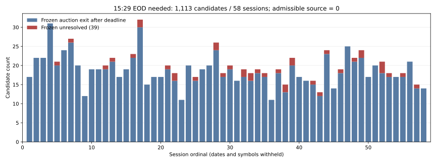

# 🚦 Capital vNext — EOD 15:29 最終Report

保存JST: 2026-10-04T09:26:57.963323+09:00 / branch: `capital-state9-vnext-20261004` / basis HEAD: `b28d17202b66239e61cada01127db87a71994e4a`

**CAPITAL_C2_EOD_SOURCE_BLOCKED / E8-B・STOP。C2 PASSなし、C3再開なし。**

`EOD_FORCE_EXIT_1529_V1` は新coverage・overlay結果を見る前にGitHubへprecommitした。全1,600候補を別downstream policy `EXIT_V3_PLUS_EOD_1529` として監査したが、15:29 raw Openは0件、admissible source・EOD fillも0件だった。15:29前のFrozen reference fillは487件、EOD対象は1,113件。旧39件の新overlayによる閉鎖は0件である。

市場契約が主blockerである。東証は2024年11月5日以降、15:25にザラバを終了し、15:25–15:30は注文受付のみ、15:30にclosing auctionを行う。[JPX売買成立方法](https://www.jpx.co.jp/equities/trading/domestic/04.html)・[2024年11月導入記録](https://www.jpx.co.jp/corporate/news/monthly-headline/202411.html)と、Frozen v3のdated clockが一致した。対象期間2025-05-30–2025-08-25の全58sessionで15:29は約定のないpre-closingに入る。15:29のraw trade Openを新providerから取得すれば解決する、と判断していない。

## 🔒 Frozen lineageと別overlay

| 対象 | authoritative HEAD / status | 今回の変更 |
|---|---|---|
| FIRST ENTRY v2 P1_Q70 | `4a2d6f35946b16820a13449a9288a6685a5c283c` / OFFICIAL_FREEZE | 0 |
| Structural EXIT v3 Local Guard | `c7a5e5c25eb19cbd58b45c3e4ffff977f4648fad` | 0 |
| Formal v3 Freeze receipt | `1ecbcc43f75279fa302f19fd896add2aac15b537` / OFFICIAL_FREEZE | 0 |
| Re-entry | Evidence-only、Frozen=false | 統合0 |
| EXIT v4 | V4_NOT_BETTER_KEEP_V3 | 再採用0 |
| Parent C2 STOP | `c55b2b2134f79cbe33085b6757337048d150c2cb` | immutable |
| Parent recovery latest | `313bfbed2bbb023ca986d0d14bcba04421a84f1a` | 開始時latest一致 |
| 今回policy | EOD_FORCE_EXIT_1529_V1 / EXIT_V3_PLUS_EOD_1529 | 別lineage、Capital採用なし |

Entry原本SHA256: `e7a6140b6b11d8d078a271fad76b75e68a5b2fda9e45c7db43d98ee2f282abeb`。
EXIT v3原本SHA256: `e162d94b9f532f1b6b44b7d602f6be50babec7a5183c4378473cefcd92d61234`。
Policy SHA256: `7cb3daee351fc3289238af4ceecb5137dc869a246605eeca573e28680e058a25`。

Frozen v3のFILLED1,561 / UNRESOLVED39を保持した。遅いauction fill1,074件を15:29へ移動せず、旧列へ保存した。新downstream列には15:29前の487 reference fillsを保持し、残り1,113件をUNRESOLVED_FAIL_CLOSEDとした。新policyの閉鎖不足を、元のFrozen成績やstatusの修正として扱っていない。

## 📊 全1,600候補のsource・closure

| 指標 | N | 全候補比率 | 判定 |
|---|---:|---:|---|
| 候補 / session / distinct symbol | 1,600 / 58 / 774 | 100% | identity保持PASS |
| EXIT v3 reference fillが15:29前 | 487 | 30.4375% | 保存、runtime cash別監査 |
| EOD対象 | 1,113 | 69.5625% | 全候補へ同じrule |
| 対象内・Frozen15:30 auction fill | 1,074 | 67.125% | deadline後価格を不採用 |
| 対象内・Frozen UNRESOLVED | 39 | 2.4375% | 元statusを維持 |
| 15:29 raw Open存在 | 0 | 0% | missing、fallback0 |
| admissible15:29 execution source | 0 | 0% | SESSION_NOT_ACTIVE |
| 新EOD valid fill | 0 | 0% | BLOCKED |
| EOD unfillable / retained candidate obligation | 1,113 | 69.5625% | fail-closed |
| 新policyのsame-day reference closure | 487 | 30.4375% | C2全体PASSではない |
| cash release runtime認証 | 0 | 0% | referenceをcashへ昇格0 |

これは**candidate-level admission**である。Allocatorを実行していないため、funded subset・実際のovernight Position数・cash/MTM Portfolio成績はUNKNOWN / NOT EXECUTED。1,113件を実保有の翌日carryと呼ばない。Entry時点で将来unfillableとなる候補を除外する操作も0である。

## 🧾 旧39 UNRESOLVEDとreason taxonomy

| 指標 | Parent / Frozen | 新overlay |
|---|---:|---:|
| 対象N | 39 | 39保持 |
| affected sessions / symbols | 29 / 38 | 29 / 38 |
| 新sourceだけでsame-day close | 0 | 0 |
| Frozen UNRESOLVED→FILLED書換え | 0 | 0 |
| EOD unfillable | 未適用 | 39 |

| precommitted reason | EOD対象1,113 | 旧39 subset | 根拠 |
|---|---:|---:|---|
| SESSION_NOT_ACTIVE | 1,113 | 39 | 15:29 pre-closing、約定なし |
| HALT | 0 | 0 | positive halt receiptなし、推定分類しない |
| NO_TRADE | 0 | 0 | absenceだけで個別無約定と認定しない |
| SOURCE_MISSING（primary reason） | 0 | 0 | raw欠損1,600はsecondary事実。市場不執行を先に分類 |
| AUCTION_ONLY | 0 | 0 | auction sourceの存在でprimary市場理由を置換しない |
| LINEAGE_UNAVAILABLE | 0 | 0 | 原本lineageを回収済み |
| OTHER_PREDECLARED_REASON | 0 | 0 | 追加bucket0 |

## 🗓️ Session coverageとグラフ

| 指標 | 結果 |
|---|---:|
| Frozen候補session | 58 |
| EOD対象を含むsession | 58 |
| 15:29がregular execution activeなsession | 0 |
| valid EOD fillを含むsession | 0 |
| EOD対象/sessionの最小–最大 | 11–32候補 |
| 旧39 UNRESOLVEDを含むsession | 29 |

全58sessionを順番通り表示した。個別日付・symbol・priceは公開しない。実数のsource/admission図であり、Portfolio curveや仮数値グラフは作成していない。

## ⏱️ known-at / cash / MTM

| 分類 | N | 結論 |
|---|---:|---|
| REFERENCE_FILL_ONLY_NOT_RUNTIME_KNOWN_AT | 487 | Frozen prior fill保持。actual arrival UNKNOWN、cash認証なし |
| NO_ADMISSIBLE_EXECUTION_SOURCE | 1,113 | EOD fill / cash release null |
| prior487のassumed_available_at−reference | 60秒 ×487 | +1mを保持、backdate0 |
| 元Frozen SELL全1,561の+1m | parent receiptを再利用 | 変更0、今回新runtime認証0 |
| 15:29 source actual / assumed known-at | 該当source0 | 時刻生成0、reference fill捏造0 |
| runtime cash release authorized | 0 | 未確認fillやintentからrelease0 |
| current MTM admission binding | BLOCKED_INHERITED_PARENT | 新cadence・補間・partial比較0 |

同時刻EXIT→cash release→ENTRYは、eligible confirmed cash eventだけの順序契約を保持した。今回、それを通過する新EOD eventは0件である。保有量も未割当なので、funded cash ledger・MTM equity・Final Equity・DDを検証済みと呼ばない。

Parentの「1,420候補のholding-window full1m欠損 / 113,303 missing closes」はfunded MTM必要範囲ではない。既存funded-only / null-aware mechanicsは回収済みだが、現在Frozenのmark clock・price role・known-atとのbindingは未確定のまま。新EODでcross-session obligationを消せなかったため、これもC3前のblockerとして残る。

## 🧮 Accounting / Independent / canaries

| 検査 | N / 結果 | 範囲 |
|---|---:|---|
| BUY effective arithmetic | 1,600 / mismatch0 | raw Open×1.0005、Entry costを追加0 |
| Frozen SELL effective arithmetic | 1,561 / mismatch0 | regular Open / exact auction Close×0.9995 |
| isolated100株 cash endpoint vs trade PnL | 1,561 / mismatch0 | 算術検査。Portfolio replayではない |
| commission / extra旧fee | 0 / 0 | 旧roundtrip/R34 feeを継承0 |
| cost二重計上 / cash二重release | 0 / 0 | 新EOD fillも0 |
| Independent original manifest checks | 3 / PASS | V2/V3原本attachment、Primaryをimport0 |
| Primary/Independent row-field comparison | 59,200値 / mismatch0 | 1,600候補×37項目、Fractionで別再計算 |
| recovery raw vs original raw arrays | 1,600 / mismatch0 | gzip header差とpayload同一を区別 |
| mutation/fail-closed canary checks | 11,339 / mismatch0 | future HLC、翌日、future outcomes、late Frozen EXIT等 |
| Open-only / invalid-source fixtures | PASS | fixtureを市場fillへ採用0 |
| actual funded quantity / Portfolio ledger | NOT EXECUTED | quantity超過やcash改善を架空検証しない |

15:29以降のHigh/Low/Close・翌日price・未来outcomeを変えてもEOD decisionは不変。15:29後のFrozen EXIT suffixを除いても1,113候補のruntime outputは不変。already-exited487件へ二重EODを適用0、missing sourceからfill/cash生成0。さらに正の15:29 Openを人工的に注入したcanaryでも市場clockによりSESSION_NOT_ACTIVEとなった。これはOpen取得だけではdeadline問題を解消しないことを示すfixture検査で、market dataや実fillのEvidenceではない。

## 🧪 C2 Gate

| Gate | 条件 | 判定 |
|---|---|---|
| 1 | Frozen1600 identities保持 | PASS |
| 2 | Entry変更0 | PASS |
| 3 | Frozen EXIT v3変更0 | PASS |
| 4 | EOD overlay別lineage | PASS |
| 5 | 15:29 rule precommitted | PASS |
| 6 | source type一意 | PASS |
| 7 | future price使用0 | PASS |
| 8 | same-day final exit contract一意 | BLOCKED |
| 9 | cash release一意 | BLOCKED |
| 10 | cost二重計上0 | PASS |
| 11 | missing source補完0 | PASS |
| 12 | Independent mismatch0 | PASS |
| 13 | LONG-only cash-only | PASS |
| 14 | Safety全false | PASS |

14条件のうち12条件PASS・2条件BLOCKED。source typeの**定義**は一意だが、実在するadmissible sourceは0件。deterministicなUNRESOLVED_FAIL_CLOSED列を作れたことは、全候補のsame-day closure・cash-known・歪みのないPortfolio比較の成立を意味しない。current MTM bindingも追加の継続blockerである。

全1,600候補を保持したまま失敗時obligationを残すmechanicsは使えるが、future unfillable候補をEntryで排除したり、未決済equityを補完したり、部分集合成績を全Portfolioとして示す契約は採用していない。このためC2をPASS扱いにしない。

## 📦 Public / Private artifacts

| 保存先 | 主な内容 | row-level公開 |
|---|---|---:|
| Public Git新cycle | EOD3契約、source集計、known-at/accounting、Independent、canaries、14Gate、closure、handoff、manifest、実commit receipts | 0 |
| Public research新cycle | Primary / Independent / canary / aggregate chart scripts | 0 |
| Private新package | EOD rows1,600、旧39rows、Independent rows1,600、固定入力slice/manifests、抽出hash、空Capital ledgers | Publicへ0 |

Private: `Ark_Capital_EOD_1529_20261004_v1_PRIVATE.zip` / 19,090,530 bytes / SHA256 `6880f9ee6171a675f55fb2d2d4231a2193b86cd21a10ddd124dddb07de6d49cc` / 21members。
ZIP CRC・全component hash・row countを検証し保存済み。Capital decisions0 records、Portfolio curves0 records。公開repoには個別symbol/session/time/priceのrowを保存していない。

## 🛡️ Execution budget / Safety

| 項目 | 消費 |
|---|---:|
| 新EOD policy / deadline variant / source fallback | 1 / 1 / 0 |
| candidate overlay / source audit runs | 2 / 2（hash assertion等のtechnical再確認を含む） |
| Independent / canary runs | 1 / 2（追加future Frozen suffix検査を含む） |
| Capital performance / MAX3・4・5 / Entry replay / EXIT replay | 0 / 0 / 0 / 0 |
| fit / ranker / threshold search / State9 feature search | 0 / 0 / 0 / 0 |
| provider / new market data | 0 / 0 |
| Protected / Holdout / Fresh / Validation / OOS / Prospective open | 0 |
| orders / main merge / force push / Claude | 0 / 0 / 0 / 0 |

Safety10項目すべてfalse。LONG-only / cash-equity-onlyを保持。今回は既存のoutcome-exposed Developmentのみで、Fresh/OOSとは呼ばない。原本Entry P1自体がState9 current/historyを既に含む。Capital incremental診断やState9 Rank研究には到達していない。

## 🧭 Checkpoints・現在地・次方針

| checkpoint | actual result commit |
|---|---|
| EOD WORK START | `12d40b8cf381379df0b7c125969180aa9d732f47` |
| EOD PRECOMMIT | `c021787fe11d7b75e3254897b33e9bad894b90d0` |
| 15:29 SOURCE COVERAGE | `ae293547310482b9685000d2e504b1bf56780f14` |
| C2 RE-AUDIT | `b28d17202b66239e61cada01127db87a71994e4a` |
| C2 CLOSURE / HANDOFF | commit成立後に `CHECKPOINT_RECEIPTS/E8_RESULT_COMMIT.json` へ記録 |

各checkpointにJST・basis HEAD・source/contract hashes・現状・未解決・次方針・Safety・Exposureを保存した。未来commit SHAは記載せず、GitHub GET確認後にreceiptを追記する。旧Evidence directoryやFrozen receiptを上書きしない。

**STOP。** 次に必要なのは、執行可能なザラバ内deadlineを別途precommitするか、注文受付deadlineと後刻auction executionを別契約として明示すること。その場合もexisting source / known-at / cash / MTM admissionの監査が必要である。今回の15:29 deadlineを15:24や15:30へ変更する実験は0。新dataだけでnonexecution期間をexecution期間へ変更できない。C3・State9 Capital・MAX比較・Integrated versionは開始しない。

## ❓ 指示書20問への回答

| # | 回答 |
|---|---|
| 1 | precommit済み。`c021787fe11d7b75e3254897b33e9bad894b90d0`、新15:29 coverage前。 |
| 2 | Frozen EXIT v3変更0。original receipt / component hashを保持。 |
| 3 | exact15:29 regular raw minute Openのみ。全1,600で存在0、admissible source0。 |
| 4 | 該当sourceがないためknown-atを生成しない。prior Frozen actual arrivalはUNKNOWN、+1m assumption保持。 |
| 5 | candidate referenceで15:29時点未閉鎖1,113件。実funded Position数は未実行・UNKNOWN。 |
| 6 | EOD対象1,113件、58session。旧39だけを特別扱い0。 |
| 7 | valid新EOD fill0件。 |
| 8 | unfillable1,113件、SESSION_NOT_ACTIVE。個別HALT/NO_TRADEをabsenceから推定0。 |
| 9 | 旧39の新overlay same-day close0/39。 |
| 10 | Frozen UNRESOLVED→FILLED書換え0。 |
| 11 | actual funded overnight数UNKNOWN。新deadlineまで閉鎖できないcandidate obligation1,113件をfail-closedで保持。 |
| 12 | future H/L/C price使用0。future suffix / next-day / future outcome mutation mismatch0。 |
| 13 | fill・missing price補完0。auction/lastClose/nextbar/zero/翌日代用0。 |
| 14 | cost二重計上0。BUY1,600・SELL1,561・isolated PnL算術mismatch0。実Portfolio ledger未実行。 |
| 15 | Primary/Independent59,200値mismatch0。canary11,339検査mismatch0。 |
| 16 | C2 PASSなし。CAPITAL_C2_EOD_SOURCE_BLOCKED / E8-B。 |
| 17 | C3以降の自動復帰なし。PASS条件を満たしていない。 |
| 18 | State9 Capital研究へ未到達。fit / rank / State9 feature search0。 |
| 19 | GitHub新cycleへJST・basis・現状・次方針をappend-only保存。result receiptはcommit成立後。 |
| 20 | Safety10false、orders/main merge/force push/Claudeすべて0。 |

詳細は [C2_RE_ADMISSION.json](C2_RE_ADMISSION.json)、[INDEPENDENT_AUDIT.json](INDEPENDENT_AUDIT.json)、[EOD_ASOF_CANARIES.json](EOD_ASOF_CANARIES.json)、[EOD_C2_CLOSURE.json](EOD_C2_CLOSURE.json)、[CONTROLLING_HANDOFF.md](CONTROLLING_HANDOFF.md) を参照。
