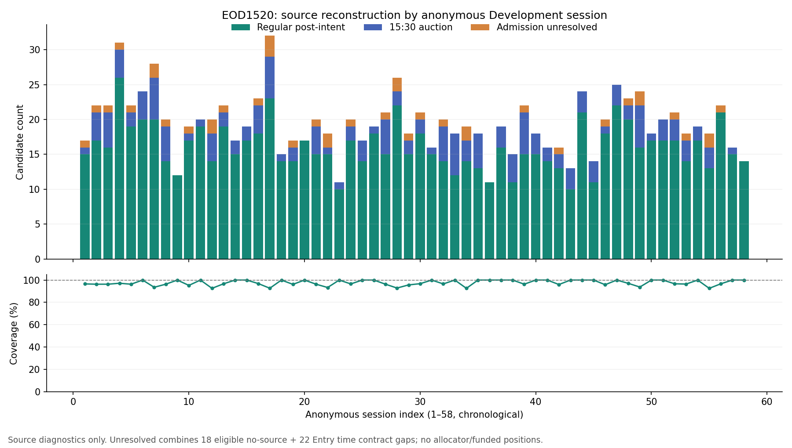
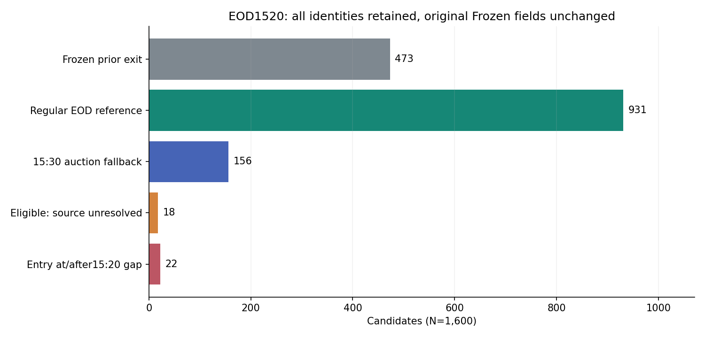

# 🧭 Capital vNext C2 — EOD15:20 SOR 最終Report

保存JST: **2026-10-04T10:08:48.330656+09:00** / branch: `capital-state9-vnext-20261004` / C2再監査result HEAD: `5528997379802a173166f1cb68ddb977491d41f2`。

**CAPITAL_C2_EOD1520_SOURCE_BLOCKED / STOP。C2未PASS、C3以降未再開。**

15:20 policyを結果前にprecommitし、全1,600 identitiesを保持した。15:20時点openの1,105候補に対して、ザラバ931件・15:30 auction156件、計**1,087 reference fills**を確認した。旧39 UNRESOLVEDのうち**19件**を新overlayでsame-day reference closeできた。

残る主なblockerは、**18件のexecution source不足**と、**22件のEntry時刻契約gap**。22件は15:20同時刻6件・15:20後16件であり、Frozenでは20FILLED・2UNRESOLVED。この22件を市場で売却不能だったと認定していない。precommit後にEntryを除外したり、保有前のSELLや新しいlate-entry liquidationを作っていない。

Primary / Independentは**54,400項目mismatch0**、canary **14,957 checks / mismatch0**。Integrity検算の一致は、C2全母集団admissionやCapital性能PASSを意味しない。結果はDevelopment入力・execution reference監査であり、Fresh/OOS成績ではない。

## 🔒 Frozen / parent lineage

| 対象 | Authoritative HEAD / 保存方針 |
|---|---|
| Work開始latest | `b170de44a2096acee5933f5935135574da480493`、報告HEADと一致 |
| Frozen FIRST ENTRY v2 P1_Q70 | `4a2d6f35946b16820a13449a9288a6685a5c283c` |
| Frozen Structural EXIT v3 | `c7a5e5c25eb19cbd58b45c3e4ffff977f4648fad` |
| Formal EXIT v3 receipt | `1ecbcc43f75279fa302f19fd896add2aac15b537` |
| EOD15:20 precommit | `d4322d6c27eb6ae29c3e21fa4d71adfd809a5eb1` |
| 旧15:29 closure | `41ada0f8390997c7d952f18b059499d57c19941e`、negative Evidence維持 |
| 今回C2 readmission | `5528997379802a173166f1cb68ddb977491d41f2` |
| Re-entry / EXIT v4 / side | Evidence-only / 拒否維持 / LONG cash-equity-only |

旧Entry/EXIT source・price・timestamp・receipt・hash・status変更0。旧39件をFrozen上FILLEDへ書き換えていない。新policyは`EXIT_V3_PLUS_EOD1520_SOR_REFERENCE_V1`という別downstream lineage。成立後のclosure resultは[CHECKPOINT_RECEIPTS/F7_RESULT_COMMIT.json](CHECKPOINT_RECEIPTS/F7_RESULT_COMMIT.json)、最終配送確認は[DELIVERY_RECEIPT.json](DELIVERY_RECEIPT.json)に追記する。

## 🏛️ Market / broker contract — PASS

| 事項 | 確認・固定した意味 |
|---|---|
| 東証 | ザラバ15:25まで、15:25–15:30は注文受付のみ、15:30 auction |
| 15:20選択理由 | ザラバ終了より5分前の固定Operational Buffer。performance選択0 |
| SOR | 成行・本日中、MarketSpeed II対応。引け条件は使わない |
| 残数量 | Rクロス未マッチ/残数量は東証へ回送。東証の残DAY注文はpre-closingへ |
| Zero Course | 現物broker commission0JPY。SOR/Rクロス利用同意が前提 |
| RSS | RssStockOrder: SELL1、通常0、SOR1、成行0、本日中1、trigger0 |
| 口座 | 現行cash accountを参照するplaceholder。特定/一般/NISAを推測しない |
| 最新PDF | 添付2026/3/30 → 公式2026/9/19。今回のfield組合せ一致 |

確認日付き公式URLとparaphraseは[MARKET_BROKER_SOURCE_RECEIPT.json](MARKET_BROKER_SOURCE_RECEIPT.json)、RSS draftは[RSS_SHADOW_ORDER_DRAFT.json](RSS_SHADOW_ORDER_DRAFT.json)。発注関数呼出し・Excel書込・実送信0。実運用のbroker対象銘柄/同意/注文受付/数量確認を本Workでlive認証していない。

## 📌 Precommit / execution reference

Policy: **EOD_LIQUIDATION_1520_SOR_MARKET_V1**。時刻候補1、policy候補1、deadline sweep0。

15:20のintentはclock・既存LONG現物position・残数量・prior full-fill factだけから決める。State9/rank/15:20以降の価格は判断に渡さない。価格は注文後に起きるexecution outcomeとして保存する。

| 優先 | source / 条件 | N |
|---|---|---:|
| 1 | Frozen v3のvalid fillが15:20より前 | 473 |
| 2 | 15:20以上15:25未満、最初のadmissible raw Open | 931 |
| 3 | primaryがない場合だけ、equal OHLC・positive Vo/Vaのexact15:30 auction | 156 |
| 4 | Eligibleだがvalid sourceなし、UNKNOWNをfail-closed | 18 |
| 別境界 | Entryが15:20同時刻/以降でintent対象にならない | 22 |
| 合計 | 全Frozen identities、除外0 | 1,600 |

J-Quants公式minute仕様はTime=minute start、O=そのminute最初のtrade。15:30 auctionはexact15:30 recordへ集約される。日足Close・最終観測Close・next-day Open・補間・forward-fillを採用していない。全量はhistorical reference modelであり、bar volumeだけで自分のSOR注文の全量実約定/板depthを認証しない。

## 📊 Source coverage / 旧39件

| 指標 | 今回 | 意味 |
|---|---:|---|
| candidates / sessions / symbols | 1,600 / 58 / 774 | 同じDevelopment、Protected開封0 |
| 15:20より前のFrozen exit | 473 | 原本fillを保持 |
| 15:20時点open / EOD intent対象 | 1,105 | candidate-level、funded position数ではない |
| regular reference fill | 931 | 15:20–15:24最初のtrade |
| auction fallback | 156 | primaryなしの場合のみ |
| EOD reference fill | 1,087 / 1,105 = 98.3710% | 性能・実SOR約定率ではない |
| EOD no-source | 18 / 1,105 = 1.6290% | 15sessions / 18symbols、HALT/NO_TRADE未証明 |
| Entry clock gap | 22 | 15:20同時刻6、以降16、21sessions |
| precommit final reference closure | 1,560 / 1,600 = 97.5% | prior473 + EOD1087 |
| 全母集団final admission未解決 | 40 | source18 + clock gap22、no-fill40とは呼ばない |
| actual funded overnight positions | UNKNOWN | allocator0。40実保有の持越しと解釈しない |

| old39の新overlay分類 | N |
|---|---:|
| regular EODでsame-day reference close | 19 |
| eligible execution source不足 | 18 |
| 15:20後Entryの契約gap | 2 |
| 原本UNRESOLVED保持 | 39 / 39 |
| 新overlayで未解決 | 20 / 39 |

| EOD reference minute | 15:20 | 15:21 | 15:22 | 15:23 | 15:24 | 15:30 |
|---|---:|---:|---:|---:|---:|---:|
| fill N | 607 | 123 | 78 | 70 | 53 | 156 |

これは最初のtrade時刻の結果分布であり、deadlineのperformance sweepではない。

date・symbol・priceのrow-levelは公開していない。図はsource診断のみで、Equity・return・utilizationの仮曲線を作っていない。

## 🔎 Existing recovery / 追加取得の状態

| 確認 | 結果 |
|---|---|
| 既存Frozen full raw | 1m、263,087 today rows / 1,600 candidates / 58sessions |
| 旧Recovery原本 | 4,931 watches / 133 Development source export、対象1,600のみ使用済み。無駄な再測定をせずhash一致を再利用 |
| previous-link source | target unique157,080 rows、追加target minutes0の正式Evidenceを再利用 |
| durable source | 8branch latest refsを再確認、全てparent HEADと同じ |
| 未検査範囲 | 既存Actions binary2件の取得制約を保持。「世界中にsourceなし」と断定しない |
| 18件の追加source | J-Quants限定・same Development・対象18pairs/15sessions/18symbolsのPrivate取得planを作成 |
| 実取得 | 利用可能な認証/接続がなく未実行。provider requests0 / new rows0 |
| APIのscope境界 | 公式minute endpointはcode/dateで、時刻filter引数なし。全日取得を暗黙に実行しない |
| no-tradeと欠損 | absent minute単独では区別不能。UNKNOWN維持、補完0 |

既存source優先の結果、19件を新policyで解決できた。18件はsourceまたはcomplete-response/market-status receiptが必要。取得許可の再要求はしていない。許可済み範囲を実行する認証が不足している。

## ⏱️ Accounting / known-at — reference検算PASS

| 項目 | 契約 / 実検算 |
|---|---|
| Broker commission | **0JPY** |
| BUY effective | Frozen raw Open×1.0005、変更0 |
| SELL effective | source×0.9995、5bps execution/slippage assumption |
| 旧roundtrip / R34 cost | 追加0 / 追加0 |
| SOR price improvement / market impact | 仮定0 / モデル追加0 |
| Original BUY / SELL算術 | 1,600 / 1,561 checked、mismatch0 / 0 |
| 独立cash endpoint = tradePnL | closed reference1,560件、isolated100shares、mismatch0 |
| source assumed availability | 既存minute+1mを保持。reference labelへbackdateしない |
| reference cash release | fill source completion assumption後に1回のみ。1,560件 |
| final unresolved cash release | 0、cash timestamp/proceeds null |
| actual arrival / runtime cash certificate | UNKNOWN / 0件 |
| Frozen auction vs reference cash time | auction15:30、bar completion assumption15:31。Frozen fill時刻を移動しない |

cash endpointは`initialCash − q×effectiveBUY + q×effectiveSELL`、tradePnLは`q×(effectiveSELL−effectiveBUY)`。effective priceへ含まれたexecution factorを再度feeとして引かない。この単体算術検算をPortfolio replayと呼ばない。

旧1,420候補のfull1m holding-window欠損は、実funded subsetの必要mark coverageではない。既存funded-only/null-aware mechanicsは回収済みだが、current MTM/source missingの比較可能性bindingをこのEOD結果だけでPASSにしていない。cash/MTM ledger・Final Equity・MaxDD・utilizationは未測定。

## 🧪 Independent / C2 admission

| 監査 | N / 判定 |
|---|---|
| Independent route | 原本V2/V3 component manifest、Fraction arithmetic。Primary import0 |
| 同一identity / original raw | 1,600 / mismatch0 |
| 比較field / values | 34 / 54,400、mismatch0 |
| original BUY / SELL / cash算術 | mismatch0 / 0 / 0 |
| future/cash/Safety canary | 14,957 / mismatch0 |
| Frozen source hash改変 | 0 |
| C2 Gate | 14 PASS / 1 BLOCKED |
| BLOCKED | 全1,600のsame-day closure/exception admission |
| C3 / State9 / MAX3・4・5 / Freeze | 未実行 / 未実行 / 未実行 / 候補なし |

post-intent price・later Frozen outcome・future Entry outcome・next-day priceを変えてもintent不変。source欠損で架空fill/cashなし。既決済/未保有/duplicate commitmentを二重売却しない。全量reference・known-atはresearch契約に限定し、broker実約定の新認証をしていない。

## 📝 残る契約草案 / 訂正lineage

[LATE_ENTRY_ADMISSION_DRAFT.md](LATE_ENTRY_ADMISSION_DRAFT.md)と[UNRESOLVED_DECISIONS.json](UNRESOLVED_DECISIONS.json)は**PROPOSED_NOT_AUTHORIZED / NOT EXECUTED**。同時刻Entry6件のevent順序、後Entry16件へのcausal allocation cutoffまたはposition確認後liquidationを明示する必要がある。どの案もこのWorkでは採用していない。performance結果で救済しない。

F3のsource requirement文書に手入力したEntry時刻下限を15:21と誤記した。正しくは**15:20–15:24、exact15:20は6件**。[F3_SOURCE_TIME_RANGE_CORRECTION.json](F3_SOURCE_TIME_RANGE_CORRECTION.json)を追記し、旧文書を上書きしていない。row output・identity・precommit・数値分類は変更0。初期scratchのno-fill40という表示も、eligible no-source18とclock gap22へ区別し、同じrow hashのまま保存した。

## 🗂️ Public / Private artifacts

| 境界 | 保存物 |
|---|---|
| Public GitHub | START、公式receipt、precommit/契約、aggregate coverage、independent/canary/accounting、C2closure、handoff、JST/commit receipts、匿名charts、audit source |
| Private | 1,600 overlay rows、1,600 independent rows、40 admission-unresolved rows、18 exact J-Quants request targets、22 clock-gap rows、immutable15:29 parent package |
| Private NOT EXECUTED | Capital decisions0records、Portfolio curves0records |

Private ZIP: `Ark_Capital_C2_EOD1520_SOR_20261004_v1_PRIVATE.zip`、19,489,115 bytes / 13members、CRC PASS。SHA256 `e9697f75da74ecc20505c1c0a7a26a6ef1134059d0654a5674af96f1feebca74`。Private rowsをpublic repoへ出していない。Git-backed code/reportのPrivate ZIPへの重複保存0。

## 🛡️ Exposure / execution budget

| 実行対象 | 消費 |
|---|---:|
| fixed EOD policy / deadline variants | 1 / 1 |
| deadline sweep / rank threshold search / State9 feature search | 0 / 0 / 0 |
| fit / Capital ranker | 0 / 0 |
| Capital performance / MAX3・4・5 / Entry replay / EXIT replay | 0 / 0 / 0 / 0 |
| provider requests / new market data rows | 0 / 0 |
| Protected / Holdout / Fresh / Validation / OOS / Prospective open | 0 |
| broker / RSS / Excel / live / paper orders | 0 |
| main merge / force push / Claude | 0 / 0 / 0 |

Safety10flagsは全false。productionReady/transmittedもfalse。Execution contractはresearch/shadowのみ。

## 🚦 現在地 / 次方針

**STOP: CAPITAL_C2_EOD1520_SOURCE_BLOCKED。**次は許可済み18-target execution/status evidenceの取得経路と、6同時刻/16後Entryのdownstream契約境界を解決する。全1,600を保持して再監査し、C2 PASSが成立した場合だけC3→C10へ自動復帰する。Integrated versionは開始しない。

旧Capital正式lineageは回収済み。Adaptive v2はPR496 `f13cc42515df3b1e1b60de7181fdf89f1a9255f9`、Realtime R6はPR532 `e198040c8224fd4f7a61410b416f767638fb473c`。旧4featuresはcurrentで同義field0、P1をprobabilityに読み替えない。C3を再開する際はmechanics-only/current-input baselineをprecommitする。P1 Entry自体がState9 current/historyを使うため、Capitalの追加参照を「Stateなしvsあり」と呼ばない。MAX-Nはconcurrent cap、Equity/NはFixed sanityだけ。

## ❓ 指示書24問

| # | 回答 |
|---|---|
| 1 | 15:29 negative Evidence、parent hash、closureを保持。上書き0。 |
| 2 | JPXザラバ終了15:25から固定5分buffer。ユーザーoperational判断と公式制度に基づく。 |
| 3 | deadline sweep0。 |
| 4 | Broker commission0JPY、execution factorと別項目。 |
| 5 | SOR MARKET DAY / RSS SELL1通常0SOR1MARKET0DAY1は公式最新版と一致。実行0。 |
| 6 | 15:20 open候補1,105。actual funded positionsはallocator0で未確定。 |
| 7 | regular first admissible trade reference fill931。 |
| 8 | exact15:30 auction fallback156。 |
| 9 | eligible no-source18。HALT/NO_TRADEは未証明、UNKNOWN。別にclock gap22。 |
| 10 | old39のうち19を新overlayでsame-day reference close。残りsource18 + lateEntry2。 |
| 11 | Frozen EXIT v3変更0。 |
| 12 | future priceをdecision inputへ渡さない。注文後execution outcomeとしてだけ使用。 |
| 13 | price補完0。 |
| 14 | 追加取得許可はDevelopment限定。利用可能なJ-Quants認証なし、実取得0。18-target Private plan保存。 |
| 15 | commission0、BUY1.0005/SELL0.9995はeffective priceへ1回。旧fee追加0、算術mismatch0。 |
| 16 | Primary/Independent34fields×1600、mismatch0。canary14,957 mismatch0。 |
| 17 | C2未PASS、14PASS/1BLOCKED。 |
| 18 | C3未再開。 |
| 19 | State9-aware Capital未到達。 |
| 20 | MAX3/4/5未実行。 |
| 21 | Capital Freeze Candidateなし、性能未測定。 |
| 22 | F0/F1/F2/F3/F5-F6/F7と成立後receiptを新cycleへappend-only保存。 |
| 23 | Safety全false、orders/main merge/force push0。 |
| 24 | Claude0回。公式source・独立原本経路で監査。 |
