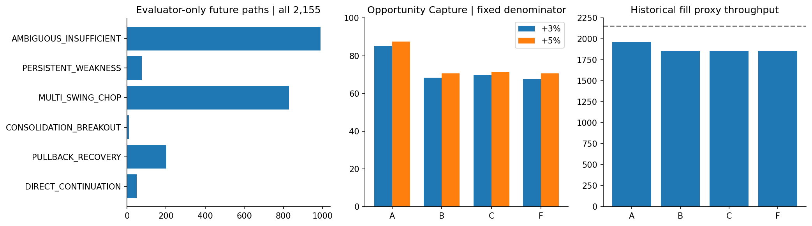
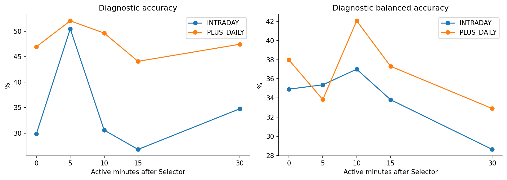
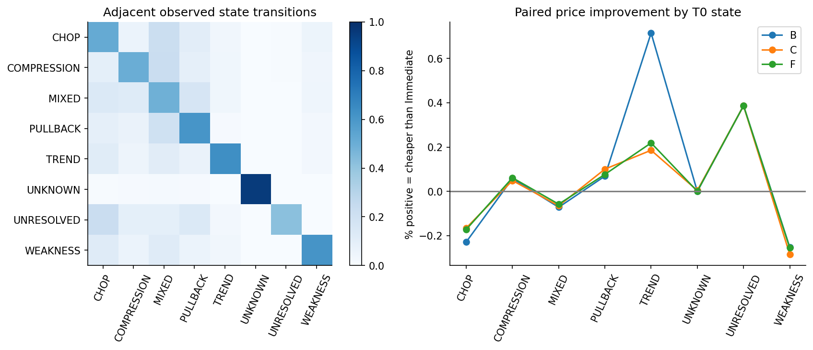
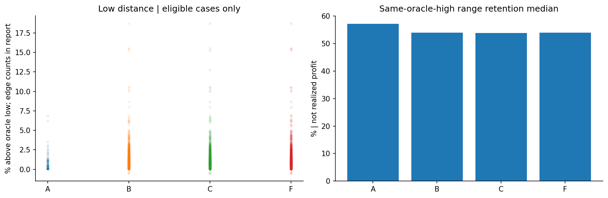

# Phase57 Causal Entry State / Path Anatomy v1

固定2,155 Opportunities。Development内の記述研究。A=Immediate、B=State-aware early、C=State適合Signal、F=10 active-minute fallback。Entryモデルの学習・Freeze・自動昇格は行わない。

## 3つの問いは別

1. 値幅の存在: Future Path / ordered Low→later Highはoracle anatomyのみ。既存+3%の値幅1,143件は実現利益ではない。
2. 因果的認識: 日足D-5〜D-1、前日1m、当日closed-prefixでStateとSignalを測定。履歴再構築であり独立knownAt認証ではない。
3. Timing改善: 下表の同一母集団・paired買値・Capture・throughputで検証。条件付きMAEだけを改善成功と扱わない。

## Future Path 5+1

| Path | N | 全2,155比% |
|---|---|---|
| DIRECT_CONTINUATION | 50 | 2.320 |
| PULLBACK_RECOVERY | 202 | 9.374 |
| CONSOLIDATION_BREAKOUT | 10 | 0.464 |
| MULTI_SWING_CHOP | 828 | 38.422 |
| PERSISTENT_WEAKNESS | 76 | 3.527 |
| AMBIGUOUS_INSUFFICIENT | 989 | 45.893 |

Path6は定義を変更せず理由別に保存。0件のクラスも隠さない。

| Path6 reason | N |
|---|---|
| INSUFFICIENT_OBSERVATION | 496 |
| NO_DOMINANT_PATH | 355 |
| TRUE_MIXED_PATH | 138 |

## Recent Daily / Path識別

D-5〜D-1全5日利用可能: 1961/2,155。残りも母集団に保持。returnOCnはn営業日の始値→終値、returnCCnはD-6も必要な通常close-to-close。混同しない。

日足理由は6本分（補助D-6含む）の延べ数でOpportunity件数ではない。

| Reason | 延べ日足数 |
|---|---|
| CORPORATE_ACTION | 8 |
| INVALID_OHLC | 45 |
| MISSING_DAILY | 48 |
| OUTSIDE_AUTHORIZED_DEVELOPMENT | 184 |

最初の29評価sessionで固定nearest-centroidをfit、後半29で診断。Entry政策学習ではなく、独立OOSでもない。後刻チェックポイントはラベルの一部を既に観測しているので、早期予測性能と混同しない。

| T+active min | Inputs | Fit N | Test N | Accuracy% | Balanced% |
|---|---|---|---|---|---|
| 0 | INTRADAY | 1,073 | 1,082 | 29.852 | 34.922 |
| 0 | PLUS_DAILY | 1,073 | 1,082 | 46.950 | 37.981 |
| 5 | INTRADAY | 1,073 | 1,082 | 50.462 | 35.377 |
| 5 | PLUS_DAILY | 1,073 | 1,082 | 52.033 | 33.834 |
| 10 | INTRADAY | 1,073 | 1,082 | 30.591 | 37.007 |
| 10 | PLUS_DAILY | 1,073 | 1,082 | 49.630 | 42.059 |
| 15 | INTRADAY | 1,073 | 1,082 | 26.802 | 33.822 |
| 15 | PLUS_DAILY | 1,073 | 1,082 | 44.085 | 37.313 |
| 30 | INTRADAY | 981 | 995 | 34.774 | 28.627 |
| 30 | PLUS_DAILY | 981 | 995 | 47.437 | 32.897 |

confusion・fit median/SD/centroid・session/month/time安定性はdiagnostic.json、全Path別feature分布とeffect sizeはfeature-separation.json.gzに保存。閾値を選ぶ材料として再最適化していない。

## Fixed-population Timing comparison

| Arm | N | Fill | +3 Capture% | +5 Capture% | Paired買値改善mean% | MAE30 median% | WAIT median | Range retained median% |
|---|---|---|---|---|---|---|---|---|
| A | 2,155 | 1,963 | 85.283 | 87.500 | 0.000 | -1.231 | 0.000 | 57.177 |
| B | 2,155 | 1,857 | 68.331 | 70.588 | -0.021 | -1.152 | 10.000 | 53.964 |
| C | 2,155 | 1,857 | 69.777 | 71.569 | -0.012 | -1.167 | 10.000 | 53.804 |
| F | 2,155 | 1,857 | 67.543 | 70.588 | -0.015 | -1.142 | 10.000 | 53.862 |

## T0 State別 paired comparison

StateはEntry後のラベルで分けず、Selector時点で固定。Fill時Stateはtradesに別保存。

| State | Arm | N | Fill | Price改善mean% | Low distance median% | Retention median% | +3 Capture% | +5 Capture% | MFE30 median% | MAE30 median% | WAIT median |
|---|---|---|---|---|---|---|---|---|---|---|---|
| CHOP | A | 106 | 106 | 0.000 | 0.050 | 53.993 | 94.444 | 95.652 | 1.083 | -0.789 | 0.000 |
| CHOP | B | 106 | 106 | -0.228 | 0.913 | 47.765 | 77.778 | 78.261 | 0.855 | -1.203 | 10.000 |
| CHOP | C | 106 | 106 | -0.165 | 0.913 | 48.672 | 80.556 | 73.913 | 0.988 | -1.176 | 10.000 |
| CHOP | F | 106 | 106 | -0.172 | 0.861 | 48.672 | 72.222 | 73.913 | 0.863 | -1.159 | 10.000 |
| COMPRESSION | A | 127 | 127 | 0.000 | 1.481 | 49.112 | 97.872 | 92.593 | 1.042 | -1.564 | 0.000 |
| COMPRESSION | B | 127 | 127 | 0.058 | 1.613 | 48.910 | 85.106 | 81.481 | 0.856 | -1.284 | 10.000 |
| COMPRESSION | C | 127 | 127 | 0.049 | 1.604 | 48.767 | 89.362 | 81.481 | 0.783 | -1.272 | 10.000 |
| COMPRESSION | F | 127 | 127 | 0.061 | 1.619 | 48.910 | 82.979 | 81.481 | 0.763 | -1.272 | 10.000 |
| MIXED | A | 247 | 246 | 0.000 | 2.254 | 52.565 | 94.643 | 93.651 | 1.408 | -1.533 | 0.000 |
| MIXED | B | 247 | 246 | -0.072 | 1.260 | 52.496 | 76.786 | 76.190 | 0.997 | -1.563 | 10.000 |
| MIXED | C | 247 | 246 | -0.065 | 1.306 | 52.790 | 78.571 | 77.778 | 1.019 | -1.588 | 10.000 |
| MIXED | F | 247 | 246 | -0.058 | 1.250 | 54.134 | 75.893 | 76.190 | 0.993 | -1.496 | 10.000 |
| PULLBACK | A | 295 | 295 | 0.000 | 1.301 | 47.745 | 94.853 | 92.405 | 1.404 | -1.471 | 0.000 |
| PULLBACK | B | 295 | 294 | 0.069 | 1.366 | 52.496 | 76.471 | 77.215 | 1.431 | -1.226 | 10.000 |
| PULLBACK | C | 295 | 294 | 0.100 | 1.308 | 53.035 | 80.882 | 79.747 | 1.431 | -1.259 | 10.000 |
| PULLBACK | F | 295 | 294 | 0.077 | 1.366 | 52.222 | 75.735 | 77.215 | 1.413 | -1.253 | 10.000 |
| TREND | A | 2 | 2 | 0.000 | — | 67.506 | 100.000 | — | 1.826 | -1.484 | 0.000 |
| TREND | B | 2 | 2 | 0.714 | — | 82.086 | 100.000 | — | 3.642 | -0.775 | 5.000 |
| TREND | C | 2 | 2 | 0.186 | 1.849 | 68.784 | 0.000 | — | 3.103 | -1.066 | 7.000 |
| TREND | F | 2 | 2 | 0.219 | 1.782 | 69.607 | 0.000 | — | 3.137 | -1.034 | 10.000 |
| UNKNOWN | A | 1,270 | 1,079 | 0.000 | 0.454 | 60.519 | 75.765 | 80.952 | 0.851 | -1.002 | 0.000 |
| UNKNOWN | B | 1,270 | 975 | -0.000 | 0.918 | 55.893 | 59.694 | 65.079 | 0.842 | -0.913 | 10.000 |
| UNKNOWN | C | 1,270 | 975 | 0.004 | 0.915 | 55.893 | 59.694 | 66.138 | 0.842 | -0.909 | 10.000 |
| UNKNOWN | F | 1,270 | 975 | 0.001 | 0.918 | 55.893 | 59.694 | 65.608 | 0.842 | -0.912 | 10.000 |
| UNRESOLVED | A | 1 | 1 | 0.000 | — | 43.610 | — | — | 0.240 | -0.919 | 0.000 |
| UNRESOLVED | B | 1 | 1 | 0.386 | — | 67.195 | — | — | 0.241 | -0.535 | 10.000 |
| UNRESOLVED | C | 1 | 1 | 0.386 | — | 67.195 | — | — | 0.241 | -0.535 | 10.000 |
| UNRESOLVED | F | 1 | 1 | 0.386 | — | 67.195 | — | — | 0.241 | -0.535 | 10.000 |
| WEAKNESS | A | 107 | 107 | 0.000 | 0.522 | 54.629 | 97.297 | 92.593 | 0.980 | -1.067 | 0.000 |
| WEAKNESS | B | 107 | 106 | -0.252 | 1.656 | 47.278 | 72.973 | 59.259 | 0.763 | -1.178 | 10.000 |
| WEAKNESS | C | 107 | 106 | -0.284 | 1.603 | 45.895 | 75.676 | 59.259 | 0.767 | -1.229 | 10.000 |
| WEAKNESS | F | 107 | 106 | -0.255 | 1.656 | 47.278 | 72.973 | 59.259 | 0.763 | -1.167 | 10.000 |

## State × Signal

以下はminute observationsの延べ数で、独立したOpportunity数ではない。first-signalsは各Opportunityの最初の認識時刻・delay・Stateを保存。

| State / Signal | True | False | Unknown |
|---|---|---|---|
| CHOP|BREAKOUT | 667 | 6,123 | 12,792 |
| CHOP|COMPRESSION_EXPANSION | 58 | 18,900 | 624 |
| CHOP|CONTINUATION | 57 | 16,525 | 3,000 |
| CHOP|HIGHER_LOW | 755 | 14,736 | 4,091 |
| CHOP|LOWER_WICK | 221 | 17,061 | 2,300 |
| CHOP|RECLAIM | 292 | 6,154 | 13,136 |
| COMPRESSION|BREAKOUT | 649 | 4,527 | 10,010 |
| COMPRESSION|COMPRESSION_EXPANSION | 113 | 14,036 | 1,037 |
| COMPRESSION|CONTINUATION | 53 | 12,585 | 2,548 |
| COMPRESSION|HIGHER_LOW | 701 | 10,265 | 4,220 |
| COMPRESSION|LOWER_WICK | 119 | 11,132 | 3,935 |
| COMPRESSION|RECLAIM | 167 | 4,698 | 10,321 |
| MIXED|BREAKOUT | 1,125 | 7,620 | 20,303 |
| MIXED|COMPRESSION_EXPANSION | 88 | 27,667 | 1,293 |
| MIXED|CONTINUATION | 87 | 25,788 | 3,173 |
| MIXED|HIGHER_LOW | 829 | 21,698 | 6,521 |
| MIXED|LOWER_WICK | 428 | 23,744 | 4,876 |
| MIXED|RECLAIM | 336 | 7,988 | 20,724 |
| PULLBACK|BREAKOUT | 90 | 6,536 | 17,798 |
| PULLBACK|COMPRESSION_EXPANSION | 7 | 23,211 | 1,206 |
| PULLBACK|CONTINUATION | 18 | 20,021 | 4,385 |
| PULLBACK|HIGHER_LOW | 178 | 18,047 | 6,199 |
| PULLBACK|LOWER_WICK | 365 | 20,010 | 4,049 |
| PULLBACK|RECLAIM | 168 | 6,591 | 17,665 |
| TREND|BREAKOUT | 2,722 | 1,730 | 3,292 |
| TREND|COMPRESSION_EXPANSION | 198 | 7,274 | 272 |
| TREND|CONTINUATION | 530 | 7,176 | 38 |
| TREND|HIGHER_LOW | 538 | 5,653 | 1,553 |
| TREND|LOWER_WICK | 29 | 7,028 | 687 |
| TREND|RECLAIM | 437 | 2,548 | 4,759 |
| UNKNOWN|BREAKOUT | 109 | 0 | 271,045 |
| UNKNOWN|COMPRESSION_EXPANSION | 0 | 0 | 271,154 |
| UNKNOWN|CONTINUATION | 115 | 19,279 | 251,760 |
| UNKNOWN|HIGHER_LOW | 0 | 0 | 271,154 |
| UNKNOWN|LOWER_WICK | 241 | 18,094 | 252,819 |
| UNKNOWN|RECLAIM | 810 | 13,961 | 256,383 |
| UNRESOLVED|BREAKOUT | 273 | 16 | 331 |
| UNRESOLVED|COMPRESSION_EXPANSION | 15 | 491 | 114 |
| UNRESOLVED|CONTINUATION | 2 | 15 | 603 |
| UNRESOLVED|HIGHER_LOW | 26 | 286 | 308 |
| UNRESOLVED|LOWER_WICK | 3 | 472 | 145 |
| UNRESOLVED|RECLAIM | 7 | 7 | 606 |
| WEAKNESS|BREAKOUT | 705 | 3,844 | 5,143 |
| WEAKNESS|COMPRESSION_EXPANSION | 27 | 9,240 | 425 |
| WEAKNESS|CONTINUATION | 0 | 9,692 | 0 |
| WEAKNESS|HIGHER_LOW | 216 | 7,632 | 1,844 |
| WEAKNESS|LOWER_WICK | 125 | 8,424 | 1,143 |
| WEAKNESS|RECLAIM | 66 | 4,204 | 5,422 |

## Failure / Success anatomy

フラグは重複可能。安く買えたがupsideを失ったケース、MAEとの交換条件を分離。

| Arm | Flag | N |
|---|---|---|
| A | UNCHANGED | 1,963 |
| A | UNPAIRED | 192 |
| B | CHEAPER | 730 |
| B | CHEAPER_BUT_UPSIDE_LOST | 2 |
| B | DEARER | 835 |
| B | LOW_CLOSER_RANGE_RETAINED | 5 |
| B | MAE_IMPROVED_UPSIDE_LOST | 20 |
| B | NO_SIGNAL_FALLBACK | 2,073 |
| B | UNCHANGED | 292 |
| B | UNPAIRED | 298 |
| C | CHEAPER | 720 |
| C | CHEAPER_BUT_UPSIDE_LOST | 2 |
| C | DEARER | 837 |
| C | LOW_CLOSER_RANGE_RETAINED | 5 |
| C | MAE_IMPROVED_UPSIDE_LOST | 15 |
| C | NO_SIGNAL_FALLBACK | 1,957 |
| C | UNCHANGED | 300 |
| C | UNPAIRED | 298 |
| F | CHEAPER | 737 |
| F | CHEAPER_BUT_UPSIDE_LOST | 2 |
| F | DEARER | 829 |
| F | LOW_CLOSER_RANGE_RETAINED | 5 |
| F | MAE_IMPROVED_UPSIDE_LOST | 20 |
| F | NO_SIGNAL_FALLBACK | 2,155 |
| F | UNCHANGED | 291 |
| F | UNPAIRED | 298 |

## Low proximity / retentionのedge cases

Direct Continuationに底距離を強制しない。Lowより前・同一barを有効な底距離へ変換しない。Retentionは同一oracle HighがEntryより厳密に後の場合のみ。別Highを使う指標はrawで分離。

| Arm | Low status | N |
|---|---|---|
| A | AFTER_LOW | 84 |
| A | DIRECT_NOT_APPLICABLE | 47 |
| A | ENTRY_BEFORE_LOW | 1,482 |
| A | INSUFFICIENT_OBSERVATION | 22 |
| A | NO_FILL | 192 |
| A | SAME_BAR_ORDER_UNKNOWN | 328 |
| B | AFTER_LOW | 750 |
| B | DIRECT_NOT_APPLICABLE | 43 |
| B | ENTRY_BEFORE_LOW | 997 |
| B | INSUFFICIENT_OBSERVATION | 13 |
| B | NO_FILL | 298 |
| B | SAME_BAR_ORDER_UNKNOWN | 54 |
| C | AFTER_LOW | 739 |
| C | DIRECT_NOT_APPLICABLE | 43 |
| C | ENTRY_BEFORE_LOW | 1,009 |
| C | INSUFFICIENT_OBSERVATION | 13 |
| C | NO_FILL | 298 |
| C | SAME_BAR_ORDER_UNKNOWN | 53 |
| F | AFTER_LOW | 755 |
| F | DIRECT_NOT_APPLICABLE | 43 |
| F | ENTRY_BEFORE_LOW | 992 |
| F | INSUFFICIENT_OBSERVATION | 13 |
| F | NO_FILL | 298 |
| F | SAME_BAR_ORDER_UNKNOWN | 54 |

| Arm | Retention status | N |
|---|---|---|
| A | ENTRY_AT_OR_AFTER_ORACLE_LOW | 421 |
| A | ENTRY_BEFORE_ORACLE_LOW | 1,499 |
| A | FULL_SESSION_OBSERVATION_INSUFFICIENT | 22 |
| A | NONPOSITIVE_DENOMINATOR | 10 |
| A | NO_FILL | 192 |
| A | ORACLE_HIGH_AT_OR_BEFORE_ENTRY | 11 |
| B | ENTRY_AT_OR_AFTER_ORACLE_LOW | 740 |
| B | ENTRY_BEFORE_ORACLE_LOW | 1,002 |
| B | FULL_SESSION_OBSERVATION_INSUFFICIENT | 13 |
| B | NONPOSITIVE_DENOMINATOR | 5 |
| B | NO_FILL | 298 |
| B | ORACLE_HIGH_AT_OR_BEFORE_ENTRY | 97 |
| C | ENTRY_AT_OR_AFTER_ORACLE_LOW | 731 |
| C | ENTRY_BEFORE_ORACLE_LOW | 1,014 |
| C | FULL_SESSION_OBSERVATION_INSUFFICIENT | 13 |
| C | NONPOSITIVE_DENOMINATOR | 5 |
| C | NO_FILL | 298 |
| C | ORACLE_HIGH_AT_OR_BEFORE_ENTRY | 94 |
| F | ENTRY_AT_OR_AFTER_ORACLE_LOW | 745 |
| F | ENTRY_BEFORE_ORACLE_LOW | 997 |
| F | FULL_SESSION_OBSERVATION_INSUFFICIENT | 13 |
| F | NONPOSITIVE_DENOMINATOR | 5 |
| F | NO_FILL | 298 |
| F | ORACLE_HIGH_AT_OR_BEFORE_ENTRY | 97 |

## Execution / observation audit

| Arm | BUY attempts | Retry | Fallback intents | Unfilled | 理由 |
|---|---|---|---|---|---|
| A | 10,360 | 8,205 | 0 | 192 | {'RETRY_EXHAUSTED': 192} |
| B | 10,222 | 8,067 | 2,073 | 298 | {'RETRY_EXHAUSTED': 298} |
| C | 10,217 | 8,062 | 1,957 | 298 | {'RETRY_EXHAUSTED': 298} |
| F | 10,222 | 8,067 | 2,155 | 298 | {'RETRY_EXHAUSTED': 298} |

30/60m legacy COMPLETEは全1m観測保証ではない。strictCoverage、WAIT中観測数、unavailable理由をrawへ保存。30/60/end MFE/MAE、MaxDD bounds、+1〜+5 remaining hit、session/time/path別比較はmetrics.jsonとstrata.json。no-trade/haltはソースで識別できずUNKNOWNのまま。架空約定なし。

## Interpretation / feature handoff / STOP

- B: Immediate差 +3 Capture -16.951pp、+5 -16.912pp、fill -106件、paired買値改善mean -0.0212%。
- C: Immediate差 +3 Capture -15.506pp、+5 -15.931pp、fill -106件、paired買値改善mean -0.0125%。

Immediate超えの総合Evidenceを条件付き改善のみで主張しない。State別の差は記述的関連であり、Stateの因果的効用・独立した予測能力を確定しない。Signal確認の遅さと欠測の寄与はfirst timestamp / WAIT rise / availabilityで併記する。

Entry vNextへ渡す研究feature候補: Daily return/trajectory/HH-HL/LH-LL/range/volume/valueと欠測mask、intraday trend efficiency・drawdown/depth/age・recovery progress・compression ratios/duration・reversal count・VWAP位置/slope/滞在比、6 SignalのEvent/State/Context、relative volume/valueと加速度。Future Path/oracle Low/High/outcomesは渡さない。

この再利用Development診断だけでvNextを学習・FreezeするEvidenceが十分とは判定しない。モデル・閾値探索、Dictionary追加、Holdout開封、NEW EXIT、Selector変更、Paper/Live、注文送信は未実施。Safety9 flags全false。STOP。

## Plots

