# Phase57 NEW LONG Entry — Chart-aware BUY / WAIT Development

DEVELOPMENT_COMPARISON_COMPLETE_NOT_PROMOTED

全144日入力監査、Selector候補 7100件、symbol×session Opportunity 5375件。評価対象 2155件。

既存144日をfit55 / embargo5 / selection20 / embargo5 / evaluation59に事前固定。最後59日は前回と同じ。過去Developmentを再利用した記述的研究であり、独立OOSではない。

Selector候補を情報源coverageで事前削除しない。同一symbol×sessionの最初の候補をOpportunityとし、以降の再選出は重複として追跡する。NEWはSelector落選後もWATCHを維持、最大30分の5分closed-bar再評価、最終scheduled tickはBUYを試行。BUY後の再Entryなし。昼休み・session境界は時計に明示。

BUYはdecision直後の実1m Openに片道5bpsを加えた研究用約定proxy。時刻の実約定がなければ未約定・次のtickまでWAIT。終端評価にも5bpsを控除する。板・スプレッド・容量の実約定認証ではない。EXITモデルは開発していない。

CURRENTは既存MSHモデル・特徴・閾値0.6・落選expire state machineをそのまま再生。共通価格評価のため実Open proxyに揃え、CURRENT本体は変更していない。

BUY/WAIT教師は U(now)−U(next5m)。U=net return30 +0.2×min(MFEend,10)+0.3×MAE30+0.1×MAEend−0.002×delay minutes。future項は教師専用。oracle最安値はanatomyのみ。deadline fallbackは固定、結果を見た閾値調整なし。

各E0〜E7についてRidge(lambda10)と固定小型HistGradientBoostingをfit55日で学習。selection20日の保持率・throughput条件、population utilityでfamilyを選び、評価前に保存。条件不達のbest candidateも診断用であり自動昇格しない。

## 共通Opportunity母集団比較

| Metric | IMMEDIATE | CURRENT | E0 | E1 | E2 | E3 | E4 | E5 | E6 | E7 |
|---|---:|---:|---:|---:|---:|---:|---:|---:|---:|---:|
| Opportunities | 2,155.000 | 2,155.000 | 2,155.000 | 2,155.000 | 2,155.000 | 2,155.000 | 2,155.000 | 2,155.000 | 2,155.000 | 2,155.000 |
| Enter count | 1,392.000 | 60.000 | 1,467.000 | 1,491.000 | 1,502.000 | 1,555.000 | 1,422.000 | 1,645.000 | 1,643.000 | 1,630.000 |
| Enter/session | 24.000 | 1.034 | 25.293 | 25.707 | 25.897 | 26.810 | 24.517 | 28.362 | 28.328 | 28.103 |
| No entry % | 35.406 | 97.216 | 31.926 | 30.812 | 30.302 | 27.842 | 34.014 | 23.666 | 23.759 | 24.362 |
| MAE30 n | 1,195.000 | 44.000 | 1,095.000 | 1,117.000 | 1,159.000 | 1,239.000 | 1,034.000 | 1,273.000 | 1,260.000 | 1,235.000 |
| MAE30 median % | -1.240 | -1.626 | -1.080 | -1.094 | -1.161 | -1.186 | -1.078 | -1.161 | -1.182 | -1.200 |
| MAE30 p05 % | -6.140 | -9.693 | -5.517 | -5.719 | -5.719 | -6.074 | -5.625 | -6.140 | -6.182 | -6.149 |
| MAE30 worst5 mean % | -9.301 | -12.818 | -8.182 | -8.255 | -8.780 | -8.833 | -8.175 | -9.185 | -9.075 | -9.012 |
| MFE median % | 2.060 | 5.359 | 1.688 | 1.772 | 1.772 | 1.951 | 1.673 | 1.952 | 1.926 | 1.915 |
| Net return30 mean % | -0.080 | 0.801 | 0.038 | 0.029 | -0.023 | -0.032 | 0.012 | -0.050 | -0.063 | -0.053 |
| Net return30 median % | -0.100 | 0.651 | -0.100 | -0.100 | -0.100 | -0.100 | -0.100 | -0.100 | -0.100 | -0.100 |
| Positive30 % | 45.941 | 59.091 | 43.288 | 45.389 | 44.521 | 45.763 | 44.487 | 45.640 | 46.349 | 46.235 |
| Entry improvement mean % | -0.121 | 2.122 | -0.144 | -0.086 | -0.145 | -0.135 | -0.123 | -0.154 | -0.156 | -0.144 |
| WAIT median minutes | 0.000 | 2.500 | 5.000 | 0.000 | 0.000 | 0.000 | 15.000 | 0.000 | 0.000 | 0.000 |
| +1 capture % | 63.770 | 2.807 | 60.227 | 61.965 | 62.634 | 68.516 | 56.350 | 72.660 | 72.059 | 70.388 |
| +2 capture % | 65.370 | 3.036 | 56.736 | 59.583 | 61.480 | 69.165 | 53.036 | 73.150 | 72.011 | 71.442 |
| +3 capture % | 65.966 | 3.679 | 55.059 | 59.658 | 61.761 | 67.674 | 51.905 | 71.748 | 70.171 | 70.171 |
| +5 capture % | 68.382 | 5.147 | 57.843 | 64.461 | 63.725 | 68.382 | 54.167 | 74.510 | 73.284 | 73.039 |

Frozen元特徴の再構成: 4500候補で保存score再現、2600候補でUNAVAILABLE。保存55日側は元のpartition-wide L0履歴と今回の直前1日入力が同一とは限らず、score不一致の特徴はEntryへ渡していない。保存candidate/score/rank/priceは変更なし。日別不一致値はsubstrate/inventory.jsonに保存。この制約を含むEntry比較であり、全Frozen元特徴を完全復元できたとは主張しない。

各Entry後outcomeの可用件数は異なる。比較表は条件付き分布、effects.jsonはpaired entrants、captureは全Selector winner固定分母（未Entry・outcome不明も保持成功にしない）。この3つを併読し、BUY削減だけによるMAE改善を成功としない。

## 判定

| Arm | Model selected before evaluation | Judgment |
|---|---|---|
| E0 | E0_TREE | NO_MEANINGFUL_ENTRY_IMPROVEMENT |
| E1 | E1_TREE | NO_MEANINGFUL_ENTRY_IMPROVEMENT |
| E2 | E2_TREE | NO_MEANINGFUL_ENTRY_IMPROVEMENT |
| E3 | E3_TREE | NO_MEANINGFUL_ENTRY_IMPROVEMENT |
| E4 | E4_TREE | NO_MEANINGFUL_ENTRY_IMPROVEMENT |
| E5 | E5_TREE | NO_MEANINGFUL_ENTRY_IMPROVEMENT |
| E6 | E6_TREE | NO_MEANINGFUL_ENTRY_IMPROVEMENT |
| E7 | E7_TREE | NO_MEANINGFUL_ENTRY_IMPROVEMENT |

**WHO正式trait効果はDICTIONARY_ENTRY_VALUE_INCONCLUSIVE。** 数値valueはH/M+PASSのみ、その他traitValue/confidence/temporal/uncertainty/nEff/computedThrough/evidenceClassは別状態として保存。欠測を性格0として扱わない。

Historical Analogはquery前の既にsession終了した初回Opportunity caseのみ。近傍20、最低5、最大直近10000 case。same-session futureはpoolに入らない。後日評価中の過去case追加入力は事前固定したonline retrievalであり、Entryモデル再学習ではない。各queryのneighbors・maxRealizedThroughを保存。

成功Gate: +3/+5 capture各90%以上、Immediate比enter数90%以上、paired MAE改善0.1pp以上・session block5 bootstrap95%下限>0・paired entry価格改善>0。CURRENT比較・ablation差はeffects.jsonで個別表示し、他情報源の効果に読み替えない。

## 図表

success/failure chart例はEntry価格改善の正負で分類し、固定hash順に抽出。利益の成功例という意味ではない。将来outcomeは別JSONに分離。
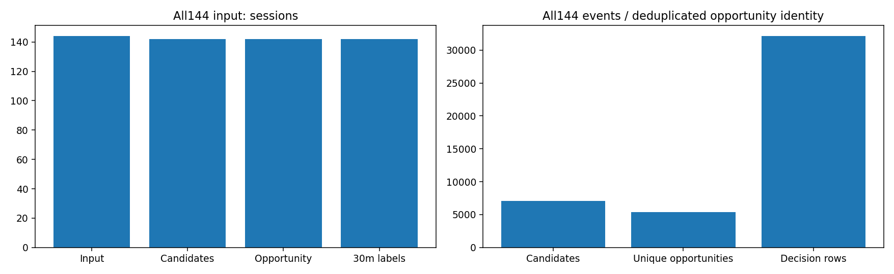

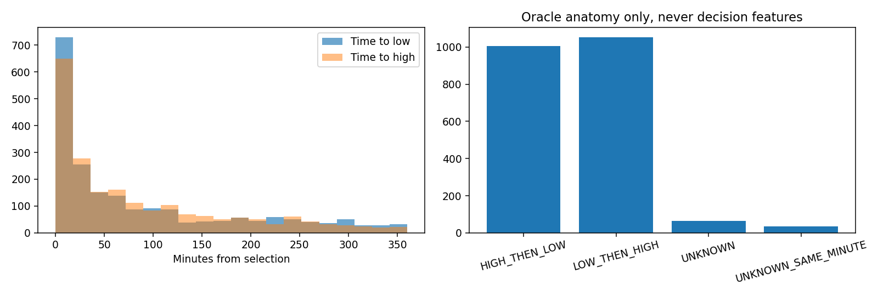

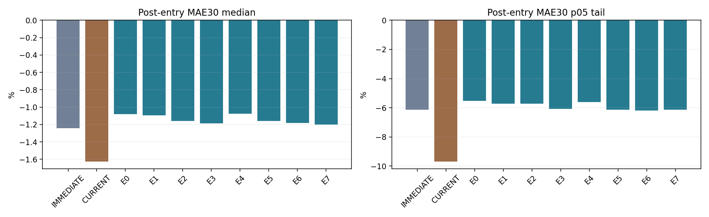

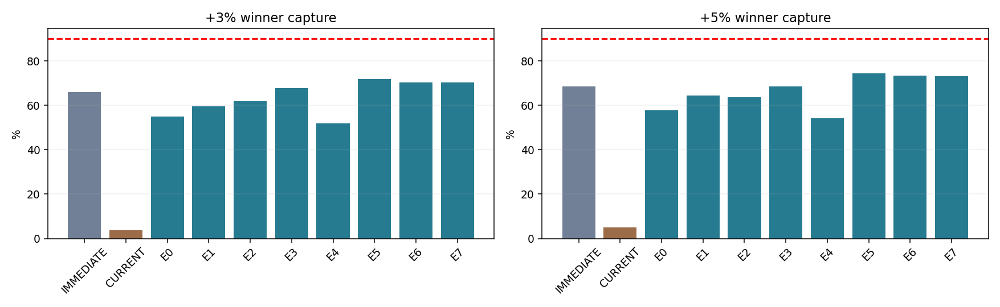

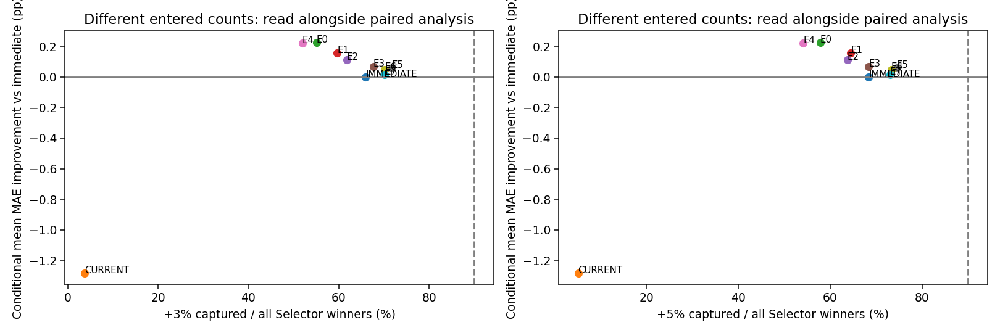

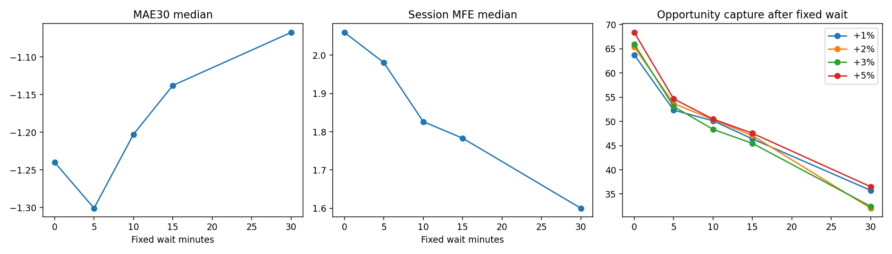

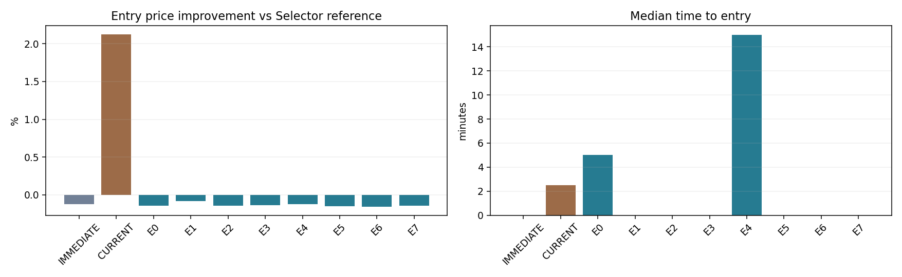

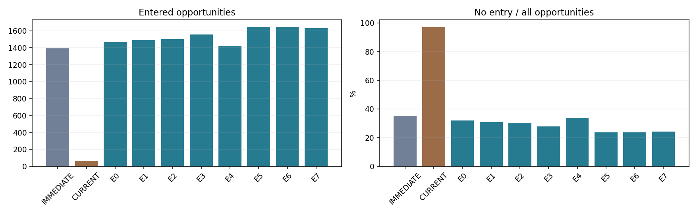

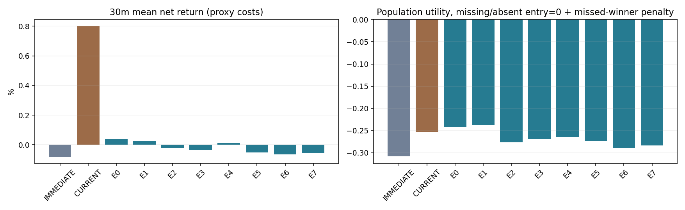

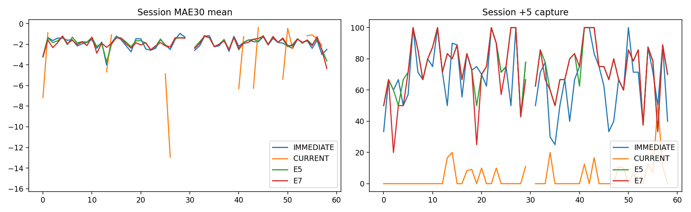

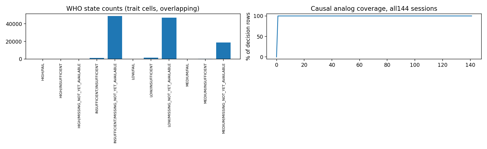

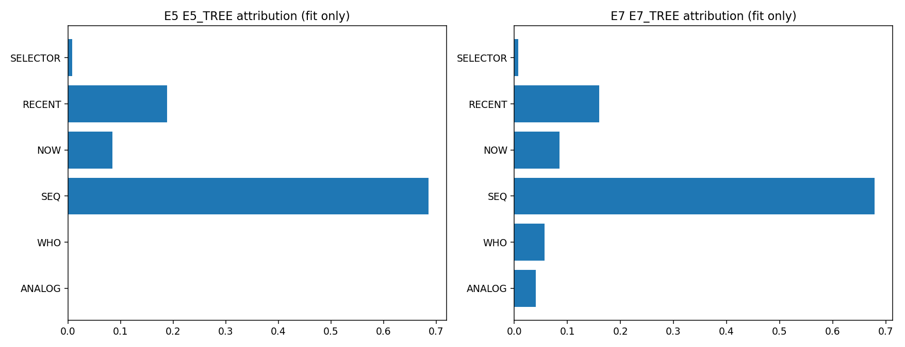

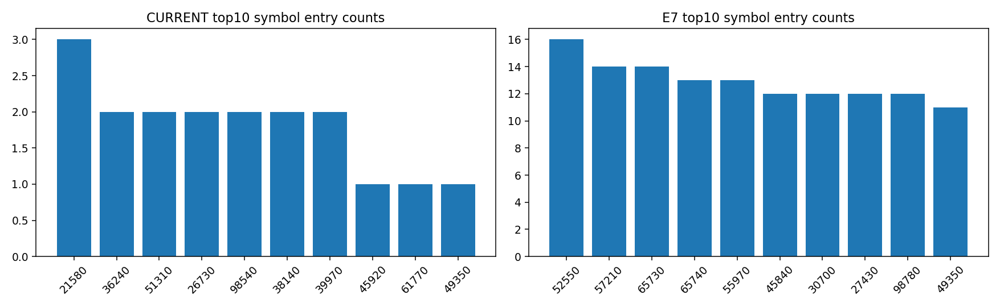

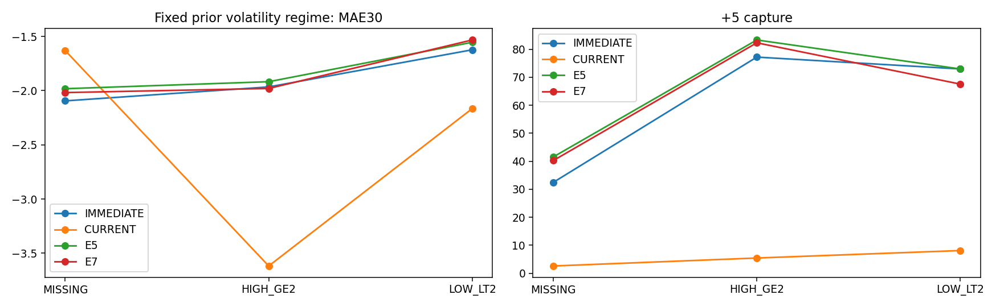

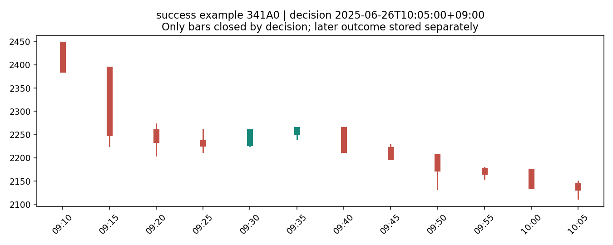

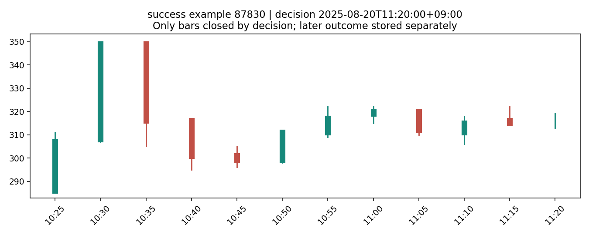

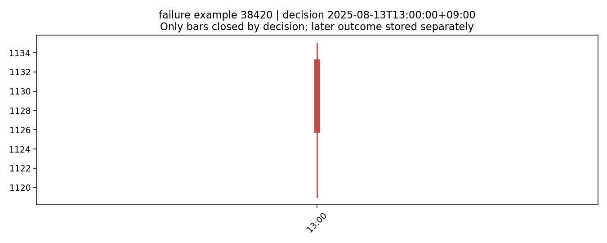

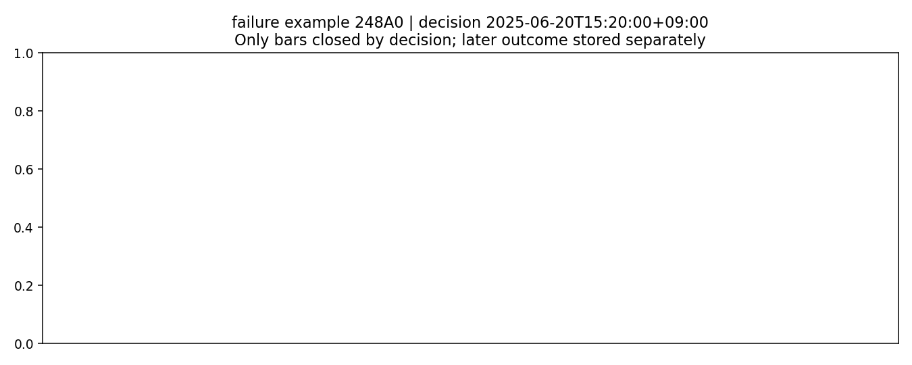

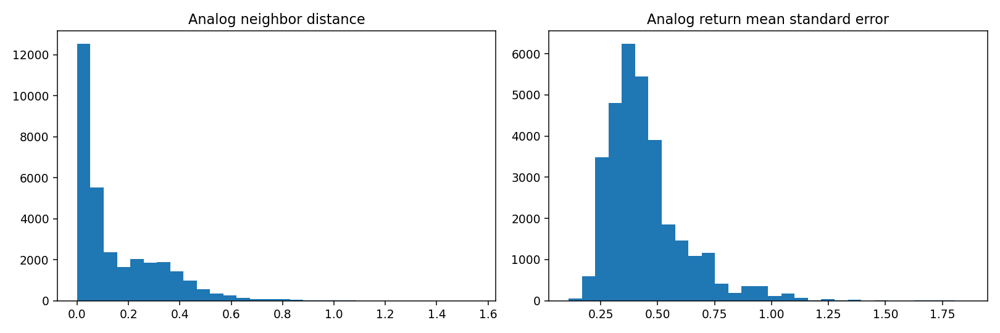

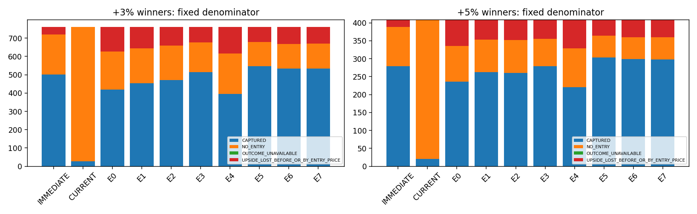

## 検証・制約

新規テスト・既存回帰PASS。substrate/measurementを各2回生成して全manifest一致。Common Holdout244と他sealed領域の追加開封0。Safety9全false。Frozen Selector、Dictionary Gate、Current Entry、Capital Allocation、EXITは不変。

上流制約: Frozen L0は既存の同日Daily validity/corporate-action/adjustment metadata利用を継承。追加入力・Analog・fit/evalの因果性監査と、上流全体の独立PIT認証を混同しない。

[CI](https://github.com/Iam-2squared/ark-terminal/actions/runs/35499090053)。PR #587 Draft・未merge。STOP、NEW EXIT・自動昇格・売買へ進まない。
