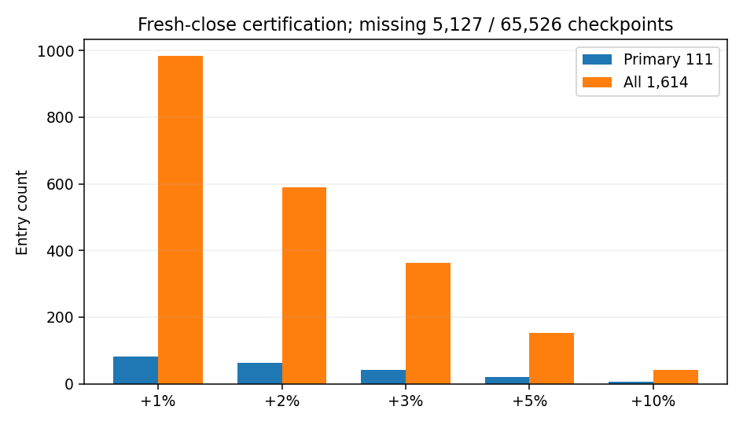
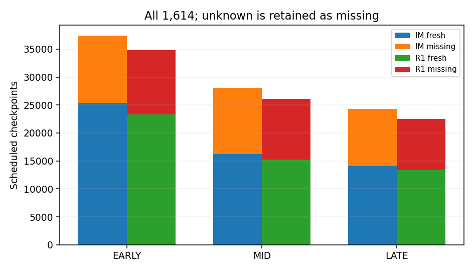
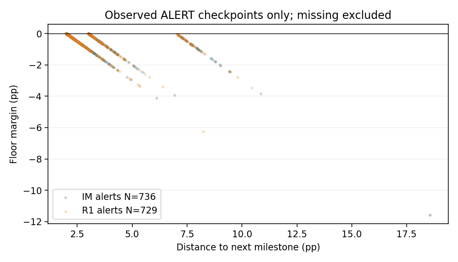
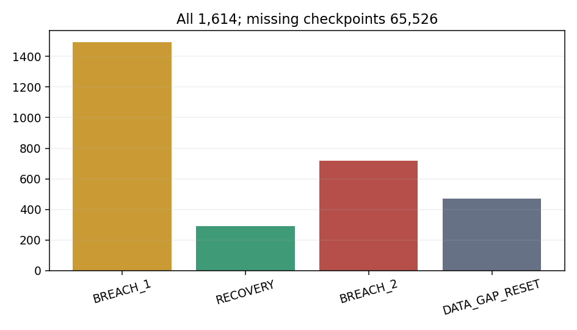
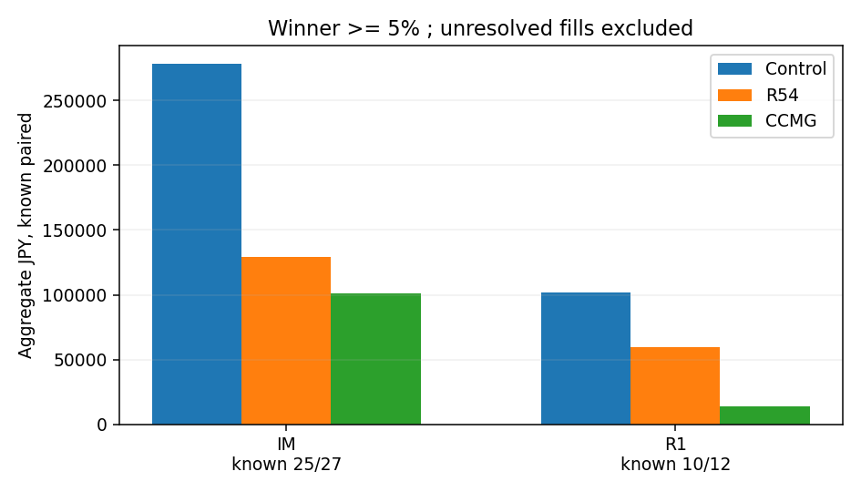
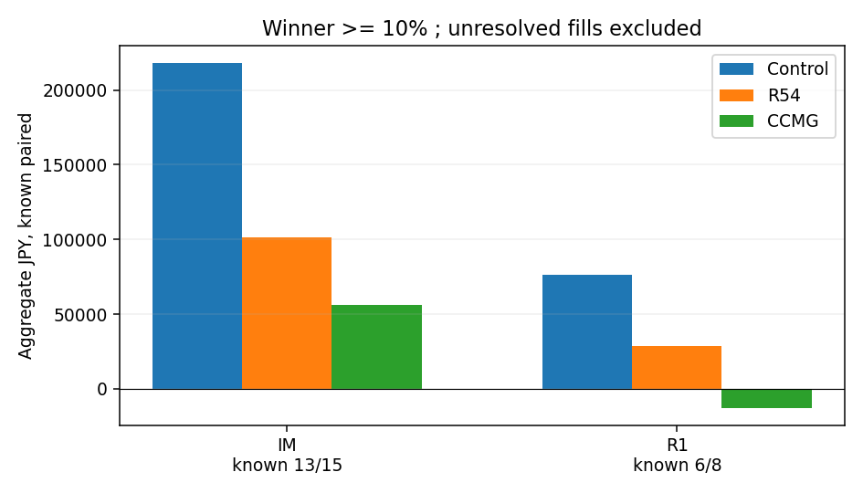
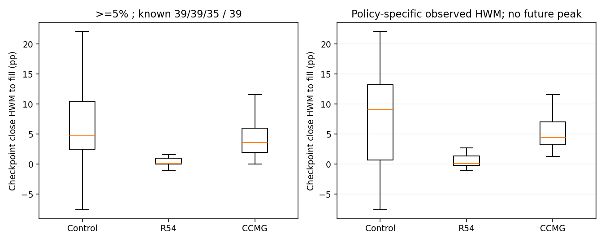
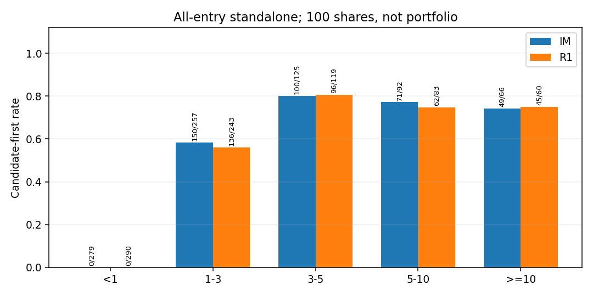
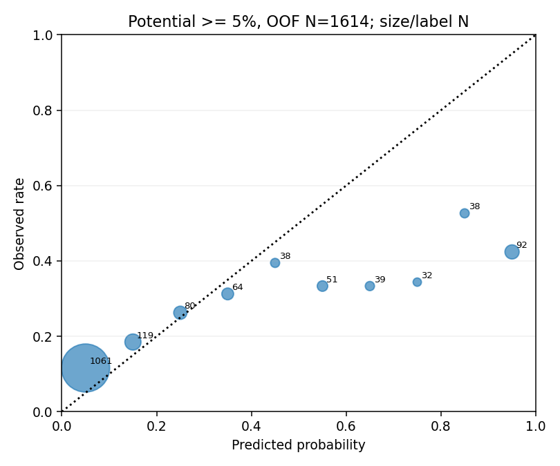
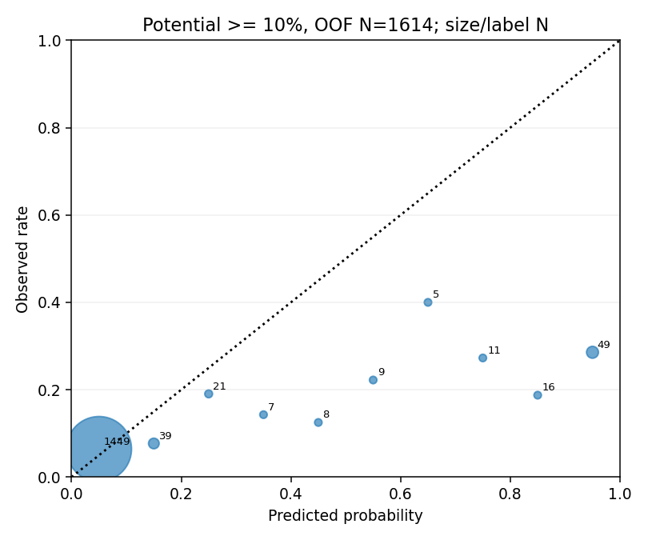

# Ark Terminal Phase57 — Checkpoint-Certified Milestone Guard EXIT

## 🧭 Current Status

2026-09-29 JST。別cycleの固定仕様 `CCMG_GUARD_V1` をDevelopmentだけで実行した。Readinessと独立監査はPASSしたが、Primary Winner Preservation Hard Gateは4 cohortすべてでFAILした。**selectedDevelopment=null、productionReady=false、Capital Replayは0件**。前cycleの`GUARD_FEASIBILITY_UNMEASURABLE`を覆した結果ではない。今回のmilestoneはbar Highでなく、fresh scheduled checkpointの**確定Close**でのみ認定した。

|項目|結果|
|---|---:|
|事前仕様SHA-256|`679cbe81bdaf483c7c68dbd290a520cdb6289ea1573519816e421b4c563cd079`|
|候補|CCMG_GUARD_V1のみ|
|EXIT estimator fits|0|
|Potential estimator fits|6 / 上限10|
|Integrated Replay|0 / 上限16|
|Provider取得 / 制限partition開封 / orders / main merge|0 / 0 / 0 / 0|

## 🔒 Source / Safety

Selector、二つのfrozen Entry arm、Capital V3、Control `R50_A_LIFECYCLE`を固定。R45・R54・R34・raw path・checkpoint実装は保存済みSHAで検証した。PR [#587](https://github.com/Iam-2squared/ark-terminal/pull/587) はDraftのまま。nine safety flagsはすべて`false`。履歴データのbar-end proxyは実時間のprovider配信時刻を証明しない。

## ⏱ Checkpoint Readiness

R1–R6は全PASS。dry traceを同じ入力で2回実行し、173,174行がbyte一致した。欠測checkpointは直前Closeを再利用せず、連続breachをリセットした。

|Universe|Entry|Scheduled|Fresh|Missing|ALERT|Recovery|Candidate-first|
|---|---:|---:|---:|---:|---:|---:|---:|
|Primary IM|79|11,705|8,493|3,212|84|15|49|
|Primary R1|32|4,684|2,769|1,915|64|17|23|
|Primary total|111|16,389|11,262|5,127|148|32|72|
|All-entry total|1,614|173,174|107,648|65,526|—|—|709|

## 📈 Certified Milestones

|Universe|+1%|+2%|+3%|+5%|+10%|
|---|---:|---:|---:|---:|---:|
|Primary 111|82|63|43|20|7|
|All-entry 1,614|983|589|362|152|41|

## 🛡 Guard Behavior

実装した床は到達+1/+2/+3/+5/+10%に対し0/+1/+2/+3/+5%。2つの**隣接予定checkpoint**でfresh Closeが床未満になったときSELL_INTENTとなる。欠測は継続回数を切り、Controlが先ならControlを優先した。same checkpointは別分類。重点テスト30/30 PASS、Guard EXIT fits=0。

|All-entry事象|件数|
|---|---:|
|2-checkpoint SELL event|719|
|Candidate-first Entry|709|
|Gapによるbreach reset|472|

## 🏆 Winner Preservation — Hard FAIL

同一のarchived R50 funded Entry・数量をR34 exact paired sourceで比較した。表は既知pairedのみの表示値を小数第2位に丸めたもの。Gateは`LAYER_A_RESULT.json`に保存したexact Decimalで判定した。未約定は0へ補完していない。

|Cohort|既知/対象|Control 平均¥|CCMG 平均¥|Control 合計¥|CCMG 合計¥|exact差分¥|
|---|---:|---:|---:|---:|---:|---:|
|IM >=5|25/27|11,127.12|4,042.49|278,177.97|101,062.14|−177,115.83|
|IM >=10|13/15|16,766.12|4,327.45|217,959.52|56,256.82|−161,702.69|
|R1 >=5|10/12|10,163.62|1,413.55|101,636.21|14,135.52|−87,500.69|
|R1 >=10|6/8|12,674.11|−2,158.21|76,044.69|−12,949.25|−88,993.94|

同一Control fillへ委譲された行は保存済みControlのexact PnLを引き継いだ。新しいcandidate-first fillのみR34新規EXIT費用式を適用した。R34 archiveのControl ledgerと新規EXITには手数料基準の微差があるため、同じfillの差分を人工的に作らないための対応である。

## 📉 Loser Non-Degradation

|Arm / 最終Upside|既知/対象|既知paired差分¥|判定|
|---|---:|---:|---|
|IM <1|20/20|0.00|PASS|
|IM 1–3|13/15|+23,403.91|LOSER_UNMEASURABLE|
|IM 3–5|12/17|+67,584.34|LOSER_UNMEASURABLE|
|R1 <1|5/6|0.00|PASS（既知paired）|
|R1 1–3|5/8|+12,999.41|PASS（既知paired）|
|R1 3–5|1/6|+9,399.08|INCONCLUSIVE_SMALL_N|

IMでは未約定があり、全対象の合計を証明できない。既知pairedのプラスを全体PASSと読み替えない。

## 📊 Checkpoint Giveback / Retention

HWMは**EXITまで保有したfresh checkpoint Closeの最大値**。将来Highやexit後のpeakを使わない。異なる保有期間のHWMを直接「真のpeak捕捉」とは解釈しない。

|Primary Winner|対象|CCMG fill既知|CCMG median giveback pp|Control median pp|R54 median pp|
|---|---:|---:|---:|---:|---:|
|>=5|39|35|3.637|4.720|0.124|
|>=10|23|19|4.448|9.104|0.124|

|確定milestone|CCMG floor|CCMG retention|Control retention|CCMG null|
|---|---:|---:|---:|---:|
|+1|0%|42/63 = 66.7%|50/82 = 61.0%|19|
|+2|+1%|28/49 = 57.1%|34/63 = 54.0%|14|
|+3|+2%|16/35 = 45.7%|22/43 = 51.2%|8|
|+5|+3%|8/20 = 40.0%|8/20 = 40.0%|0|
|+10|+5%|2/7 = 28.6%|4/7 = 57.1%|0|

床はCloseで判定する意図であり、約定価格の保証ではない。間の急変やnext-open差で床未満のfillが生じた。retentionはこのcycleの診断値であり、Hard selectionはpaired Winner経済性が優先。

## 🌐 All-entry standalone

100-share単位の診断でありPortfolio PnLではない。下表の差分は既知pairedを同一R34 SELL費用式で計算した。R54の既存standalone表示はentry-side費用式なので、この表のControl比較とは混ぜない。

|Arm / Upside|Entry|既知paired|Candidate-first|CCMG−Control ¥|
|---|---:|---:|---:|---:|
|IM <1|279|274|0|0.00|
|IM 1–3|257|214|150|+144,843.16|
|IM 3–5|125|97|100|+113,461.39|
|IM 5–10|92|82|71|−78,881.39|
|IM >=10|66|61|49|−542,212.34|
|R1 <1|290|286|0|0.00|
|R1 1–3|243|202|136|+173,419.16|
|R1 3–5|119|86|96|+20,993.28|
|R1 5–10|83|78|62|+1,793.09|
|R1 >=10|60|54|45|−362,057.34|

>=5と>=10の両arm合算方向がマイナスで、事前固定の`ALL_ENTRY_WINNER_CONTRADICTION`にも該当する。各bucketのnull NとInitial/Replacementは機械可読Evidenceに残した。

## 🔮 Entry Potential — Skill FAIL / Runtime Authority 0

既存artifactに欠けていた566列のfrozen `features.npy`を保存済み入力から**期待SHAまでbyte一致**で再生成した。既存Development 3,848件はすべてEntry前の一意なfeature行へ対応し、固定24 sessionの1,614件のteacherはR54既存canonical labelと1e−12以内で一致した。元の5 temporal fold中、固定評価期間と交差する3 foldで2 head合計6 fitを実施した。

|Head|陽性/全件|AUC [session CI]|PR-AUC|Brier / 基準|LogLoss / 基準|結果|
|---|---:|---:|---:|---:|---:|---|
|>=5|301/1,614|0.720 [0.676, 0.761]|0.356|0.1703 / 0.1520|0.7154 / 0.4822|FAIL|
|>=10|126/1,614|0.693 [0.633, 0.752]|0.176|0.0942 / 0.0724|0.6642 / 0.2776|FAIL|

AUCは方向性を示したが、両headとも事前固定のBrierとLogLoss比較を満たさなかった。再fitすると最大10 fit予算を超えるためフルOOF再fit再現は実施せず、保存済みOOFのhash・Entry ID・fold・ラベルを独立監査した。PotentialにHOLD veto、SELL、Guard override、Capital sizing、candidate rankingの権限はない。

## 💴 Capital

Primary Winner Hard GateがFAILしたため、固定Capitalのintegrated Replayを実行していない。下表のfundedとreplacementは**archived ControlのPrimary scope**だけを示し、CCMGのPortfolio成績ではない。

|Arm|archived funded|archived replacement|CCMG cash idle / utilization / cash lock|Final Equity / MaxDD|
|---|---:|---:|---|---|
|IM|79|7|未測定|未測定|
|R1|32|2|未測定|未測定|

## 🧪 Stress

0.20pp fee stressはHard Gate不通過のため未実行。Replay 0件を0円の損益と扱わない。

## 🎯 Month 2x

24/24 certified EOD、Final Equity、daily return、¥2M gapは未測定。North Star statusは`ARK_MONTH_2X_UNMEASURABLE`。

## 🔁 Reproducibility / Independent Audit

Focused tests 30/30 PASS。専用GitHub Actions [run 36454683040](https://github.com/Iam-2squared/ark-terminal/actions/runs/36454683040) のfocused-contract jobもSUCCESS。dry trace 2回byte一致。Layer Aのevent/fill/PnL JSONとentry rowsも2回目にSHA一致。別scriptが173,174 checkpointの床・2cp・gap、111 Primary EntryのR34 source identity、4 Winner cohort exact差分、PotentialのOOF ID・fit budgetを検算して`PASS`。

## ✅ Final

|項目|確定|
|---|---|
|Readiness|PASS|
|Winner gate|WINNER_PRESERVATION_FAIL|
|Loser gate|LOSER_UNMEASURABLE|
|All-entry|ALL_ENTRY_WINNER_CONTRADICTION|
|Potential >=5 / >=10|SKILL_FAIL / SKILL_FAIL|
|Capital / stress / Month 2x|SKIPPED_HARD_GATE / SKIPPED_HARD_GATE / UNMEASURABLE|
|Independent audit|PASS|
|selectedDevelopment / productionReady|null / false|

**境界**：この固定checkpoint-Close認定、1段下floor、2cp確認、現在のupstreamとDevelopmentで、Winner Preservationを達成できなかった。結果を見て床、ladder、confirmation、別candidateを調整せず正式Closeする。次研究は新Precommitが必要。
