# NEW LONG Entry — Extended Outcome / Capture Measurement

既存decision固定の追加評価。モデル学習・推論・BUY/WAIT再実行は0。Immediate / Current / E5を図09で強調。全10方式を同じ評価Opportunity 2,155件から比較。

Hit Rate = 各方式の全BUYを分母、horizon内に実データで到達確認できた件数を分子。censored/unavailableで未確認のcaseはunknownで、未到達と断定しない。表示率は観測下限、上限・complete-only率・分子分母をdenominators.jsonに保存。部分観測で確認できたhitは含める。

Capture = 既存と完全に同じsession-end Selector winner固定分母。Entry後session-end MFEで捕捉判定。30m/60m Captureへ定義を変更していないため両表のCapture列は同じ。未Entry・不明は捕捉成功にしない。

30m/60mは壁時計時間。昼休みをまたがず、前場/日中session末尾で打切り。完全観測は既存のstrict 5m source slot＋endpoint契約を継承し、毎1分の約定存在を意味しない。無約定分足は補間しない。終端11:30/15:00/15:30の実auctionは既存契約どおり。

Entry priceは保存値（実1m Open＋5bps）。MFE/MAEはEntryを0とし上昇/下落がなければ0。Returnは終端の実Closeにexit-reference 5bpsを控除。給付戻しgivebackはMFE−net return（percentage points）。価格・時間proxyの研究値で、実約定認証ではない。

**MaxDDはMAEと別**。Entry価格から開始するrunning peakに対し、前の足のpeak→今のLow、今のOpen→Low、High→Closeという順序が確認できる下落を主表に表示。同じ1m内のHigh→Lowの順序は不明なので、その順序を仮定した最大下落幅を別列MaxDDAdverseBoundに保存。真のtick MaxDDは両者の間。主表を正確なtick MaxDDと解釈しない。

分布はcomplete caseのみ。Hitの全BUY分母やCaptureのSelector winner分母とは異なる。CurrentはBUY60件と少なく条件付き分布だけで優劣を断定しない。これは再利用Development内の記述的評価で独立OOSではない。

## 30m（件数以外は%）

| Entry | BUY | MFE med | MAE med | MaxDD med | +1 Hit | +2 Hit | +3 Hit | +4 Hit | +5 Hit | +1 Capture | +2 Capture | +3 Capture | +4 Capture | +5 Capture |
|---|---|---|---|---|---|---|---|---|---|---|---|---|---|---|
| IMMEDIATE | 1392 | 1.120 | -1.240 | -2.154 | 51.365 | 28.161 | 15.014 | 8.980 | 5.891 | 63.770 | 65.370 | 65.966 | 69.301 | 68.382 |
| CURRENT | 60 | 2.907 | -1.626 | -3.956 | 71.667 | 53.333 | 36.667 | 28.333 | 23.333 | 2.807 | 3.036 | 3.679 | 4.596 | 5.147 |
| E0 | 1467 | 0.994 | -1.080 | -1.952 | 44.649 | 23.381 | 13.156 | 8.793 | 5.658 | 60.227 | 56.736 | 55.059 | 57.904 | 57.843 |
| E1 | 1491 | 1.055 | -1.094 | -2.033 | 46.412 | 24.681 | 14.017 | 8.719 | 5.768 | 61.965 | 59.583 | 59.658 | 62.868 | 64.461 |
| E2 | 1502 | 1.042 | -1.161 | -2.020 | 46.605 | 25.166 | 14.780 | 8.389 | 5.925 | 62.634 | 61.480 | 61.761 | 64.522 | 63.725 |
| E3 | 1555 | 1.099 | -1.186 | -2.128 | 48.617 | 26.559 | 14.598 | 8.746 | 5.338 | 68.516 | 69.165 | 67.674 | 71.507 | 68.382 |
| E4 | 1422 | 0.969 | -1.078 | -1.960 | 43.108 | 22.433 | 13.432 | 8.017 | 5.485 | 56.350 | 53.036 | 51.905 | 53.493 | 54.167 |
| E5 | 1645 | 1.092 | -1.161 | -2.115 | 48.267 | 25.775 | 14.225 | 8.389 | 5.046 | 72.660 | 73.150 | 71.748 | 76.103 | 74.510 |
| E6 | 1643 | 1.072 | -1.182 | -2.089 | 48.083 | 25.563 | 14.303 | 8.460 | 5.234 | 72.059 | 72.011 | 70.171 | 75.000 | 73.284 |
| E7 | 1630 | 1.072 | -1.200 | -2.137 | 47.301 | 25.460 | 14.417 | 8.344 | 5.337 | 70.388 | 71.442 | 70.171 | 74.816 | 73.039 |

## 60m（件数以外は%）

| Entry | BUY | MFE med | MAE med | MaxDD med | +1 Hit | +2 Hit | +3 Hit | +4 Hit | +5 Hit | +1 Capture | +2 Capture | +3 Capture | +4 Capture | +5 Capture |
|---|---|---|---|---|---|---|---|---|---|---|---|---|---|---|
| IMMEDIATE | 1392 | 1.595 | -1.715 | -3.149 | 60.057 | 36.279 | 22.270 | 15.086 | 10.632 | 63.770 | 65.370 | 65.966 | 69.301 | 68.382 |
| CURRENT | 60 | 5.325 | -2.029 | -5.159 | 75.000 | 58.333 | 48.333 | 40.000 | 33.333 | 2.807 | 3.036 | 3.679 | 4.596 | 5.147 |
| E0 | 1467 | 1.351 | -1.533 | -2.766 | 52.420 | 30.266 | 19.018 | 13.429 | 8.862 | 60.227 | 56.736 | 55.059 | 57.904 | 57.843 |
| E1 | 1491 | 1.404 | -1.604 | -2.913 | 54.661 | 31.254 | 20.121 | 13.749 | 9.390 | 61.965 | 59.583 | 59.658 | 62.868 | 64.461 |
| E2 | 1502 | 1.423 | -1.613 | -2.846 | 54.328 | 31.824 | 20.173 | 13.515 | 9.454 | 62.634 | 61.480 | 61.761 | 64.522 | 63.725 |
| E3 | 1555 | 1.533 | -1.664 | -3.004 | 57.042 | 34.277 | 20.836 | 14.019 | 9.068 | 68.516 | 69.165 | 67.674 | 71.507 | 68.382 |
| E4 | 1422 | 1.359 | -1.559 | -2.768 | 51.336 | 29.395 | 18.425 | 12.096 | 8.509 | 56.350 | 53.036 | 51.905 | 53.493 | 54.167 |
| E5 | 1645 | 1.527 | -1.643 | -3.010 | 56.900 | 34.103 | 21.033 | 14.164 | 9.240 | 72.660 | 73.150 | 71.748 | 76.103 | 74.510 |
| E6 | 1643 | 1.448 | -1.612 | -2.928 | 56.604 | 33.475 | 20.694 | 13.999 | 9.373 | 72.059 | 72.011 | 70.171 | 75.000 | 73.284 |
| E7 | 1630 | 1.504 | -1.643 | -3.022 | 55.706 | 33.620 | 20.982 | 14.110 | 9.387 | 70.388 | 71.442 | 70.171 | 74.816 | 73.039 |

## Horizon Return (%)

| Entry | 30m Mean | 30m Median | 30m Positive | 60m Mean | 60m Median | 60m Positive |
|---|---|---|---|---|---|---|
| IMMEDIATE | -0.080 | -0.100 | 45.941 | -0.104 | -0.162 | 44.896 |
| CURRENT | 0.801 | 0.651 | 59.091 | 1.385 | 0.779 | 57.576 |
| E0 | 0.038 | -0.100 | 43.288 | -0.141 | -0.100 | 44.867 |
| E1 | 0.029 | -0.100 | 45.389 | -0.035 | -0.162 | 45.499 |
| E2 | -0.023 | -0.100 | 44.521 | -0.020 | -0.100 | 45.181 |
| E3 | -0.032 | -0.100 | 45.763 | -0.092 | -0.136 | 44.542 |
| E4 | 0.012 | -0.100 | 44.487 | -0.215 | -0.231 | 43.050 |
| E5 | -0.050 | -0.100 | 45.640 | -0.099 | -0.136 | 44.962 |
| E6 | -0.063 | -0.100 | 46.349 | -0.043 | -0.100 | 45.283 |
| E7 | -0.053 | -0.100 | 46.235 | -0.045 | -0.100 | 45.819 |

## Coverage / 母集団差

| Entry | Horizon | BUY | Path available | Complete | Censored | Unavailable | Reasons |
|---|---|---|---|---|---|---|---|
| IMMEDIATE | 30 | 1392 | 1392 | 1195 | 0 | 197 | {'MISSING_REQUIRED_SOURCE_SLOT_OR_ENDPOINT': 197} |
| IMMEDIATE | 60 | 1392 | 1392 | 911 | 243 | 238 | {'LUNCH_OR_SESSION_BOUNDARY': 243, 'MISSING_REQUIRED_SOURCE_SLOT_OR_ENDPOINT': 238} |
| CURRENT | 30 | 60 | 55 | 44 | 8 | 8 | {'LUNCH_OR_SESSION_BOUNDARY': 8, 'MISSING_REQUIRED_SOURCE_SLOT_OR_ENDPOINT': 8} |
| CURRENT | 60 | 60 | 55 | 33 | 19 | 8 | {'LUNCH_OR_SESSION_BOUNDARY': 19, 'MISSING_REQUIRED_SOURCE_SLOT_OR_ENDPOINT': 8} |
| E0 | 30 | 1467 | 1467 | 1095 | 158 | 214 | {'LUNCH_OR_SESSION_BOUNDARY': 158, 'MISSING_REQUIRED_SOURCE_SLOT_OR_ENDPOINT': 214} |
| E0 | 60 | 1467 | 1467 | 789 | 442 | 236 | {'LUNCH_OR_SESSION_BOUNDARY': 442, 'MISSING_REQUIRED_SOURCE_SLOT_OR_ENDPOINT': 236} |
| E1 | 30 | 1491 | 1491 | 1117 | 145 | 229 | {'LUNCH_OR_SESSION_BOUNDARY': 145, 'MISSING_REQUIRED_SOURCE_SLOT_OR_ENDPOINT': 229} |
| E1 | 60 | 1491 | 1491 | 811 | 424 | 256 | {'LUNCH_OR_SESSION_BOUNDARY': 424, 'MISSING_REQUIRED_SOURCE_SLOT_OR_ENDPOINT': 256} |
| E2 | 30 | 1502 | 1502 | 1159 | 116 | 227 | {'LUNCH_OR_SESSION_BOUNDARY': 116, 'MISSING_REQUIRED_SOURCE_SLOT_OR_ENDPOINT': 227} |
| E2 | 60 | 1502 | 1502 | 830 | 425 | 247 | {'LUNCH_OR_SESSION_BOUNDARY': 425, 'MISSING_REQUIRED_SOURCE_SLOT_OR_ENDPOINT': 247} |
| E3 | 30 | 1555 | 1555 | 1239 | 88 | 228 | {'LUNCH_OR_SESSION_BOUNDARY': 88, 'MISSING_REQUIRED_SOURCE_SLOT_OR_ENDPOINT': 228} |
| E3 | 60 | 1555 | 1555 | 907 | 387 | 261 | {'LUNCH_OR_SESSION_BOUNDARY': 387, 'MISSING_REQUIRED_SOURCE_SLOT_OR_ENDPOINT': 261} |
| E4 | 30 | 1422 | 1422 | 1034 | 184 | 204 | {'LUNCH_OR_SESSION_BOUNDARY': 184, 'MISSING_REQUIRED_SOURCE_SLOT_OR_ENDPOINT': 204} |
| E4 | 60 | 1422 | 1422 | 741 | 455 | 226 | {'LUNCH_OR_SESSION_BOUNDARY': 455, 'MISSING_REQUIRED_SOURCE_SLOT_OR_ENDPOINT': 226} |
| E5 | 30 | 1645 | 1645 | 1273 | 87 | 285 | {'LUNCH_OR_SESSION_BOUNDARY': 87, 'MISSING_REQUIRED_SOURCE_SLOT_OR_ENDPOINT': 285} |
| E5 | 60 | 1645 | 1645 | 923 | 400 | 322 | {'LUNCH_OR_SESSION_BOUNDARY': 400, 'MISSING_REQUIRED_SOURCE_SLOT_OR_ENDPOINT': 322} |
| E6 | 30 | 1643 | 1643 | 1260 | 102 | 281 | {'LUNCH_OR_SESSION_BOUNDARY': 102, 'MISSING_REQUIRED_SOURCE_SLOT_OR_ENDPOINT': 281} |
| E6 | 60 | 1643 | 1643 | 901 | 425 | 317 | {'LUNCH_OR_SESSION_BOUNDARY': 425, 'MISSING_REQUIRED_SOURCE_SLOT_OR_ENDPOINT': 317} |
| E7 | 30 | 1630 | 1630 | 1235 | 124 | 271 | {'LUNCH_OR_SESSION_BOUNDARY': 124, 'MISSING_REQUIRED_SOURCE_SLOT_OR_ENDPOINT': 271} |
| E7 | 60 | 1630 | 1630 | 897 | 426 | 307 | {'LUNCH_OR_SESSION_BOUNDARY': 426, 'MISSING_REQUIRED_SOURCE_SLOT_OR_ENDPOINT': 307} |

30mと60m Return主表は母集団が異なる。図10右は両horizonでcompleteの同一BUYへ揃えた補助診断。summary.jsonに各nを保存。

## Reproduction / Safety

reproduction-audit.json: PASS。保存decision/model/score/feature/outcome manifestを入力時検証。BUY件数、全方式MAE30 count/median/mean/p05、既存+1/+2/+3/+5 Capture分子分母・率を再現。+4は同じ式の追加threshold。各BUYのraw sourceに対する30/60mとsession-end extremaの再現も監査。

計測データと全図を2回生成してmanifest照合。CIの最終tests/regression/determinismはcompletion-gate.jsonとci-receipt.jsonを参照。

Common Holdout244・他sealed開封0、Safety9全false、Frozen Selector/Entry/Dictionary/EXIT/Capital Allocation変更なし。STOP、昇格なし。

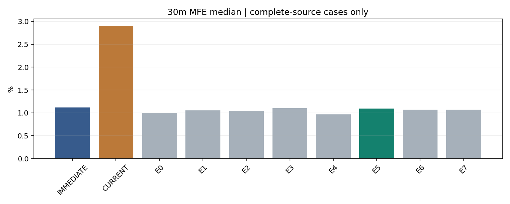

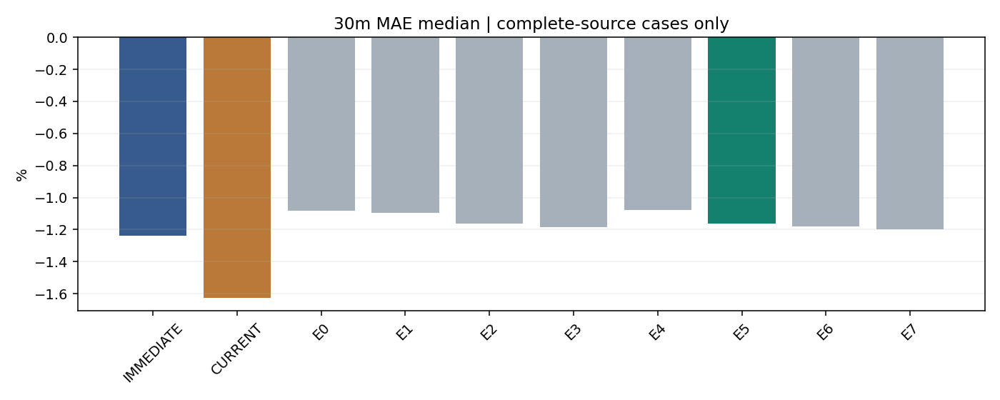

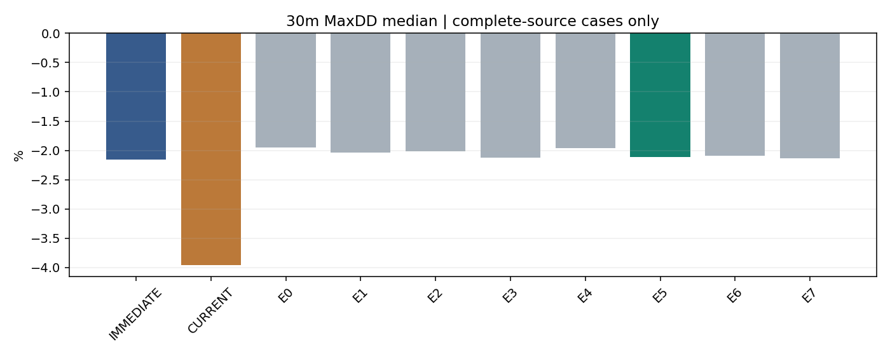

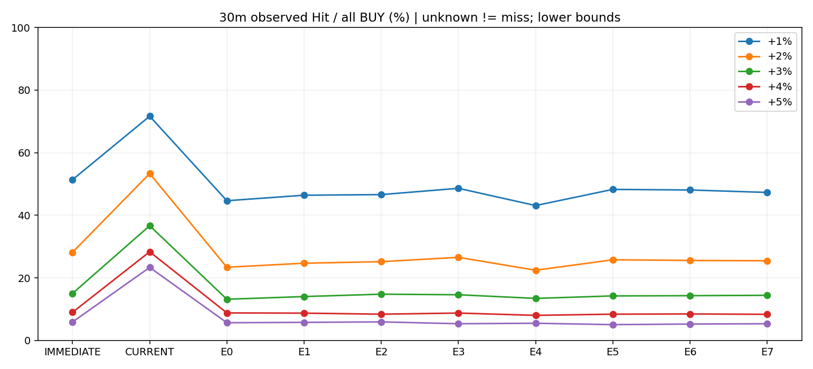

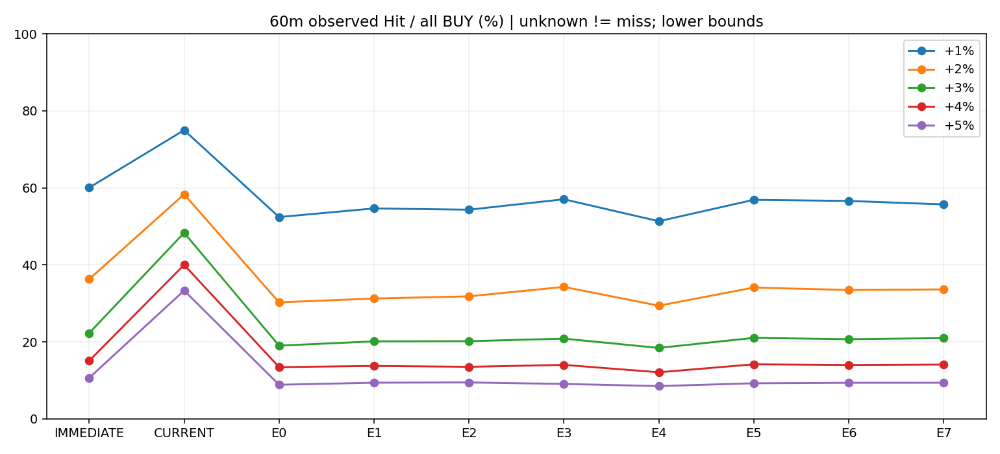

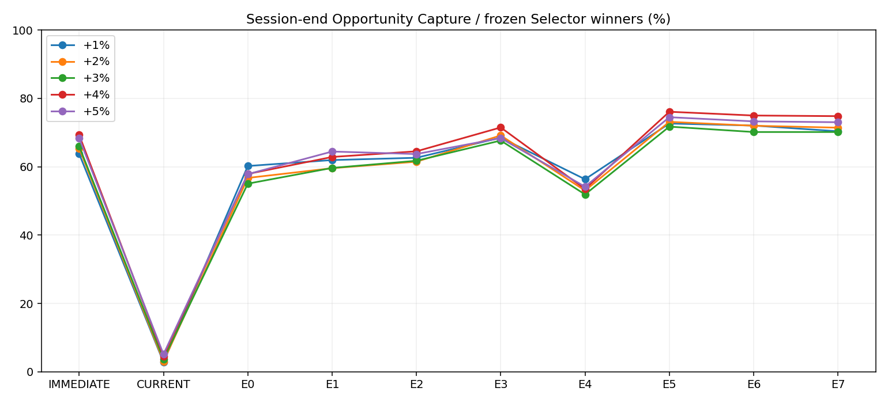

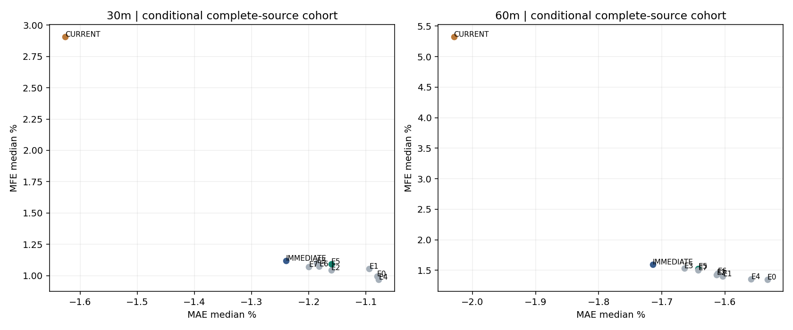

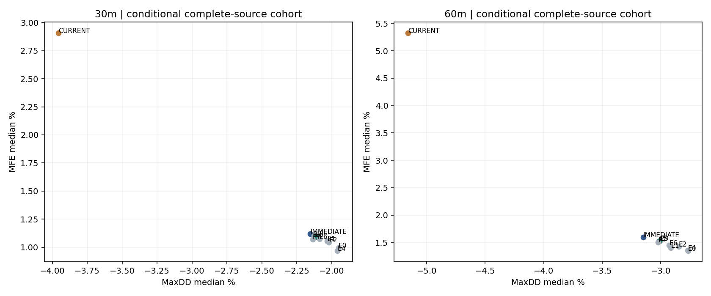

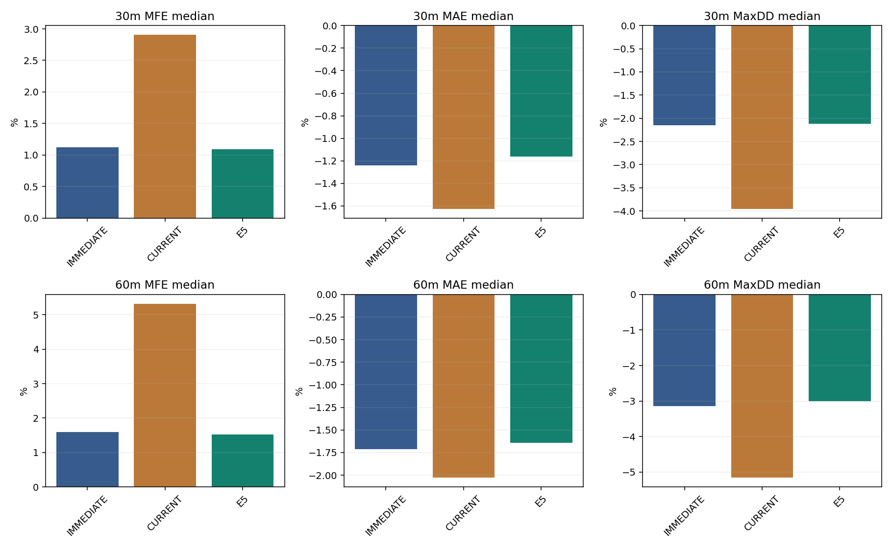

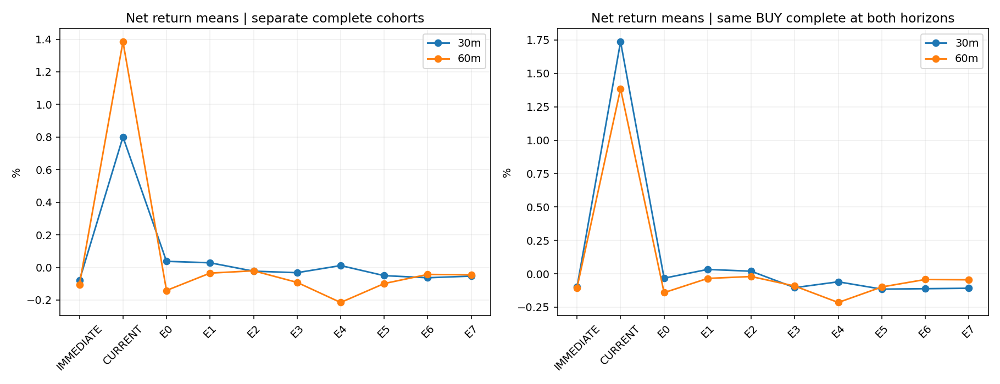

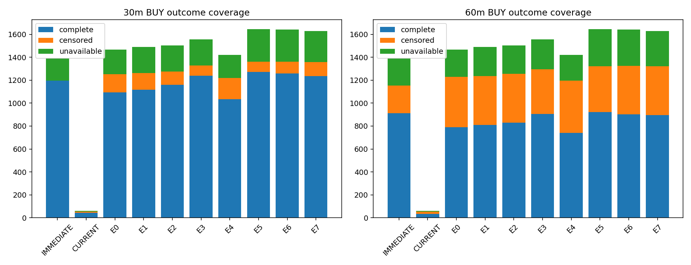

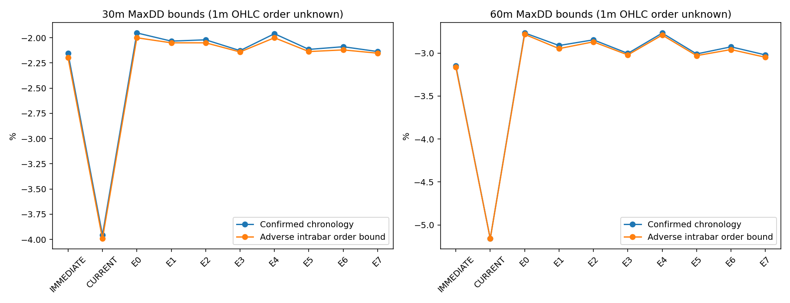

