# NEW LONG Entry Pattern v2 — Development

ENTRY_V2_DEVELOPMENT_COMPARISON_COMPLETE_NOT_PROMOTED

Primary chosen on selection dates before evaluation: **RIDGE_FULL_QUALITY_1m**. Judgment: **ENTRY_DEVELOPMENT_INCONCLUSIVE**.

144日を入力監査。既存fit55 / embargo5 / selection20 / embargo5 / evaluation59を再利用。Independent OOSではない。Frozen Selector、Dictionary、v1 decision/model/threshold/clockは不変。Dictionaryはv2入力から除外、廃棄・FAIL認定ではない。

新契約: 同一symbol×session Opportunityを30 session-active minutes監視。11:30選出は12:31以降のclosed1mで再開、昼休みは時計停止。前場11:00選出は既に30分使うため後場への監視時間は残らない。15:25以降のpre-closeへ新規注文しない。1m主評価、同一modelの5m比較。最終tickは強制BUYせずEXPIRE=0。

B0は同じquote freshness<=5m、同じgrid、同じ実1m Open+5bps、同じunfilled retry。モデルはWHOやfeature availabilityで候補を事前削除しない。MODEL_WAIT / STALE_OR_MISSING_REFERENCE / BUY_ATTEMPT_UNFILLED(reason=NO_SOURCE_TRADE) / EXPIRED(reason=SESSION_BOUNDARY or MONITOR_BUDGET)を分離。

前日full observed1mと当日open→closed-prefixを保持。fullとは保存source内の実record全体で、全minute約定存在を意味しない。欠測はmask、価格補間なし。5m observed OHLCVは実recordだけを集約し、partial5とstrict complete5を別状態にする。v1 Reader/Gateは変更せずv2 adapterで部分情報を表現。VWAPはobserved prefix値でsource completeness認証とは別。

Raw numeric入力: 前日/当日全1m OHLC・Volume・Trading Valueの固定seed24次元線形projection、直近15分のraw-normalized6channel、全日/AM/PM/late/local1/2/3/5/10/15/30/60統計、1/3/5/10/15/30分signal前path、Swing確認・価格構造・RVOL/Value変化。完全raw pathはevaluator-only archiveに置き、decision/modelへは前日全体と当日prefixだけを渡す。画像modelなし。

学習: Ridge(lambda10)と固定小型Tree(60 iterations,7 leaves,min_leaf100,l2=10)。return30/MFE30/MAE30/MaxDD30を別head、買い品質U=return30+.15*min(MFE30,10)+.3*MAE30+.2*MaxDD30−.002*active delay。全て30 active-minute horizonへ統一。別headで将来実行可能tickの実現最大UとEXPIRE=0のmaxを教師とする。これはoptimistic continuation proxyであり、Bellman最適policyを解いたと主張しない。futureは教師専用、evaluation labelsは学習・選択に使用しない。未知のfuture rewardはcontinuation教師をcensor。

Quality-onlyは予測U>=0でBUY。STOPは予測U>=max(0,予測continuation)でBUY。それ以外WAIT、期限でEXPIRE。4候補をselection20日で事前定義目的により選択し、その後evaluationを一度比較。NO_SEQUENCE/NO_PREVIOUS/NO_RECENTは固定Ridge STOP ablation。Pattern MemoryとWHO追加はPrimaryの後の別ablationへ延期し、今回のPrimaryに混ぜていない。

結果表の30/60はsession-active minutesで、v1 wall-clock値を上書きしない。B2はv1のBUY timestamp/price/Captureを完全保存し、同じ新horizonで補助比較。MFE/MAE/MaxDD/returnはcomplete source-slot caseのみ、Hitは全BUY分母の観測下限、Captureは従来session-end Selector winner固定分母。MaxDDは確認できるOHLC順序の下落で、同一足内順序のadverse boundもlabelに保存。

## Comparison

| Entry | BUY | NoEntry | MFE30 med | MAE30 med | MaxDD30 med | Return30 mean | Return60 mean | End mean | +1 Capture | +2 Capture | +3 Capture | +4 Capture | +5 Capture |
|---|---|---|---|---|---|---|---|---|---|---|---|---|---|
| B0_RETRY_1m | 1963 | 192 | 1.092 | -1.231 | -2.128 | -0.059 | -0.082 | -0.169 | 85.227 | 85.579 | 85.283 | 86.765 | 87.500 |
| B0_RETRY_5m | 1802 | 353 | 1.112 | -1.196 | -2.125 | -0.071 | -0.098 | -0.231 | 79.545 | 80.455 | 79.763 | 83.456 | 83.578 |
| B1_WAIT10_1m | 1857 | 298 | 0.946 | -1.142 | -1.995 | -0.030 | -0.137 | -0.190 | 70.922 | 70.114 | 67.543 | 68.566 | 70.588 |
| B1_WAIT10_5m | 1685 | 470 | 0.939 | -1.141 | -2.022 | -0.009 | -0.149 | -0.278 | 65.842 | 65.085 | 62.286 | 64.522 | 66.912 |
| B1_WAIT15_1m | 1807 | 348 | 0.908 | -1.119 | -1.956 | 0.028 | -0.094 | -0.207 | 66.845 | 65.939 | 62.943 | 65.257 | 65.686 |
| B1_WAIT15_5m | 1624 | 531 | 0.920 | -1.084 | -2.007 | 0.053 | -0.105 | -0.279 | 61.096 | 61.290 | 58.870 | 61.765 | 62.010 |
| B1_WAIT30_1m | 1062 | 1093 | 0.855 | -1.093 | -1.957 | -0.129 | -0.218 | -0.735 | 39.906 | 35.958 | 35.611 | 37.684 | 39.216 |
| B1_WAIT30_5m | 1062 | 1093 | 0.855 | -1.093 | -1.957 | -0.129 | -0.218 | -0.735 | 39.906 | 35.958 | 35.611 | 37.684 | 39.216 |
| B1_WAIT5_1m | 1899 | 256 | 1.001 | -1.178 | -2.041 | -0.050 | -0.154 | -0.161 | 75.201 | 75.237 | 73.193 | 74.816 | 75.980 |
| B1_WAIT5_5m | 1728 | 427 | 1.008 | -1.170 | -2.064 | -0.032 | -0.142 | -0.240 | 69.987 | 70.114 | 68.725 | 71.140 | 71.814 |
| B2_E5_V1_PRESERVED | 1645 | 510 | 1.101 | -1.212 | -2.141 | -0.074 | -0.124 | -0.243 | 72.660 | 73.150 | 71.748 | 76.103 | 74.510 |
| RIDGE_FULL_QUALITY_1m | 1020 | 1135 | 1.119 | -1.113 | -2.010 | 0.020 | -0.033 | 0.026 | 42.447 | 41.461 | 40.736 | 41.912 | 41.912 |
| RIDGE_FULL_QUALITY_5m | 784 | 1371 | 1.106 | -1.105 | -2.020 | 0.043 | -0.043 | 0.108 | 32.955 | 32.827 | 32.326 | 33.824 | 34.069 |
| RIDGE_FULL_STOP_1m | 435 | 1720 | 0.919 | -0.886 | -1.631 | 0.373 | 0.697 | 0.531 | 14.973 | 13.188 | 12.089 | 12.316 | 12.010 |
| RIDGE_FULL_STOP_5m | 266 | 1889 | 0.980 | -0.828 | -1.626 | 0.531 | 0.644 | 0.372 | 9.559 | 8.159 | 8.016 | 8.088 | 6.618 |
| RIDGE_NO_PREVIOUS_STOP_1m | 298 | 1857 | 0.589 | -0.730 | -1.210 | 0.159 | 0.397 | 0.034 | 9.158 | 6.357 | 4.731 | 4.044 | 3.676 |
| RIDGE_NO_RECENT_STOP_1m | 361 | 1794 | 0.797 | -0.791 | -1.513 | 0.419 | 0.614 | 0.903 | 12.166 | 10.057 | 9.593 | 9.743 | 9.559 |
| RIDGE_NO_SEQUENCE_STOP_1m | 415 | 1740 | 1.010 | -0.844 | -1.626 | 0.496 | 0.751 | 0.208 | 13.436 | 12.429 | 10.381 | 11.029 | 10.784 |
| TREE_FULL_QUALITY_1m | 108 | 2047 | 2.369 | -2.192 | -3.787 | 0.624 | 0.223 | -0.542 | 5.214 | 5.598 | 6.045 | 7.904 | 8.578 |
| TREE_FULL_QUALITY_5m | 84 | 2071 | 2.294 | -2.156 | -3.788 | 0.529 | 0.249 | -0.995 | 4.211 | 4.839 | 5.256 | 6.801 | 7.353 |
| TREE_FULL_STOP_1m | 12 | 2143 | 2.840 | -1.936 | -3.435 | 1.239 | -0.535 | 0.779 | 0.468 | 0.474 | 0.657 | 0.919 | 0.490 |
| TREE_FULL_STOP_5m | 7 | 2148 | 3.789 | -0.953 | -3.435 | 1.500 | -1.013 | -1.911 | 0.334 | 0.285 | 0.394 | 0.551 | 0.245 |

[Pattern good/bad anatomy・full1m coverage・cadence別retry差・noise・選択モデルattribution](diagnostics/REPORT-ja.md)

## Limitations / safety

Sparse/partial minute data cannot distinguish no trade from source acquisition gap without external completeness metadata. Exact prior session outside authorized144 remains unavailable, never backfilled. Fixed projection is a numeric representation, not proof of human-like chart understanding. Frozen upstream same-day Daily metadata limitation inherited; this study does not independently certify upstream prospective PIT. Prior Development reused and prior outcomes known; no independent OOS claim.

Weights are precommitted. weight-sensitivity.json changes the upside coefficient 0/.15/.3 only for descriptive scoring of the same selected decisions; no result-based retune. Conditional means do not establish success by themselves; read fixed-population capture, throughput, unknown outcomes and session plots. Models/targets/scores/selection lock/ablation saved.

Completion verification: focused tests, regression, dual substrate manifests and dual measurement manifests in ci-receipt.json. Holdout244 untouched, all9 Safety false, no EXIT/capital/trading/merge/promotion.

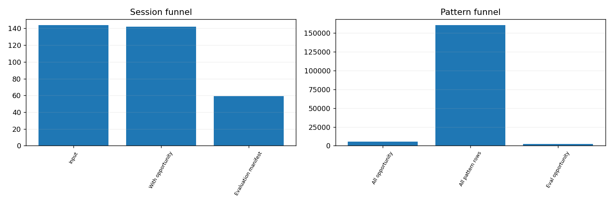

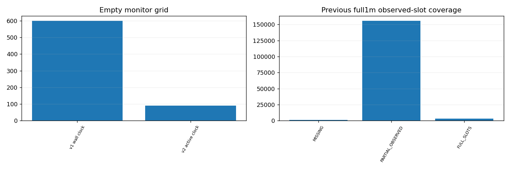

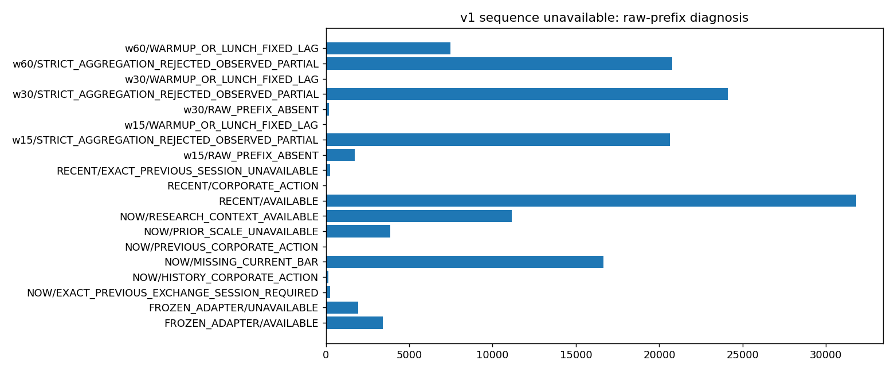

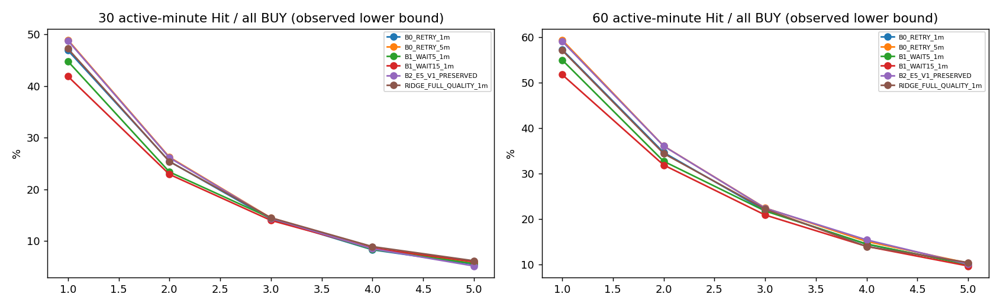

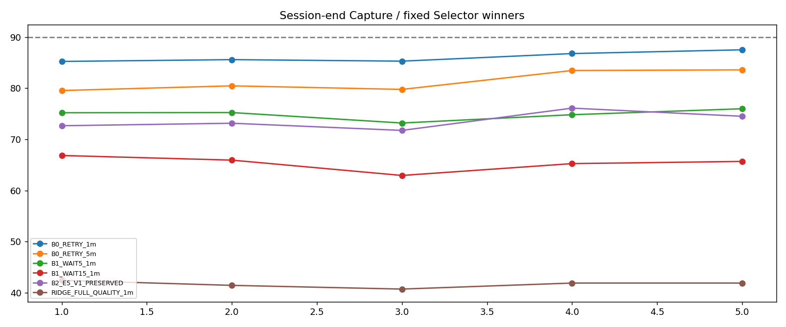

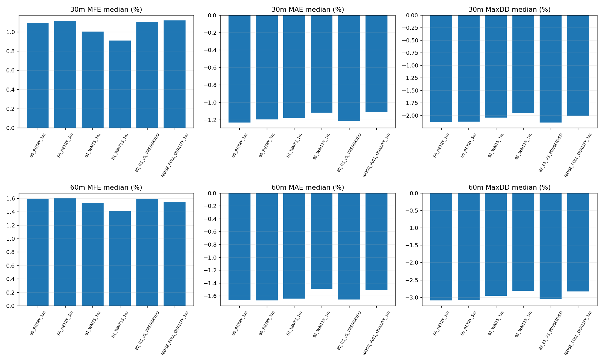

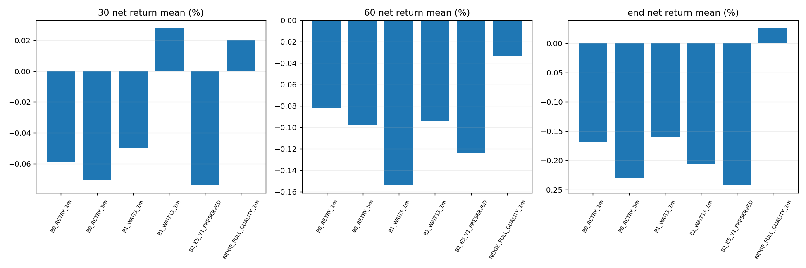

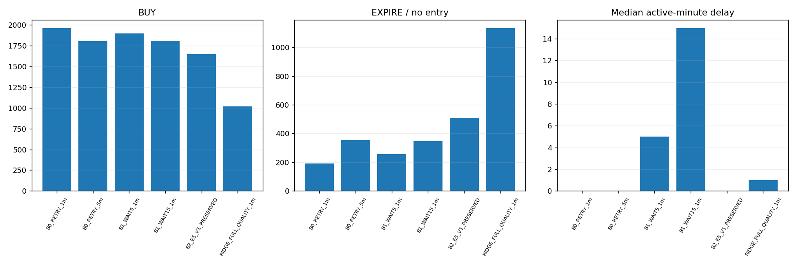

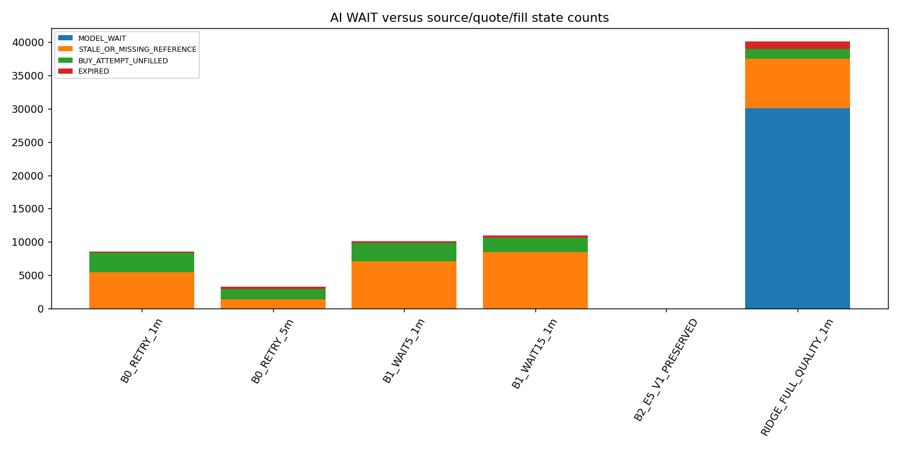

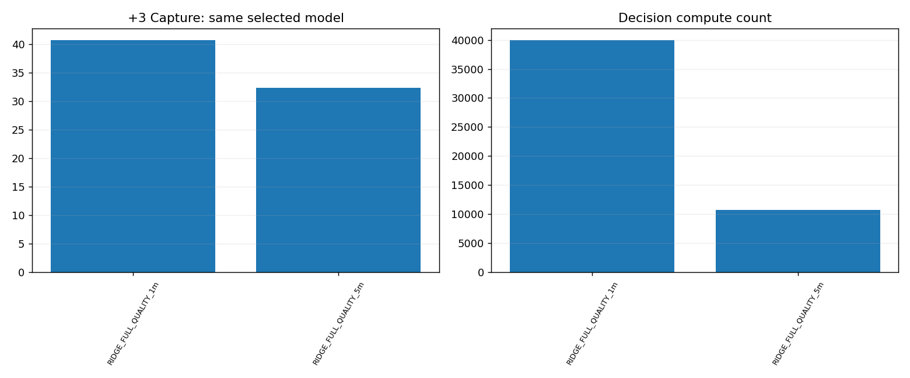

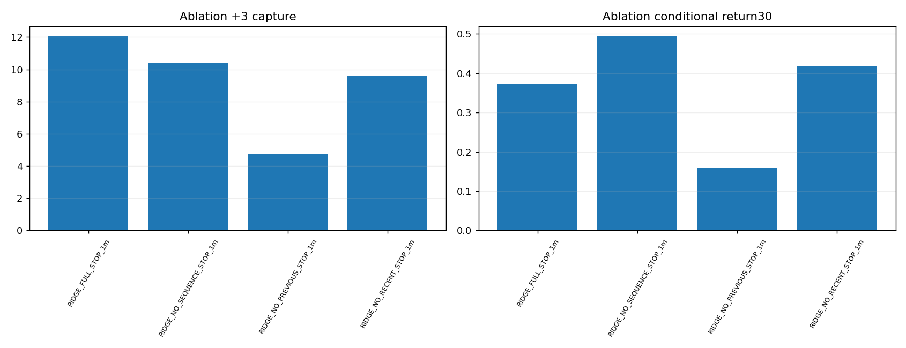

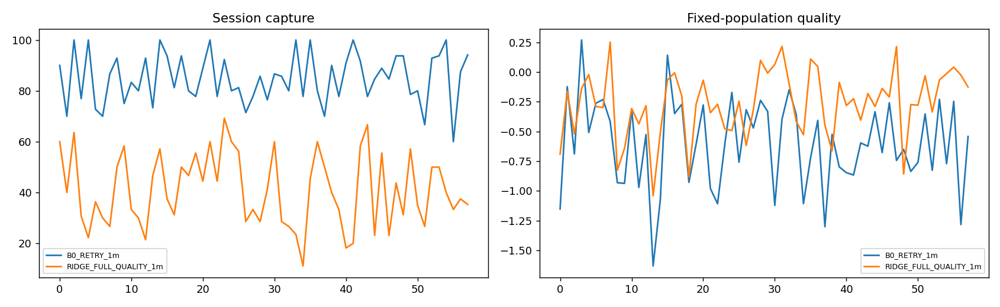

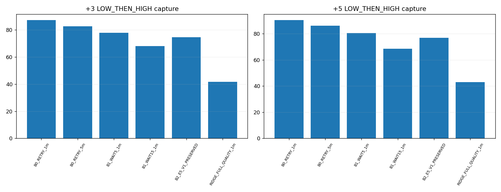

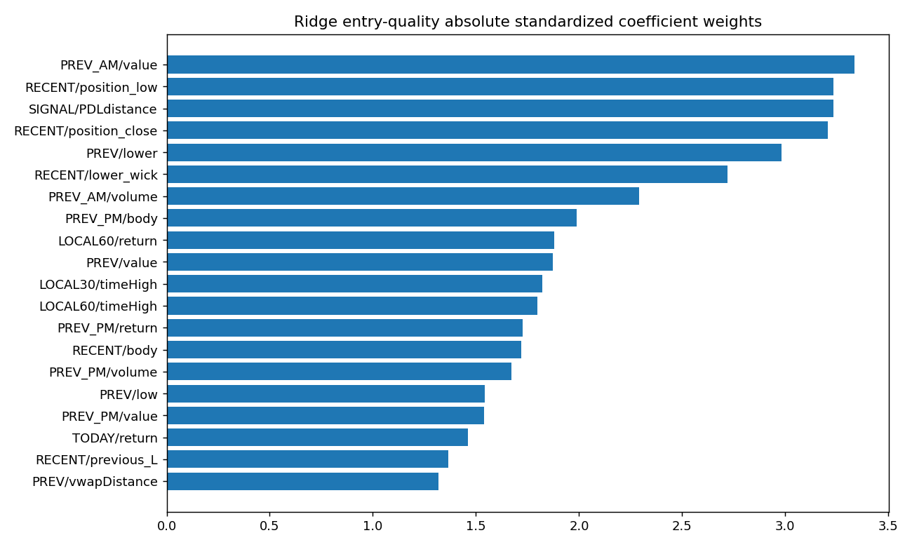

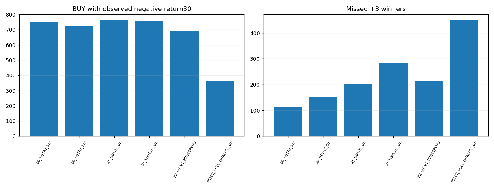

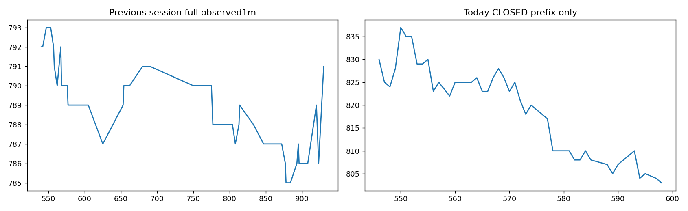

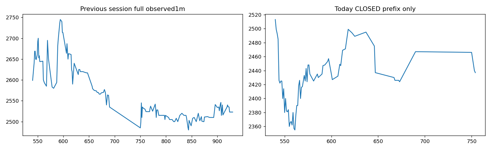

