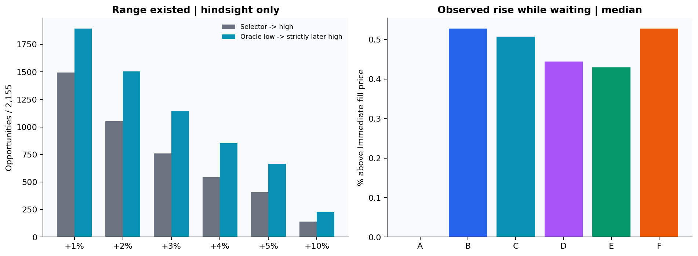
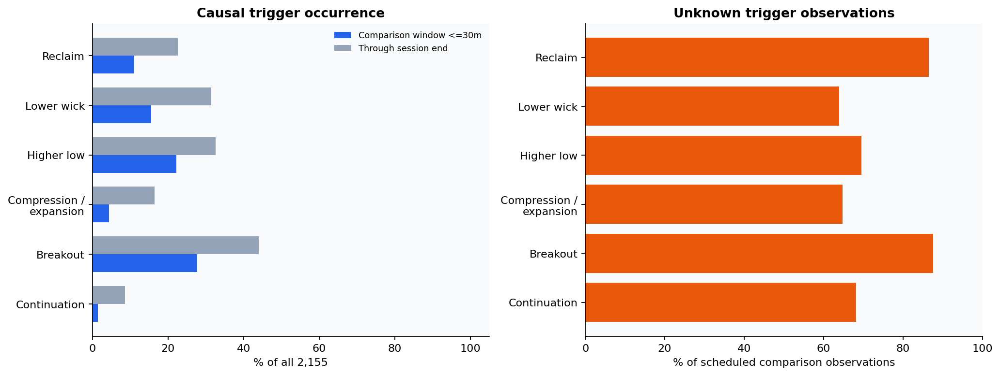
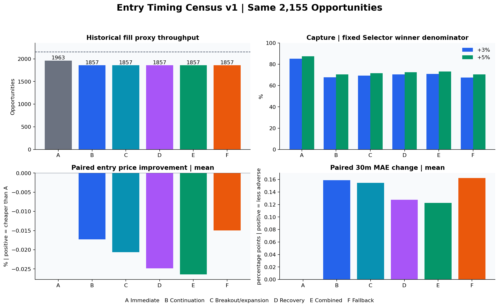
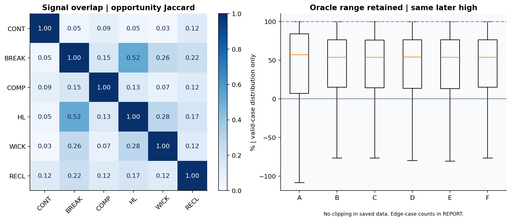

# Entry Timing Signal Census v1 — 結果

**固定2,155 OpportunityのDevelopment診断。Entry vNextの学習・採用・Freezeは行わない。**

144 Development sessionsの既存入力を再利用。評価manifestは59日、Opportunityあり58日。全日評価可能2,092件、評価不能63件。Selector→Highが+1%未満の596件と評価不能は別集計。

## 1. 値幅が存在した — oracle / hindsight

| 水準 | Selector→High | Low→strictly later High | 固定母数 |
|---|---|---|---|
| +1% | 1,496 | 1,895 | 2,155 |
| +2% | 1,054 | 1,504 | 2,155 |
| +3% | 761 | 1,143 | 2,155 |
| +4% | 544 | 854 | 2,155 |
| +5% | 408 | 666 | 2,155 |
| +10% | 141 | 229 | 2,155 |

LowとHighは異なる1m barに限定。同一bar内の順序は推定しない。これは実現利益・Entry精度ではない。

## 2. Signalを因果的に認識できた

| 系統 | 比較window発生 | 発生率% | 全日発生 | 最初delay中央値 | unknown bar率% |
|---|---|---|---|---|---|
| CONTINUATION | 31 | 1.439 | 187 | 14.000 | 68.165 |
| BREAKOUT | 598 | 27.749 | 948 | 12.000 | 87.590 |
| COMPRESSION_EXPANSION | 95 | 4.408 | 353 | 18.000 | 64.738 |
| HIGHER_LOW | 478 | 22.181 | 701 | 10.000 | 69.557 |
| LOWER_WICK | 336 | 15.592 | 677 | 11.000 | 63.950 |
| RECLAIM | 237 | 10.998 | 488 | 11.000 | 86.453 |

CONTINUATIONはState、他5系統はEventがtrigger。bar-start mはm+1に利用可能。pivot時刻へ遡らない。全日時刻と比較windowの最初の時刻を各Opportunity recordに保存。

Signal未観測は確認済み不発と観測不足を区別。以下のSignalなしにはpartial観測も含むため、完全な不発を意味しない。

| 系統 | Signal+成功 | Signal+失敗 | 未観測+成功 | 未観測+失敗 | 未来評価不能 | Signal未観測・観測不足 |
|---|---|---|---|---|---|---|
| CONTINUATION | 29 | 2 | 732 | 1,329 | 63 | 1,752 |
| BREAKOUT | 300 | 298 | 461 | 1,033 | 63 | 1,505 |
| COMPRESSION_EXPANSION | 54 | 41 | 707 | 1,290 | 63 | 1,641 |
| HIGHER_LOW | 228 | 250 | 533 | 1,081 | 63 | 1,533 |
| LOWER_WICK | 141 | 195 | 620 | 1,136 | 63 | 1,695 |
| RECLAIM | 129 | 108 | 632 | 1,223 | 63 | 1,810 |

成功/失敗は将来Selector→High +3%のanatomyラベルのみ。各行の最初5列の件数合計は2,155。最後の観測不足は重複する内訳。

## 3. その時点でEntryした場合に改善したか — 同一Opportunity paired比較

A Immediate+retry / B Continuation / C Breakout・Expansion / D Pullback・Recovery / E Combination / F 固定10 active minutes Fallback。B-FはSignalなしでもFallback。BUY意図は一度立つと失効させず共通30 active minutesまでretry。全て歴史的next observed Open+5bps約定proxy。

| 方法 | BUY intent件数 | BUY attempt回数 | fill | fill率% | retry | Fallback intent | delay中央値 |
|---|---|---|---|---|---|---|---|
| A | 2,155 | 10,360 | 1,963 | 91.090 | 8,205 | 0 | 0.000 |
| B | 2,155 | 10,222 | 1,857 | 86.172 | 8,067 | 2,147 | 10.000 |
| C | 2,155 | 10,213 | 1,857 | 86.172 | 8,058 | 1,903 | 10.000 |
| D | 2,155 | 10,215 | 1,857 | 86.172 | 8,060 | 1,711 | 10.000 |
| E | 2,155 | 10,210 | 1,857 | 86.172 | 8,055 | 1,615 | 10.000 |
| F | 2,155 | 10,222 | 1,857 | 86.172 | 8,067 | 2,155 | 10.000 |

| 方法 | +1 Capture% | +2 | +3 | +4 | +5 | paired価格改善中央値% | paired N |
|---|---|---|---|---|---|---|---|
| A | 85.227 | 85.579 | 85.283 | 86.765 | 87.500 | 0.000 | 1,963 |
| B | 70.922 | 70.114 | 67.674 | 68.566 | 70.588 | 0.000 | 1,857 |
| C | 71.324 | 70.209 | 69.251 | 69.669 | 71.569 | 0.000 | 1,857 |
| D | 72.126 | 71.822 | 70.434 | 70.772 | 72.549 | 0.000 | 1,857 |
| E | 72.393 | 71.727 | 70.959 | 71.507 | 73.284 | 0.000 | 1,857 |
| F | 70.922 | 70.114 | 67.543 | 68.566 | 70.588 | 0.000 | 1,857 |

Captureの母数は元のSelector winner集合で固定。価格改善は両方式fillのpaired subsetのみ。未約定・欠測を価格改善0と代入しない。条件付きReturn改善だけでEntry成功とはしない。

| 方法 | Both fill | Aのみ | 候補のみ | 両方なし | 平均価格改善% | session-equal平均% | session bootstrap 95% |
|---|---|---|---|---|---|---|---|
| A | 1,963 | 0 | 0 | 192 | 0.000 | 0.000 | [0.0, 0.0] |
| B | 1,857 | 106 | 0 | 192 | -0.017 | -0.019 | [-0.1083873729454443, 0.06607192041772947] |
| C | 1,857 | 106 | 0 | 192 | -0.021 | -0.021 | [-0.10630439921136788, 0.06539410781442634] |
| D | 1,857 | 106 | 0 | 192 | -0.025 | -0.025 | [-0.10305321277815763, 0.05031250504183042] |
| E | 1,857 | 106 | 0 | 192 | -0.026 | -0.026 | [-0.10637356587673388, 0.0509482288695131] |
| F | 1,857 | 106 | 0 | 192 | -0.015 | -0.017 | [-0.10593372893833257, 0.0681853556932636] |

Bootstrapは既に見たDevelopmentのsession単位記述統計。独立検証・多重比較補正済み有意性の証明ではない。

## 30 active minutes — coverageとpath

| 方法 | legacy評価N | strict全1m N | MFE med% | MAE med% | MaxDD med% | adverse bound med% | net平均% | paired MAE差pp | paired return差pp |
|---|---|---|---|---|---|---|---|---|---|
| A | 1,365 | 544 | 1.092 | -1.231 | -2.128 | -2.141 | -0.059 | 0.000 | 0.000 |
| B | 1,337 | 499 | 0.946 | -1.142 | -1.995 | -2.020 | -0.035 | 0.159 | 0.041 |
| C | 1,337 | 501 | 0.966 | -1.151 | -2.002 | -2.033 | -0.035 | 0.155 | 0.040 |
| D | 1,336 | 506 | 0.948 | -1.187 | -2.018 | -2.052 | -0.088 | 0.128 | 0.001 |
| E | 1,336 | 507 | 0.965 | -1.193 | -2.004 | -2.047 | -0.079 | 0.122 | 0.009 |
| F | 1,337 | 499 | 0.946 | -1.142 | -1.995 | -2.020 | -0.030 | 0.162 | 0.046 |

| 方法 | remaining +1 observed hit% | +2 | +3 | +4 | +5 | coverage |
|---|---|---|---|---|---|---|
| A | 46.918 | 25.420 | 14.264 | 8.304 | 5.502 | {"CENSORED": 150, "COMPLETE": 1365, "UNAVAILABLE": 448} |
| B | 43.619 | 23.156 | 13.732 | 8.778 | 5.924 | {"CENSORED": 144, "COMPLETE": 1337, "UNAVAILABLE": 376} |
| C | 43.834 | 23.640 | 14.109 | 8.778 | 5.924 | {"CENSORED": 144, "COMPLETE": 1337, "UNAVAILABLE": 376} |
| D | 43.888 | 23.586 | 14.163 | 8.778 | 5.654 | {"CENSORED": 144, "COMPLETE": 1336, "UNAVAILABLE": 377} |
| E | 44.157 | 23.425 | 14.163 | 8.778 | 5.708 | {"CENSORED": 144, "COMPLETE": 1336, "UNAVAILABLE": 377} |
| F | 43.673 | 23.209 | 13.732 | 8.778 | 5.977 | {"CENSORED": 144, "COMPLETE": 1337, "UNAVAILABLE": 376} |

legacy評価可能は既存の5分slot観測契約。strict全1m観測とは異なる。Hit率はfill母数のobserved lower bound、unknownとupper boundはmetrics.json。MaxDDは同一bar high→low順序を仮定しないconfirmed値とadverse boundを別保存。30m/60mはEntryから測るため、WAIT方式では終了時刻も遅くなる。

## 60 active minutes — coverageとpath

| 方法 | legacy評価N | strict全1m N | MFE med% | MAE med% | MaxDD med% | adverse bound med% | net平均% | paired MAE差pp | paired return差pp |
|---|---|---|---|---|---|---|---|---|---|
| A | 1,117 | 335 | 1.595 | -1.664 | -3.091 | -3.097 | -0.082 | 0.000 | 0.000 |
| B | 1,098 | 308 | 1.355 | -1.585 | -2.890 | -2.930 | -0.142 | 0.181 | -0.035 |
| C | 1,101 | 310 | 1.348 | -1.594 | -2.885 | -2.915 | -0.132 | 0.168 | -0.026 |
| D | 1,099 | 310 | 1.371 | -1.596 | -2.923 | -2.979 | -0.146 | 0.144 | -0.045 |
| E | 1,101 | 310 | 1.371 | -1.596 | -2.906 | -2.941 | -0.146 | 0.134 | -0.046 |
| F | 1,099 | 308 | 1.352 | -1.588 | -2.893 | -2.937 | -0.137 | 0.178 | -0.031 |

| 方法 | remaining +1 observed hit% | +2 | +3 | +4 | +5 | coverage |
|---|---|---|---|---|---|---|
| A | 57.310 | 34.641 | 21.854 | 14.417 | 10.036 | {"CENSORED": 308, "COMPLETE": 1117, "UNAVAILABLE": 538} |
| B | 53.258 | 31.718 | 21.163 | 14.163 | 9.585 | {"CENSORED": 290, "COMPLETE": 1098, "UNAVAILABLE": 469} |
| C | 53.366 | 31.879 | 21.540 | 14.270 | 9.532 | {"CENSORED": 290, "COMPLETE": 1101, "UNAVAILABLE": 466} |
| D | 53.743 | 32.256 | 21.756 | 14.593 | 9.585 | {"CENSORED": 290, "COMPLETE": 1099, "UNAVAILABLE": 468} |
| E | 53.958 | 32.202 | 21.809 | 14.593 | 9.532 | {"CENSORED": 290, "COMPLETE": 1101, "UNAVAILABLE": 466} |
| F | 53.258 | 31.664 | 21.109 | 14.163 | 9.585 | {"CENSORED": 290, "COMPLETE": 1099, "UNAVAILABLE": 468} |

legacy評価可能は既存の5分slot観測契約。strict全1m観測とは異なる。Hit率はfill母数のobserved lower bound、unknownとupper boundはmetrics.json。MaxDDは同一bar high→low順序を仮定しないconfirmed値とadverse boundを別保存。30m/60mはEntryから測るため、WAIT方式では終了時刻も遅くなる。

## Entry→session end / Range Retention

| 方法 | end MFE med% | end MAE med% | end +1 hits | +2 | +3 | +4 | +5 | Range Retention med% | Retention N |
|---|---|---|---|---|---|---|---|---|---|
| A | 1.880 | -1.763 | 1,309 | 937 | 668 | 481 | 373 | 57.177 | 1,920 |
| B | 1.625 | -1.687 | 1,185 | 822 | 588 | 423 | 329 | 53.778 | 1,742 |
| C | 1.611 | -1.729 | 1,188 | 822 | 599 | 429 | 333 | 53.623 | 1,747 |
| D | 1.632 | -1.695 | 1,187 | 837 | 602 | 434 | 331 | 53.986 | 1,752 |
| E | 1.619 | -1.716 | 1,192 | 835 | 605 | 438 | 334 | 53.587 | 1,757 |
| F | 1.625 | -1.687 | 1,185 | 822 | 587 | 423 | 329 | 53.862 | 1,742 |

Range Retention=100×(同じoracle later High/actual Entry−1)/(同High/oracle Low−1)。評価専用、clippingなし。Entry前のHighや同時刻Highは無効。Entryがoracle Lowより前でも独立statusで残す。別Highを使ったalternative値はrawに分離。

| 方法 | No fill | 観測不足 | 非正分母 | High≦Entry | Entry<Low | Entry≧Low |
|---|---|---|---|---|---|---|
| A | 192 | 22 | 10 | 11 | 1,499 | 421 |
| B | 298 | 13 | 5 | 97 | 997 | 745 |
| C | 298 | 13 | 5 | 92 | 1,012 | 735 |
| D | 298 | 13 | 5 | 87 | 1,036 | 716 |
| E | 298 | 13 | 5 | 82 | 1,043 | 714 |
| F | 298 | 13 | 5 | 97 | 997 | 745 |

## Direct Continuationを取り逃したか

将来anatomy定義: Selector価格から+3%到達が−0.5%押しより先。同一barならAMBIGUOUS。未来pathは当日decisionへ渡さない。

| 方法 | Direct件数 | fill | +3 Capture% | delay中央値 | paired価格改善中央値% |
|---|---|---|---|---|---|
| A | 354 | 323 | 74.859 | 0.000 | 0.000 |
| B | 354 | 308 | 48.023 | 10.000 | -1.000 |
| C | 354 | 308 | 49.718 | 10.000 | -0.922 |
| D | 354 | 308 | 50.000 | 10.000 | -0.839 |
| E | 354 | 308 | 50.282 | 10.000 | -0.829 |
| F | 354 | 308 | 47.740 | 10.000 | -0.977 |

## WAITの買値改善とupside消費

| 方法 | paired価格改善med% | WAIT最大上昇med% | WAIT最大上昇p95% | Range Retention paired平均差pp |
|---|---|---|---|---|
| A | 0.000 | 0.000 | 0.000 | 0.000 |
| B | 0.000 | 0.528 | 3.015 | 2.280 |
| C | 0.000 | 0.507 | 2.751 | 1.645 |
| D | 0.000 | 0.444 | 2.685 | 1.774 |
| E | 0.000 | 0.429 | 2.480 | 1.398 |
| F | 0.000 | 0.528 | 3.023 | 2.301 |

WAIT最大上昇はImmediate fillから実Entry直前までの観測High。欠測区間がある場合は下限的な観測値。positiveな買値改善と、失った上昇・未約定増加を同時に読む。

## Volume / Trading Value context

1/3/5/10m sums、直前同長window比、前営業日同clock slot比、compression contraction/expansion、wick confirmation比を全系統共通で保存。欠測はnull、observed count付き。Volume増加によるBUY gateはない。

| 系統 | 3m relative Value bucket | signal件数 | 評価30m N | first signal net平均% |
|---|---|---|---|---|
| CONTINUATION | LT_0.8 | 6 | 6 | -1.146 |
| CONTINUATION | 0.8_TO_1.2 | 1 | 1 | 2.948 |
| CONTINUATION | GE_1.2 | 11 | 10 | 0.382 |
| CONTINUATION | UNKNOWN | 13 | 13 | -1.529 |
| BREAKOUT | LT_0.8 | 118 | 113 | -0.456 |
| BREAKOUT | 0.8_TO_1.2 | 28 | 28 | 0.132 |
| BREAKOUT | GE_1.2 | 178 | 161 | -0.215 |
| BREAKOUT | UNKNOWN | 274 | 247 | -0.147 |
| COMPRESSION_EXPANSION | LT_0.8 | 21 | 21 | -0.582 |
| COMPRESSION_EXPANSION | 0.8_TO_1.2 | 4 | 4 | -0.680 |
| COMPRESSION_EXPANSION | GE_1.2 | 34 | 31 | 0.688 |
| COMPRESSION_EXPANSION | UNKNOWN | 36 | 32 | -0.409 |
| HIGHER_LOW | LT_0.8 | 114 | 110 | -0.192 |
| HIGHER_LOW | 0.8_TO_1.2 | 22 | 20 | 0.145 |
| HIGHER_LOW | GE_1.2 | 136 | 121 | -0.157 |
| HIGHER_LOW | UNKNOWN | 206 | 186 | -0.445 |
| LOWER_WICK | LT_0.8 | 47 | 45 | 0.357 |
| LOWER_WICK | 0.8_TO_1.2 | 20 | 17 | 0.496 |
| LOWER_WICK | GE_1.2 | 107 | 99 | -0.699 |
| LOWER_WICK | UNKNOWN | 162 | 144 | 0.337 |
| RECLAIM | LT_0.8 | 57 | 55 | -0.277 |
| RECLAIM | 0.8_TO_1.2 | 16 | 16 | -0.237 |
| RECLAIM | GE_1.2 | 73 | 62 | -0.296 |
| RECLAIM | UNKNOWN | 91 | 71 | 0.504 |

この表はSignal発生subsetの補助診断でありPrimaryではない。前日同時刻比は1日proxy、歴史的な通常量とは言わない。session/time別の全方式集計はsession-stability.json / time-stability.jsonに保存。

## 未約定・入力制約

| 方法 | terminal reasons | attempt results |
|---|---|---|
| A | {"RETRY_EXHAUSTED": 192} | {"FILLED_PROXY": 1963, "UNAVAILABLE_REFERENCE": 5452, "UNFILLED": 2945} |
| B | {"RETRY_EXHAUSTED": 298} | {"FILLED_PROXY": 1857, "UNAVAILABLE_REFERENCE": 5908, "UNFILLED": 2457, "WAIT": 21322} |
| C | {"RETRY_EXHAUSTED": 298} | {"FILLED_PROXY": 1857, "UNAVAILABLE_REFERENCE": 5908, "UNFILLED": 2448, "WAIT": 20283} |
| D | {"RETRY_EXHAUSTED": 298} | {"FILLED_PROXY": 1857, "UNAVAILABLE_REFERENCE": 5908, "UNFILLED": 2450, "WAIT": 18830} |
| E | {"RETRY_EXHAUSTED": 298} | {"FILLED_PROXY": 1857, "UNAVAILABLE_REFERENCE": 5908, "UNFILLED": 2445, "WAIT": 18295} |
| F | {"RETRY_EXHAUSTED": 298} | {"FILLED_PROXY": 1857, "UNAVAILABLE_REFERENCE": 5908, "UNFILLED": 2457, "WAIT": 21349} |

- historical knownAtを独立証明したデータではない。閉じたbar-prefixに対する因果的再構成。Frozen upstreamの同日metadata制約を継承。
- missing sourceからHALT/NO_TRADEを捏造せずMISSING_SOURCE_UNCLASSIFIEDと記録。注文・Paper・Liveは行わない。
- 全2,155件を残した。59日manifestの候補0日もsession集計に残す。全144日で再学習した結果ではない。
- Fallbackは全件のBUYを保証しない。WAIT後に価格観測がなくなる可能性をthroughputとpaired statusに明示。
- Common Holdout244未開封。Dictionary追加、Selector変更、NEW EXIT、Entry vNext学習・Freezeなし。9 safety flagsすべてfalse。

## Reproduction / files

`python -m unittest -v scripts.test_phase57_entry_timing_census`

`python -m scripts.phase57_entry_timing_census --output <new-directory>`

`python -m scripts.phase57_entry_timing_report --source <measurement-directory> --output <new-report-directory>`

protocol.json / PROTOCOL.md / protocol-lock.json は事前固定。measurement/manifest.jsonがraw全ファイルをhash固定。minute-census/*.json.gzは全時刻のEvent/State/ContextとVolume、opportunity-records.json.gzはfirst timestamps・oracle・全Opportunity、trades/pairedは失敗・Signalなし・欠測も保持。

