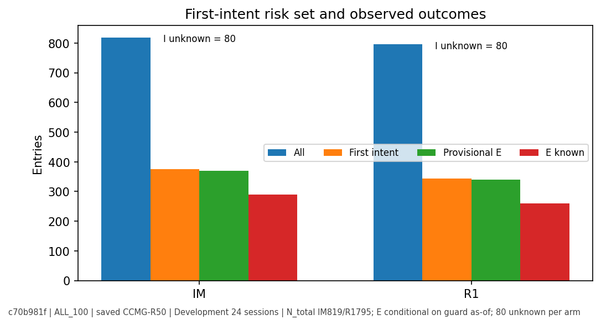
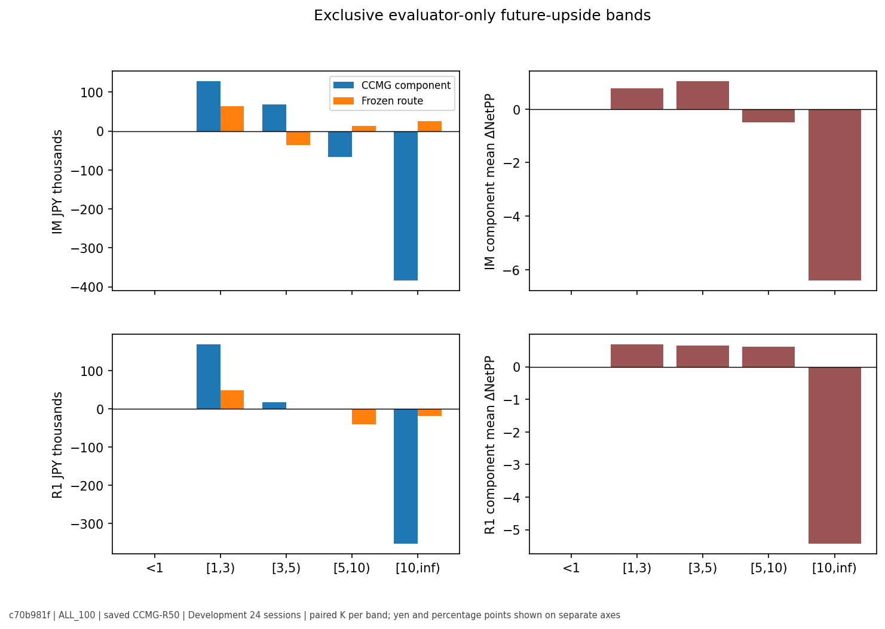
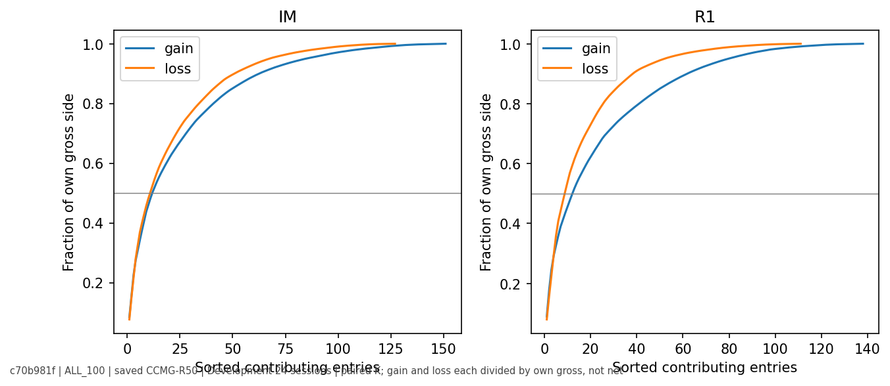
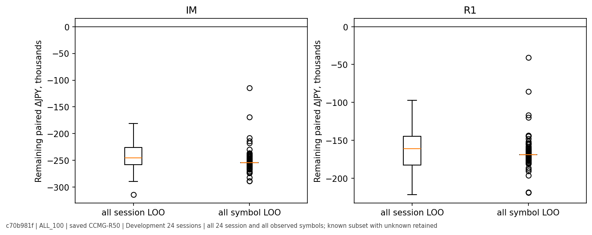
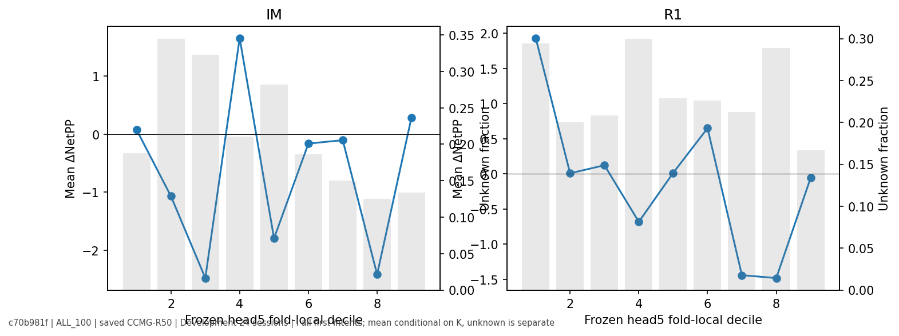
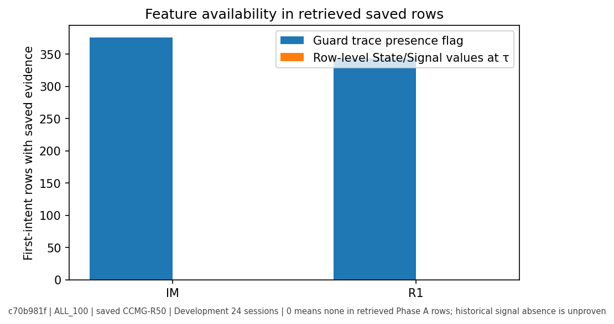
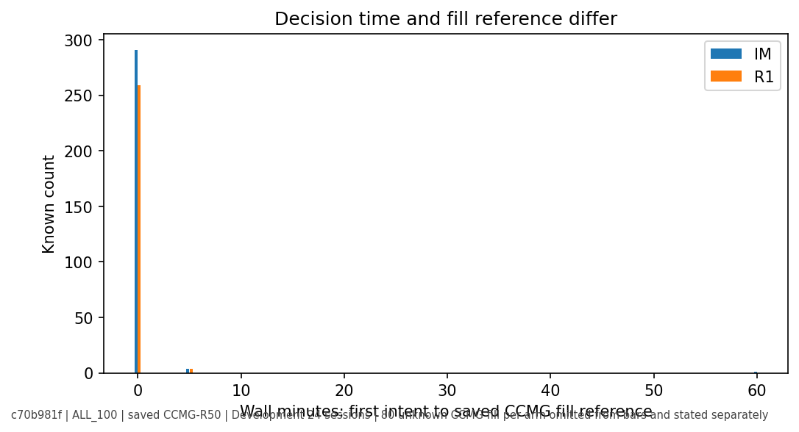

# 🧭 Phase57 Post-PRR Phase A+ 補完報告

**基準HEAD:** `c70b981fd07128dfd9b18893b4aca3a387d17e3b`。PR #587は開始時Open／Draft／未merge。前回Phase Aは変更していない。今回は繰返し閲覧済みDevelopment 24 sessionの保存行だけを再集計した。新fit、新policy Replay、provider取得、保護partition開封、外部LLM、発注、main mergeはいずれも0。

**判定:** 保存行からの補完計算はPASS。初回intent時点のState／Signal値、τの参照価格、post-intent path、stage-2 nested lineage、案Bの完全な枝対応は原本不足・未証明。案Bは不足原本と契約を詰める**設計検討のみ**。実験開始、候補選定、production投入は未承認。

## 🚨 I／E／Kと未知80件

| ALL_100 | 全Entry | I:初回intent | E:暫定選択余地 | K:両outcome既知 | I∩K | E∩K | I内未知 | 同時刻 | R50先行 |
|---|---:|---:|---:|---:|---:|---:|---:|---:|---:|
| IM | 819 | 376 | 370 | 728 | 296 | 290 | 80 | 6 | 0 |
| R1 | 795 | 343 | 339 | 706 | 263 | 259 | 80 | 4 | 0 |

Eは「CCMG初回intentがR50 decisionより早く、既存guardのas-ofフラグが真」という**暫定**分類。R50 pendingやhidden stateの完全一致は証明できていない。Kは事後のラベル観測maskであり、eligibilityではない。I\KとR50のみ既知の各80 IDは行集合で完全一致し、両側のset differenceは空。別にno-intentで両outcome未知がIM 11、R1 9。I内の既知ΔはIMで負127／ゼロ18／正151、R1で負111／ゼロ14／正138。no-intent内で既知のΔは全て0（IM432、R1443）。[INTENT_CENSUS.json](INTENT_CENSUS.json)には80件全IDを、[UNKNOWN_FIRST_INTENT_ROWS.jsonl.gz](UNKNOWN_FIRST_INTENT_ROWS.jsonl.gz)にはstatusと時刻を保存した。

80件ずつの保存statusはすべて `MISSING_EXECUTION_REFERENCE`、terminalは `CANDIDATE_FIRST`。既存契約は次の予定連続立会OPENを**その時刻だけ**照会し、存在しなければ価格null／`queuedIntent=false`とする。無約定の確定、no-trade／haltの証明とは異なる。参照価格の欠落はintent後にしか判明しない。UNKNOWNをR50値または0で埋めていない。traceはR50 decisionまで、またはCCMG初回intentで打切られる。R50先行0はこの観測幾何の結果であり、CCMGの予見能力ではない。925は15:25のdecision endpoint、930は強制終端auctionのfill reference。両者を混ぜていない。同時刻10行の順序は未解決。

## 🧮 会計、数量、比較mask

R34の保存契約はeffective Entryに買付費用を含み、売却費用は支払Entry原価の0.05%。各行の `cost=entryCostJpy`、`PnL=q×exitPrice−1.0005×cost`、同一Entry・数量の `ΔJPY=q×(CCMG価格−R50価格)`、`ΔNetPP=100×ΔJPY/cost` をDecimalで再計算した。平均円と平均Net%は別計算。旧Phase Aの原本正規化receiptと前回closureを変更していない。

| ALL_100、同一paired K | N | CCMG−R50 円合計 | 平均ΔNetPP | 凍結route−R50 円合計 | 凍結route 平均ΔNetPP |
|---|---:|---:|---:|---:|---:|
| IM | 728 | −¥254,400 | −0.228 pp | +¥65,500 | +0.035 pp |
| R1 | 706 | −¥168,700 | −0.070 pp | −¥13,200 | +0.044 pp |

routeの別欄は**同一Kで再集計**。DEFAULTはR50へ委譲しroute差0だが、その行でCCMG outcomeが未知ならCCMG component差は未知のまま。route単独で既知な行はIM789／R1767で、平均の分母が異なるため別の `frozenRouteAvailable` 欄にした。[FINE_BUCKET_ROUTE_RESULTS.json.gz](FINE_BUCKET_ROUTE_RESULTS.json.gz)にworld×arm×route×band×intent区分の両maskを保存した。

| component ΔJPY | Primary 100株 K | Primary実数量 K | 数量項 Σ(q−100)Δ価格 | Primary外100株 K | 全100株 K |
|---|---:|---:|---:|---:|---:|
| IM | +¥22,400 / 70 | −¥86,100 / 70 | −¥108,500 | −¥276,800 / 658 | −¥254,400 / 728 |
| R1 | −¥67,900 / 21 | −¥65,100 / 21 | +¥2,800 | −¥100,800 / 685 | −¥168,700 / 706 |

共通Primary IDのEntry・価格・route・原価を検算し、数量恒等式とPrimary＋Primary外＝全100株の残差は0。Primaryの未知9／11は別に残した。数量が変わっても同一EntryのΔNetPPは変わらない。これは会計的構成分解であり、全Entryを実際に保有したCapital Replayではない。

## 📊 Winner帯、tail、LOO

| ALL_100 paired K、排他band | IM N | IM component円 / route円 | R1 N | R1 component円 / route円 |
|---|---:|---:|---:|---:|
| <1% | 274 | ¥0 / ¥0 | 286 | ¥0 / ¥0 |
| 1–3% | 214 | +¥128,300 / +¥63,200 | 202 | +¥168,500 / +¥48,800 |
| 3–5% | 97 | +¥68,200 / −¥36,000 | 86 | +¥16,300 / −¥700 |
| 5–10% | 82 | −¥67,100 / +¥12,900 | 78 | **¥0 / −¥41,500** |
| ≥10% | 61 | −¥383,800 / +¥25,400 | 54 | −¥353,500 / −¥19,800 |

R1の5–10% component円0は、正28件の+¥186,300と負26件の−¥186,300が相殺した値。同値24、未知5は別。mean ΔNetPPは同帯で+0.616 ppであり、円合計と同じ統計ではない。凍結routeの≥5% IMは+¥38,300だが**平均ΔNetPPは−0.029 pp**。旧winner gateの円PASSを独立した平均Net% PASSとしない。R1 routeの≥5%は−¥61,300、うち5–10%の−¥41,500が重要。

component ALL_100 Kの正側GrossGain／負側GrossLossはIM +¥559,100／¥813,500、R1 +¥582,000／¥750,700。Top10寄与はIMで正46.0%／負48.2%、R1で正45.7%／負53.9%。全24 sessionを一つずつ、全symbolを一つずつ対称に除外した場合、component円合計の符号反転は各armとも0。IMのsession LOO範囲は−¥313,600〜−¥181,300、R1は−¥221,400〜−¥97,000。個別行・session・symbolの両側曲線と全LOOは[TAIL_AND_LOO.json.gz](TAIL_AND_LOO.json.gz)、[GROUP_CONCENTRATION.json.gz](GROUP_CONCENTRATION.json.gz)へ保存。netを分母にした集中率は用いていない。

 

## 📏 Session-cluster CIとPotential

24 session、PCG64 seed 20260929、10,000反復、同じdrawをIM／R1／四world／component／routeへ共有。再標本化後のmidrankでSpearmanを計算し、線形補間の95% percentileを用いた。例えばALL_100 component円差CIはIM **[−¥558,213, +¥50,110]**、R1 **[−¥461,415, +¥114,200]**。平均ΔNetPP CIはIM [−0.524,+0.051] pp、R1 [−0.323,+0.161] pp。繰返し閲覧済みDevelopmentの既知subsetに対する記述的不確実性で、未知160件、選択bias、多重探索、将来汎化を補正しない。

| frozen scoreとΔNetPPのSpearman | 全K | I∩K | E∩K | E∩K 95% cluster CI |
|---|---:|---:|---:|---:|
| IM head5 | +0.031 | +0.014 | +0.014 | [−0.094,+0.131] |
| IM head10 | −0.028 | −0.053 | −0.053 | [−0.190,+0.087] |
| R1 head5 | +0.014 | −0.039 | −0.041 | [−0.143,+0.065] |
| R1 head10 | +0.011 | −0.043 | −0.046 | [−0.180,+0.089] |

scoreは凍結順位であり、差分価値のfitではない。intent限定でも明瞭な分離は確認できない。Kの選択、ties、少数session、nested lineage未証明を残すため**INCONCLUSIVE**。fold・decile別既知率を[RANK_DELTA_ANATOMY.json.gz](RANK_DELTA_ANATOMY.json.gz)に保存した。

## ⏱️ State／Signal、枝、τ前後

過去のEntry研究にはclosed 1mの六つのsignal familyとState分類の履歴があり、checkpoint codeにもState・signal producerの静的参照がある。ただし今回の保存mask内の `causalGuardTraceAtIntent` は719件分の**存在フラグ**で、State値やsignal activationではない。取得できた行でτのState／signal値・knownAtは各arm **0件**。これは歴史的にsignalが発火しなかったという意味ではない。CCMG guardのmilestone／floor／breach stateとも別。Stateが単なる既存警報条件の言換えかも、値の照合ができず未判定。未知を有利なStateとして補完していない。[PRIOR_STATE_SIGNAL_USAGE_AUDIT.json](PRIOR_STATE_SIGNAL_USAGE_AUDIT.json)、[STATE_SIGNAL_AVAILABILITY.json](STATE_SIGNAL_AVAILABILITY.json)参照。

CCMG初回intentの保存時刻とfill referenceは分離した。既知のI内ではIM 291件・R1 259件が同じ時計分のOPEN参照、同時刻競合の4+4件は5分後の終端参照、IMの1件は昼休み越し60分。UNKNOWN 80件ずつにはfill時刻も価格もない。τのfresh closed price `Pτ`はPhase A台帳に保存されず、`q×(exit−Pτ)`の二枝分解は**BLOCKED_SOURCE**。同時計分でもdecision priceとOPEN fillは同義ではない。[INTENT_FILL_ANATOMY.json](INTENT_FILL_ANATOMY.json)参照。

IM／R1はfrozen opportunityで795組が1対1、IMだけ24。Primary対応は両方22、片方64、両方外709。組は追加独立標本ではない。[ARM_MATCHED_ROWS.jsonl.gz](ARM_MATCHED_ROWS.jsonl.gz)に保存した。Entry起点のfuture-upside scalarだけでpost-intent highを逆算できず、τ前後の残上昇・peak時刻は**BLOCKED_SOURCE**。上昇可能値を実際の収益やruntime inputに転用しない。

## 🔒 次の境界

静的codeはCCMG traceがR50 decisionを上限にし、first intentで止まり、欠けた次OPENを待機・補間しないことを支持する。ただし全行のALLOW／ABSTAINの隠れ状態・pending・同分競合まで証明したものではない。新候補の成績は作っていない。案Bの教師をKだけで全I／Eへ一般化できない。既存Potentialをstage-2に使うには、stage-1 train session・transformer・label成熟のnested依存を別途証明する必要がある。

不足原本と最小列は[MISSING_EVIDENCE_REQUEST.json](MISSING_EVIDENCE_REQUEST.json)、未決定事項は[UNRESOLVED_DECISIONS.json](UNRESOLVED_DECISIONS.json)。[独立監査](INDEPENDENT_AUDIT.json)は保存行の価格・mask・数量式・bucket・全LOO・bootstrap draw／headline CIを別関数でPASSとした。上流binaryを再開封した独立validationという意味ではない。
