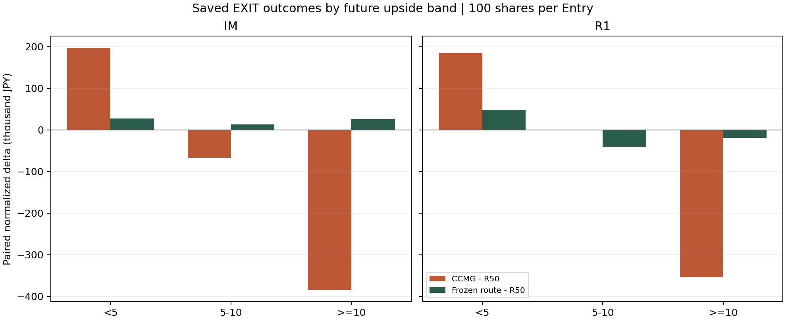
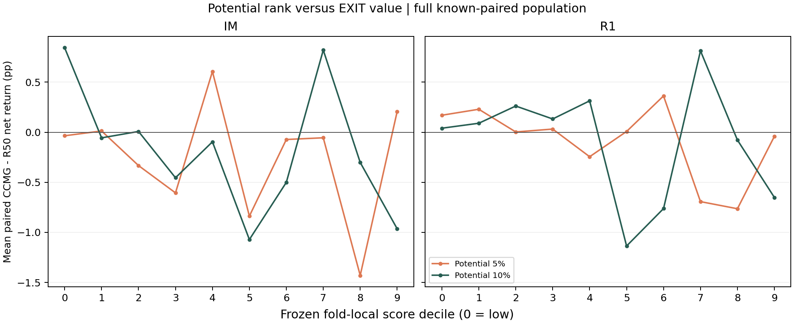

# Phase57 Post-PRR Phase A — 会計・比較母集団・EXIT差分監査

研究対象：保存済みのR50とCCMG。新fit 0、新policy Replay 0。PR #587はdraft、旧PRRのNO_SELECTIONは維持。

## 原本と会計

- Phase A Precommit SHA-256: `25e6f97b191a8d343a9361f73e48d179dd4ddcd94a229cac5f55c46b210381e9`。A0 SHA-256: `cc7280eead274f00e90ec1c69d3dfed479c2af11506a0b247cd54937c64700c6`。A1 Spec SHA-256: `8dc2bd97dcc4a7c209051dc964ac01c407240880a0d5e82f32d78a1407ad6ed0`。
- R34台帳の支払原価はeffective Entry price × quantity。買付費用はeffective priceに含まれる。売却費用は支払原価の0.05%。PnL = exit price × quantity − paid cost × 1.0005。Net% = 100 × PnL / paid cost。
- 旧CCMG/PRRの一部は売却代金の0.05%を差し引いた。旧receiptを変更せず、原本価格からR34式の列を別保存した。全100株世界では既知pairedの旧差 = 正規化差 × 0.9995。PrimaryではControlのみR34式で、CCMGは委譲値と売却代金basisが混在。
- 正規化が必要だった既知PnLは全100株 Control 1594件／CCMG 1434件、Primary Control 0件／CCMG 53件。Primaryの差分符号変更は1件。
- 既存winner_gateはmean JPYを比較する。下表の平均Net％は各Entryの支払原価で割ってから平均した独立列であり、円合計や資本加重リターンで代用していない。

## A0 — 件数（特徴とΔの関係を見る前に固定）

|母集団|arm|Entry|両outcome既知|R50のみ|両方未知|Δ=0|Δ≠0|CCMG初回intent|R50 model intent|
|---|---:|---:|---:|---:|---:|---:|---:|---:|---:|
|全Entry 100株|IM|819|728|80|11|450|278|376|34|
|全Entry 100株|R1|795|706|80|9|457|249|343|35|
|Primary 実数量|IM|79|70|9|0|31|39|49|7|
|Primary 実数量|R1|32|21|10|1|8|13|23|2|
|Primary外 100株|IM|740|658|71|11|419|239|327|27|
|Primary外 100株|R1|763|685|70|8|449|236|320|33|

A0はΔ=0/非0の件数を閲覧したためoutcome blindではない。Primaryは全Entryの部分集合。IM/R1は代替Entry世界で合算Portfolioではない。期間は2025-07-22～2025-08-25の24セッション。

## A1 — 保存済みoutcomeの同一Entry差

|母集団|arm|paired N|改善 / 同値 / 悪化|CCMG−R50 円合計|平均Net差 pp|固定route−R50 円合計|固定route平均Net差 pp|
|---|---:|---:|---:|---:|---:|---:|---:|
|全Entry 100株|IM|728|151 / 450 / 127|-254,400|-0.228|65,500|+0.035|
|全Entry 100株|R1|706|138 / 457 / 111|-168,700|-0.070|-13,200|+0.044|
|Primary 実数量|IM|70|19 / 31 / 20|-86,100|-0.408|24,500|+0.089|
|Primary 実数量|R1|21|8 / 8 / 5|-65,100|-1.378|14,900|+0.249|
|Primary外 100株|IM|658|132 / 419 / 107|-276,800|-0.209|27,600|+0.030|
|Primary外 100株|R1|685|130 / 449 / 106|-100,800|-0.030|-20,700|+0.038|

固定routeのDEFAULT=R50という同値は仕様。CCMG outcomeが未知な行をCCMG−R50=0とは置いていない。円合計は単独Entryの並列比較であり、資本回転・同時保有制約・約定可能性を含むPortfolio効果ではない。

### 上昇帯別（全Entry・100株、同一paired mask）

|arm|未来上昇帯|paired N|CCMG−R50 円合計|CCMG平均Net差 pp|固定route−R50 円合計|固定route平均Net差 pp|
|---|---|---:|---:|---:|---:|---:|
|IM|<5|585|196,500|+0.454|27,200|+0.051|
|IM|5-10|82|-67,100|-0.496|12,900|+0.110|
|IM|>=10|61|-383,800|-6.407|25,400|-0.217|
|IM|>=5|143|-450,900|-3.017|38,300|-0.029|
|R1|<5|574|184,800|+0.341|48,100|+0.070|
|R1|5-10|78|0|+0.616|-41,500|+0.122|
|R1|>=10|54|-353,500|-5.429|-19,800|-0.342|
|R1|>=5|132|-353,500|-1.857|-61,300|-0.068|

R1の固定route 5–10%帯は−¥41,500、≥10%帯は−¥19,800。R1の≥5%合計は−¥61,300で、<5%の+¥48,100と相殺して全体−¥13,200。これは旧報告値の会計差を正規化した値。

### 平均Net％を独立に見たWinner Gate

|母集団|arm|帯|固定route円差|固定route平均Net差 pp|旧receipt|今回の両条件|
|---|---|---|---:|---:|---|---|
|Primary|IM|≥5%|24,500|+0.249|WINNER_PRESERVATION_PASS|PASS|
|Primary|IM|≥10%|24,500|+0.479|WINNER_PRESERVATION_PASS|PASS|
|Primary|R1|≥5%|100|+0.005|WINNER_PRESERVATION_PASS|PASS|
|Primary|R1|≥10%|0|+0.000|WINNER_PRESERVATION_PASS|PASS|
|全Entry|IM|≥5%|38,300|-0.029|ALL_ENTRY_WINNER_REGRESSION|FAIL|
|全Entry|IM|≥10%|25,400|-0.217|ALL_ENTRY_WINNER_REGRESSION|FAIL|
|全Entry|R1|≥5%|-61,300|-0.068|ALL_ENTRY_WINNER_REGRESSION|FAIL|
|全Entry|R1|≥10%|-19,800|-0.342|ALL_ENTRY_WINNER_REGRESSION|FAIL|

全Entry IMの≥5/≥10は円差が正でも平均Net％差が負。旧receiptの同等とみなせない。PrimaryのPASSは少数のfunded subsetに限る。

### 利益・損失の集中と順位

|arm|CCMG改善 / 悪化 N|利益総額|損失総額（絶対値）|損失上位5件の損失比|負のセッション|
|---|---:|---:|---:|---:|---:|
|IM|151 / 127|559,100|813,500|32.6%|16 / 24|
|R1|138 / 111|582,000|750,700|36.0%|15 / 24|

損失上位5件はIMで約32.6%、R1で約36.0%。最大損失のEntry IDと全セッション差分は`A1_RESULTS.json`に保存。Δ≠0だけで母集団を選んでいない。

Potentialのscore/decileとΔの記述的な順位相関（Spearman、全pairedで同値を含む）：
- IM: head5 +0.029、head10 -0.033。単調なEXIT価値の順位関係はこの観察から確認できない。
- R1: head5 +0.016、head10 +0.010。単調なEXIT価値の順位関係はこの観察から確認できない。

### 対応Entry、SELL判断、約定参照

IM/R1の同じopportunityで両方の保存outcomeが既知な対応組は683組。このうち両armでPrimaryは15組、Entry分が同じなのは174組。別Entry時刻の組を同一取引として足していない。

|arm|paired中CCMG初回intent|両model intent時刻既知|CCMG intentがR50 fillより先|CCMG fillがR50 fillより後|同一fill価格|完全stage-2 snapshot|
|---|---:|---:|---:|---:|---:|---:|
|IM|296|30|294|0|450|0|
|R1|263|26|263|0|457|0|

R50の`controlNow`はMODEL_EXITなら判断時刻。FORCED_TERMINALの925を早期SELL_INTENTとして数えない。`controlExitMinute`と`candidateExitMinute`は保存された約定参照時刻で、intent時刻ではない。初回CCMG intentのguard traceはknownAt≤nowを確認できるが、stage-2用の完全なruntime特徴量は保存されていない。

## 不足Evidenceと判定

- この24セッション外の許可済みDevelopment期間に、同一EntryのR50/CCMG双方のoutcomeがあると確認できない。別期間の教師数を増やしていない。
- frozen feature arrayはreceipt上のSHAだけでこのcheckoutに現物がなく、再hashできない。canonical OOFとrouteのSHAは照合済み。stage-2の入力lineageとfirst intent時点のas-of特徴量を次実験前に監査する必要がある。
- Primaryと全Entry、IM/R1、旧receiptと正規化列の位置付けを維持する。旧POTENTIAL_SKILL_FAILはRank Signal PASSで置換しない。
- 結論：A1は保存済みOutcomeの記述的差分。CCMGの一般適用を支持せず、案Bの実験可否は追加のcausal snapshot・support・独立のGate定義に依存。選定なし、productionReady=false。
