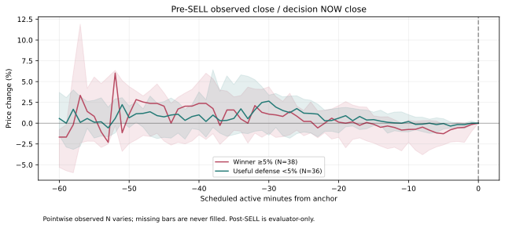
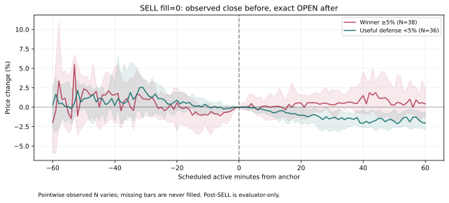
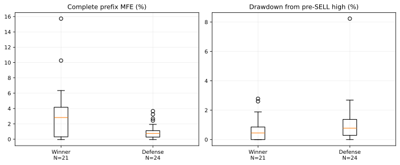
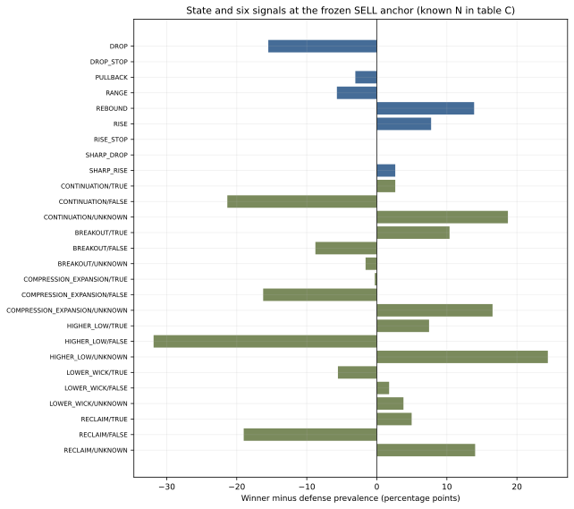
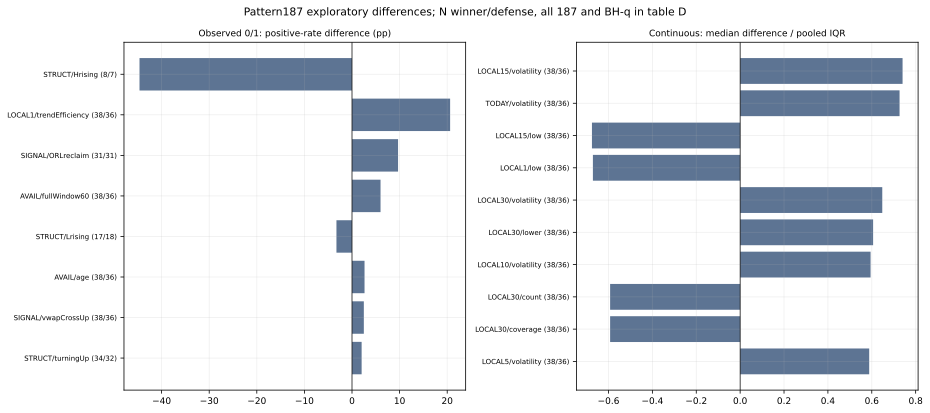
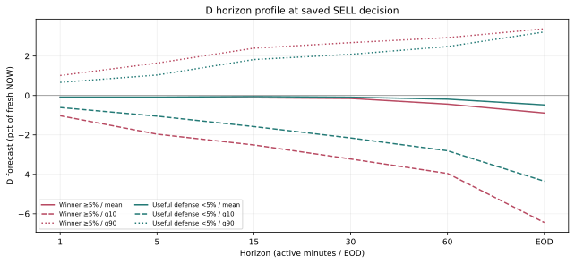
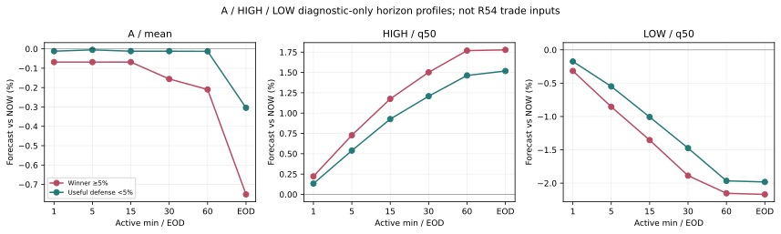
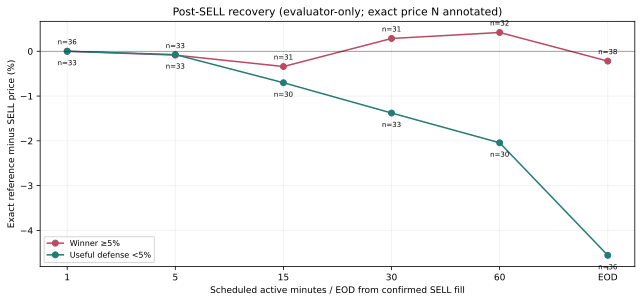

# Phase57 Post-R54 Winner Preservation Anatomy — Claude向け事実パッケージ

作成：2026-09-28 JST。対象：Draft PR #587、`research/phase57-long-only-cash-equity`。分析authority：記述的なfailure anatomyのみ。`ANATOMY_PRECOMMIT.json`を先に固定した。次EXIT architectureの採択・実装・閾値探索・Replay・新fitを行っていない。

## 🧭 現在地

R54 Cycle2の支配的結論は変更しない：`integrity_status=PASS`、`measurement_status=MEASUREMENT_BLOCKED`、`forecast_status=FAIL_D_INCREMENTAL_SKILL`、`winner_status=FAIL`、`economic_status=FULL_PERIOD_UNMEASURABLE`、`selected=null`、`productionReady=false`。履歴の176 fits・44 integrated Replaysは増やしていない。MH_WAIT15/WAIT5は各arm内同一、grace usedは0。

固定universeはR50_AでfundedとなったIM 79件・R1 32件、同一Entry・同一数量のR34補正済みpaired Layer A。補助universeは全Entry IM 819件・R1 795件の100株単位standalone診断であり、funded portfolio PnLではない。両armは代替的なEntry世界であり合算をPortfolio実績とみなさない。観測単位は1 Entryにつき保存済みR54 FULL/MH_WAIT15の1 SELL判定アンカー。未来の上値・PnL・SELL後価格はcohort/evaluatorだけに用いた。

「Premature Winner」は**保存済みEntry後上値>=5%で、R54 model SELLが確定した**という操作的ラベル。上値の最高時刻がSELL後だったという証明ではない。>=10%は>=5%の内数。「Useful Defensive」はEntry後上値<5%、model SELL確定、同一数量のR54 PnL−Control PnL>0。Controlを下回る小値幅、利益を改善したWinnerなどは別のcross-flagとし、後からcohort境界を変更していない。

### A. Cohort件数

| Universe/arm | Entry N | model SELL | >=10 Winner（>=5内数） | >=5 Winner | 3–5 防御 | 1–3 防御 | <1 防御 | terminalで保持した>=5 | 未解決fill |
|:--|--:|--:|--:|--:|--:|--:|--:|--:|--:|
| Funded IM | 79 | 64 | 15 | 27 | 10 | 5 | 12 | 0 | 0 |
| Funded R1 | 32 | 24 | 8 | 11 | 3 | 3 | 3 | 1 | 1 |
| Funded combined | 111 | 88 | 23 | 38 | 13 | 8 | 15 | 1 | 1 |
| Standalone IM（補助） | 819 | 542 | 66 | 150 | 43 | 92 | 110 | 8 | 11 |
| Standalone R1（補助） | 795 | 509 | 59 | 132 | 42 | 79 | 97 | 11 | 9 |

Funded combinedのcross-flagは、WinnerなのにControlより悪い18件、小値幅なのにR54がControl以下35件。残る小値幅やforced/unresolvedを勝手に防御成功とはしない。[全件数表](tables/A_cohorts.csv)・[session/Entry時刻/SELL時刻/State/checkpoint strata](tables/A_entry_context_strata.csv)。

## 🏆 Premature Winner

### B. 上値bucket別の同一数量R34補正paired Layer A

| Arm / 上値 | N（paired） | R54 model SELL | Control平均net | R54平均net | Control PnL | R54 PnL | 差（R54−Control） |
|:--|--:|--:|--:|--:|--:|--:|--:|
| IM >=10% | 15 | 15 | +7.468% | +2.669% | ¥269,377 | ¥114,677 | **−¥154,700** |
| IM >=5%（>=10を含む） | 27 | 27 | +4.896% | +1.885% | ¥329,596 | ¥142,896 | **−¥186,700** |
| IM 3–5% | 17 | 14 | −1.089% | +1.165% | −¥48,157 | ¥56,843 | +¥105,000 |
| IM 1–3% | 15 | 10 | −2.967% | −1.421% | −¥121,877 | −¥57,827 | +¥64,050 |
| IM <1% | 20 | 13 | −4.660% | −1.699% | −¥272,431 | −¥106,531 | +¥165,900 |
| R1 >=10% | 8 | 8 | +9.517% | +0.131% | ¥220,221 | ¥5,021 | **−¥215,200** |
| R1 >=5%（>=10を含む） | 12 | 11 | +7.115% | +0.941% | ¥245,812 | ¥36,112 | **−¥209,700** |

表示は円単位への丸め。厳密値・全bucket・paired改善/悪化件数は[上値bucket表](tables/A_upside_buckets.csv)。IM全79の同一数量Control −¥112,868.990875、R54 +¥35,381.009125、差 +¥148,250に一致。R1の<1%は6件中1件のR54 fill/Control会計が未解決なので平均・PnLは**既知5件のみ**。`null`を0や閉じた損益へ補完しない。

>=5% funded 39件（IM27、R1 12）のうちR54 model SELLは38件、R1の1件はterminal保持。model SELL 38件のpaired差は悪化18、同値2、改善18。>=10% model SELL 23件の差も悪化11、同値1、改善11だが、損失側の大きさが勝り合計−¥369,900。操作的ラベルだけでは全38件を「SELL後に取り逃した勝者」と認定できない。

保存済み全Entry後peakとR54 SELL価格の差は、model SELL >=5%群で中央値9.43 pp（38件）、>=10%群で11.76 pp（23件）。これは**全経路peak−SELLのevaluator-only幾何学的gap**であり、peakがSELL前か後かを特定していない。SELL後に獲得可能だった上値・実現できたはずのPnLとして扱わない。

## 🛡 Loser Defense

IMの3–5% 17件で+¥105,000、1–3% 15件で+¥64,050、<1% 20件で+¥165,900。特に真の「Useful Defensive」では3–5% 10件、1–3% 5件、<1% 12件（IM）；R1は各3件。防御cohortのpaired差中央値は+¥12,000/Entry（combined 36件、IQR +¥4,275〜+¥17,525）。これは同一Entry・同一数量の反実仮想であり、Capitalの全期間Equity改善を証明しない。

保存済みSELL理由はWinner 38/38と防御36/36が`PERSISTENT_SHORT_DISADVANTAGE`。両群ともshort_negative 100%、2回のnegative confirmation待ちを経験し、SELL時点の厳格long-support条件は0/74。従って「短期悪化を確認して売る」機構はLoser損益に貢献する一方、同じ機構が高上値Entryにも作用した。理由カウンタと欠測は[SELL機構表](tables/B_sell_mechanism.csv)。これは次architectureで保持すべき**観測された防御特性**であって新policy提案ではない。

## 📉 SELL直前Path

| 固定SELL判定時の尺度 | Winner>=5 | Useful defense<5 | 注意 |
|:--|--:|--:|:--|
| Entry→判定、active分の中央値（IQR） | 9.5（3.25–32）, N=38 | 6（2–30）, N=36 | 確定fill時刻ではなく閉じた判定時刻 |
| 仮にNOW価格で売った場合のR34 net%、中央値 | +1.003, N=38 | +0.217, N=36 | 実SELL fill PnLではない |
| 完全prefix MFE%、中央値 | 2.828, N=21 | 0.749, N=24 | 不完全prefixは除外 |
| 完全prefix highからのDD%、中央値 | 0.452, N=21 | 0.779, N=24 | Nが半数程度 |
| 完全prefix MAE%、中央値 | −0.475, N=21 | −0.741, N=24 | 不完全prefixは除外 |
| 直近5 active分のclose変化%、中央値 | +0.800, N=27 | +0.341, N=27 | 欠測は埋めない |
| 直近15分realized vol%、中央値 | 1.087, N=17 | 0.483, N=23 | coverage<50%のためgradeはUNMEASURABLE |

Path gradeは固定基準で、完全prefix MFEとDDはWEAK（support不足）、NOW net/5分変化もWEAK。連続上昇runはSTRONGという**効果量・既知率だけの記述grade**だがwinner/defenseの中央値1/0で、探索的raw p=0.145、個別予測・採用閾値を示さない。経路は出来高も含めR54入力として保存されたものだけ。prefix完全性はR45の`position.fullOwnedPrefix`と111件すべて一致した。[SELL timingとIQR](tables/B_sell_timing.csv)・[全as-of数値比較](tables/C_all_asof_features.csv)・[時点ごとのN/IQR](tables/B_event_paths.csv)。

上図の推移は時点ごとの観測中央値とIQRであり、遠い時点は同一Entry集合とは限らない。SELL後の曲線はevaluator-only、判定時点の利用可能情報ではない。

## 🧠 State / Signals

| 事前固定as-of指標 | Winner / defense | 方向とgrade |
|:--|:--|:--|
| currentState=DROP | 11/38（28.9%）/16/36（44.4%） | Winner側−15.5 pp、MODERATE |
| currentState=REBOUND | 19/38（50.0%）/13/36（36.1%） | Winner側+13.9 pp、WEAK |
| HIGHER_LOW=FALSE | 9/38（23.7%）/20/36（55.6%） | Winner側−31.9 pp、STRONG（記述のみ） |
| HIGHER_LOW=UNKNOWN | 23/38（60.5%）/13/36（36.1%） | Winner側+24.4 pp、MODERATE |
| CONTINUATION=FALSE | 13/38（34.2%）/20/36（55.6%） | Winner側−21.3 pp、MODERATE |
| R54保存`facts.signalFalseN` | 中央値2.0 / 3.5（N=38/36） | 防御側で否定Signalが多い、MODERATE |

「UNKNOWN」は`FALSE`に読み替えない。Entry Stateやtransitionも[全State/6 Signals](tables/C_state_signals.csv)・[Entry Stateとentry→current遷移](tables/C_state_transition.csv)に固定support付きで掲載。State transitionの大半は小N/UNKNOWNが多い。gradeは独立holdoutなし、State/Signal相関と多重比較未解消。時刻・arm・checkpointの偏り（SELL EARLY Winner34/38、防御27/36、FIRST5 Winner15/38、防御17/36）だけで分類可能とは言えない。

## 🧩 Pattern187

187列のうち、今回の実測で166列は連続値、21列は観測範囲が0/1。全列を「pattern発火有無」に変換しない。winner vs defenseの中央値/四分位・正値率・既知N・固定grade・187列内BH-qを[全Pattern187表](tables/D_pattern187.csv)に保存。

| 例（探索的） | Winner中央値 | 防御中央値 | 既知N W/D | 187列内BH-q | grade |
|:--|--:|--:|--:|--:|:--|
| TODAY/volatility | 1.184 | 0.773 | 38/36 | 0.0029 | MODERATE |
| LOCAL30/volatility | 0.981 | 0.632 | 38/36 | 0.0068 | MODERATE |
| LOCAL15/low | −2.813 | −1.100 | 38/36 | 0.0098 | MODERATE |
| AVAIL/prevRows | 165.5 | 262.0 | 38/36 | 0.2232 | MODERATE |

上位3列でも、同じEntry集合を見て列を選んだ**in-sample探索**であり、相関した187列のq値は外部再現・EXIT改善を保証しない。`AVAIL/prevRows`はavailability由来で経済Signalと誤認しない。個別パターンを即policy化しない。保存済み1時点のPattern187だけで、未保存の過去pattern列推移を構築しない。

## 🔮 A / D / HIGH / LOW

| OOF予測、SELL判定NOW、combinedの中央値 | Winner N | Winner | 防御 N | 防御 | 固定記述grade |
|:--|--:|--:|--:|--:|:--|
| D h1 mean | 38 | −0.099% | 36 | −0.081% | NO EVIDENCE |
| D h5 mean | 38 | −0.099% | 36 | −0.081% | NO EVIDENCE |
| D h1 q10 / q90 | 38 | −1.027 / +1.014% | 36 | −0.608 / +0.665% | 各MODERATE、分布幅の差 |
| D h60 mean | 37 | −0.439% | 36 | −0.185% | MODERATE、Winner側がむしろ低い |
| D h60−h5 mean | 37 | −0.306 pp | 36 | −0.068 pp | MODERATE、Winner側がむしろ悪化 |
| A h15 mean | 38 | −0.068% | 36 | −0.012% | WEAK |
| HIGH h15 q50 | 38 | +1.175% | 36 | +0.927% | MODERATE |
| LOW h15 q50 | 38 | −1.354% | 36 | −1.008% | MODERATE |
| A−D hEOD mean | 38 | +0.222 pp | 36 | +0.219 pp | NO EVIDENCE |

全h1/5/15/30/60/EOD、D mean/q10/q90、A mean/quantiles、HIGH/LOW quantilesは[Forecast表](tables/E_forecast_at_sell.csv)。同じアンカーでの単変量差と宣言済みhorizon shapeは[Forecast対比表](tables/E_forecast_contrasts.csv)。D q幅やHIGH/LOWに記述的な方向差はあるが、**Dの主要h1/h5/h15 pooled・fold OOFはD=0 baselineに勝てなかった**というR54 gateを覆さない。A/HIGH/LOWも診断ラベルであって新policyの有効性ではない。

graceは全1614 EntryのFULL/MH_WAIT15で0。理由はcontrollerの2回short negative確認後、いずれか長期horizonで`D mean>0 AND q10>=0`というanchorを要求するのに、確定model SELLのfunded 88件で該当0だから。単にWAIT15の時間が短かったと断定できない。WAIT5/WAIT15の差もない。grace長やD閾値の探索を行っていない。

## ⏱ Post-SELL Recovery

以下はSELL後のevaluator-onlyな**正確な保存済み予定OPEN/EOD価格**。価格差は確定SELL価格から、`回復`はその時点の価格がSELL判定直前のfresh NOW close以上。経路途中の新高値はSELL前完全prefixとSELL後完全区間の両方がある場合だけ可測とした。

| 確定SELLからのactive分 | Winner価格差中央値（既知N） | 防御価格差中央値（既知N） | NOW回復 Winner / 防御 | 新高値 Winner / 防御（完全区間のみ） |
|:--|:--|:--|:--|:--|
| 1 | 0.000%（36） | 0.000%（33） | 23/36・21/33 | 7/21・5/24 |
| 5 | −0.086%（33） | −0.075%（33） | 20/33・14/33 | 11/17・8/22 |
| 15 | −0.341%（31） | −0.703%（30） | 16/31・10/30 | 9/14・10/20 |
| 30 | +0.286%（31） | −1.379%（33） | 20/31・5/33 | 9/10・9/17 |
| 60 | +0.419%（32） | −2.044%（30） | 17/32・2/30 | 7/7・4/9 |
| EOD | −0.220%（38） | −4.557%（36） | 20/38・1/36 | 1/1・0/3 |

EODの新高値は**Winner 1/1、defense 0/3という極小の完全経路集合**で、全件の新高値率ではない。SELLから残余全経路が完全だったのは111件中6件、Winner38件中**1件**のみ。その1件のSELL後高値到達はactive 167分、追加上値9.54%だが代表値ではない。残り37 Winnerの「真のSELL後最高値・到達分・追加上値」はUNMEASURABLE。SELL後予定OPENの点情報と全経路maxを混同しない。EODでの回復差は事後診断であり、NOW時点でそれを見分けられた証明でもWAIT延長の提案でもない。[horizon別の全N/IQRと新高値](tables/F_recovery.csv)・[完全残余経路の可測性](tables/F_whole_remaining_path.csv)。

## 💴 Capital / Measurement

EXITの早売りとは別root cause。IMの`2025-07-23|62650|883`のauction/mark不明からcash lockが続き、後続>=5% Opportunity 146件は`UNRESOLVED_CASH_LOCK`。R1も`2025-08-04|36700|602`が未解決。現物/CASH-only、初期¥1,000,000、100株lot、MAX3、保存済みCapital V3 Bを固定。会計paired差やclosed PnLをfull-period Equityへ代入しない。全期間の経済statusは`FULL_PERIOD_UNMEASURABLE`。

## 🎯 月2倍との関係

ArkのNorth Starは¥1,000,000→約¥2,000,000/1か月（24 sessionsなら幾何平均約+2.93%/日）。今回観測できたEXITの捕捉差は、IM funded >=5%のControl対比−¥186,700、>=10%内数−¥154,700、R1 >=5%−¥209,700、>=10%内数−¥215,200。一方で小値幅防御はIM 3–5% +¥105,000、1–3% +¥64,050、<1% +¥165,900。これらは同一Entry/同一数量の**内訳**であって、月2倍の達成見込み・機会の換金可能総額・Capital込み月次損益ではない。SELL後残存peakを定量的に確定できない38件中37件とcash-lockが、North Starを数値評価する制約。

## 🔒 Integrity / Safety と識別可能性の限界

SHAでR45 frozen features/row IDs/raw path、R54 OOFとReplay全81ファイル、R34 corrected paired/selection、precommitを照合。111件のSELL前prefix完全性は保存済み`position.fullOwnedPrefix`と一致。14表・8 SVG、全187 patternに既知N。各出力SHAは`MANIFEST.json`とappend-only receiptに記録。`providerRequests=0`、`protectedOpened=0`、`estimatorFitsAdded=0`、`integratedReplaysAdded=0`、注文/昇格/merge=0。自動実行・broker write・live/paper/productionは全てfalse。

記述gradeはprecommit基準：両群既知N>=5・coverage>=50%・連続median差/pooled IQR>=0.2または二値率差>=5ppをWEAK、N>=10・coverage>=70%・効果>=0.5 IQR/15ppかつarm反対方向なしをMODERATE、N>=20・coverage>=80%・効果>=1 IQR/25ppかつ両arm同方向をSTRONG。支持不足（両群いずれかN<5またはcoverage<50%）はUNMEASURABLE、十分支持でも差が弱ければNO EVIDENCE。中央値差=0・IQR=0はNO EVIDENCE。これはfit・交差検証・予測力評価ではない。多重比較、同一Entry/銘柄/日相関、cohortが将来上値/事後PnLで定義されたこと、早期SELLで短いprefix/欠測が偏ることを解消していない。D/A/HIGH/LOWとPatternに差があっても「NOWで十分分離可能」とは結論できない。

## 📦 Claude Handoff

このEvidenceだけを前提に、Loser防御を維持しながら>=5%/>=10% Winnerの**SELL後に残存した上値を保護する**次EXIT architectureをどう設計するか。R54 Dの微調整ではなく、pre-performanceで固定可能な仮説を提案せよ。ただし、peak時刻の未確認、事後cohort、R34の全期間測定不能、D incremental-skill gate不通過を明示的制約とし、現Workの探索差を直接candidate/threshold/productionへ昇格しないこと。

再現入口：[固定precommit](ANATOMY_PRECOMMIT.json)、[分析script](../../../scripts/phase57_post_r54_winner_anatomy.py)、[RESULT](RESULT.json)、[入力/出力hash manifest](MANIFEST.json)。既存R54 closure/handoffは変更していない。
