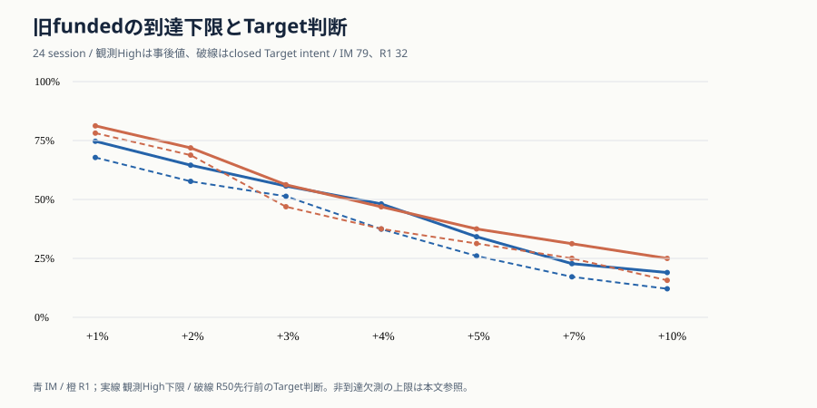
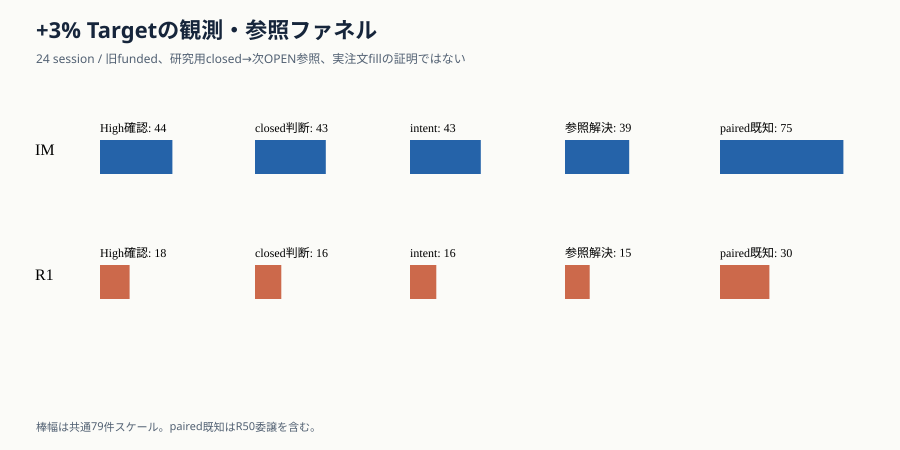
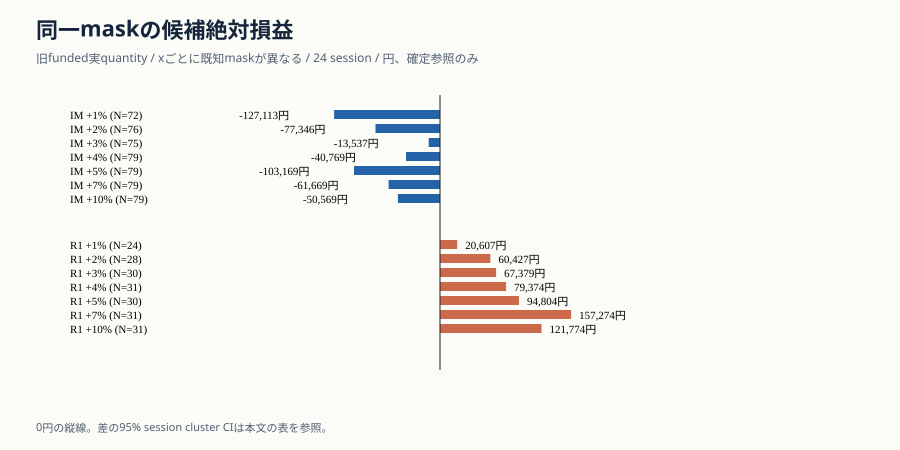
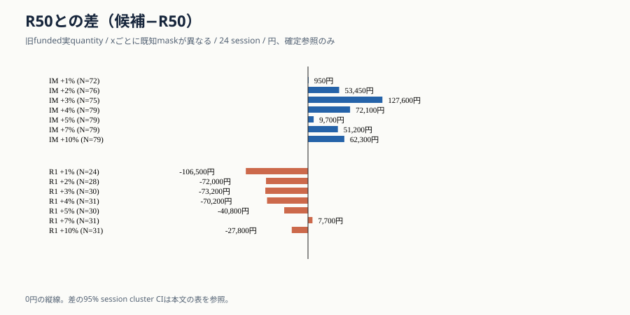
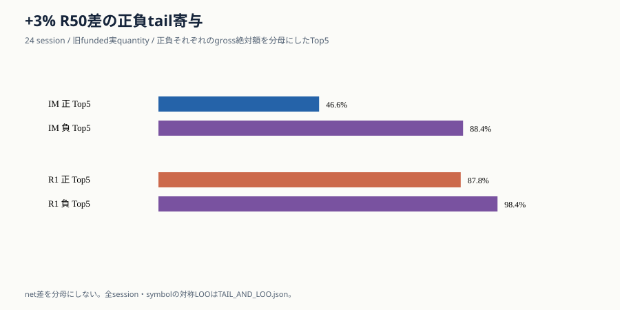
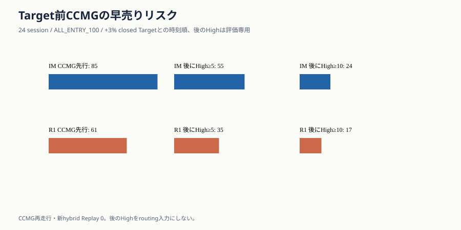
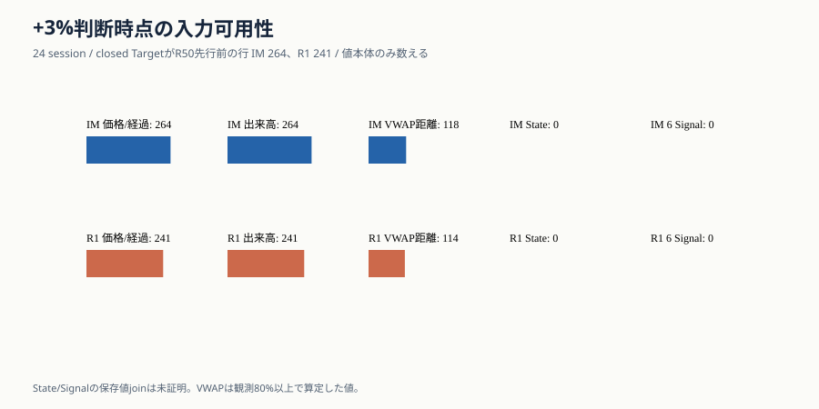

# 🎯 Ark Terminal Phase57 — Profit Target + Exceptional Extension

保存JST：2026-09-29T17:08:10+09:00。対象：2025-07-22〜2025-08-25 / 24 session / 許可済みDevelopment。basis HEAD `6eb22edb57dab19d7d63ea9b71adc99a4a843ebc`。

> **結論**：固定Targetは採用しない。初回batchは後処理例外でINVALID_RUN。保存済みpolicy行11,298件は別コードで全件一致したが、正式な成功runや独立市場validationではない。State/Signalのtarget時点値も未証明。

## 🔒 範囲と実施量

|項目|今回|
|---|---:|
|母集団|IM 819 / R1 795（代替Entry世界）|
|旧R50 funded|IM 79 / R1 32|
|固定family|7 target × 2 arm = 14 main arm、別コード14照合|
|新fit / CCMG hybrid / 延長policy / Capital統合Replay|0 / 0 / 0 / 0|
|provider / protected / 外部LLM / 発注 / main merge|各0|
|実行状態|初回INVALID_RUN、保存行の後処理回復、独立照合11,298行不一致0|

旧案Bは研究の優先度を変更した。`DESIGN_ONLY_EXPERIMENT_BLOCKED`を保持し、`DEPRIORITIZED_BY_OPERATOR / NOT_EXPERIMENTALLY_REJECTED`。Phase A/A+を再走行していない。

## 💰 CapitalとHigh到達

Capital v3-Bは、train foldで保存されたRidge score（訓練targetはpost-Entry観測上昇を0〜20%にclip）で同時刻候補を順位付けし、R37の1/3 equity目標、現金、100株単位、MAX3同時保有に従った。saved score bytesは固定、旧CI/local予測bytes差は残る。PRR score5/10とは別系列。資金解放と未解決cash lockはfunded集合を変える。

|arm / 集合|N|+3% High確認|到達下限|到達上限|完全path|
|---|---:|---:|---:|---:|---:|
|IM 旧funded|79|44|55.7%|96.2%|4|
|IM nonfunded|740|239|32.3%|90.0%|98|
|IM 同時刻riskset|636|229|36.0%|88.8%|96|
|IM 同時刻riskset内nonfunded|562|188|33.5%|87.9%|—|
|R1 旧funded|32|18|56.2%|93.8%|2|
|R1 nonfunded|763|244|32.0%|87.4%|125|
|R1 同時刻riskset|405|132|32.6%|83.5%|82|
|R1 同時刻riskset内nonfunded|386|120|31.1%|82.9%|—|

HighはEntry OPEN足を含む同日連続足と、存在する15:30 auctionの観測値。非到達を証明するには全予定足とauctionが必要。旧strictly-later表を原本と照合し不一致0。+3%旧funded確認はIM 44/79、R1 18/32で既存報告と一致するが、Highは約定価格ではない。risksetはfundedを含む重複集合であり、上表に非funded内数も示す。

## ⏱️ Target判断から参照まで

|arm / x|High確認|R50先行前のTarget intent|正確な次OPENあり|Target参照欠測|paired既知 / funded|
|---|---:|---:|---:|---:|---:|
|IM +1%|59|56|49|7|72/79|
|IM +2%|51|48|45|3|76/79|
|IM +3%|44|43|39|4|75/79|
|IM +4%|38|32|32|0|79/79|
|IM +5%|27|23|23|0|79/79|
|IM +7%|18|16|16|0|79/79|
|IM +10%|15|12|12|0|79/79|
|R1 +1%|26|26|19|7|24/32|
|R1 +2%|23|23|20|3|28/32|
|R1 +3%|18|16|15|1|30/32|
|R1 +4%|15|13|13|0|31/32|
|R1 +5%|12|11|10|1|30/32|
|R1 +7%|10|9|9|0|31/32|
|R1 +10%|8|6|6|0|31/32|

closed 1mの判断後、正確な次の予定OPENを研究用参照にした。Highだけの閾値超過はTarget intentにならない。参照欠測ではR50や次に見えたOPENで埋めない。15:30 auctionはHigh解剖の終端観測とR50保存約定参照であり、足中Highの指値fill証明ではない。

## 📊 固定利確の同一mask比較（旧funded実quantity）

|arm / x|paired/全件|候補絶対PnL|R50同mask PnL|差 JPY|平均Net%|平均差pp|差の95% cluster CI JPY|全x共通mask N|
|---|---:|---:|---:|---:|---:|---:|---:|---:|
|IM +1%|72/79|-127,113円|-128,063円|950円|-0.51%|-0.11pp|-357,255円〜351,760円|70|
|IM +2%|76/79|-77,346円|-130,796円|53,450円|-0.25%|0.14pp|-312,656円〜408,317円|70|
|IM +3%|75/79|-13,537円|-141,137円|127,600円|0.05%|0.49pp|-228,832円〜479,802円|70|
|IM +4%|79/79|-40,769円|-112,869円|72,100円|-0.12%|0.18pp|-258,502円〜370,510円|70|
|IM +5%|79/79|-103,169円|-112,869円|9,700円|-0.41%|-0.10pp|-292,912円〜280,622円|70|
|IM +7%|79/79|-61,669円|-112,869円|51,200円|-0.16%|0.14pp|-227,000円〜306,002円|70|
|IM +10%|79/79|-50,569円|-112,869円|62,300円|-0.12%|0.18pp|-212,305円〜320,500円|70|
|R1 +1%|24/32|20,607円|127,107円|-106,500円|0.27%|-1.43pp|-376,205円〜116,300円|22|
|R1 +2%|28/32|60,427円|132,427円|-72,000円|0.64%|-0.89pp|-302,602円〜147,100円|22|
|R1 +3%|30/32|67,379円|140,579円|-73,200円|0.69%|-0.84pp|-321,100円〜152,502円|22|
|R1 +4%|31/32|79,374円|149,574円|-70,200円|0.79%|-0.78pp|-307,800円〜132,300円|22|
|R1 +5%|30/32|94,804円|135,604円|-40,800円|1.05%|-0.43pp|-275,100円〜153,000円|22|
|R1 +7%|31/32|157,274円|149,574円|7,700円|1.73%|0.16pp|-205,900円〜202,300円|22|
|R1 +10%|31/32|121,774円|149,574円|-27,800円|1.37%|-0.20pp|-227,100円〜153,400円|22|

同一target内でもunknownは比較から除外し、件数を併記。絶対JPY合計とEntry平均Net%はquantity・原価が違うため符号が一致するとは限らない。全x共通maskは欠測を隠さない補助表としてJSONに保持。session bootstrapは10,000回、24 cluster、seed 20260929。14比較から良いtargetを選ばない。

## ⚖️ 未前倒し損失・Winner・tail

|arm +3%|target前倒し既知|前倒し差|R50委譲既知の絶対損失合計|旧≥5 Winner帯の差|正のTop5寄与|負のTop5寄与|
|---|---:|---:|---:|---:|---:|---:|
|IM|39|127,600円|-430,467円|-140,500円 / N=140|46.6%|88.4%|
|R1|15|-73,200円|-130,139円|37,900円 / N=131|87.8%|98.4%|

旧Winner Gateの5–10/≥10/≥5のJPY・平均Net%非劣化結果は `LEGACY_WINNER_GATE_AUDIT.json` に元基準のまま保存。全session・全symbolの対称LOO、候補絶対損失tailと差のtailは `TAIL_AND_LOO.json`。費用総率0.05/0.10/0.20ppの再価格では同一quantityの差は恒等的に不変であり、約定頑健性は証明しない。

## 🛡️ Target前CCMGと時点入力

|arm +3% ALL_ENTRY_100|CCMGがclosed Targetより先|その後High≥5|その後High≥10|順序/path不明|
|---|---:|---:|---:|---:|
|IM|85|55|24|461|
|R1|61|35|17|437|

その後のWinnerは事後評価だけに使用。CCMGは今回再走行せず、旧結果の先行intentを比較した。Target前に後の上昇を切り得るため `CCMG_OPTIONAL_UNPROVEN` を維持。最初のmilestone前はBASELINEで、一般的な損切り能力を保証しない。

|arm +3% focal|R50前closed Target|価格/経過|bar出来高・売買代金|VWAP距離|既存State値|既存6 Signal値|
|---|---:|---:|---:|---:|---:|---:|
|IM|264|264|264|118|0|0|
|R1|241|241|241|114|0|0|

State/Signalの過去利用とtarget時点値の存在は別。既存producerの名前だけで実際のsnapshotが使えたとは言わない。bar volume/valueは累積値とみなさず0・欠測を分けた。VWAPは当時までのvalue/volumeで観測率80%以上の場合のみ算定。売買代金の単位、previous-session入力、実配信knownAtは未証明。

## 🚦 判定と次工程

|Gate|状態|
|---|---|
|source / Capital|hash・R50/資金配分IDと保存score契約PASS。予測byte差は未解決|
|High / execution|観測到達は照合、完全pathは少数。exact OPEN欠測はUNKNOWN|
|固定Target|初回 `INVALID_RUN`、保存行の独立照合PASS。選定なし|
|State / Signal / Volume|State/Signal target値BLOCKED_SOURCE、volume/VWAP部分的|
|Extension / Capital統合|設計草案のみ、実データpolicy/Portfolio Replay 0|
|Production|false、発注0、main merge0|

1. **Capitalは何を優先したか。** saved v3-B OOF scoreで同時刻候補を順位付けし、R37のcash/lot/slot制約で配分した。旧fundedのHigh≥3はIM44/79、R1 18/32で旧報告と整合。将来選別性能の証明ではない。
2. **Highと売却参照の差は。** +3% HighはIM44、R1 18。R50先行前のclosed Target intentはIM43、R1 16、正確な次OPEN既知はIM39、R1 15。Highそのものでは売らない。
3. **利益はどう見えるか。** 上の7 target全件表の通り。+3%旧funded同maskの差はIM +¥127,600、R1 −¥73,200だが、候補絶対はIM −¥13,537、R1 +¥67,379。未前倒し損失、Winner早売り、unknown、CI、試行露出を含めると採用できない。
4. **CCMGとState/Volumeは。** CCMGが先に出て後に+10% Highを観測した行はIM24、R1 17。State/6 Signalのtarget時点値は0件証明、出来高bar値は一部因果的に読めるが単位・運用knownAtは未証明。
5. **次は。** まずState/Signal値と正確なOPEN・auction欠測の原本を回収し、新しい有限確認仕様を固定する。単純Targetの結果だけから延長を否定せず、今回のbudgetを再使用しない。Capital統合と本番化は別Gate。

実行条件：新provider0、保護partition0、外部LLM0、注文0。旧North Star ¥1,000,000→約¥2,000,000/24 sessionは目標であり、この固定funded帰属比較からPortfolio達成率は算出しない。

公開Evidenceのtarget時点行では、raw bar出来高・売買代金の数値は再掲せず、存在・0・欠測フラグと集計coverageのみ保存した。元データのhashはsource manifestで追跡する。
