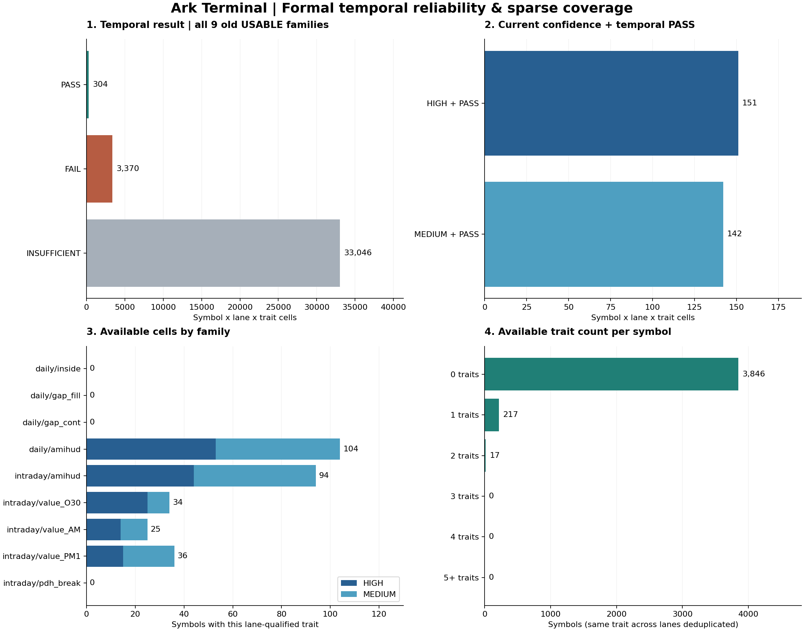

# Sparse Dictionary — Formal Temporal Reliability Remeasurement

**Gate: SPARSE_DICTIONARY_CHART_READER_READY_FOR_ENTRY_EXIT_DEVELOPMENT**

利用可能なSparse Dictionary: **234銘柄 / 293 symbol×lane×trait**。全trait PASSは要求しない。MEDIUMもconfidenceを保持したまま利用可能。
固定仕様を正式採用してDevelopment144だけで再測定。window・minimum-N・sample confidence・temporal thresholdは保存済み仕様から変更なし。既存9USABLE/23WATCHと旧Gate/Evidenceは上書きしていない。

## 1. Temporal結果・confidence（旧USABLE9、全4080銘柄）

| 指標 | symbol×lane×trait数 |
|---|---:|
| 全評価対象 | 36,720 |
| Temporal PASS | 304 |
| Temporal FAIL | 3,370 |
| Temporal INSUFFICIENT | 33,046 |
| HIGH + temporal PASS | 151 |
| MEDIUM + temporal PASS | 142 |
| sample LOW（temporalとは別軸） | 13,500 |
| sample INSUFFICIENT（別軸） | 14,310 |
| 利用可能 HIGH | 151 |
| 利用可能 MEDIUM | 142 |
| 引渡し可能 合計 | 293 |

PASS/FAIL/INSUFFICIENTのみが全評価対象を分割する。HIGH+PASS/MEDIUM+PASS/LOWは別軸であり、上表全行を足し合わせない。WATCH23を含む全32の補助集計はmeasurement/01_coverage.jsonのall32Totals。WATCHはPASSしても旧WATCHのまま、引渡し対象に含めない。

## 2. trait family別結果

| family | 3期間比較可 | PASS | FAIL | INSUFFICIENT | HIGH+PASS | MEDIUM+PASS | 利用可能 |
|---|---:|---:|---:|---:|---:|---:|---:|
| daily/inside | 0 | 0 | 0 | 4080 | 0 | 0 | 0 |
| daily/gap_fill | 0 | 0 | 0 | 4080 | 0 | 0 | 0 |
| daily/gap_cont | 0 | 0 | 0 | 4080 | 0 | 0 | 0 |
| daily/amihud | 1318 | 110 | 1208 | 2762 | 53 | 51 | 104 |
| intraday/amihud | 1145 | 97 | 1048 | 2935 | 44 | 50 | 94 |
| intraday/value_O30 | 413 | 34 | 379 | 3667 | 25 | 9 | 34 |
| intraday/value_AM | 381 | 27 | 354 | 3699 | 14 | 11 | 25 |
| intraday/value_PM1 | 417 | 36 | 381 | 3663 | 15 | 21 | 36 |
| intraday/pdh_break | 0 | 0 | 0 | 4080 | 0 | 0 | 0 |

## 3. usable trait数／symbol

| usable trait数 | 銘柄数（同じtrait_idはlane間で重複除去） | lane別traitとして数えた場合 |
|---|---:|---:|
| 0 | 3846 | 3846 |
| 1 | 217 | 176 |
| 2 | 17 | 57 |
| 3 | 0 | 1 |
| 4 | 0 | 0 |
| 5+ | 0 | 0 |

| 条件 | 銘柄数 |
|---|---:|
| 少なくとも1 trait利用可能 | 234 |
| 少なくとも2 trait利用可能 | 17 |
| 少なくとも3 trait利用可能 | 0 |

主表ではdaily/amihudとintraday/amihudを同一traitとして数える。値・confidence・出典は統合せず別レコードで保存する。引渡しセル総数はlane別。銘柄全体のALL PASS判定はない。

## 4. 固定3期間

| 期間 | Source終端 | 予測起点 | Target開始 | Target終了 | 許可session |
|---|---|---|---|---|---:|
| CALIBRATION | 2024-11-12T15:30:00+09:00 | 2024-11-12T15:31:00+09:00 | 2024-11-20 | 2025-05-01 | 26 |
| VALIDATION1 | 2025-06-06T15:30:00+09:00 | 2025-06-06T15:31:00+09:00 | 2025-06-16 | 2025-07-23 | 26 |
| VALIDATION2 | 2025-07-15T15:30:00+09:00 | 2025-07-15T15:31:00+09:00 | 2025-07-24 | 2025-08-21 | 20 |

sourceは60取引所calendar-position。targetは固定済み26/26/20許可日を含む範囲で、各最低20適格日・peer100条件を維持。calibration期間は空白を含み108取引所日にまたがる。欠測はNaN、warm-up/resetは変更なし。対象期間は非重複だが、統計的独立・iidを認定しない。
Temporal判定は3期間のsource H/M・最低標本・有限posteriorを要求し、sign consistency>=2/3、normalized RMSE<=1、|bias|<=0.5、slope0.5..1.5（prediction SD>=0.1）、posterior-change RMS<=1を全て満たす場合PASS。3期間未成立はINSUFFICIENT。既存関数による採点をそのまま使用。
期間別resultはCOMPARABLE/INSUFFICIENTと実測x/y/change等を保存する。単一期間に独自のPASS基準は追加していない。

## 5. 残4/9のINSUFFICIENT

| family | Period1比較可 | Period2比較可 | Period3比較可 | 全3期間 |
|---|---:|---:|---:|---:|
| daily/inside | 0 | 0 | 0 | 0 |
| daily/gap_fill | 0 | 1 | 3 | 0 |
| daily/gap_cont | 0 | 0 | 1 | 0 |
| intraday/pdh_break | 0 | 0 | 0 | 0 |

**daily/inside**
- CALIBRATION: {"SOURCE_NOT_HIGH_MEDIUM": 4080}
- VALIDATION1: {"SOURCE_NOT_HIGH_MEDIUM": 4080}
- VALIDATION2: {"SOURCE_NOT_HIGH_MEDIUM": 4080}

**daily/gap_fill**
- CALIBRATION: {"MISSING_TARGET_OR_SOURCE_POSTERIOR": 1, "SOURCE_NOT_HIGH_MEDIUM": 4040, "TARGET_NEFF_BELOW_8": 39}
- VALIDATION1: {"ELIGIBLE": 1, "SOURCE_NOT_HIGH_MEDIUM": 4079}
- VALIDATION2: {"ELIGIBLE": 3, "SOURCE_NOT_HIGH_MEDIUM": 4041, "TARGET_NEFF_BELOW_8": 36}

**daily/gap_cont**
- CALIBRATION: {"SOURCE_NOT_HIGH_MEDIUM": 4057, "TARGET_NEFF_BELOW_8": 23}
- VALIDATION1: {"SOURCE_NOT_HIGH_MEDIUM": 4080}
- VALIDATION2: {"ELIGIBLE": 1, "SOURCE_NOT_HIGH_MEDIUM": 4046, "TARGET_NEFF_BELOW_8": 33}

**intraday/pdh_break**
- CALIBRATION: {"SOURCE_NOT_HIGH_MEDIUM": 4080}
- VALIDATION1: {"SOURCE_NOT_HIGH_MEDIUM": 4080}
- VALIDATION2: {"MISSING_TARGET_OR_SOURCE_POSTERIOR": 103, "SOURCE_NOT_HIGH_MEDIUM": 3942, "TARGET_NEFF_BELOW_8": 35}

現在の固定Development分割では標本・source confidence・事後推定等の条件が揃わず正式比較不能。追加session/eventで自然に条件が揃う可能性はあるが保証しない。trait自体が永久に測れないとの結論ではない。必要追加日数は銘柄別event頻度等に依存するためUNKNOWN。残4件を救済するwindow選び直し・条件緩和は実施していない。

## 6. WATCH23補正診断

| family | calibration fit pairs | validation1 PASS | validation2 PASS | 新version候補のみ |
|---|---:|---|---|---|
| daily/body_range | 3625 | True | False | False |
| daily/large_up | 3472 | False | False | False |
| daily/doji | 3537 | True | True | True |
| daily/long_lower | 3454 | True | True | True |
| daily/outside | 3668 | True | True | True |
| daily/trend_day | 3531 | True | True | True |
| daily/range_s | 2337 | False | True | False |
| daily/range_exp | 2943 | False | False | False |
| daily/range_con | 2850 | True | False | False |
| daily/gap_up | 3377 | True | True | True |
| daily/gap_dn | 3540 | False | False | False |
| daily/overnight_var_share | 3551 | True | True | True |
| daily/value_shock | 2402 | False | True | False |
| daily/jump | 3296 | False | True | False |
| intraday/inside | 3452 | True | True | True |
| intraday/trend_day | 3068 | True | True | True |
| intraday/range_con | 2627 | True | True | True |
| intraday/gap_fill | 0 | False | False | False |
| intraday/overnight_var_share | 2976 | True | True | True |
| intraday/value_shock | 1671 | False | True | False |
| intraday/value_CL | 0 | False | False | False |
| intraday/range_PM1 | 463 | True | True | True |
| intraday/volume_CL | 0 | False | False | False |

mappingは最初の期間のみでfitし、その完了後の2起点に固定適用。各期間>=100 pairs、slope0.5..1.5、mapped MSE<=identity MSEの旧条件を変更していない。候補になっても旧WATCHをUSABLEへ昇格しない。

## 7. Sparse handoff・past-only・Reader

payloadはvalue / availability / sampleConfidence / temporalReliability / uncertainty / nEff / computedThrough / availableAt / definitionHashを分離する。利用不能value=null、availability=UNAVAILABLE、理由を保持。実値0はAVAILABLEとなり得る。失格の兄弟traitは他traitを排除しない。
Profile/peer/normalization/referenceはsame-as-of。computedThrough < decisionTimeを厳格チェックし、temporal判定のcomputedThrough/availableAtも別に検査する。今回の再現性判定は2025-08-21終了分まで使用しており、それ以前のdecisionへ利用しない。MEDIUMの未検定driftは旧仕様どおり許容し、DRIFT_UNTESTEDを明示。
実データ同時接続: 2件。8/22閉場までのProfile＋8/25 12:35のclosed-bar Reader、code順の最初3候補だけで接続を検証。鮮度・session境界・future/stale拒否・history adapterは契約テストで確認。全市場のReader coverageを主張しない。
144日は将来のEntry/EXIT Developmentとして再利用できる。各decisionで全学習済みartifactとfeatureをpast-only再生成し、最終Profile/最終H/M/最終temporal判定の過去へのbackfillを禁止する。今回のcoverageは最終時点の研究用coverageであり、144日全decisionにこのcoverageが存在したとは言わない。
availableAtは本研究のイベント時刻に基づく再構成であり、実際の当時の取得時刻が証明されたPITデータではない。固定registryや以前の開発結果は事後に見られており、独立したconfirmatory/OOS検証・売買利益を認定しない。

## 8. Gate・検証・保護境界

Gate: **SPARSE_DICTIONARY_CHART_READER_READY_FOR_ENTRY_EXIT_DEVELOPMENT**。残blocker: []。
Focused tests 239 PASS / regression 2949 PASS / 2回再生成manifest完全一致。旧Evidence/registry/specハッシュ不変。
Common Holdout244・REPORT19/Validation/OOS/Freshの追加開封0。既存matrixと元read ledgerを照合。Reader確認のraw復元は許可済み8/22と8/25のみ。過去Exposure Ledgerは維持。新規取得0。
Frozen Selector・Capital Allocation・実売買系は不変。新Entry/EXIT学習0。安全フラグ9項目は全false。main未merge。
Execution HEAD `32c74a5c2533ff00edc29fd2e82ca8c711bbc6a7` / PR587 Draft・未merge / CI 35488395883。保存HEADはこの実行commitの子孫。

## 保存ファイル

- measurement/05_profiles.json.gz: 全symbol×traitのProfile・3期間結果・標本/再現性・provenance。
- measurement/06_feature_payload.json.gz: 明示availabilityと欠測を持つ下流契約。
- measurement/01_coverage.json / 02_family_periods.json: 表・グラフの全数値。
- measurement/07_artifacts.json / 08_reader_integration.json / 09_boundary.json: as-of artifact・接続・境界証拠。
- handoff-gate.json / ci-receipt.json / coverage.png / coverage.svg。
STOP。READYでも今回Entry/EXIT本格学習は開始しない。
