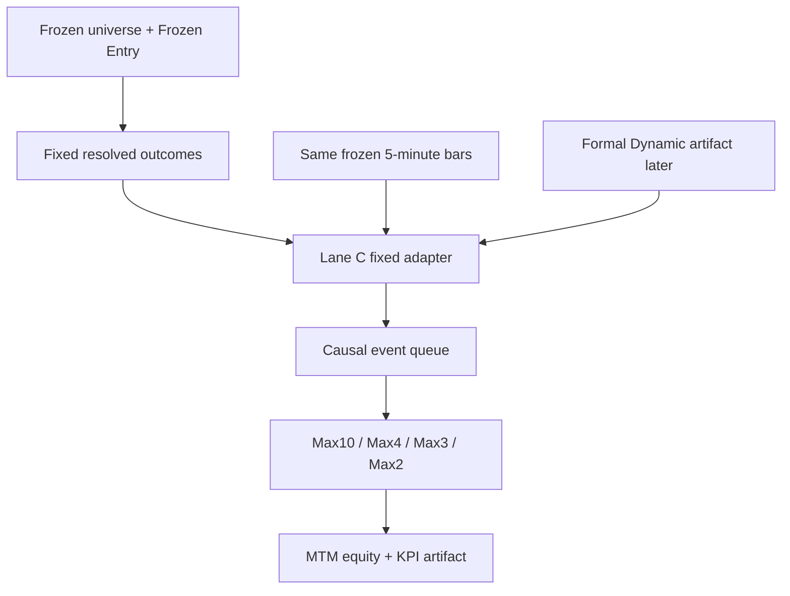

# Phase57 P25 Lane C — Portfolio / Capital Allocation Foundation

Status: **RESEARCH ONLY — FIXED-HORIZON CHECKPOINT RUNNER IMPLEMENTED; WINNER LOCKED**

Progress is tracked independently:

- Ark Terminal main body: approximately **99.999%**. Lane C does not revise this number.
- Lane C: a separate engineering/evidence track. No allocation winner has been selected.

## Scientific boundary

| Research lane | Frozen input | Variable under test | Edge label |
| --- | --- | --- | --- |
| Lane A | Frozen Entry | Fixed-Horizon trade outcome | Signal Edge |
| Lane B | Same Frozen Entry | Dynamic HOLD/EXIT versus Fixed | Management Edge |
| Lane C | Same Entry and same selected management outcome | Capital constraint and allocation profile | Capital Allocation Edge |
| Fixed/Dynamic portfolio matrix | Same Frozen Entry, then different exit timing | Management plus downstream cash availability | Management × Capital Allocation |

Lane C cannot change the Entry model, threshold, universe, Dynamic-N, horizon, or Lane B management rule. A Fixed-versus-Dynamic portfolio difference is not relabelled pure Management Edge because an earlier or later EXIT changes the cash available to later Entries.

`DYNAMIC_30`, `DYNAMIC_40`, and `DYNAMIC_50` remain point-in-time universe variants. They are not Dynamic HOLD/EXIT modes.

## GitHub source-of-truth audit of Current / Existing Baseline

The current P25 code contains two different portfolio-like paths, but neither is a causal Lane C baseline that can be silently called `Max 10`.

1. The formal P25 evaluator reports `sessionEqualWeightPortfolio`. It takes the mean return of all resolved Entries in a completed session and compounds those session returns. It has no cash ledger, 100-share lots, capital lock, concurrent-position limit, or 5-minute mark-to-market. Reproducing that mean as an Entry-time allocator would require knowing how many later signals will occur in the session, which violates the event-time information boundary.
2. The research Paper/Shadow scaffold defaults to 100 shares, long-only, a JPY 300,000 order/position cap, and a JPY 50,000 minimum cash reserve. It does not process the formal Fixed-Horizon exits and would reject Frozen SHORT Entries. It therefore cannot be used for a same-Frozen-Entry paired comparison.

The foundation consequently preserves the formal session-equal-weight result as `CURRENT_EXISTING`, with status `REFERENCE_ONLY_NOT_CAUSAL_PORTFOLIO`. It is shown for continuity but is excluded from Capital Allocation winner selection. `Max 10` remains a separate causal profile. A future causal Current profile requires an explicit prior-only precommit; Lane C does not invent it from observed returns.

## Fixed foundation profiles

All causal profiles use the same Entry candidates, management results, cost model, lot rule, and deterministic processing. Only the maximum concurrent-position count changes.

| Profile | Maximum concurrent positions | Position sizing |
| --- | ---: | --- |
| Max 10 | 10 | Current MTM equity ÷ 10, then cash/lot constrained |
| Max 4 | 4 | Current MTM equity ÷ 4, then cash/lot constrained |
| Max 3 | 3 | Current MTM equity ÷ 3, then cash/lot constrained |
| Max 2 | 2 | Current MTM equity ÷ 2, then cash/lot constrained |

No confidence, expected-return, hindsight, sector, correlation, or outcome ranking is used. Simultaneous Entries are ordered by timestamp and then symbol code.

## Equity and cash are different state variables

At every 5-minute mark:

\[
\text{Portfolio Equity}_t = \text{Available Cash}_t + \text{Open Position Value}_t
\]

For allocation profile \(N\):

\[
\text{Target Slot Budget}_t = \frac{\text{Portfolio Equity}_t}{N}
\]

The target is not buying power. The accepted quantity is the largest 100-share lot satisfying both:

\[
\text{Entry Notional} \leq \text{Target Slot Budget}_t
\]

\[
\text{Actual Entry Cash Debit} \leq \text{Available Cash}_t
\]

Unrealized profit changes MTM equity, risk, drawdown, and the target budget, but not cash. It becomes recyclable capital only after EXIT releases it to cash.

## Event-time data flow

The Dynamic connector is deliberately downstream. The active Dynamic persistence workflow is not changed or delayed by Lane C.

## Formal Fixed artifact bridge

The Fixed runner consumes the existing P25.3Q lineage-pinned inputs and checkpoints; it does not score Entry again. Before any portfolio simulation, it:

1. rebuilds the frozen evidence input set from the history pack, captures, integrity ledger, and lineage manifest;
2. validates checkpoint session, capture SHA, batch membership, methodology, and safety identities;
3. recombines the complete frozen-universe shard set;
4. materializes the unchanged 0.05%-cost Fixed-Horizon outcomes;
5. recomputes the formal P25.3Q evaluation and requires an exact canonical match with the supplied formal evaluation artifact;
6. reconciles `CURRENT_EXISTING` to the formal `sessionEqualWeightPortfolio` separately for every universe variant;
7. only then runs Current reference plus Max10/4/3/2.

The first integration verification used successful GitHub Actions run `32831810521` and its five session checkpoints for 2026-08-19, 20, 21, 24, and 25. The exact checkpoint recomputation matched the formal evaluation, with lineage head `40a68403d9a2befa6155a781041cef916ed33836dcbeec3c938352d1537061fe`. It reconstructed 29 Frozen Entries, of which 27 had resolved Fixed outcomes and 2 remained unresolved. This is pipeline validation and early descriptive evidence only; it does not authorize a profile winner.

### Required session input

Each session bundle contains:

- `sessionDate`;
- resolved trade rows retaining `entryAccepted=true`, `frozenBeforeOutcome=true`, and `currentOutcomeUsed=false`;
- `symbol`, `sector`, `signalDirection`, `entryTimestamp`, `entryPrice`, `exitTimestamp`, and `exitPrice`;
- the same session's frozen 5-minute bars keyed by symbol;
- frozen universe membership selected before outcomes.

The Fixed adapter filters only by the already-frozen universe membership. Entry and EXIT prices must match exact 5-minute marks; missing or inconsistent marks fail closed.

### Allocator-visible Entry envelope

Only these fields cross the allocation-decision boundary:

- `key`
- `sessionDate`
- `symbol`
- `sector`
- `signalDirection`
- `entryTimestamp`
- `entryReferencePrice`

`exitTimestamp`, `exitPrice`, future return, hit/win labels, confidence, and future holding duration are stored separately from the Entry envelope. The event engine can schedule a future EXIT, but the Entry allocator cannot inspect its outcome fields.

## Exact timestamp order

For every timestamp, the simulator performs:

1. update all available 5-minute marks;
2. process due EXITs;
3. release EXIT capital to cash;
4. process same-time Entries in symbol-code order;
5. record MTM equity and concentration.

This permits valid same-timestamp capital recycling without using a future EXIT to prioritize an earlier Entry.

## Long and short accounting

Both Frozen LONG and SHORT Entries remain in the candidate set. SHORTs use a research-only, fully cash-collateralized representation:

- entry notional is removed from available cash and held as collateral;
- short-sale proceeds never increase reusable cash;
- MTM position value is collateral plus aligned unrealized P&L;
- EXIT releases collateral plus realized P&L, net of cost.

This is an accounting convention for paired evidence, not a claim about borrow availability or executable orders.

The formal Fixed cost remains 0.05% round trip. The baseline slippage parameter is explicitly zero; non-negative adverse slippage can be supplied for sensitivity without changing the baseline result.

## Output and KPIs

Each causal profile emits:

- 5-minute Portfolio Equity Curve and daily closing curve;
- final equity, total return, realized/unrealized P&L, and CAGR only when at least one year is observed;
- MTM MaxDD, annualized volatility, Sharpe, downside risk, Sortino, and worst daily period;
- candidates, accepted/rejected Entries, rejection reasons, win rate, mean P&L, Profit Factor, and holding time;
- time-weighted capital utilization, cash ratio, deployed capital, idle-cash duration, turnover, and recycling counts;
- maximum concurrent positions plus symbol/sector concentration through time;
- every sanitized allocation decision and every closed simulated trade;
- a hash of the identical Frozen Entry key list used by every profile.

Sector concentration is measured only. It is not a v1 allocation constraint.

## Interpretation lock

- No profile winner is selected from the current prospective sample.
- `CURRENT_EXISTING` is a continuity reference, not a causal competitor.
- Max10/4/3/2 measure Capital Allocation Edge only within the same universe variant and management mode.
- Fixed versus Dynamic under a profile is labelled Management × Capital Allocation.
- Ranking, optimized sizing, correlation-aware selection, and sector limits require separate prior-only, nested/walk-forward/prospective hypotheses.

## Implementation roadmap

1. **Foundation — complete:** source audit, immutable safety contract, Fixed adapter, causal event engine, baseline profiles, KPI schema, deterministic tests.
2. **Fixed artifact runner — complete:** reconstruct resolved Fixed rows and bars from the lineage-pinned P25 capture/checkpoint path without changing the existing evaluator.
3. **Fixed artifact verification — integration verified, persistence next:** exact formal-evaluation reconciliation and real JSON/equity-curve generation are verified; add the independent research-only persistence workflow and confirm its stored artifact.
4. **Prospective accumulation:** append sessions without tuning profiles and keep `winnerSelectionAllowed=false` until the predeclared evidence threshold is met.
5. **Dynamic connector:** after the formal Dynamic artifact is stable, map its same-key EXIT rows into the identical simulator contract.
6. **Fixed/Dynamic matrix:** report both management modes across the same profile list and separate Management, Allocation, and interaction interpretations.
7. **New hypotheses only after evidence:** precommit ranking/sizing/correlation research independently; never fit them to the already-viewed outer-OOS outcomes.

## Hard safety lock

All of the following remain false:

- `executionAllowed`
- `brokerWriteAllowed`
- `excelOrderWriteAllowed`
- `rssOrderFunctionAllowed`
- `liveTradingAllowed`
- `paperTradingAllowed`
- `automaticPromotionAllowed`
- `productionUpdateAllowed`
- `transmitted`
- `freshHoldoutConsumed`

Lane C does not call a broker, MARKETSPEED II order function, Excel/RSS order-write surface, or production updater.
