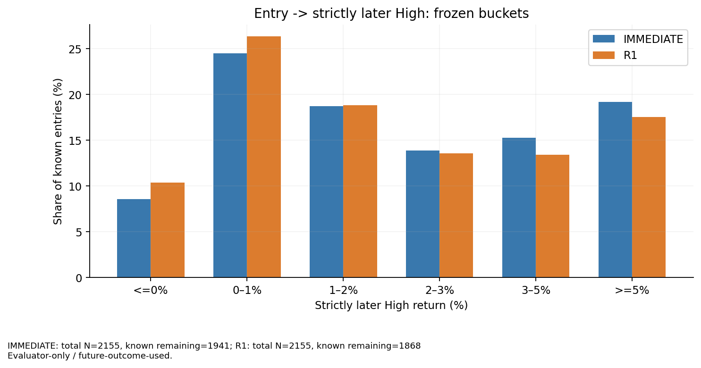
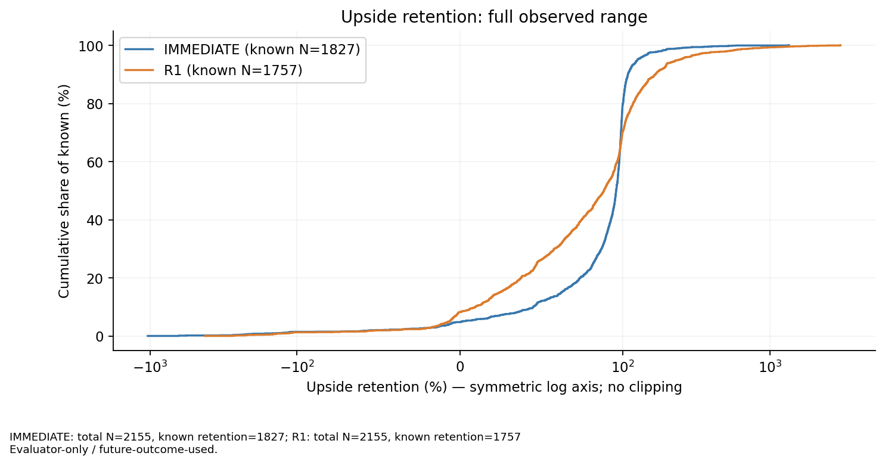
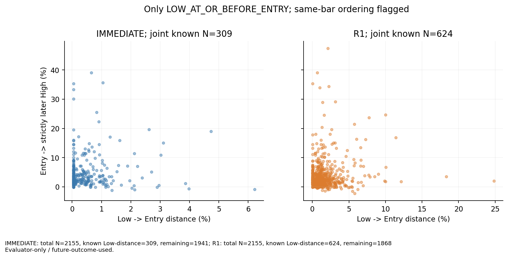
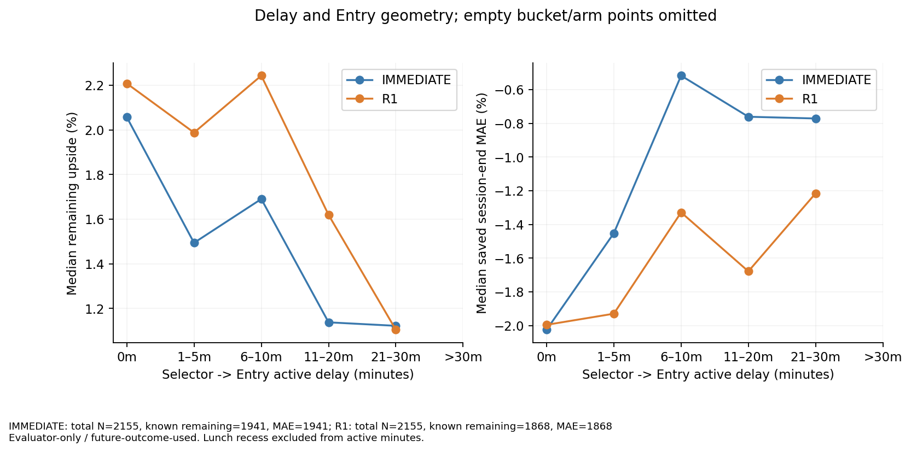
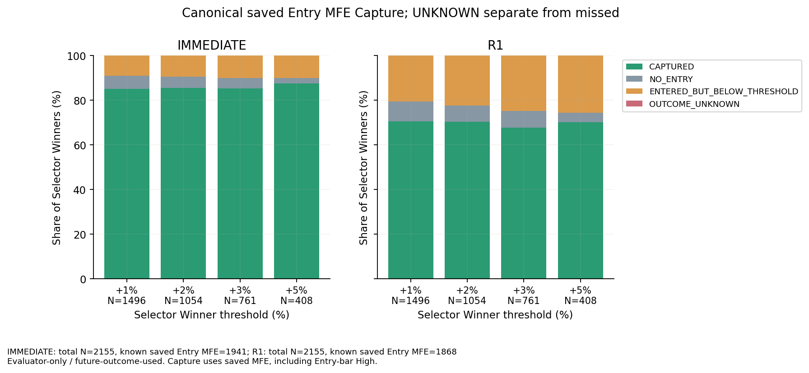
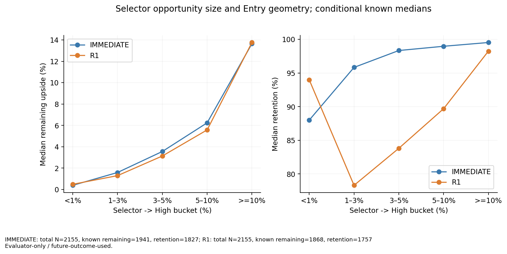
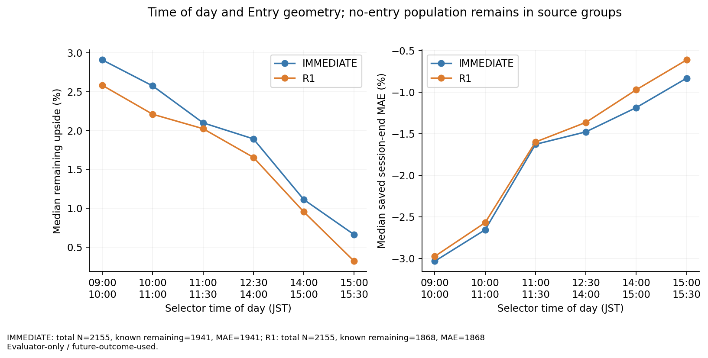

# 📐 Ark Terminal — Entry Geometry / Capture Baseline

- **現在status:** ENTRY_GEOMETRY_BASELINE_AUDIT_PASS + HYBRID_ENTRY_NEXT_SPEC_DRAFT_READY
- **latest HEAD（C6作業開始時のGitHub GET）:** `5495e0e6f67eca9e533127ae7f567607ebedb407`
- **JST（この報告生成時の実時刻）:** 2026-10-02T23:59:48.213981+09:00
- **完了範囲:** C1 source freeze、C2 metric freeze、C3 saved join、C4 13表枠・7図、C5 独立監査、C6 解釈・次仕様草案。
- **次の方針:** 別の有限PrecommitでHybrid Entryのfit可否を判断する。草案statusは **PROPOSED_NOT_AUTHORIZED**。今回のfitは0。

Document ID: `WORK_ENTRY_GEOMETRY_CAPTURE_BASELINE_20261002_V1`

C6保存結果のHEADはGitHub commit自体が正本であり、本文で未来のSHAを予測しない。納品receiptと最終応答に保存後GETで確認したresult HEADを記録する。

## 🧭 結論と適用範囲

R1は中央値でSelector上昇余地の**88.316%**を残すが、IMMEDIATEの**95.760%**を下回る。残存upside中央値は**1.672%**、session-end MAE中央値は**−1.606%**である。同じOpportunityの共通known 1,868件では、R1は残存upside平均を**0.255 pp**失う一方、MAE平均は**0.223 pp**浅くなる。利益・実現P&L・exit性能・昇格の証拠ではない。

R1のRetention平均**102.176%**は、小さい正のSelector MFEを分母にした大きな比率に影響される。全体平均だけで改善とは判断しない。Winner ≥1%のRetention平均は**79.746%**、中央値は**86.337%**である。0〜100へのclip、UNKNOWNの0補完、標本の独立数への水増しは行っていない。

これは保存済み・既にoutcome-exposedなDevelopmentのdescriptive baselineである。各armの分母は同じ2,155 Opportunity、58 sessions、950 symbols。armごとのknown-only平均にはfill選択・missingness・残り観測時間が異なる。以下のfuture outcomeはすべて**evaluator-only / future-outcome-used**であり、decisionには使用しない。

## 🧊 C1/C2 — Sourceと意味の固定

Original Frozen Selectorの3,800 rows / 760 timestamps / 76 sessions / 934 symbolsと、今回のcanonical Entry 2,155 Opportunities / 58 sessions / 950 symbolsは別の保存lineageである。3,800を2,155へ切り詰めたり、元のTRAIN38 / VALIDATION19 / DEVELOPMENT_TEST19を現在母集団へ再適用したりしていない。38/19/19はCheckpoint 00の保存receiptを権威とする。現在の58 sessionsは2025-05-30〜2025-08-25の旧Entry研究で既にexposedであり、新しいValidation/OOS openではない。

`ENTRY_DUAL_FREEZE_R10.json`が正式に保持するIMMEDIATEとAll-Material R1だけを比較した。R1 frozen entry-records SHA-256は`15ddb5cfc5169024878ee72d9dbecc6e1d9dec24e78afa2dcdf8dea891117fa6`、saved raw-path SHA-256は`37853e73799544be6fd6eb955de514073dd13671692426291a9fdb6d80056c6b`。全sourceのGit blob・SHA-256・HEAD・exposureはSOURCE_MANIFEST.jsonにある。

保存済み`orderedOracle`は最大の**strict Low→High rebound**であり、global Low/Highとは異なる。従来のquality、Entry position、range retention、oracleはそのまま別欄に保持した。global extremaの時刻と厳密なEntry後最大Highは未保存のため、許可された保存raw pathから機械的に計算した。新Replay・fill生成・provider取得はない。

Selector→Highは権威ある保存済み`selectorOutcome.mfeEnd`を利用し、継承されたmax(0,...)を保つ。負のunclipped global-high returnは別診断欄に保存した。Entry→Later Highは**Entry minuteよりstrictに後のbar**の最大HIGHを使う。Entry barのHighを含むcanonical saved MFEによるCaptureとは分離する。両者を混ぜない。

Lowはpost-Selectorの観測global Lowである。Low minute≤Entry minuteだけをLow→Entryとし、LowがEntry後ならEntry→Future Lowのdownsideとして保存する。同一bar内のLow/Entryの実順序は不明である。global Lowであったと確定すること自体はfuture outcomeなので、過去running Lowのcausal featureとは区別する。

primary extremaはcanonical full-session admissionが通った行だけ評価する。このadmissionは保存sourceのslot/endpoint完全性であり、毎minuteの全取引を観測した保証ではない。30/60m MAEは保存ラベルと元のCOMPLETE/PARTIAL/CENSORED statusを保持する。

active minutesはAM09:00–11:30とPM12:30–15:30の区間長。昼休み60分を除外し、wall-clockを別欄に保存する。bucket境界はC2から固定のままである。

## 📋 TABLE 1 — 母集団・fill・unknown・oracle

| 項目 | IMMEDIATE | R1 |
| --- | --- | --- |
| population_N | 2155 | 2155 |
| unique_opportunity_N | 2155 | 2155 |
| sessions | 58 | 58 |
| symbols | 950 | 950 |
| fill_N | 1963 | 1885 |
| no_entry_N | 192 | 270 |
| canonical_full_session_evaluable_N | 2092 | 2092 |
| selector_outcome_known_N | 2092 | 2092 |
| strict_later_high_known_N | 1941 | 1868 |
| saved_entry_outcome_known_N | 1941 | 1868 |

| remaining upsideのunknown理由 | IMMEDIATE | R1 |
| --- | --- | --- |
| NO_ENTRY | 192 | 270 |
| FULL_SESSION_NOT_EVALUABLE | 22 | 17 |
| NO_STRICTLY_LATER_HIGH | 0 | 0 |
| JOIN_MISMATCH | 0 | 0 |

Selector outcome UNKNOWN63件はWinnerに割り当てない。fillしてもfull-sessionが評価できない行はIMMEDIATE22件、R1 17件。join missing・重複・identity不一致はすべて0。NO_ENTRY理由は両armとも保存上RETRY_EXHAUSTEDである。

## 📈 TABLE 2 — Selector→High

| Selector upside bucket | N（各arm共通） |
| --- | --- |
| <1% | 596 |
| 1–3% | 735 |
| 3–5% | 353 |
| 5–10% | 267 |
| >=10% | 141 |
| UNKNOWN | 63 |

known N=2092、平均3.448%、中央値2.014%。全quantileとmin/maxは付録にある。

## 🚀 TABLE 3 — Entry→Later High

| remaining upside bucket | IMMEDIATE N | R1 N |
| --- | --- | --- |
| <=0% | 166 | 194 |
| 0–1% | 475 | 492 |
| 1–2% | 363 | 352 |
| 2–3% | 269 | 253 |
| 3–5% | 296 | 250 |
| >=5% | 372 | 327 |
| UNKNOWN | 214 | 287 |

| 指標（%） | IMMEDIATE 平均 / 中央値 / known N | R1 平均 / 中央値 / known N |
| --- | --- | --- |
| entry_to_later_high_pct | 3.303 / 1.872 / 1941 | 3.098 / 1.672 / 1868 |
| entry_mae_end_pct | -2.977 / -1.763 / 1941 | -2.819 / -1.606 / 1868 |
| entry_mae_30_pct | -1.870 / -1.231 / 1365 | -1.748 / -1.103 / 1328 |
| entry_mae_60_pct | -2.513 / -1.664 / 1117 | -2.351 / -1.505 / 1092 |

## 📉 TABLE 4 — Upside Retention

| Retention（%） | IMMEDIATE | R1 |
| --- | --- | --- |
| N | 2155 | 2155 |
| known_N | 1827 | 1757 |
| unknown_N | 328 | 398 |
| mean | 85.385 | 102.176 |
| median | 95.760 | 88.316 |
| p5 | 1.127 | -6.460 |
| p25 | 81.633 | 47.224 |
| p75 | 99.274 | 105.795 |
| p90 | 107.971 | 165.887 |
| p95 | 125.275 | 238.052 |
| min | -1,038.799 | -422.688 |
| max | 1,352.561 | 3,034.644 |

| clipせず保持した行 | IMMEDIATE | R1 |
| --- | --- | --- |
| negative_N | 88 | 146 |
| greater_than_100_N | 364 | 519 |

100%超はEntry価格改善等によりEntry基準の上昇率がSelector基準を上回ることを含む。負値はstrictly later HighでもEntry価格に届かないことを示す。小さい分母のratioは不安定で、平均が中央値より高くても優位のGateにはならない。図は全データを表示し、軸だけをsymmetric logにしている。

## 📏 TABLE 5 — Low→Entry（Low≤Entryのみ）

| Ordering | IMMEDIATE | R1 |
| --- | --- | --- |
| LOW_AT_OR_BEFORE_ENTRY | 309 | 624 |
| LOW_AFTER_ENTRY | 1632 | 1244 |
| LOW_UNKNOWN | 22 | 17 |
| NO_ENTRY | 192 | 270 |
| same-bar真の順序不明 | 245 | 109 |

| Low→Entry bucket | IMMEDIATE N | R1 N |
| --- | --- | --- |
| <=0% | 0 | 0 |
| 0–0.5% | 215 | 163 |
| 0.5–1% | 48 | 130 |
| 1–2% | 30 | 170 |
| 2–3% | 10 | 68 |
| >=3% | 6 | 93 |

| 指標（%） | IMMEDIATE 平均 / 中央値 / known N | R1 平均 / 中央値 / known N |
| --- | --- | --- |
| low_to_entry_pct | 0.484 / 0.127 / 309 | 1.650 / 1.084 / 624 |

Low distanceとremaining upsideのSpearmanはIMMEDIATE +0.015（joint known309）、R1 +0.056（joint known624）。この限定母集団では「Lowから離れるほどremaining upsideが減る」という単調関係を確認できない。Opportunityの大きさ・価格基準・将来Low順序への条件付けが混在するため、causal効果ではない。

## 🔻 TABLE 6 — LOW_AFTER_ENTRYのdownside

| arm | cohort N / known N | Future Low 平均% | Future Low 中央値% | saved MAE 平均% | saved MAE 中央値% |
| --- | --- | --- | --- | --- | --- |
| IMMEDIATE | 1632 | -3.462 | -2.262 | -3.462 | -2.262 |
| R1 | 1244 | -3.798 | -2.621 | -3.798 | -2.621 |

このfuture-Low cohortではFuture Low returnとsaved MAEが一致する。R1全体のMAEは浅くても、このcohortのMAEはIMMEDIATEより深い。future Lowを「Lowから上でEntryした距離」に混ぜると、この差を見落とす。

## ⏱️ TABLE 7 — Selector→Entry delay

| active delay bucket | IMMEDIATE fills N | R1 fills N |
| --- | --- | --- |
| 0m | 1392 | 274 |
| 1–5m | 428 | 284 |
| 6–10m | 44 | 66 |
| 11–20m | 73 | 1022 |
| 21–30m | 26 | 239 |
| >30m | 0 | 0 |
| UNKNOWN | 192 | 270 |

| 時間指標（minutes） | IMMEDIATE 平均 / 中央値 / known N | R1 平均 / 中央値 / known N |
| --- | --- | --- |
| selector_to_entry_active_minutes | 1.453 / 0.000 / 1963 | 14.080 / 20.000 / 1885 |
| selector_to_entry_wall_minutes | 6.557 / 0.000 / 1963 | 18.982 / 20.000 / 1885 |

| delay | arm | N | known | remaining平均% | remaining中央値% | MAE中央値% | remaining≥2% share | remaining≥3% share |
| --- | --- | --- | --- | --- | --- | --- | --- | --- |
| 0m | IMMEDIATE | 1392 | 1384 | 3.494 | 2.057 | -2.025 | 51.23 | 36.92 |
| 0m | R1 | 274 | 269 | 3.941 | 2.208 | -1.995 | 53.90 | 40.89 |
| 1–5m | IMMEDIATE | 428 | 422 | 2.830 | 1.494 | -1.452 | 41.47 | 27.96 |
| 1–5m | R1 | 284 | 277 | 3.424 | 1.988 | -1.929 | 49.82 | 37.18 |
| 6–10m | IMMEDIATE | 44 | 42 | 2.871 | 1.690 | -0.517 | 42.86 | 33.33 |
| 6–10m | R1 | 66 | 64 | 3.819 | 2.243 | -1.328 | 51.56 | 37.50 |
| 11–20m | IMMEDIATE | 73 | 68 | 2.657 | 1.138 | -0.761 | 38.24 | 27.94 |
| 11–20m | R1 | 1022 | 1020 | 2.892 | 1.619 | -1.678 | 43.04 | 28.92 |
| 21–30m | IMMEDIATE | 26 | 25 | 3.168 | 1.122 | -0.771 | 36.00 | 24.00 |
| 21–30m | R1 | 239 | 238 | 2.457 | 1.105 | -1.215 | 31.51 | 18.91 |
| >30m | IMMEDIATE | 0 | 0 | UNKNOWN | UNKNOWN | UNKNOWN | UNKNOWN | UNKNOWN |
| >30m | R1 | 0 | 0 | UNKNOWN | UNKNOWN | UNKNOWN | UNKNOWN | UNKNOWN |

R1は0mと6–10mでremaining中央値が2%超だが、6–10mのknownは64件。11–20mは平均2.892%・中央値1.619%、≥2%が43.04%、≥3%が28.92%。21–30mにも≥2%が31.51%残る。ただしdelayの最適上限を探索した結果ではなく、10mまでなら安全というGateも作っていない。>30mは保存fill0件で推論不能。

delayとremainingのSpearmanはIMMEDIATE −0.118、R1 −0.131。delayとsigned MAEは+0.197、+0.076で、後者の正値は逆行が浅い方向である。待機によるprice改善・fill選択・time-of-day・終値までの露出時間が絡むので、待てば必ず改善するとは結論しない。

## ⌛ TABLE 8 — Entry→Highの残り時間

| remaining active time bucket | IMMEDIATE N | R1 N |
| --- | --- | --- |
| <=5m | 349 | 393 |
| 6–15m | 275 | 250 |
| 16–30m | 247 | 220 |
| 31–60m | 334 | 335 |
| >60m | 736 | 670 |
| UNKNOWN | 214 | 287 |

| 時間指標（minutes） | IMMEDIATE 平均 / 中央値 / known N | R1 平均 / 中央値 / known N |
| --- | --- | --- |
| entry_to_high_active_minutes | 65.328 / 39.000 / 1941 | 62.093 / 36.000 / 1868 |
| entry_to_high_wall_minutes | 79.424 / 41.000 / 1941 | 77.446 / 39.500 / 1868 |

Entry後Highまでactive中央値は39m / 36m。昼休みを跨ぐEntry→Highは456 / 478件、Selector→Entryは167 / 154件で、独立監査はそれぞれwall-active=60mを確認した。残りHigh時刻もfuture outcomeであり、当時のdecision featureではない。

## 🎯 TABLE 9 — Winner Capture / Missed

| Selector Winner | arm | Winner N | CAPTURED | NO_ENTRY | entered below | UNKNOWN | known missed | Capture% |
| --- | --- | --- | --- | --- | --- | --- | --- | --- |
| +1% | IMMEDIATE | 1496 | 1275 | 87 | 134 | 0 | 221 | 85.23 |
| +1% | R1 | 1496 | 1057 | 133 | 306 | 0 | 439 | 70.66 |
| +2% | IMMEDIATE | 1054 | 902 | 52 | 100 | 0 | 152 | 85.58 |
| +2% | R1 | 1054 | 741 | 78 | 235 | 0 | 313 | 70.30 |
| +3% | IMMEDIATE | 761 | 649 | 35 | 77 | 0 | 112 | 85.28 |
| +3% | R1 | 761 | 516 | 56 | 189 | 0 | 245 | 67.81 |
| +5% | IMMEDIATE | 408 | 357 | 10 | 41 | 0 | 51 | 87.50 |
| +5% | R1 | 408 | 286 | 18 | 104 | 0 | 122 | 70.10 |

canonical Captureは保存MFEを権威としEntry barを含む。strict-later sensitivityのCapture率は以下。UNKNOWNをmissへ合算していない。ここではWinnerのentered outcome UNKNOWNは全thresholdで0だが、Selector UNKNOWN63件は別途残る。

| threshold | IMMEDIATE canonical% / strict% | R1 canonical% / strict% |
| --- | --- | --- |
| +1% | 85.23 / 84.69 | 70.66 / 70.45 |
| +2% | 85.58 / 85.58 | 70.30 / 70.11 |
| +3% | 85.28 / 85.28 | 67.81 / 67.81 |
| +5% | 87.50 / 87.25 | 70.10 / 69.85 |

### 🧩 Missedの内訳と遅延の関連

| threshold | arm | no entry | entered below: global High≤Entry minute | entered below: global High>Entry minute | outcome unknown |
| --- | --- | --- | --- | --- | --- |
| +1% | IMMEDIATE | 87 | 38 | 96 | 0 |
| +1% | R1 | 133 | 190 | 116 | 0 |
| +2% | IMMEDIATE | 52 | 16 | 84 | 0 |
| +2% | R1 | 78 | 104 | 131 | 0 |
| +3% | IMMEDIATE | 35 | 7 | 70 | 0 |
| +3% | R1 | 56 | 61 | 128 | 0 |
| +5% | IMMEDIATE | 10 | 3 | 38 | 0 |
| +5% | R1 | 18 | 23 | 81 | 0 |

R1の+1% known missed439件はNO_ENTRY133、High≤Entry minute190、Highが後でもEntry基準upside不足116。+5% missed122件は18 / 23 / 81。+5%では、単にglobal Highを過ぎたことよりも、Highが後に存在してもEntry price基準で5%が残らない分類が多い。High≤Entryは同一barを含むchronology proxyであり、遅いEntryが原因と確定した件数ではない。NO_ENTRYは全件保存上RETRY_EXHAUSTEDであり、価格・流動性不足のcausal内訳は追加推測しない。

## 🪜 TABLE 10 — Selector upside bucket × Geometry

| Selector bucket | arm | N | remaining known | remaining中央値% | retention known | retention平均% | retention中央値% |
| --- | --- | --- | --- | --- | --- | --- | --- |
| <1% | IMMEDIATE | 596 | 532 | 0.389 | 418 | 70.974 | 88.000 |
| <1% | R1 | 596 | 505 | 0.487 | 394 | 179.770 | 93.983 |
| 1–3% | IMMEDIATE | 735 | 683 | 1.591 | 683 | 85.154 | 95.832 |
| 1–3% | R1 | 735 | 658 | 1.296 | 658 | 76.873 | 78.311 |
| 3–5% | IMMEDIATE | 353 | 328 | 3.557 | 328 | 91.855 | 98.339 |
| 3–5% | R1 | 353 | 315 | 3.134 | 315 | 77.779 | 83.811 |
| 5–10% | IMMEDIATE | 267 | 262 | 6.239 | 262 | 94.465 | 98.970 |
| 5–10% | R1 | 267 | 258 | 5.576 | 258 | 83.488 | 89.694 |
| >=10% | IMMEDIATE | 141 | 136 | 13.645 | 136 | 97.737 | 99.529 |
| >=10% | R1 | 141 | 132 | 13.757 | 132 | 91.444 | 98.245 |

| Winner帯 | arm | Winner N | known | Retention平均% | Retention中央値% | remaining中央値% |
| --- | --- | --- | --- | --- | --- | --- |
| ≥1% | IMMEDIATE | 1496 | 1409 | 89.660 | 97.126 | 2.814 |
| ≥1% | R1 | 1496 | 1363 | 79.746 | 86.337 | 2.484 |
| ≥2% | IMMEDIATE | 1054 | 1002 | 91.783 | 98.011 | 3.838 |
| ≥2% | R1 | 1054 | 976 | 81.051 | 88.970 | 3.456 |
| ≥3% | IMMEDIATE | 761 | 726 | 93.899 | 98.551 | 5.087 |
| ≥3% | R1 | 761 | 705 | 82.427 | 90.143 | 4.571 |
| ≥5% | IMMEDIATE | 408 | 398 | 95.583 | 99.037 | 7.496 |
| ≥5% | R1 | 408 | 390 | 86.181 | 93.936 | 6.895 |

R1でもSelector 3–5%帯のremaining中央値3.134%、5–10%帯5.576%、≥10%帯13.757%が残る。Lowぴったりを要求せず、当時のcausal情報からこうした機会を維持し、downsideを同時に見る余地がある。ただしSelector Winner帯はfuture outcomeによる評価用分類であり、当時のSelector scoreをそのままWinner確率とはみなさない。

## 🕘 TABLE 11 — Time-of-day × Geometry

| Selector時刻 JST | arm | N | known | remaining中央値% | MAE中央値% | Highまでactive中央値m |
| --- | --- | --- | --- | --- | --- | --- |
| 09:00–10:00 | IMMEDIATE | 290 | 285 | 2.907 | -3.034 | 53.000 |
| 09:00–10:00 | R1 | 290 | 279 | 2.580 | -2.975 | 60.000 |
| 10:00–11:00 | IMMEDIATE | 509 | 478 | 2.573 | -2.656 | 59.500 |
| 10:00–11:00 | R1 | 509 | 465 | 2.208 | -2.570 | 55.000 |
| 11:00–11:30 | IMMEDIATE | 419 | 354 | 2.097 | -1.628 | 59.000 |
| 11:00–11:30 | R1 | 419 | 335 | 2.022 | -1.600 | 51.000 |
| 12:30–14:00 | IMMEDIATE | 399 | 361 | 1.891 | -1.478 | 46.000 |
| 12:30–14:00 | R1 | 399 | 350 | 1.653 | -1.364 | 45.000 |
| 14:00–15:00 | IMMEDIATE | 359 | 316 | 1.111 | -1.186 | 28.000 |
| 14:00–15:00 | R1 | 359 | 298 | 0.952 | -0.971 | 22.000 |
| 15:00–15:30 | IMMEDIATE | 179 | 147 | 0.659 | -0.833 | 10.000 |
| 15:00–15:30 | R1 | 179 | 141 | 0.317 | -0.612 | 3.000 |

R1の朝09–10時remaining中央値2.580%に対し15–15:30は0.317%。session-endまでの観測時間が異なるため、時間帯と残りactive時間を次研究の必須controlにする。Entry時刻別の同形式全統計もTIME_GEOMETRY.jsonに保存した。

## 🧬 TABLE 12 — State9 Geometryの可用性

**NOT_AVAILABLE_EXACT_SOURCE_JOIN_NOT_CERTIFIED**。保存Entryのnine-pattern sourceは旧State-v3 contractであり、最終RC2 State9と同一ではない。RC2 V3/V6のsaved trace source identityと、このEntryのsymbol/session・raw price basisとの正確な同一性を認証できなかった。近時刻join・ラベル名置換・State再生成は行わず、旧StateをRC2の差として報告しない。State9別Geometry差は今回回答不能。これは許可されたNOT_AVAILABLE receiptであり、baselineの算術PASSを妨げない。

## 🧮 TABLE 13 — Session / symbol concentration

| 単位 | unique N | 最大share% | top5 share% | top10 share% | HHI | 機会数min / median / max |
| --- | --- | --- | --- | --- | --- | --- |
| session | 58 | 2.042 | 10.023 | 19.582 | 0.017399 | 28 / 37 / 44 |
| symbol | 950 | 0.882 | 3.759 | 6.775 | 0.002123 | 1 / 1 / 19 |

| session 上位5 | Opportunity N | share% | IMMEDIATE fills / remaining known | R1 fills / remaining known |
| --- | --- | --- | --- | --- |
| 2025-06-23 | 44 | 2.042 | 41 / 40 | 39 / 38 |
| 2025-08-15 | 44 | 2.042 | 38 / 37 | 35 / 35 |
| 2025-07-10 | 43 | 1.995 | 34 / 34 | 33 / 33 |
| 2025-08-07 | 43 | 1.995 | 39 / 39 | 39 / 39 |
| 2025-06-09 | 42 | 1.949 | 32 / 32 | 29 / 29 |

| symbol 上位5 | Opportunity N | share% | IMMEDIATE fills / remaining known | R1 fills / remaining known |
| --- | --- | --- | --- | --- |
| 65740 | 19 | 0.882 | 14 / 14 | 13 / 13 |
| 52550 | 17 | 0.789 | 17 / 17 | 17 / 17 |
| 30700 | 15 | 0.696 | 15 / 15 | 14 / 14 |
| 57210 | 15 | 0.696 | 14 / 14 | 14 / 14 |
| 65730 | 15 | 0.696 | 15 / 15 | 15 / 15 |

同じsymbolの複数sessionと同じsessionの複数symbolは独立標本とは宣言しない。全58 sessions・950 symbolsのfill / known / remaining統計・+5% Capture件数をCONCENTRATION.jsonに保持する。新しいconcentration Gateや有意性Gateは作らない。

## 🔍 C5 — 独立監査と共通known比較

| 検証 | 結果 |
| --- | --- |
| status | ENTRY_GEOMETRY_BASELINE_AUDIT_PASS |
| 機械的チェック数 | 307655 |
| mismatch | 0 |
| 絶対許容差 pct | 1e-08 |
| 最大観測絶対誤差 | 2.6297186650481308e-11 |
| 原本hash / counts / identity / ordering / buckets / lunch / Capture | PASS |
| UNKNOWNの0補完 / future decision use | false / false |

主join・主aggregateをimportせず、保存原本からDecimal比率、streaming extrema、trading区間との交差時間、手動sorted quantileで再計算した。既存scorecardは再計算の入力ではなく、最後のCapture parity authorityとして使用した。+5と+3の分母区別、Entry前High不使用、Entry後Lowをdistanceに混ぜないことも確認した。

| 指標（%またはminutes） | 共通known N | IMMEDIATE平均 | R1平均 | paired差 R1−IM平均 | paired差中央値 |
| --- | --- | --- | --- | --- | --- |
| entry_mae_end_pct | 1868 | -3.042 | -2.819 | 0.223 | 0.000 |
| entry_to_later_high_pct | 1868 | 3.353 | 3.098 | -0.255 | 0.000 |
| selector_to_entry_active_minutes | 1885 | 1.373 | 14.080 | 12.707 | 20.000 |
| upside_retention_pct | 1757 | 85.739 | 102.176 | 16.437 | 0.000 |

paired Retention差の平均は+16.437 ppでも中央値差は0。ratio tailを除去せず保持した結果であり、残存upsideのpaired平均差−0.255 ppと併せて読む。新bootstrap・CI・performance significance Gateはない。

## 🧭 C6 — 10の問いへの回答と次研究

| 問い | Evidenceからの回答 |
| --- | --- |
| Selector Opportunityを何%残すか | 全体Retention mean / medianはIMMEDIATE 85.385 / 95.760%、R1 102.176 / 88.316%。known Nは1,827 / 1,757で、ratio tailと選択差を伴う。 |
| Winner帯でも維持するか | R1の≥3% Winner Retention mean / medianは82.427 / 90.143%、≥5%は86.181 / 93.936%。上昇余地は残るがIMMEDIATEよりCaptureを失う。 |
| Lowからどれだけ上か | Low≤EntryのみR1 mean / median 1.650 / 1.084%、known624。その他を同じLow-distanceへ混ぜない。same-bar109件は真の順序不明。 |
| Lowから離れるとupsideが減るか | R1 Spearman+0.056で単調減少を確認できない。futureで条件付けた限定cohortであり、因果関係は判断できない。 |
| delayとremaining | 弱い負の関連。R111–20mのknown1,020で中央値1.619%、21–30mのknown238で1.105%。 |
| delayとMAE | signed MAEと弱い正の関連。全体paired平均は0.223 pp浅いが、session-end露出時間とfill選択の違いを含む。 |
| どの程度のdelayで数%残るか | R1は0m・6–10mでmedian>2%。11–20mでも43.04%が≥2%、28.92%が≥3%。次specは時間帯・機会強度をcontrolし、任意のdelay閾値を今決めない。 |
| Missedの主因 | 既知分類ではR1はentered belowが多い。+5% missed122はno-entry18 / global High≤Entry23 / Highが後でもupside不足81。causal理由の確定ではない。 |
| State9差 | 正確な最終RC2 join未認証のため回答不能。State-v3は代用しない。 |
| 次に見るcausal family | 最低限は価格構造 + Selector時点の保存情報 + active delay/time-of-day。RC2 State9はidentity認証後の追加family候補。volume/liquidityはその次にsource可用性を固定して1familyずつ。relative strength・market/sector・volatilityは後続候補。 |

対象は「底ぴったり」ではなく、**Entry後に数%のupsideが残り、downsideとのバランスが良いEntry**。まだ「良いdownside」の許容値をfitや探索で決めていない。NEXT_HYBRID_ENTRY_SPEC_DRAFT.mdへtarget / metric / minimum feature / missingness / audit / bounded research案を保存し、PROPOSED_NOT_AUTHORIZEDで停止する。

## 🛡️ V6結論・実行境界

| V6既存結論（再実行なし） | R1 dangerous UP→DOWN | R2 Full State9 | improvement pp | 95% CI pp |
| --- | --- | --- | --- | --- |
| V6-only | 10.186757% | 9.665227% | +0.521530 | [−1.630718, +2.367065] |
| V5+V6 pooled | 11.025943% | 9.671848% | +1.354095 | [−0.171312, +2.723970] |

STATE_R2_SIGNAL_NOT_REPLICATED、calibration FAIL、pooled dangerous PASS=falseを維持する。TRUE_NULL / sample / concentration / independent audit / core auditは既存PASS、mismatch=0、direct future leakageなし。R2 probabilityや未検証rankをEntry thresholdへ使わない。State / Path / 既存target定義を変更せず、自動Hybrid fit・promotionはしない。

| 実績counter | 値 |
| --- | --- |
| new_entry_model_fits | 0 |
| state_model_fits | 0 |
| exit_model_fits | 0 |
| threshold_searches | 0 |
| new_policy_replays | 0 |
| provider_requests | 0 |
| Protected_open | 0 |
| Holdout_open | 0 |
| Validation_new_open | 0 |
| OOS_open | 0 |
| Prospective_open | 0 |
| orders | 0 |
| paper_trades | 0 |
| live_trades | 0 |
| main_merges | 0 |
| bootstrap | 0 |

| Safety | 値 |
| --- | --- |
| executionAllowed | false |
| brokerWriteAllowed | false |
| excelOrderWriteAllowed | false |
| rssOrderFunctionAllowed | false |
| liveTradingAllowed | false |
| paperTradingAllowed | false |
| automaticPromotionAllowed | false |
| productionUpdateAllowed | false |
| transmitted | false |
| 方向 / 商品 | LONG-only / cash-equity-only |

## 📚 付録 — 全主要連続指標の必須統計

Nは各armの全2,155行。knownのみから統計量を計算し、unknownは残す。Low→Entry / Future Lowは対象外のorderingもunknown側に含むため、対象cohort統計と併読する。quantileはlinear type7。単位は末尾pctが%、minutesが分。

### 📊 IMMEDIATE

| metric | N | known_N | unknown_N | mean | median | p5 | p25 | p75 | p90 | p95 | min | max |
| --- | --- | --- | --- | --- | --- | --- | --- | --- | --- | --- | --- | --- |
| entry_mae_30_pct | 2155 | 1365 | 790 | -1.870 | -1.231 | -5.954 | -2.427 | -0.518 | -0.152 | -0.050 | -29.218 | -0.050 |
| entry_mae_60_pct | 2155 | 1117 | 1038 | -2.513 | -1.664 | -7.553 | -3.388 | -0.760 | -0.295 | -0.050 | -29.218 | -0.050 |
| entry_mae_end_pct | 2155 | 1941 | 214 | -2.977 | -1.763 | -9.593 | -3.942 | -0.714 | -0.178 | -0.050 | -29.218 | -0.050 |
| entry_to_future_low_pct | 2155 | 1632 | 523 | -3.462 | -2.262 | -10.211 | -4.518 | -1.081 | -0.539 | -0.359 | -29.218 | -0.085 |
| entry_to_high_active_minutes | 2155 | 1941 | 214 | 65.328 | 39.000 | 1.000 | 9.000 | 99.000 | 177.000 | 221.000 | 1.000 | 300.000 |
| entry_to_high_wall_minutes | 2155 | 1941 | 214 | 79.424 | 41.000 | 1.000 | 9.000 | 123.000 | 234.000 | 281.000 | 1.000 | 360.000 |
| entry_to_later_high_pct | 2155 | 1941 | 214 | 3.303 | 1.872 | -0.050 | 0.680 | 3.954 | 7.595 | 11.737 | -4.045 | 44.482 |
| low_to_entry_pct | 2155 | 309 | 1846 | 0.484 | 0.127 | 0.050 | 0.050 | 0.619 | 1.166 | 2.002 | 0.050 | 6.223 |
| selector_to_entry_active_minutes | 2155 | 1963 | 192 | 1.453 | 0.000 | 0.000 | 0.000 | 1.000 | 3.000 | 10.900 | 0.000 | 30.000 |
| selector_to_entry_wall_minutes | 2155 | 1963 | 192 | 6.557 | 0.000 | 0.000 | 0.000 | 1.000 | 19.000 | 61.000 | 0.000 | 90.000 |
| selector_to_high_pct | 2155 | 2092 | 63 | 3.448 | 2.014 | 0.000 | 0.877 | 4.088 | 7.547 | 11.871 | 0.000 | 46.000 |
| selector_to_observed_global_high_unclipped_pct | 2155 | 2092 | 63 | 3.430 | 2.014 | 0.000 | 0.877 | 4.088 | 7.547 | 11.871 | -10.305 | 46.000 |
| upside_retention_pct | 2155 | 1827 | 328 | 85.385 | 95.760 | 1.127 | 81.633 | 99.274 | 107.971 | 125.275 | -1,038.799 | 1,352.561 |

### 📊 R1

| metric | N | known_N | unknown_N | mean | median | p5 | p25 | p75 | p90 | p95 | min | max |
| --- | --- | --- | --- | --- | --- | --- | --- | --- | --- | --- | --- | --- |
| entry_mae_30_pct | 2155 | 1328 | 827 | -1.748 | -1.103 | -5.352 | -2.232 | -0.479 | -0.050 | -0.050 | -29.218 | -0.050 |
| entry_mae_60_pct | 2155 | 1092 | 1063 | -2.351 | -1.505 | -7.034 | -3.099 | -0.708 | -0.250 | -0.050 | -29.218 | -0.050 |
| entry_mae_end_pct | 2155 | 1868 | 287 | -2.819 | -1.606 | -9.526 | -3.641 | -0.641 | -0.132 | -0.050 | -31.967 | -0.050 |
| entry_to_future_low_pct | 2155 | 1244 | 911 | -3.798 | -2.621 | -10.858 | -4.832 | -1.318 | -0.691 | -0.418 | -31.967 | -0.085 |
| entry_to_high_active_minutes | 2155 | 1868 | 287 | 62.093 | 36.000 | 1.000 | 8.000 | 93.000 | 170.000 | 216.650 | 1.000 | 300.000 |
| entry_to_high_wall_minutes | 2155 | 1868 | 287 | 77.446 | 39.500 | 1.000 | 8.000 | 120.000 | 230.000 | 276.650 | 1.000 | 360.000 |
| entry_to_later_high_pct | 2155 | 1868 | 287 | 3.098 | 1.672 | -0.134 | 0.567 | 3.702 | 7.176 | 11.612 | -3.274 | 47.401 |
| low_to_entry_pct | 2155 | 624 | 1531 | 1.650 | 1.084 | 0.050 | 0.485 | 2.059 | 3.707 | 5.493 | 0.050 | 24.824 |
| selector_to_entry_active_minutes | 2155 | 1885 | 270 | 14.080 | 20.000 | 0.000 | 3.000 | 20.000 | 21.000 | 22.000 | 0.000 | 30.000 |
| selector_to_entry_wall_minutes | 2155 | 1885 | 270 | 18.982 | 20.000 | 0.000 | 3.000 | 20.000 | 25.000 | 77.400 | 0.000 | 90.000 |
| selector_to_high_pct | 2155 | 2092 | 63 | 3.448 | 2.014 | 0.000 | 0.877 | 4.088 | 7.547 | 11.871 | 0.000 | 46.000 |
| selector_to_observed_global_high_unclipped_pct | 2155 | 2092 | 63 | 3.430 | 2.014 | 0.000 | 0.877 | 4.088 | 7.547 | 11.871 | -10.305 | 46.000 |
| upside_retention_pct | 2155 | 1757 | 398 | 102.176 | 88.316 | -6.460 | 47.224 | 105.795 | 165.887 | 238.052 | -422.688 | 3,034.644 |

全数値の精度を保つJSONはGEOMETRY_SUMMARY.json、CSVはCONTINUOUS_STATISTICS.csv。fillを分母としたknown / unknownもJSONに保存する。missingnessはMISSINGNESS.json、joinはJOIN_AUDIT.json、機械的raw計算receiptはC3_RECEIPT.json、State9不使用receiptはSTATE9_GEOMETRY_NOT_AVAILABLE.json。

## 💾 Checkpoint / 正本

| Checkpoint | saved_at_jst（実時刻） | basis HEAD | result HEAD（保存後GET確認） |
| --- | --- | --- | --- |
| C1 | 2026-10-02T23:26:45.272585+09:00 | df5737a93345a46850d4b5a52b373d0bc5f233d6 | 08c914a65f5938bd87c407ecd431062ebcc43a78 |
| C2 | 2026-10-02T23:29:32.007394+09:00 | 08c914a65f5938bd87c407ecd431062ebcc43a78 | 08b99052f37db12a7ee0ac956967a5b3e5899a9e |
| C3 | 2026-10-02T23:37:34.617637+09:00 | 08b99052f37db12a7ee0ac956967a5b3e5899a9e | 987c0be273eb41a2a52b36d7ede627427921d2fd |
| C4 | 2026-10-02T23:42:50.240460+09:00 | 987c0be273eb41a2a52b36d7ede627427921d2fd | 895b7553fe24bb1e241ed217b78ba0c2439379ef |
| C5 | 2026-10-02T23:48:49.222400+09:00 | 895b7553fe24bb1e241ed217b78ba0c2439379ef | 5495e0e6f67eca9e533127ae7f567607ebedb407 |

C6はCHECKPOINTS/C6_INTERPRETATION.md/jsonへ実際の保存時刻と上記C5 result HEADをbasisとして保存する。result HEADはcommit自体を権威とする。force push / main mergeなし。
