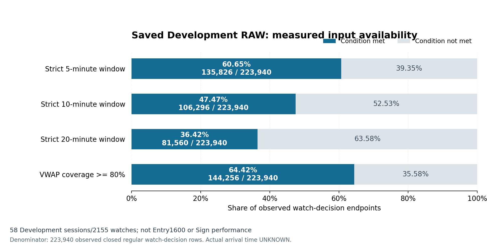

# 🧭 J-Quants接続確認・保存済みRAW復元と購入前入力監査

文書ID: ARK_JQUANTS_SIGN_INPUT_RECOVERY_REPORT_V1_20261006  
実時計JST: 2026-10-06T14:32:02+09:00  
実時計UTC: 2026-10-06T05:32:02+00:00  
対象Repo: Iam-2squared/ark-terminal  
branch: `data/jquants-sign-input-recovery-20261006-v1`  
Work開始basis HEAD: `f6c571ef416edcea1df8ff8b0bfb8223563711c1`  
公開保存のcurrent predecessor HEAD: `4779a6d67909ac0cfce41d9a6a2a2db0ed8c3d91`  
実行owner: Codex /root  
集計・図・報告作成owner: Codex /sign_finite_review  
状態: RAW_RESTORED_AUDIT_PASS_CURRENT_METADATA_ACCESS_CONFIRMED_CANONICAL_SIGN_INPUTS_BLOCKED

## ✅ 結論・前回からの差

**保存済みDevelopment RAWを原本hash一致で復元し、購入前窓の不成立を実測できた。新しいSignの学習・80%達成確認はまだ実行していない。** J-Quants APIの現在のmetadata accessはMinute／Daily／Masterの3種類で確認できたが、新しいprovider RAWは取得していない。

前回の「private入力がない」状態から、既存Actions artifactのZIP 21,223,454 bytesを復元できた。RAW sourceの5原本hash、全4,931 watchのsourceHash、正規58日・2,155 watch・Selector 2,900 events、およびwatch-grid集計は原本receiptに一致した。null guardの有限独立照合も2,016／2,016一致した。

**これらはwatch-decision gridの記述監査であり、Entry 1,600件の欠測原因やSign性能の確認ではない。** 正規Entry／EXIT／元snapshot・matrix／既存State9・Path traceの復元が次の依存条件。原本の代替やState再生成、新fitは行わない。

## 🔌 現在のAPI接続と実行予算

問い合わせ対象日は既存Developmentの`2025-08-01`。初回run [37418149802](https://github.com/Iam-2squared/ark-terminal/actions/runs/37418149802) は3件ともHTTP 200だが、初回parserのschema検査が全件不成立だった。技術訂正後run [37418440683](https://github.com/Iam-2squared/ark-terminal/actions/runs/37418440683) は全件 `METADATA_ACCESS_CONFIRMED`。

| dataset | 初回HTTP／schema | 訂正後HTTP／schema | 訂正後file数 | 一覧上のSize合計bytes |
|---|---|---|---:|---:|
| Minute | 200／不成立 | 200／成立 | 1 | 90,574,217 |
| Daily | 200／不成立 | 200／成立 | 1 | 1,997,506 |
| Master | 200／不成立 | 200／成立 | 1 | 2,265,097 |

このSizeはAPIが返した一覧metadataであり、ダウンロード済みRAW量ではない。初回と訂正後で各datasetのresponse SHA-256・response bytesは一致した。訂正後のbody encodingは全件 `identity` でgzipではなかった。この比較とparser差分から、初回のint限定`Size`検査が整数値floatを拒否したことを原因として推定できる。元本文の原トークンを公開保存して直接再確認したという主張ではなく、gzip不具合だったとは断定しない。

**初回3＋技術訂正3＝累計6 provider requestsで固定予算を終了。再run、code／test変更による再push、追加probeは行わない。** 自動retryは0。現在のmetadata access確認は、保持権、契約終了日、将来の利用権、Minute RAW全期間coverageの証明とは分ける。保持期限・利用条件の現状態は未確認として残す。

API原本は[CURRENT_ACCESS_RESULT.json](CURRENT_ACCESS_RESULT.json)と[TECHNICAL_ACCESS_RESULT.json](TECHNICAL_ACCESS_RESULT.json)、技術変更の理由・追加3件の固定は[02_TECHNICAL_PROBE_AMENDMENT.json](checkpoints/02_TECHNICAL_PROBE_AMENDMENT.json)に保持する。初回不成立の記録を上書きしていない。

## 📊 保存RAWの同一性と母集団

復元した既存ZIPはrun `37091120832`／artifact `11261429936`。ZIP SHA-256は `2db231298033006571bd8d5c709d3b19d81f0cc48644242fd763f6e891928cca`。直接artifact取得のAzure redirect Forbiddenによる旧失敗は残し、MCP artifact download経由の復元成功を別receiptとして保存した。

| 検証・対象 | 実測 | 分母・意味 |
|---|---:|---|
| RAW source原本hash一致 | 5／5 | split・ledger・RAW・Selector events・export receipt |
| sourceHashと元minute ledger一致 | 4,931／4,931 | 保存済み全watch |
| 保存RAW母集団 | 133日・4,931 watch | Development source artifact |
| 正規SESSION_SPLIT | 58日・2,155 watch・950 symbols | 原本58日へ限定 |
| Selector events | 2,900 | 同じ58日の選出イベント。watchとは別単位 |
| 予定watch-decision | 377,450 | 最初のSelector以降、予定通常足の判断endpoint |
| 観測watch-decision | 223,940／377,450 = 59.33% | 実観測の確定通常足endpoint |
| 非観測watch-decision | 153,510／377,450 = 40.67% | 上記予定と観測の差 |
| FULL／PARTIAL／SOURCE_UNAVAILABLE | 218／1,929／8 watch | 原本watch-grid supportと一致 |

当日RAWは398,050足、前日RAWは313,642足。無効OHLC／Volume／Value、重複・逆順は0。当日regular足は394,536／700,375 = 56.33%、前日regular足は310,455／700,375 = 44.33%。この分母は2,155 watchごとの日付に対応する通常1分足scheduleの合計であり、全市場の取得coverageではない。配列が存在することと、必要な時刻の通常足が存在することを区別する。

## 📉 strict窓とVWAP条件の実測

次の分母はすべて **223,940実観測watch-decision endpoint**。58 Development sessions／2,155 watchesの記述値であり、Entry 1,600件、特徴量セル率、Sign正解率のいずれとも混同しない。

| 購入前条件 | 成立件数／223,940 | 成立率 | 予定観測欠落による窓不成立 | 半日内の履歴不足 |
|---|---:|---:|---:|---:|
| strict 5分窓 | 135,826 | 60.65% | 84,509 | 3,605 |
| strict 10分窓 | 106,296 | 47.47% | 110,121 | 7,523 |
| strict 20分窓 | 81,560 | 36.42% | 127,262 | 15,118 |
| 累積VWAP coverage ≥80% | 144,256 | 64.42% | coverage未達79,684。原因別分類はこの行では未実施 | — |

図の脚注: `58 Development sessions/2155 watches; not Entry1600 or Sign performance`。SVGは[watch-grid-availability.svg](figures/watch-grid-availability.svg)、数値原本は[WATCH_GRID_AVAILABILITY_DATA.json](figures/WATCH_GRID_AVAILABILITY_DATA.json)。図は原本集計JSONのSHA-256を確認して生成し、RAW・教師・価格行を読んでいない。VWAP行はcoverage条件の成立であり、追加の価格特徴量の復元完了という意味ではない。

## 🔍 null guard照合と未確定の欠測原因

保存RAWの7列schemaは `[raw-start JST分, Open, High, Low, Close, Volume, Value]`。既存missingness adapterへ列変換なしで接続できた。結果を見る前に固定した「各日の辞書順先頭／末尾watch、最初／中間／最後の実観測endpoint、6特徴」の規則で、116 watch・58日・336 endpoint・2,016 guardを独立の時刻presence計算と照合した。

| 指標 | 件数 |
|---|---:|
| guard一致 | 2,016／2,016 |
| SCHEDULED_BAR_GAP | 938 |
| HISTORY_WINDOW_INSUFFICIENT | 228 |
| PREVIOUS_INPUT_INSUFFICIENT | 70 |
| HALF_SESSION_BOUNDARY | 44 |
| NO_KNOWN_NULL_CONDITION | 736 |

これはnull成立条件の照合であり、保存された特徴量セルとの照合ではない。`NO_KNOWN_NULL_CONDITION`もセルが正常・非nullであると認定する値ではない。旧SignのG_PRICE数値セル欠測率は104,655／167,268 = 62.57%（runtime適格1,578行×106列）だった。元Sign snapshot、Entry identity／first-intentと照合していないため、この原因を取得失敗・join故障・正当なnullのいずれかに確定していない。完全caseだけを後付け採用する処理や、欠測修復の効果の主張は行わない。

判断入力はraw-start+1分の確定足時刻まで。adapterはraw-start≥cutoffの足のH/L/C／Volume／Valueを読む前に除外する。実受信時刻はUNKNOWNであり、このbar-end可用仮定をライブの時点認証とは呼ばない。

## 🚧 残るblockerと次の方針

保存記録にある正規Independent Sign bundleは26,213,376 bytes／523 members、SHA-256 `f44ac726082843064f93666dce9cdeaa3b70a6a7503934c32e9452b61fdeab4c`。library取得は `file could not be authorized or resolved` で失敗し、このbundleは現workspaceへ復元できていない。

復元できた旧source artifactには、corrected P1_Q70 FIRST_ENTRY 1,600件、EXIT v3 trade原本、P0／P1 numeric matrix、元Sign snapshot、既存State9／Path trace、正確なdecimal source-token basisが含まれない。古いcanonical／geometry／substrateを正式Entry／EXITの代替には使わず、混合bodyも開封していない。丸め済み数値RAWから固定decimal State9を再生成して同一traceと扱わない。

次は正規bundle、または同等の凍結原本群の所在を解決し、hashを検証する。Entryの正確なidentity・first-intent・元snapshotを保持し、同一RAWとのsidecar照合で修復可能なjoin／extractorの差を特定する。必要な工程だけ元partitionを受け渡し、監査後に有限Sign契約を固定して符号分類を比較する。第2層学習・Capital Replayへ先回りしない。

現workspaceでの復元とhash検証は済んだが、消える作業領域だけの保存を永続RAW保存完了とは呼ばない。新しいprovider RAWの取得成功とも、保持権の確認完了とも分ける。

## 💾 実行量と公開成果物

| 項目 | 今回の累計 |
|---|---:|
| J-Quants metadata requests | 6。固定予算終了・追加なし |
| 新provider RAW downloads | 0 |
| 既存Actions ZIP復元 | 1件・21,223,454 bytes |
| 新fit／閾値選択／市場性能評価 | 0／0／0 |
| 第2層fit／Capital Replay | 0／0 |
| 教師行読出し／保護市場body開封 | 0／0 |
| Selector／Entry／EXIT／State／Path変更 | 0 |
| Sign通過PLUS率80%の達成確認 | 未実行・未確認 |
| 実口座操作／production promotion | 0／0 |

公開するのは集計・hash・監査コード・図・状況だけ。RAW本体、行別市場データ、教師、API key、署名付きURL、口座情報は含めない。

`audits/`へ以下8原本をbyte-identicalでコピーした。原本statusや旧失敗履歴は訂正せず、その後の成功・未完了をこの報告と新receiptで区別する。コピーした監査コードは元private配置への依存を残した原本であり、この公開directoryだけでRAW監査を再実行できるという主張ではない。

| 原本 | SHA-256 |
|---|---|
| [RESTORED_RAW_COVERAGE_AUDIT.json](audits/RESTORED_RAW_COVERAGE_AUDIT.json) | `29f07a6939a906dfddcb24e7d2e81965d29a87cbc8df52575e6d8a3b2110fae4` |
| [NULL_GUARD_ADAPTER_AUDIT.json](audits/NULL_GUARD_ADAPTER_AUDIT.json) | `e0f6a90436ef2e710a56893a2f09dcaf1ef337573bdd58a5f1453d8c86adef81` |
| [RAW_BAR_DENSITY_SUPPLEMENT.json](audits/RAW_BAR_DENSITY_SUPPLEMENT.json) | `ddaf19d7d7a875867d0fab06354d2eb25e43eae6d37d0acd09abbc5c7fb3ab96` |
| [RESTORED_RAW_AUDIT_README-ja.md](audits/RESTORED_RAW_AUDIT_README-ja.md) | `8f8e58ad257fccb4cb89a9f855ad51cdb9523decfa53d5fc61e65fb3dc54bddc` |
| [FALLBACK_RECOVERY_VERIFICATION_RECEIPT.json](audits/FALLBACK_RECOVERY_VERIFICATION_RECEIPT.json) | `88dbe3728f645b910408ead5e26a724aa112042554f495bf4c290ec5093d2077` |
| [FROZEN_ASSET_RECOVERY_AUDIT.json](audits/FROZEN_ASSET_RECOVERY_AUDIT.json) | `535f445bcd96e8151840716e6fe35b1f9eeba72a1d2160472246afa7334d4dfa` |
| [audit_recovered_source.py](audits/audit_recovered_source.py) | `6040297f40ed354c50d111ab4fd6986e55cca2961a48c855cb2c1bbc4da34b6a` |
| [audit_null_guard_adapter.py](audits/audit_null_guard_adapter.py) | `cd5dc438611116705fb1a818a403aad1fb340586706f1e5c6ba1e0ad9d97cedf` |

図の生成コードは[plot_watch_availability.py](audits/plot_watch_availability.py)。本報告作成時点ではGitHubへの保存・actual GET読み戻しはrootの後続作業であり、local成果物の作成をGitHub保存完了とは呼ばない。
