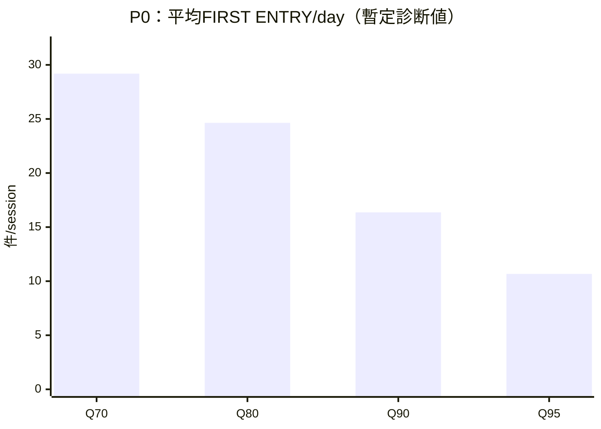

# Ark Terminal — FIRST ENTRY v2 Existing Results Readout

> **BLOCKED_SPLIT_OR_LINEAGE_MISMATCH — 以下のQ70/Q80/Q90/Q95結果は正式OOF candidateではなく、生成済み旧fit + 修正Evaluatorによる暫定診断値。**

Document ID: `WORK_FIRST_ENTRY_V2_EXISTING_RESULTS_READOUT_20261003`

actual saved_at_jst: `2026-10-03T13:58:36.034870+09:00`

actual basis_head: `4c7e5b404ae2de1715da87850d44672482f5b029`

対象FINAL HEAD: `4c7e5b404ae2de1715da87850d44672482f5b029`

branch: `persistent-watchlist-uptrend-first-entry-20261003-v2`

**readout-only / 新fit 0 / refit 0 / teacher repair実行 0 / replay 0 / market-data provider request 0 / Protected 0 / EXIT 0 / Re-entry 0 / Capital 0**。既存FINAL status・resultsを上書きしない。

既知の昼跨ぎteacher calendarのPath欠測判定ミスにより、既に修正済みのteacherと元fitのtraining eligibilityが20 head fitsで一致しない。正しいteacherで所定designを再fitすると、既存30 + 追加20 = 50 fitsとなりhard cap36を超えるため、前Workは追加fit0で停止した。このReadoutでは修復・再生成・再評価・追加実験を実行せず、既存の修正Evaluator出力と旧fitのEntry結果を転記する。方向感を確認する診断表示であり、正式candidateのFreeze／promotionを行わない。

## 1. 8-policy 超要約

> **BLOCKED_SPLIT_OR_LINEAGE_MISMATCH — 以下のQ70/Q80/Q90/Q95結果は正式OOF candidateではなく、生成済み旧fit + 修正Evaluatorによる暫定診断値。**

Primaryは58 sessions・2,155 unique `session|symbol` watches、anchorはfirst Selector event。各policyは別の仮想policyとして同じwatch集合を評価した結果であり、8 policyのEntry Nを合算しない。

| Policy | FIRST ENTRY N | 平均Entry/day | Entry rate % | Entry→High中央値 % | Retention中央値 % | Pre-peak MAE中央値 % | Path Efficiency中央値 | >=3 Capture % | >=5 Capture % |
| --- | --- | --- | --- | --- | --- | --- | --- | --- | --- |
| P0_Q70 | 1693 | 29.19 | 78.56 | 1.603 | 90.516 | 0.504 | 0.191 | 61.89 | 64.71 |
| P0_Q80 | 1429 | 24.64 | 66.31 | 1.719 | 92.958 | 0.508 | 0.225 | 53.88 | 55.64 |
| P0_Q90 | 949 | 16.36 | 44.04 | 1.786 | 91.454 | 0.517 | 0.088 | 35.74 | 37.75 |
| P0_Q95 | 619 | 10.67 | 28.72 | 1.880 | 88.618 | 0.181 | 0.050 | 23.92 | 25.98 |
| P1_Q70 | 1682 | 29.00 | 78.05 | 1.619 | 90.964 | 0.554 | 0.225 | 63.21 | 64.22 |
| P1_Q80 | 1429 | 24.64 | 66.31 | 1.719 | 91.630 | 0.569 | 0.213 | 53.88 | 56.13 |
| P1_Q90 | 930 | 16.03 | 43.16 | 1.783 | 91.812 | 0.472 | 0.068 | 35.09 | 35.78 |
| P1_Q95 | 622 | 10.72 | 28.86 | 1.919 | 89.222 | 0.281 | 0.100 | 24.05 | 26.23 |

全セルは既存REPORT-ja.mdの表示値をそのまま転記した。中央値・mean・rate・差分をこのWorkで再計算していない。High／RetentionとQ／MAEはknown metricの集合が異なるため、同じdenominatorの中央値ではない。Q・MAEのknown／unknown Nは後のPath支持表へそのまま示す。

| Family / policy | 既存の意味 |
| --- | --- |
| P0 | Price / Volume / Path / Selector context。 |
| P1 | P0 + このFINALで固定済みの最新RC2 State9 current fields + 同じRC2 State9のpast-only history。 |
| Q70 / Q80 / Q90 / Q95 | 前Workで固定済みのselectivity policies。各foldのtraining-side score分布の70 / 80 / 90 / 95 percentile閾値。成功確率を意味しない。 |

**Legacy State（旧State-v3等）はEntry featureに入っていない。** FEATURE_FREEZE.jsonのP1 fieldsとState identityを参照した。Stateロジック・feature・thresholdは変更していない。

## 2. Selector→High 1%刻みのEntry→High

> **BLOCKED_SPLIT_OR_LINEAGE_MISMATCH — 以下のQ70/Q80/Q90/Q95結果は正式OOF candidateではなく、生成済み旧fit + 修正Evaluatorによる暫定診断値。**

セルはFIRST ENTRY後のstrictly-later observed Highまでの値幅中央値（%）。既存REPORTの表を転置しただけで、bucket・中央値を再計算していない。

| Selector→High bucket | P0_Q70 | P0_Q80 | P0_Q90 | P0_Q95 | P1_Q70 | P1_Q80 | P1_Q90 | P1_Q95 |
| --- | --- | --- | --- | --- | --- | --- | --- | --- |
| 1–<2% | 1.122 | 1.140 | 1.121 | 1.121 | 1.121 | 1.121 | 1.138 | 1.110 |
| 2–<3% | 2.097 | 2.149 | 2.152 | 2.035 | 2.108 | 2.156 | 2.178 | 1.996 |
| 3–<4% | 2.846 | 2.762 | 2.733 | 2.814 | 2.955 | 2.719 | 2.868 | 2.857 |
| 4–<5% | 3.920 | 3.948 | 3.760 | 3.439 | 3.988 | 3.920 | 3.975 | 3.432 |
| >=5% | 7.048 | 7.319 | 7.299 | 7.273 | 7.198 | 7.212 | 7.268 | 7.251 |

**Selector→High bucketはfuture evaluatorによる分類であり、Entry decision featureではない。** 各bucketのwatch Nは1–<2%=442、2–<3%=293、3–<4%=217、4–<5%=136、>=5%=408。<1%=596、missing=63も既存評価に残されている。

## 3. 大Winner保持 — 累積>=1..5%

> **BLOCKED_SPLIT_OR_LINEAGE_MISMATCH — 以下のQ70/Q80/Q90/Q95結果は正式OOF candidateではなく、生成済み旧fit + 修正Evaluatorによる暫定診断値。**

CaptureはSelector winner全体を分母にし、Entry後に同じthresholdへstrictly-later observed Highで届いた割合。no-entryも分母に残る。unknownはEntryありでも欠測下で同threshold到達を確認できないケースで、no-entryとは別。以下のCapture %は既存REPORTの表示値、denominator／no-entry／unknownはWINNER_PRESERVATION.jsonの保存済み整数を転記した。

| Policy | >=1 Capture % | >=2 | >=3 | >=4 | >=5 |
| --- | --- | --- | --- | --- | --- |
| P0_Q70 | 63.90 | 64.23 | 61.89 | 63.60 | 64.71 |
| P0_Q80 | 55.82 | 56.17 | 53.88 | 55.33 | 55.64 |
| P0_Q90 | 38.03 | 38.24 | 35.74 | 36.58 | 37.75 |
| P0_Q95 | 26.14 | 25.71 | 23.92 | 24.26 | 25.98 |
| P1_Q70 | 64.17 | 64.99 | 63.21 | 63.60 | 64.22 |
| P1_Q80 | 55.35 | 56.26 | 53.88 | 55.88 | 56.13 |
| P1_Q90 | 37.43 | 37.19 | 35.09 | 35.48 | 35.78 |
| P1_Q95 | 25.94 | 25.43 | 24.05 | 24.08 | 26.23 |
| IMMEDIATE | 84.69 | 85.58 | 85.28 | 86.58 | 87.25 |
| R1 | 70.45 | 70.11 | 67.81 | 70.04 | 69.85 |

### >=1% Winner

> **BLOCKED_SPLIT_OR_LINEAGE_MISMATCH — 以下のQ70/Q80/Q90/Q95結果は正式OOF candidateではなく、生成済み旧fit + 修正Evaluatorによる暫定診断値。**

| Policy / baseline | Capture % | denominator | no-entry | unknown |
| --- | --- | --- | --- | --- |
| P0_Q70 | 63.90 | 1496 | 301 | 221 |
| P0_Q80 | 55.82 | 1496 | 464 | 185 |
| P0_Q90 | 38.03 | 1496 | 787 | 140 |
| P0_Q95 | 26.14 | 1496 | 1021 | 84 |
| P1_Q70 | 64.17 | 1496 | 310 | 214 |
| P1_Q80 | 55.35 | 1496 | 470 | 187 |
| P1_Q90 | 37.43 | 1496 | 806 | 130 |
| P1_Q95 | 25.94 | 1496 | 1024 | 84 |
| IMMEDIATE | 84.69 | 1496 | 87 | 130 |
| R1 | 70.45 | 1496 | 133 | 252 |

### >=2% Winner

> **BLOCKED_SPLIT_OR_LINEAGE_MISMATCH — 以下のQ70/Q80/Q90/Q95結果は正式OOF candidateではなく、生成済み旧fit + 修正Evaluatorによる暫定診断値。**

| Policy / baseline | Capture % | denominator | no-entry | unknown |
| --- | --- | --- | --- | --- |
| P0_Q70 | 64.23 | 1054 | 193 | 166 |
| P0_Q80 | 56.17 | 1054 | 297 | 155 |
| P0_Q90 | 38.24 | 1054 | 528 | 123 |
| P0_Q95 | 25.71 | 1054 | 695 | 88 |
| P1_Q70 | 64.99 | 1054 | 195 | 165 |
| P1_Q80 | 56.26 | 1054 | 297 | 152 |
| P1_Q90 | 37.19 | 1054 | 546 | 116 |
| P1_Q95 | 25.43 | 1054 | 698 | 88 |
| IMMEDIATE | 85.58 | 1054 | 52 | 93 |
| R1 | 70.11 | 1054 | 78 | 205 |

### **>=3% Winner**

> **BLOCKED_SPLIT_OR_LINEAGE_MISMATCH — 以下のQ70/Q80/Q90/Q95結果は正式OOF candidateではなく、生成済み旧fit + 修正Evaluatorによる暫定診断値。**

| Policy / baseline | Capture % | denominator | no-entry | unknown |
| --- | --- | --- | --- | --- |
| P0_Q70 | 61.89 | 761 | 126 | 148 |
| P0_Q80 | 53.88 | 761 | 208 | 133 |
| P0_Q90 | 35.74 | 761 | 371 | 118 |
| P0_Q95 | 23.92 | 761 | 502 | 77 |
| P1_Q70 | 63.21 | 761 | 128 | 141 |
| P1_Q80 | 53.88 | 761 | 202 | 138 |
| P1_Q90 | 35.09 | 761 | 387 | 107 |
| P1_Q95 | 24.05 | 761 | 501 | 77 |
| IMMEDIATE | 85.28 | 761 | 35 | 73 |
| R1 | 67.81 | 761 | 56 | 168 |

### >=4% Winner

> **BLOCKED_SPLIT_OR_LINEAGE_MISMATCH — 以下のQ70/Q80/Q90/Q95結果は正式OOF candidateではなく、生成済み旧fit + 修正Evaluatorによる暫定診断値。**

| Policy / baseline | Capture % | denominator | no-entry | unknown |
| --- | --- | --- | --- | --- |
| P0_Q70 | 63.60 | 544 | 81 | 101 |
| P0_Q80 | 55.33 | 544 | 146 | 90 |
| P0_Q90 | 36.58 | 544 | 256 | 89 |
| P0_Q95 | 24.26 | 544 | 355 | 57 |
| P1_Q70 | 63.60 | 544 | 84 | 103 |
| P1_Q80 | 55.88 | 544 | 137 | 94 |
| P1_Q90 | 35.48 | 544 | 268 | 83 |
| P1_Q95 | 24.08 | 544 | 352 | 61 |
| IMMEDIATE | 86.58 | 544 | 16 | 55 |
| R1 | 70.04 | 544 | 29 | 118 |

### **>=5% Winner**

> **BLOCKED_SPLIT_OR_LINEAGE_MISMATCH — 以下のQ70/Q80/Q90/Q95結果は正式OOF candidateではなく、生成済み旧fit + 修正Evaluatorによる暫定診断値。**

| Policy / baseline | Capture % | denominator | no-entry | unknown |
| --- | --- | --- | --- | --- |
| P0_Q70 | 64.71 | 408 | 64 | 67 |
| P0_Q80 | 55.64 | 408 | 117 | 58 |
| P0_Q90 | 37.75 | 408 | 196 | 58 |
| P0_Q95 | 25.98 | 408 | 268 | 34 |
| P1_Q70 | 64.22 | 408 | 67 | 70 |
| P1_Q80 | 56.13 | 408 | 106 | 67 |
| P1_Q90 | 35.78 | 408 | 203 | 59 |
| P1_Q95 | 26.23 | 408 | 266 | 35 |
| IMMEDIATE | 87.25 | 408 | 10 | 40 |
| R1 | 69.85 | 408 | 18 | 97 |

Q70→Q95でEntry頻度とCaptureにtrade-offがあることを表示している。Captureは利益やEXIT後returnではなく、今回の表示からQ70／Q95等の最終採用判断はしない。IMMEDIATE／R1のstrictly-later Captureも前Workで保存したpaired-anchor評価を引用している。

## 4. Entry Frequency

> **BLOCKED_SPLIT_OR_LINEAGE_MISMATCH — 以下のQ70/Q80/Q90/Q95結果は正式OOF candidateではなく、生成済み旧fit + 修正Evaluatorによる暫定診断値。**

全8 policyの0 Entry日は0/58日。10/day Gateは置かず、Entry数は測定済み結果として扱う。平均・中央値・day buckets・maximum simultaneous FIRST ENTRYは既存REPORTから転記した。

| Policy | mean Entry/day | median Entry/day | 0 Entry days | 1–5 days | 6–10 days | 11–15 days | >15 days | maximum simultaneous FIRST ENTRY |
| --- | --- | --- | --- | --- | --- | --- | --- | --- |
| P0_Q70 | 29.19 | 28.0 | 0 | 0 | 0 | 0 | 58 | 4 |
| P0_Q80 | 24.64 | 24.5 | 0 | 0 | 0 | 0 | 58 | 4 |
| P0_Q90 | 16.36 | 16.0 | 0 | 0 | 0 | 22 | 36 | 3 |
| P0_Q95 | 10.67 | 11.0 | 0 | 0 | 25 | 33 | 0 | 2 |
| P1_Q70 | 29.00 | 29.0 | 0 | 0 | 0 | 0 | 58 | 5 |
| P1_Q80 | 24.64 | 25.0 | 0 | 0 | 0 | 0 | 58 | 4 |
| P1_Q90 | 16.03 | 16.0 | 0 | 0 | 0 | 25 | 33 | 3 |
| P1_Q95 | 10.72 | 11.0 | 0 | 1 | 22 | 35 | 0 | 3 |

以下の図は上の既存mean Entry/dayだけを使う。y軸は件/sessionで、10/dayを基準線や合否条件にしない。

### sessionごとの保存済みFIRST ENTRY N

> **BLOCKED_SPLIT_OR_LINEAGE_MISMATCH — 以下のQ70/Q80/Q90/Q95結果は正式OOF candidateではなく、生成済み旧fit + 修正Evaluatorによる暫定診断値。**

各sessionのSelector events／unique watches／policy別FIRST ENTRY NをDAILY_FIRST_ENTRY_ACTIVITY.jsonから転記した。session集計を新しく実行していない。

| Session | Selector events | Unique watches | P0_Q70 | P0_Q80 | P0_Q90 | P0_Q95 | P1_Q70 | P1_Q80 | P1_Q90 | P1_Q95 |
| --- | --- | --- | --- | --- | --- | --- | --- | --- | --- | --- |
| 2025-05-30 | 50 | 34 | 33 | 25 | 15 | 10 | 30 | 25 | 13 | 10 |
| 2025-06-02 | 50 | 37 | 28 | 25 | 21 | 14 | 28 | 25 | 19 | 14 |
| 2025-06-03 | 50 | 38 | 27 | 25 | 13 | 8 | 27 | 22 | 12 | 8 |
| 2025-06-04 | 50 | 40 | 38 | 31 | 20 | 12 | 36 | 32 | 17 | 12 |
| 2025-06-05 | 50 | 35 | 30 | 27 | 19 | 11 | 29 | 28 | 20 | 12 |
| 2025-06-06 | 50 | 40 | 32 | 28 | 17 | 12 | 33 | 28 | 18 | 12 |
| 2025-06-09 | 50 | 42 | 29 | 25 | 20 | 13 | 29 | 27 | 20 | 13 |
| 2025-06-10 | 50 | 29 | 27 | 23 | 17 | 12 | 27 | 24 | 18 | 11 |
| 2025-06-11 | 50 | 35 | 20 | 19 | 11 | 8 | 22 | 21 | 11 | 8 |
| 2025-06-12 | 50 | 35 | 25 | 17 | 11 | 9 | 22 | 18 | 12 | 8 |
| 2025-06-13 | 50 | 38 | 30 | 28 | 16 | 11 | 31 | 27 | 17 | 10 |
| 2025-06-16 | 50 | 39 | 32 | 24 | 16 | 10 | 30 | 25 | 16 | 11 |
| 2025-06-17 | 50 | 39 | 29 | 22 | 17 | 10 | 29 | 24 | 15 | 9 |
| 2025-06-18 | 50 | 35 | 26 | 24 | 14 | 7 | 24 | 20 | 13 | 5 |
| 2025-06-19 | 50 | 39 | 29 | 23 | 15 | 11 | 31 | 21 | 14 | 12 |
| 2025-06-20 | 50 | 39 | 34 | 29 | 15 | 10 | 33 | 25 | 16 | 10 |
| 2025-06-23 | 50 | 44 | 39 | 33 | 22 | 15 | 39 | 34 | 22 | 15 |
| 2025-06-24 | 50 | 35 | 26 | 22 | 13 | 9 | 27 | 23 | 13 | 7 |
| 2025-06-25 | 50 | 38 | 28 | 23 | 12 | 8 | 33 | 23 | 12 | 9 |
| 2025-06-26 | 50 | 37 | 28 | 25 | 17 | 13 | 28 | 24 | 17 | 11 |
| 2025-06-27 | 50 | 34 | 28 | 24 | 17 | 12 | 29 | 23 | 16 | 11 |
| 2025-06-30 | 50 | 40 | 31 | 27 | 19 | 11 | 31 | 25 | 18 | 11 |
| 2025-07-01 | 50 | 28 | 23 | 22 | 17 | 12 | 22 | 21 | 15 | 11 |
| 2025-07-02 | 50 | 38 | 28 | 23 | 14 | 12 | 31 | 25 | 15 | 12 |
| 2025-07-03 | 50 | 32 | 29 | 26 | 16 | 13 | 29 | 26 | 16 | 12 |
| 2025-07-04 | 50 | 36 | 27 | 24 | 20 | 12 | 27 | 25 | 18 | 12 |
| 2025-07-07 | 50 | 36 | 28 | 22 | 15 | 10 | 27 | 22 | 17 | 9 |
| 2025-07-08 | 50 | 40 | 31 | 20 | 15 | 9 | 29 | 19 | 13 | 9 |
| 2025-07-09 | 50 | 41 | 24 | 20 | 14 | 9 | 24 | 19 | 12 | 9 |
| 2025-07-10 | 50 | 43 | 34 | 25 | 17 | 10 | 32 | 25 | 16 | 12 |
| 2025-07-15 | 50 | 34 | 28 | 23 | 16 | 11 | 29 | 25 | 15 | 10 |
| 2025-07-16 | 50 | 40 | 28 | 24 | 17 | 8 | 29 | 23 | 15 | 8 |
| 2025-07-17 | 50 | 42 | 30 | 27 | 19 | 12 | 30 | 27 | 15 | 11 |
| 2025-07-18 | 50 | 36 | 27 | 22 | 14 | 12 | 29 | 22 | 15 | 13 |
| 2025-07-22 | 50 | 32 | 28 | 25 | 14 | 9 | 27 | 26 | 16 | 9 |
| 2025-07-23 | 50 | 33 | 27 | 25 | 15 | 14 | 27 | 26 | 15 | 13 |
| 2025-07-24 | 50 | 36 | 33 | 28 | 17 | 11 | 33 | 27 | 18 | 11 |
| 2025-07-25 | 50 | 36 | 27 | 22 | 18 | 11 | 25 | 21 | 16 | 11 |
| 2025-07-28 | 50 | 37 | 28 | 20 | 15 | 9 | 28 | 21 | 14 | 9 |
| 2025-07-29 | 50 | 36 | 28 | 24 | 15 | 12 | 28 | 23 | 15 | 13 |
| 2025-07-30 | 50 | 38 | 29 | 24 | 16 | 11 | 29 | 26 | 18 | 14 |
| 2025-07-31 | 50 | 33 | 26 | 21 | 15 | 12 | 24 | 21 | 16 | 11 |
| 2025-08-01 | 50 | 36 | 27 | 24 | 18 | 6 | 26 | 24 | 17 | 8 |
| 2025-08-04 | 50 | 41 | 32 | 26 | 15 | 11 | 33 | 26 | 14 | 11 |
| 2025-08-05 | 50 | 39 | 28 | 26 | 14 | 9 | 28 | 26 | 15 | 9 |
| 2025-08-06 | 50 | 37 | 25 | 20 | 17 | 9 | 24 | 20 | 18 | 11 |
| 2025-08-07 | 50 | 43 | 34 | 27 | 17 | 12 | 32 | 27 | 18 | 12 |
| 2025-08-08 | 50 | 40 | 35 | 32 | 21 | 14 | 36 | 33 | 21 | 14 |
| 2025-08-12 | 50 | 38 | 35 | 31 | 18 | 12 | 34 | 29 | 17 | 13 |
| 2025-08-13 | 50 | 36 | 28 | 25 | 16 | 9 | 28 | 25 | 17 | 8 |
| 2025-08-14 | 50 | 36 | 29 | 26 | 18 | 11 | 29 | 26 | 18 | 11 |
| 2025-08-15 | 50 | 44 | 32 | 25 | 19 | 12 | 31 | 26 | 19 | 14 |
| 2025-08-18 | 50 | 35 | 31 | 26 | 17 | 8 | 32 | 29 | 15 | 11 |
| 2025-08-19 | 50 | 37 | 32 | 27 | 21 | 14 | 32 | 26 | 21 | 14 |
| 2025-08-20 | 50 | 40 | 27 | 24 | 16 | 8 | 26 | 21 | 14 | 8 |
| 2025-08-21 | 50 | 42 | 34 | 26 | 17 | 11 | 33 | 28 | 17 | 10 |
| 2025-08-22 | 50 | 33 | 25 | 24 | 13 | 9 | 25 | 24 | 14 | 11 |
| 2025-08-25 | 50 | 29 | 27 | 24 | 16 | 9 | 26 | 25 | 16 | 9 |

## 5. Entry単体品質

> **BLOCKED_SPLIT_OR_LINEAGE_MISMATCH — 以下のQ70/Q80/Q90/Q95結果は正式OOF candidateではなく、生成済み旧fit + 修正Evaluatorによる暫定診断値。**

すべて中央値。既存REPORTのQuality表をそのまま引用する。IMMEDIATE／R1のunpaired cohort値も参照として残すが、filled cohortの中央値同士だけでは改善を断定しない。

| Policy | Entry→High % | Retention % | Q | pre-peak MAE % | TV % | Reversal | peak active min | Entry delay min |
| --- | --- | --- | --- | --- | --- | --- | --- | --- |
| P0_Q70 | 1.603 | 90.516 | 0.191 | 0.504 | 1.872 | 1.000 | 39.000 | 4.000 |
| P0_Q80 | 1.719 | 92.958 | 0.225 | 0.508 | 1.751 | 1.000 | 44.000 | 6.000 |
| P0_Q90 | 1.786 | 91.454 | 0.088 | 0.517 | 1.520 | 1.000 | 55.000 | 7.000 |
| P0_Q95 | 1.880 | 88.618 | 0.050 | 0.181 | 1.002 | 1.000 | 59.000 | 13.000 |
| P1_Q70 | 1.619 | 90.964 | 0.225 | 0.554 | 1.761 | 1.000 | 40.000 | 4.000 |
| P1_Q80 | 1.719 | 91.630 | 0.213 | 0.569 | 1.640 | 1.000 | 43.000 | 6.000 |
| P1_Q90 | 1.783 | 91.812 | 0.068 | 0.472 | 1.443 | 1.000 | 56.000 | 7.000 |
| P1_Q95 | 1.919 | 89.222 | 0.100 | 0.281 | 1.011 | 1.000 | 62.000 | 12.000 |
| IMMEDIATE | 1.872 | 95.760 | 0.203 | 0.701 | 3.375 | 3.000 | 39.000 | 0.000 |
| R1 | 1.672 | 88.316 | 0.192 | 0.534 | 2.780 | 2.000 | 35.000 | 20.000 |

| 指標 | 定義と単位 |
| --- | --- |
| Entry→High | FIRST ENTRYのfill価格から、fill-barを除くstrictly later observed最大Highまでの上昇余地（%）。source不足の場合は真の最大Highに対するobserved下限。 |
| Upside Retention | Entry→Highとfirst-selectorのfuture High余地の比率（%）。保存済み値を引用。 |
| Pre-peak MAE | fillからearliest later max-High barまでにEntry価格から最大どれだけ下がったかの絶対値（%）。表示は各Entryの最大逆行を集計した中央値。peak-bar Lowも含む。 |
| Path Efficiency | High barのcloseまでの非負net close progress ÷ total variation。1に近いほどclose経路がまっすぐ。Highの瞬間touchだけで高品質にせず、TV=0は0。 |
| Total Variation | fill価格と後続closed 1m closesの隣接価格差の絶対値を足したfill-price基準の%（既存値）。 |
| Reversal count | Highまでのclose経路の方向反転回数（既存定義）。 |
| peak active minutes | fillからearliest later max-High barまでのactive minutes。 |
| Selector→Entry delay | first Selector anchorからfillまでのactive minutes。 |

lunchとclosing auction pauseはactive minutesへ含めない。missing minuteを補完せず、Q／MAE／TV／reversalはcomplete pre-peak pathだけ。High touchのintrabar順序はunknown。

| Policy | FIRST ENTRY N | Path known N | Path unknown N |
| --- | --- | --- | --- |
| P0_Q70 | 1693 | 393 | 1300 |
| P0_Q80 | 1429 | 307 | 1122 |
| P0_Q90 | 949 | 125 | 824 |
| P0_Q95 | 619 | 59 | 560 |
| P1_Q70 | 1682 | 374 | 1308 |
| P1_Q80 | 1429 | 304 | 1125 |
| P1_Q90 | 930 | 128 | 802 |
| P1_Q95 | 622 | 60 | 562 |

Path unknownは品質が悪いと確定した意味ではない。Q／MAEの評価可能Nがfilled Nより小さく、policy間でも異なることを維持して表示した。

## 6. IMMEDIATE / R1 paired比較

> **BLOCKED_SPLIT_OR_LINEAGE_MISMATCH — 以下のQ70/Q80/Q90/Q95結果は正式OOF candidateではなく、生成済み旧fit + 修正Evaluatorによる暫定診断値。**

同じWATCH_KEY・同じfirst-selector anchorで、両armがfilledかつそのmetricがknownのwatchだけ。paired Nはmetricごとに異なり、既存REPORTと同一。Δはwatchごとの差の中央値であり、列の中央値の単純差ではない。以下の表では既存paired Δ median=0の項目を省略しない。

### P0_Q80 vs IMMEDIATE / R1

> **BLOCKED_SPLIT_OR_LINEAGE_MISMATCH — 以下のQ70/Q80/Q90/Q95結果は正式OOF candidateではなく、生成済み旧fit + 修正Evaluatorによる暫定診断値。**

| Baseline | Metric | paired N | 新Entry median | baseline median | paired Δ median |
| --- | --- | --- | --- | --- | --- |
| IMMEDIATE | entry_to_high_pct | 1329 | 1.848 | 2.132 | 0.000 |
| IMMEDIATE | path_efficiency | 224 | 0.217 | 0.196 | 0.000 |
| IMMEDIATE | pre_peak_mae_abs_pct | 224 | 0.566 | 0.782 | 0.000 |
| IMMEDIATE | total_variation_pct | 224 | 2.066 | 2.758 | 0.000 |
| IMMEDIATE | reversal_count | 224 | 1.000 | 2.000 | 0.000 |
| IMMEDIATE | upside_retention_pct | 1244 | 93.512 | 95.956 | 0.000 |
| IMMEDIATE | selector_to_entry_active_delay | 1343 | 5.000 | 0.000 | 2.000 |
| R1 | entry_to_high_pct | 1280 | 1.895 | 1.852 | 0.000 |
| R1 | path_efficiency | 205 | 0.193 | 0.164 | 0.000 |
| R1 | pre_peak_mae_abs_pct | 205 | 0.616 | 0.652 | 0.000 |
| R1 | total_variation_pct | 205 | 2.493 | 2.368 | 0.000 |
| R1 | reversal_count | 205 | 1.000 | 1.000 | 0.000 |
| R1 | upside_retention_pct | 1198 | 93.673 | 90.441 | 0.000 |
| R1 | selector_to_entry_active_delay | 1292 | 5.000 | 20.000 | 0.000 |

### P1_Q70 vs IMMEDIATE / R1

> **BLOCKED_SPLIT_OR_LINEAGE_MISMATCH — 以下のQ70/Q80/Q90/Q95結果は正式OOF candidateではなく、生成済み旧fit + 修正Evaluatorによる暫定診断値。**

| Baseline | Metric | paired N | 新Entry median | baseline median | paired Δ median |
| --- | --- | --- | --- | --- | --- |
| IMMEDIATE | entry_to_high_pct | 1545 | 1.751 | 2.018 | 0.000 |
| IMMEDIATE | path_efficiency | 304 | 0.226 | 0.177 | 0.000 |
| IMMEDIATE | pre_peak_mae_abs_pct | 304 | 0.647 | 0.794 | 0.000 |
| IMMEDIATE | total_variation_pct | 304 | 2.149 | 3.010 | -0.026 |
| IMMEDIATE | reversal_count | 304 | 1.000 | 2.000 | 0.000 |
| IMMEDIATE | upside_retention_pct | 1441 | 91.704 | 95.619 | 0.000 |
| IMMEDIATE | selector_to_entry_active_delay | 1562 | 3.000 | 0.000 | 1.000 |
| R1 | entry_to_high_pct | 1484 | 1.819 | 1.750 | 0.000 |
| R1 | path_efficiency | 264 | 0.240 | 0.169 | 0.000 |
| R1 | pre_peak_mae_abs_pct | 264 | 0.652 | 0.689 | 0.000 |
| R1 | total_variation_pct | 264 | 2.571 | 2.947 | 0.000 |
| R1 | reversal_count | 264 | 2.000 | 2.000 | 0.000 |
| R1 | upside_retention_pct | 1383 | 91.921 | 89.172 | 0.000 |
| R1 | selector_to_entry_active_delay | 1499 | 3.000 | 20.000 | -2.000 |

High／MAE／TV／RetentionのΔはpercentage points、Qは0..1の比率差、reversalは回数差、delayはactive-minute差。両policyは前Workに既にある比較対象であり、今回の新しいcandidate選定ではない。

### canonical event-level continuity reference

> **BLOCKED_SPLIT_OR_LINEAGE_MISMATCH — 以下のQ70/Q80/Q90/Q95結果は正式OOF candidateではなく、生成済み旧fit + 修正Evaluatorによる暫定診断値。**

| Canonical event arm | event N | saved filled N | Entry→High median % | Retention median % | saved delay median min |
| --- | --- | --- | --- | --- | --- |
| IMMEDIATE | 2155 | 1963 | 1.872 | 95.760 | 0.000 |
| R1 | 2155 | 1885 | 1.672 | 88.316 | 20.000 |

上のevent-level 2,155件は既存Geometry reference。Primary watch-levelとdenominatorを加算せず、旧clockも維持して引用した。

## 7. State9：P1−P0の既存暫定差

> **BLOCKED_SPLIT_OR_LINEAGE_MISMATCH — 以下のQ70/Q80/Q90/Q95結果は正式OOF candidateではなく、生成済み旧fit + 修正Evaluatorによる暫定診断値。**

各fixed quantileの保存済みP1−P0診断差。新しい差分計算・State feature変更は行っていない。High／MAEはpercentage points、Qは0..1比率差、Capture／Entry rateはpercentage points。

| Quantile | Δ High % | Δ Q | Δ MAE % | Δ >=3 Capture pp | Δ >=5 pp | Δ Entry rate pp |
| --- | --- | --- | --- | --- | --- | --- |
| Q70 | 0.015 | 0.034 | 0.050 | 1.31 | -0.49 | -0.51 |
| Q80 | 0.000 | -0.012 | 0.061 | 0.00 | 0.49 | 0.00 |
| Q90 | -0.003 | -0.020 | -0.046 | -0.66 | -1.96 | -0.88 |
| Q95 | 0.039 | 0.050 | 0.100 | 0.13 | 0.25 | 0.14 |

既存STATE_INCREMENTAL_VALUE.jsonの機械的statusは **STATE9_NO_INCREMENTAL_UPTREND_ENTRY_VALUE_ON_DEVELOPMENT**。**lineage BLOCKにより正式結論ではない。** State9のincremental valueを確定せず、P1を正式採用しない。旧State-v3をP1として解釈しない。

## 8. 暫定的に見えること

> **BLOCKED_SPLIT_OR_LINEAGE_MISMATCH — 以下のQ70/Q80/Q90/Q95結果は正式OOF candidateではなく、生成済み旧fit + 修正Evaluatorによる暫定診断値。**

- Persistent WatchlistでFIRST ENTRYは平均10.67～29.19件/day生成されており、全policyで0 Entry日は0/58日。
- Entry後に残るobserved High余地の全体中央値は既存表で1.603～1.919%。Selector>=5% bucketでは7.048～7.319%残っている。
- Q70→Q95でEntry数とWinner Captureが下がるtrade-offが見える。>=3／>=5 Captureを併せて読む必要がある。
- paired Path Efficiency／MAEのwatch別Δ中央値は両比較policy・両baselineとも0。QやMAEのcohort中央値には差があるが、一貫した改善を確定できない。P1_Q70 vs IMMEDIATEのTV Δ中央値は-0.026pp。
- P1−P0はquantileごとに正負が混在しており、State追加の改善は明確ではない。Path欠測Nと既知のlineage BLOCKを伴う診断として表示する。

既存のQUALITY=P0_Q80、BALANCED=P1_Q70という名称は、元Workに保存された機械的rankingとして残っているだけ。このReadoutで候補を再選定していない。

## 9. まだ言えないこと

> **BLOCKED_SPLIT_OR_LINEAGE_MISMATCH — 以下のQ70/Q80/Q90/Q95結果は正式OOF candidateではなく、生成済み旧fit + 修正Evaluatorによる暫定診断値。**

- どのpolicyが正式Entryか。
- State9が正式に有効か、P1を採用すべきか。
- Q70／Q80／Q90／Q95のどれをFreezeすべきか。
- EXIT研究へ渡せるか。
- Re-entry／Capital／Portfolio／利益への影響。
- corrected teacherに整合する所定designの正式OOF性能。

このReadout生成後STOP。teacher repair／refit／candidate Freeze／EXIT／Re-entry／Capitalへ自動進行しない。次Workは人間が暫定結果を確認した後に別途決める。

## 10. Source of Truth / 実行境界

> **BLOCKED_SPLIT_OR_LINEAGE_MISMATCH — 以下のQ70/Q80/Q90/Q95結果は正式OOF candidateではなく、生成済み旧fit + 修正Evaluatorによる暫定診断値。**

参照対象はすべて対象FINALの保存済みEvidence。REPORT表示値の転記と表の転置・結合のみを行い、future evaluator・teacher・modelsを実行していない。新しい研究Evidenceではない。

| 既存Source | このReadoutで参照した内容 |
| --- | --- |
| [REPORT-ja.md](https://github.com/Iam-2squared/ark-terminal/blob/4c7e5b404ae2de1715da87850d44672482f5b029/research/persistent-watchlist-uptrend-first-entry-20261003-v2/REPORT-ja.md) | 全8 policyの表示値、Capture %、paired N／中央値／Δ、State差分 |
| [FINAL_HANDOFF.md](https://github.com/Iam-2squared/ark-terminal/blob/4c7e5b404ae2de1715da87850d44672482f5b029/research/persistent-watchlist-uptrend-first-entry-20261003-v2/FINAL_HANDOFF.md) | 停止点、既知のtraining-label lineage BLOCK |
| [FINAL_STATUS.json](https://github.com/Iam-2squared/ark-terminal/blob/4c7e5b404ae2de1715da87850d44672482f5b029/research/persistent-watchlist-uptrend-first-entry-20261003-v2/FINAL_STATUS.json) | 正式status、既存FIRST ENTRY hashes、採用／次工程不可 |
| [SELECTOR_WATCH_BUCKET_EVALUATION.json](https://github.com/Iam-2squared/ark-terminal/blob/4c7e5b404ae2de1715da87850d44672482f5b029/research/persistent-watchlist-uptrend-first-entry-20261003-v2/SELECTOR_WATCH_BUCKET_EVALUATION.json) | 保存済みSelector-high bucketの構造・評価単位 |
| [WINNER_PRESERVATION.json](https://github.com/Iam-2squared/ark-terminal/blob/4c7e5b404ae2de1715da87850d44672482f5b029/research/persistent-watchlist-uptrend-first-entry-20261003-v2/WINNER_PRESERVATION.json) | 各>=1..5%のdenominator／no-entry／unknown |
| [ENTRY_HIGH_EVALUATION.json](https://github.com/Iam-2squared/ark-terminal/blob/4c7e5b404ae2de1715da87850d44672482f5b029/research/persistent-watchlist-uptrend-first-entry-20261003-v2/ENTRY_HIGH_EVALUATION.json) | 保存済みHigh／Retention、paired構造、canonical reference |
| [PATH_QUALITY_EVALUATION.json](https://github.com/Iam-2squared/ark-terminal/blob/4c7e5b404ae2de1715da87850d44672482f5b029/research/persistent-watchlist-uptrend-first-entry-20261003-v2/PATH_QUALITY_EVALUATION.json) | complete pathのみ／missing非補完の既存評価 |
| [DAILY_FIRST_ENTRY_ACTIVITY.json](https://github.com/Iam-2squared/ark-terminal/blob/4c7e5b404ae2de1715da87850d44672482f5b029/research/persistent-watchlist-uptrend-first-entry-20261003-v2/DAILY_FIRST_ENTRY_ACTIVITY.json) | 58 sessionの保存済みEntry N |
| [STATE_INCREMENTAL_VALUE.json](https://github.com/Iam-2squared/ark-terminal/blob/4c7e5b404ae2de1715da87850d44672482f5b029/research/persistent-watchlist-uptrend-first-entry-20261003-v2/STATE_INCREMENTAL_VALUE.json) | 既存State比較statusと正式結論不可 |
| [FEATURE_FREEZE.json](https://github.com/Iam-2squared/ark-terminal/blob/4c7e5b404ae2de1715da87850d44672482f5b029/research/persistent-watchlist-uptrend-first-entry-20261003-v2/FEATURE_FREEZE.json) | P1のexact RC2 current/history、Legacy State featureなし |
| [CLEAN_UPTREND_TEACHER_CONTRACT.json](https://github.com/Iam-2squared/ark-terminal/blob/4c7e5b404ae2de1715da87850d44672482f5b029/research/persistent-watchlist-uptrend-first-entry-20261003-v2/CLEAN_UPTREND_TEACHER_CONTRACT.json) | strictly-later High、pre-peak Q/D、欠測定義 |

保存済みprivate evidence packageのREADME／manifest／FIRST_ENTRY_Q70/Q80/Q90/Q95／labelsをread-onlyで参照し、FIRST ENTRY filesのSHA256がFINAL_STATUS.jsonと一致することを確認した。modelsはarchiveの保存metadataだけを参照し、load・predict・fitは実行していない。private row-level dataはこのpublic Readoutへ追加しない。

| 今回の実行／変更 | 値 |
| --- | --- |
| new_fit | 0 |
| refit | 0 |
| teacher_repair_execution | 0 |
| new_threshold | 0 |
| threshold_relaxation | 0 |
| new_model | 0 |
| new_feature | 0 |
| new_State_logic | 0 |
| EXIT | 0 |
| R50 | 0 |
| Re-entry | 0 |
| Capital | 0 |
| Portfolio Replay | 0 |
| market-data provider request | 0 |
| Protected/Fresh/Validation/OOS/Prospective open | 0 |
| orders | 0 |
| main merge | 0 |

Safetyは常に `executionAllowed=false`、`brokerWriteAllowed=false`、`excelOrderWriteAllowed=false`、`rssOrderFunctionAllowed=false`、`liveTradingAllowed=false`、`paperTradingAllowed=false`、`automaticPromotionAllowed=false`、`productionUpdateAllowed=false`、`transmitted=false`、`productionReady=false`。既存FINAL statusは **BLOCKED_SPLIT_OR_LINEAGE_MISMATCH** のまま。
