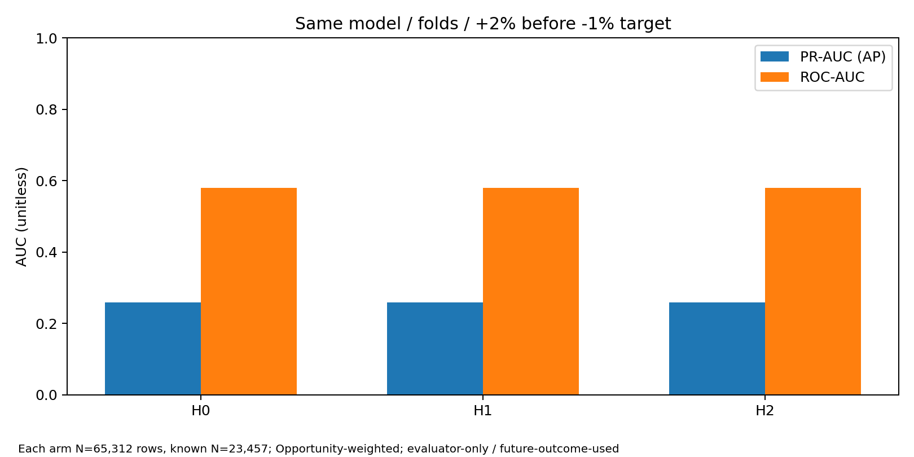
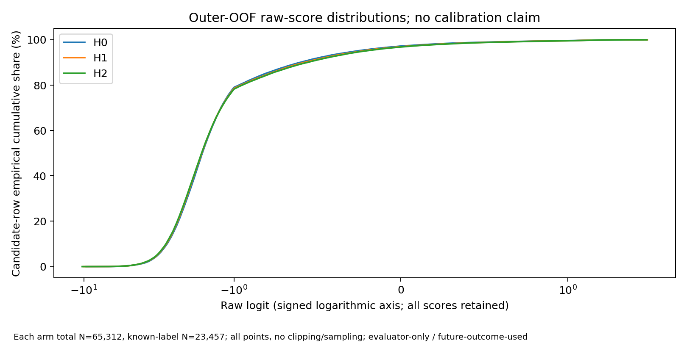
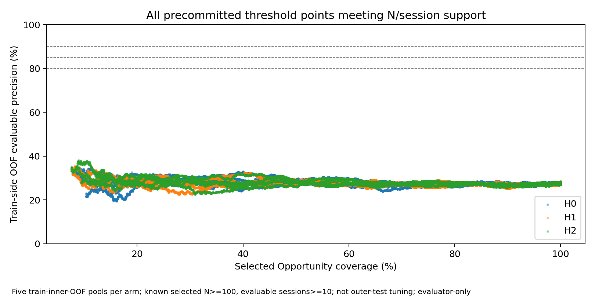
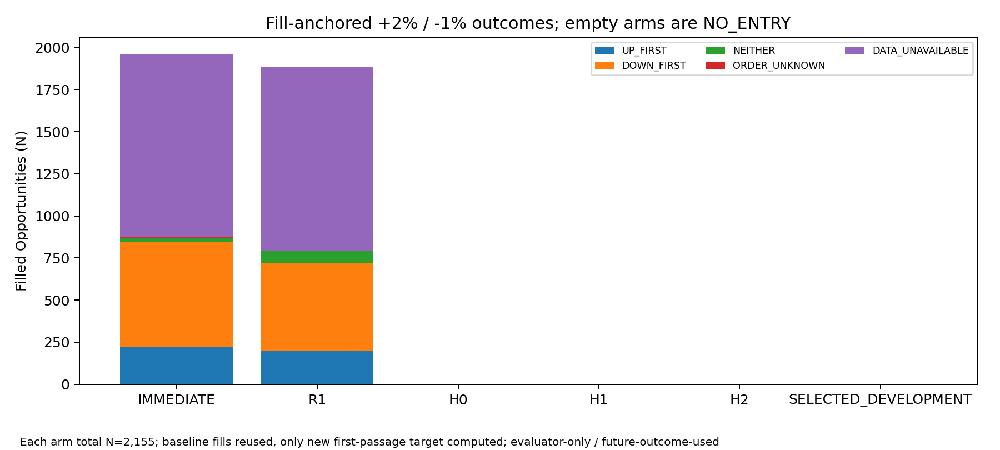
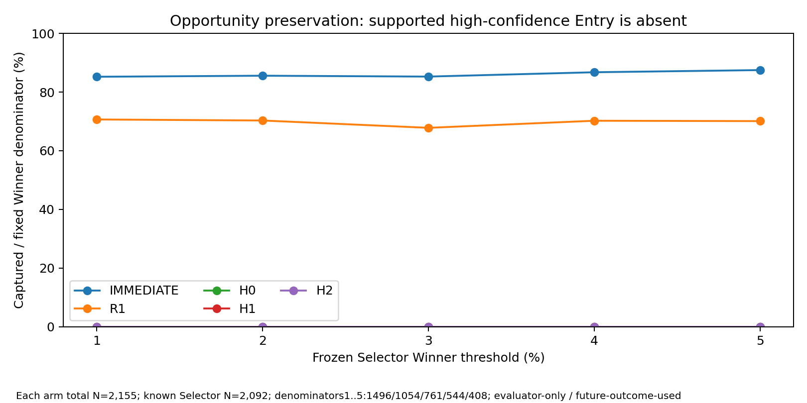

# 🚦 State9-Assisted Safe-Upside Hybrid Entry — 最終結果

現在status: `SAFE_UPSIDE_ENTRY_NO_HIGH_PRECISION_CANDIDATE`  
補足status: `STATE9_NO_INCREMENTAL_ENTRY_VALUE_ON_DEVELOPMENT`  
監査: `SAFE_UPSIDE_ENTRY_INDEPENDENT_AUDIT_PASS` / mismatch=0  
latest HEAD（本文生成前のactual GitHub GET）: `1b1d0d0a9722a6dfcf89c8ab2bc8d25ce62996cc`  
JST: `2026-10-03T10:33:44.435710+09:00`  
完了範囲: C0〜C7、固定60 fit、比較・図表・独立監査。FINAL保存後のresult HEADはGitHub commit自体を正本とする。未来のSHAは予測しない。  
次の方針: この有限仕様での追加fit・threshold緩和・Fresh Validationは開始しない。State9を正式Entryへ採用しない。`productionReady=false`。

## 🎯 結論

各candidate fill起点の「−1%を先に踏む前に+2%」を高precisionで識別できるEntryは得られなかった。H0、RC2 current追加H1、history追加H2の全15 family/foldで90/85/80% operating pointが不成立。新3armと選択armは全2,155 OpportunityでNO_HIGH_CONFIDENCE_ENTRY。
H0のPR-AUC/AP、Brier、LogLossがState追加より良く、H1 ROCの差は+0.00000166にとどまる。H2もH0を上回らなかった。State追加の実用的incremental valueは、このDevelopment・固定LR・有限feature仕様では確認できない。State9の一般的無効や新しい統計的有意性を主張する結果ではない。

## 🧬 Exact RC2 / Saved Evidence / 新規性

最終semantic freeze receiptのexact bytesを回収し、contract `45859122a62ccdc946b31bb5709f3fc080ea4a4f935958afd8f1ca895f75b6ff`、profile/M0/reference/Path/sourceを照合。29/29一致、観測Primary18/18、9/9 coverage、context-reset ACCEPTED_AS_DEFINEDを維持。Final Prefixだけをsemantic freezeの代用とはしていない。
既存R1 original grid 149,900行 / 4,931 Opportunity / 133 sessionを再利用し、current canonical2,155 Opportunity / 65,312行 / 58 session / 950 symbolへ1:1 lineageを維持。新minute grid・provider取得・old State代用0。current214 Opportunity / 6,417行のState source不足を明示的MISSINGとして保持。formal null27,818行とsource不足は区別している。
V6で宣言されたState-schema digestとcomplete FEATURE_SCHEMAのdigestはhash対象が異なるため同一digestと主張しない。最終freezeのexact current33 numeric/11 categoricalと有限過去historyを直接利用した。V6 R2 score/probability/rankは一切feature/thresholdへ接続しない。`STATE_R2_SIGNAL_NOT_REPLICATED`を維持。
旧研究との違いは、old ad-hoc Stateではなく最終RC2、Selector+1/−0.5ではなく各Entry fill+2/−1、eventual Highではなく先着順、同条件nonstate controlとの比較、forced fallbackなしNO_ENTRY許可。near-low quartile teacherやPotential eventual+5/+10の再fitはしていない。
H0は保存済み476 causal Pattern列＋凍結CONTEXT4列（480）。旧R1のSTATE/SIX86列は除外し、未保存の566列matrixを再生成しない。H1はH0+33numeric/11categorical、H2はH1+5numeric/3categoricalの有限履歴。

## 📐 Target / Fill / Split

Primary +2%/−1%は変更0。decision inputはintentまでにclosedな情報のみ。canonical fillは既存quote/retry grid上でraw open+5bps、fill価格はteacher/evaluator専用。openで順序確定できず同bar両touchならORDER_UNKNOWN。未説明のscheduled raw-minute欠落がfirst touch以前ならDATA_UNAVAILABLE。UNKNOWNをnegative/0へ補完していない。
元R1は最初のregular opening slotを除外する。prefit全4,931 Opportunityの478で最初のeligible候補delay=1。Selector anchorは最初候補行ではなく保存origin.decisionTimestamp。Lunchはactive minutesへ加えない。baseline GeometryのPM endpoint930と今回R1 clock925は明示的に分離し、旧値を書き換えない。
保存R1の5 chronological outer / 各3innerをexact再利用。train-only median/0+missing flags、train-only scaling/categories、Opportunity総eligible学習weight1。固定L2 LogisticRegression C=1/liblinear/max_iter1000/tol1e-4/class_weightNone、hyperparameter search0。60/72 fit、収束警告0。thresholdはinner OOFの初回strict >crossだけで選び、outer labelで選択0。

## 📊 OOF識別力 / State incremental value

各arm: total65,312候補行、known23,457、unknown41,855（64.08%）、knownを1行以上持つOpportunity1,337。表は各Opportunity総評価weight1。C4のrow-count UP率24.46%とこのweighted prevalence20.81%は別分母。候補行を独立取引として扱わない。

|Arm|PR-AUC/AP ↑|PR-AUC台形 ↑|ROC-AUC ↑|Brier ↓|LogLoss ↓|
|---|---|---|---|---|---|
|H0|0.259632|0.259421|0.580380|0.169508|0.526893|
|H1|0.258627|0.258419|0.580382|0.170230|0.529430|
|H2|0.259132|0.258924|0.579750|0.170553|0.530661|

Brier/LogLossはuncalibrated sigmoid(logit)の評価用診断値。校正PASSではなく、raw scoreを絶対確率としてhandoffしない。

|差分|ΔPR-AUC/AP|ΔROC-AUC|ΔBrier|ΔLogLoss|
|---|---|---|---|---|
|H1-H0|-0.00100431|0.00000166|0.00072226|0.00253712|
|H2-H0|-0.00049936|-0.00063059|0.00104480|0.00376746|
|H2-H1|0.00050495|-0.00063226|0.00032254|0.00123034|

## 🧪 90 / 85 / 80% operating-point support

固定条件はevaluable選択Opportunity≥100、evaluable session≥10、DOWN_FIRST≤10%。supportだけを満たす点のprecision上限も下表のとおり80%から遠く、supportとDOWN≤10%を同時に満たす点は全15組で0。診断上限を新Entry thresholdとして採用していない。

|outer|H0 support時最大precision|H1|H2|90/85/80 feasible|
|---|---|---|---|---|
|1|33.02%|32.43%|32.20%|全arm 0 / 0 / 0|
|2|29.83%|30.19%|33.00%|全arm 0 / 0 / 0|
|3|31.47%|30.87%|30.94%|全arm 0 / 0 / 0|
|4|34.97%|35.29%|38.14%|全arm 0 / 0 / 0|
|5|33.91%|32.69%|34.78%|全arm 0 / 0 / 0|

## 📍 Entry起点 Safe-up / Baseline

IMMEDIATE/R1の3,848 saved fillをcandidate labelへexact joinして新Primaryだけ評価。追加baseline label生成0、旧Entry decision再生成0、旧Geometry・旧Capture本集計の再計算0。

|Arm|母集団|selected|filled|evaluable|UP|DOWN|NEITHER|ORDER_UNKNOWN|DATA_UNAVAILABLE|UP/known|UP/all filled|
|---|---|---|---|---|---|---|---|---|---|---|---|
|IMMEDIATE|2155|2155|1963|870|220|623|27|6|1087|25.29%|11.21%|
|R1|2155|2155|1885|791|201|516|74|3|1091|25.41%|10.66%|
|H0|2155|0|0|0|0|0|0|0|0|UNKNOWN|UNKNOWN|
|H1|2155|0|0|0|0|0|0|0|0|UNKNOWN|UNKNOWN|
|H2|2155|0|0|0|0|0|0|0|0|UNKNOWN|UNKNOWN|
|SELECTED_DEVELOPMENT|2155|0|0|0|0|0|0|0|0|UNKNOWN|UNKNOWN|

Hybridのfilled=0は「DOWN率0%」「MAE0%」「安全性改善」を意味しない。precision/MAE/Entry→Highは測定不能UNKNOWN。各arm2,155件全体のNO_ENTRY率は100%。NO_ENTRYを不利なprice/labelで埋めていない。baselineのknown-only率にも大きなmissingness/selection制約があり、全母集団の安全確率ではない。

## 🏆 Winner保持 / 既存Geometry引用

|Selector Winner|固定分母|IMMEDIATE captured / rate|R1 captured / rate|H0/H1/H2各arm captured|各新armNO_ENTRY|
|---|---|---|---|---|---|
|+1%|1496|1275 / 85.23%|1057 / 70.66%|0|1496|
|+2%|1054|902 / 85.58%|741 / 70.30%|0|1054|
|+3%|761|649 / 85.28%|516 / 67.81%|0|761|
|+4%|544|472 / 86.76%|382 / 70.22%|0|544|
|+5%|408|357 / 87.50%|286 / 70.10%|0|408|

Selector outcome unknown63件はWinner分母やmissへ強制投入していない。+4を省略せず、+5と+3を混同していない。

|既存Geometry引用|IMMEDIATE|R1|Hybrid|
|---|---|---|---|
|strictly later High median|1.872141%|1.672065%|UNKNOWN（fill0）|
|session-end MAE median|−1.763404%|−1.605520%|UNKNOWN（fill0）|
|delay median（旧clock）|0 active min|20 active min|UNKNOWN（fill0）|

paired IMMEDIATE/R1は共通fill1,885、Primary共通known673。R1−IMMEDIATEの共通known strictly-later-upside平均差−0.254720pp、MAE平均差+0.223043pp。これらは新matched比較であって独立取引数の加算ではない。Hybridとの共通fillは0で、MAEを抑えつつ数%残したという主張はできない。

## 🕒 State Census / 安定性

current candidate census: UP5,738 / DOWN16,212 / NEITHER1,507 / ORDER_UNKNOWN73 / DATA_UNAVAILABLE41,782。全9formal Stateを保持し、semantic nullとsource不足を別集計。State/pathの小標本高率から手作業BUY/除外ruleは作っていない。secondary15組は記述保存のみで、最良組合せ選択0。

|outer|Known rows|H0 PR-AUC/AP|H1|H2|
|---|---|---|---|---|
|1|4167|0.235213|0.228812|0.227234|
|2|5098|0.258317|0.258776|0.259349|
|3|4464|0.252817|0.251034|0.250213|
|4|4774|0.273822|0.274527|0.275780|
|5|4954|0.286064|0.287349|0.291694|

State追加の識別力差はfoldで符号が揺れる。全58session別評価・symbol/session concentrationはSTATE_INCREMENTAL_VALUE.json / SESSION_SYMBOL_CONCENTRATION.jsonに保存。Hybridにfillがないため選択symbol集中や安定した安全Entryの実証はない。

## 🔍 独立監査 / Integrity

|確認|実績|
|---|---|
|source_hash_checks|219|
|all_row_causal_cutoff_checks|149900|
|H0_saved_original_cell_checks|71352400|
|H0_causal_context_cell_checks|599600|
|opportunity_weight_checks|81969|
|temporal_model_split_checks|60|
|train_only_numeric_preprocessing_checks|30220|
|independent_OOF_score_checks|1208796|
|train_only_categorical_checks|500|
|independent_threshold_boundary_checks|130249|
|capture_denominator_checks|5|
|first_cross_policy_record_checks|6465|
|baseline_primary_OHLC_bar_checks|29612|
|independent_baseline_fill_primary_checks|3848|
|evaluation_denominator_unknown_checks|6|
|new_arm_capture_checks|20|
|independent_metric_checks|18|
|lunch_clock_boundary_checks|3|
|independent_RC2_public_Path_steps|2212|
|independent_H1_H2_snapshot_checks|358|

独立dense score最大絶対差: 3.86535248253e-12。主model/helperと主label/helper import0、audit fit0、tuning0、bootstrap0、future feature input0、mismatch0。candidate PrimaryはC4別Decimal経路で全149,900行も照合済み。
監査scopeを過大表示しない: all-row cutoffとmodel/threshold算術は全数、独立RC2 full-prefix/H1/H2は事前選定12 Opportunity / 358snapshot。actual received_atはUNKNOWN。bar-end availability仮定と有限Decimal確認をlive PIT/exact-log保証に読み替えない。

## ❓ 指示書の12問への回答

|問|回答|
|---|---|
|1 exact接続|exact contract/source/grid identityとclosed-input lineageはPASS。全2,155保持。ただし214 OpportunityはState source不足として明示UNKNOWN/MISSING、全値observedという意味ではない。|
|2 新規性|最終RC2、fill起点+2/−1先着順、同条件H0比較、NO_ENTRY許可。旧State/DIRECT/near-low/Potentialの再fitではない。|
|3 H0|PR-AUC/AP0.259632、ROC0.580380。90/85/80% operating pointは全fold不成立。|
|4 H1改善|PR-AUC/AP−0.001004、Brier/LL悪化。ROC差+0.00000166だけでは採用根拠にならず、operating pointなし。|
|5 H2改善|H0比PR-AUC/AP−0.000499、ROC−0.000631、Brier/LL悪化。operating pointなし。|
|6 precisionかcoverageか|実用operating pointがなく、3armともcoverage0。同条件でprecision向上やcoverage改善を確認していない。|
|7 DOWNを減らせたか|Hybridはfill0。DOWN件数0を安全性改善と呼べない。率はUNKNOWN。baseline known DOWN率IM71.61%、R165.23%。|
|8 MAE/upside|共通Hybrid fill0で比較不能。IM/R1既存Geometryは引用済み。MAE削減＋数%upside保持の候補なし。|
|9 Winner保持|新arm+1/+2/+3/+4/+5全てCapture0、Winner各固定分母が全てNO_ENTRY。UNKNOWNはmissへ補完しない。|
|10 high-precision support|45 target check全て不成立。N≥100/session≥10でのprecision診断上限は最大38.14%、DOWN≤10%併用point0。|
|11 増分なし結論|今回DevelopmentではState9追加Entry価値未確認を維持し、Stateを優遇/採用しない。一般無効証明ではない。|
|12 次の方針|Fresh Validationを今は開かない。この有限Hybrid仕様を閉じる。Entry研究全体の打切りは一般化せず、別Precommitの前に保存source coverageの意味を整理する。|

## 🛡️ Budget / Safety / 次工程

fits60/72（Entryのみ）、state/exit fit0、hyperparameter search0、threshold selection15（固定target check45）、新candidate label pass1、追加provider0、protected/holdout/新Validation/OOS/prospective open0、bootstrap0、orders0、paper/live0、main merge0。既存R1等のpolicy再Replay0。新hybrid policyは保存OOFのfirst-cross算術のみ。EXIT/Capital/Portfolio変更0。
全execution/broker/excel/rss/live/paper/automaticPromotion/productionUpdate/transmitted flagsはfalse。LONG-only / cash-equity-only。`productionReady=false`。
次は候補不成立を理由に80%を緩和したりDown10%を緩めたりせず、保存sourceでどの欠落が未分類・no-trade・censorかを整理する。provider取得が必要なら別承認。新familyやmodel変更が必要なら別有限Precommit。H0には既に価格構造・volume関連proxyがあるため、同じ列を新familyとして再fitしない。

## 🔒 保存範囲 / Publication

公開GitHubへの全directory pushは安全審査で拒否され、再試行しなかった。価格を含む行単位label/OOF/Entry/model算術は非公開成果物として保持。GitHubには集計・contract・source・hash manifest・receipt・各checkpointを明示allowlistで保存し、各commit後actual HEAD GET確認。raw/private provider payloadや元model pickleを公開しない。
公開範囲を広げて行単位fill価格をGitHubへ出すには明示的な追加承認が必要。非公開研究成果物のhashはPRIVATE_EVIDENCE_PACKAGE_RECEIPT.json、完全row/modelデータはユーザー専用Evidence ZIP。
