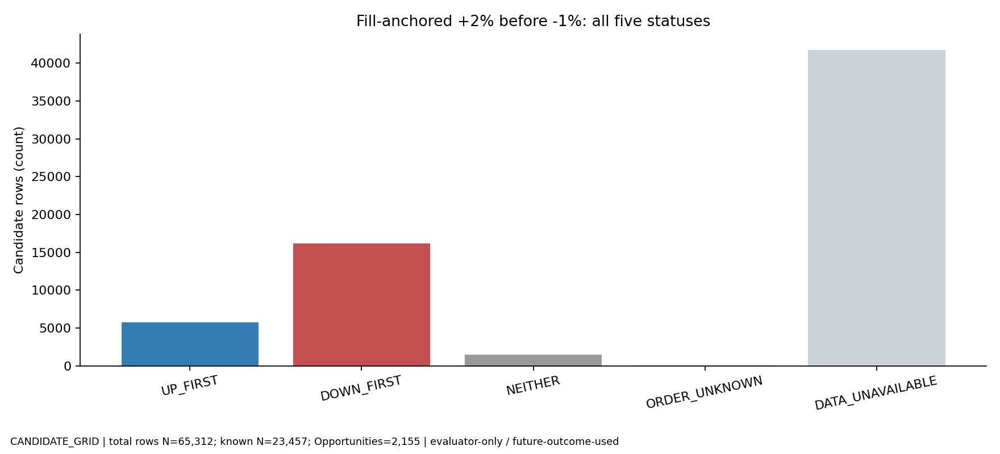
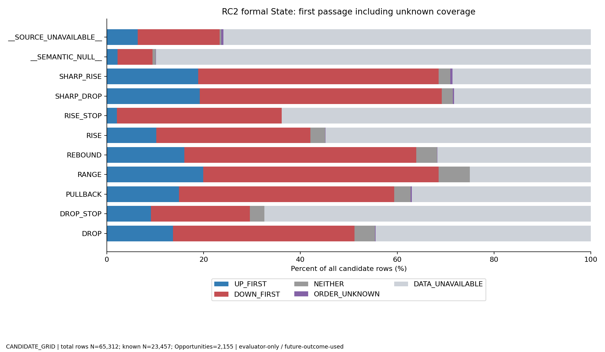
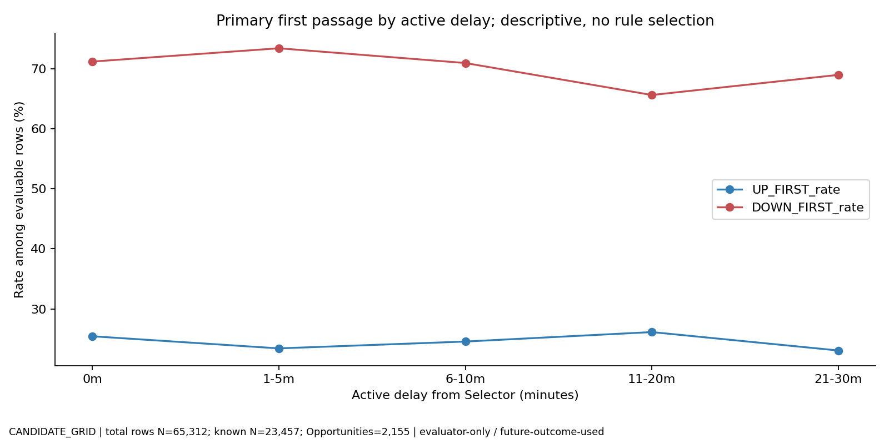

# 📊 RC2 State × fill起点 First-Passage Census

Primary: +2% before −1%。N=65,312 candidate rows / 2,155 Opportunity / 58 sessions。

候補行は独立取引ではない。全てevaluator-only / future-outcome-used。このcensusから手作業のBUY/除外ruleを作らない。

|項目|N|
|---|---:|
|UP_FIRST|5,738|
|DOWN_FIRST|16,212|
|NEITHER|1,507|
|ORDER_UNKNOWN|73|
|DATA_UNAVAILABLE|41,782|

evaluable UP_FIRST rate: 24.4618%

## ⚠️ 解釈境界

Source不足・semantic null・同bar順序不明を分離。touch時刻はbar-start lower-bound proxy。MAE-before-UPはintrabar順序不明ならexact UNKNOWNと上下boundを併記。

## 🔎 formal_primary

|Group|Rows N|Opportunity N|Known N|UP_FIRST|DOWN_FIRST|NEITHER|ORDER_UNKNOWN|DATA_UNAVAILABLE|UP / known|DOWN / known|
|---|---:|---:|---:|---:|---:|---:|---:|---:|---:|---:|
|DROP|8674|1418|4805|1187|3254|364|10|3859|24.70%|67.72%|
|DROP_STOP|132|70|43|12|27|4|0|89|27.91%|62.79%|
|PULLBACK|2701|645|1696|402|1202|92|7|998|23.70%|70.87%|
|RANGE|5094|569|3821|1015|2476|330|1|1272|26.56%|64.80%|
|REBOUND|7018|1060|4787|1124|3364|299|8|2223|23.48%|70.27%|
|RISE|4931|1175|2225|504|1569|152|2|2704|22.65%|70.52%|
|RISE_STOP|144|80|52|3|49|0|0|92|5.77%|94.23%|
|SHARP_DROP|1553|583|1110|298|777|35|4|439|26.85%|70.00%|
|SHARP_RISE|830|358|589|157|412|20|4|237|26.66%|69.95%|
|__SEMANTIC_NULL__|27818|1445|2814|625|1996|193|8|24996|22.21%|70.93%|
|__SOURCE_UNAVAILABLE__|6417|214|1515|411|1086|18|29|4873|27.13%|71.68%|

## 🔎 display_primary

|Group|Rows N|Opportunity N|Known N|UP_FIRST|DOWN_FIRST|NEITHER|ORDER_UNKNOWN|DATA_UNAVAILABLE|UP / known|DOWN / known|
|---|---:|---:|---:|---:|---:|---:|---:|---:|---:|---:|
|DROP|20484|1634|5819|1433|3935|451|15|14650|24.63%|67.62%|
|DROP_STOP|225|72|82|20|56|6|0|143|24.39%|68.29%|
|PULLBACK|3785|665|1925|478|1348|99|8|1852|24.83%|70.03%|
|RANGE|7856|663|4047|1056|2653|338|2|3807|26.09%|65.55%|
|REBOUND|9580|1114|5170|1197|3653|320|8|4402|23.15%|70.66%|
|RISE|13536|1264|2965|643|2112|210|2|10569|21.69%|71.23%|
|RISE_STOP|293|83|67|4|63|0|0|226|5.97%|94.03%|
|SHARP_DROP|2097|607|1231|337|850|44|5|861|27.38%|69.05%|
|SHARP_RISE|1039|359|636|159|456|21|4|399|25.00%|71.70%|
|__SOURCE_UNAVAILABLE__|6417|214|1515|411|1086|18|29|4873|27.13%|71.68%|

## 🔎 transition

|Group|Rows N|Opportunity N|Known N|UP_FIRST|DOWN_FIRST|NEITHER|ORDER_UNKNOWN|DATA_UNAVAILABLE|UP / known|DOWN / known|
|---|---:|---:|---:|---:|---:|---:|---:|---:|---:|---:|
|DROP>DROP_STOP|84|42|33|7|22|4|0|51|21.21%|66.67%|
|DROP>RANGE|1665|223|1259|366|717|176|0|406|29.07%|56.95%|
|DROP>REBOUND|5329|977|3588|828|2503|257|7|1734|23.08%|69.76%|
|DROP>RISE|856|355|270|49|203|18|0|586|18.15%|75.19%|
|DROP>SHARP_DROP|1187|485|826|224|572|30|3|358|27.12%|69.25%|
|DROP>SHARP_RISE|13|7|8|0|8|0|0|5|0.00%|100.00%|
|DROP_STOP>DROP|55|23|22|4|7|11|0|33|18.18%|31.82%|
|DROP_STOP>PULLBACK|8|6|0|0|0|0|0|8|UNKNOWN|UNKNOWN|
|DROP_STOP>RANGE|18|3|14|11|3|0|0|4|78.57%|21.43%|
|DROP_STOP>REBOUND|28|13|5|0|5|0|0|23|0.00%|100.00%|
|DROP_STOP>RISE|8|7|4|1|3|0|0|4|25.00%|75.00%|
|DROP_STOP>SHARP_DROP|16|11|8|0|8|0|0|8|0.00%|100.00%|
|DROP_STOP>SHARP_RISE|3|2|1|0|1|0|0|2|0.00%|100.00%|
|PULLBACK>DROP|128|85|75|15|55|5|0|53|20.00%|73.33%|
|PULLBACK>DROP_STOP|29|18|6|1|5|0|0|23|16.67%|83.33%|
|PULLBACK>RANGE|482|69|375|63|273|39|0|107|16.80%|72.80%|
|PULLBACK>RISE|1483|411|1026|229|735|62|0|457|22.32%|71.64%|
|PULLBACK>SHARP_DROP|74|29|60|18|41|1|0|14|30.00%|68.33%|
|PULLBACK>SHARP_RISE|38|26|31|6|23|2|0|7|19.35%|74.19%|
|RANGE>DROP|251|140|205|46|143|16|0|46|22.44%|69.76%|
|RANGE>RISE|245|140|178|42|123|13|0|67|23.60%|69.10%|
|RANGE>SHARP_DROP|133|67|114|25|87|2|0|19|21.93%|76.32%|
|RANGE>SHARP_RISE|115|58|100|27|72|1|0|15|27.00%|72.00%|
|REBOUND>DROP|5033|875|3588|945|2380|263|4|1441|26.34%|66.33%|
|REBOUND>RANGE|2243|271|1716|481|1129|106|1|526|28.03%|65.79%|
|REBOUND>RISE|191|123|120|32|81|7|0|71|26.67%|67.50%|
|REBOUND>RISE_STOP|63|37|29|2|27|0|0|34|6.90%|93.10%|
|REBOUND>SHARP_DROP|113|64|96|31|63|2|1|16|32.29%|65.62%|
|REBOUND>SHARP_RISE|105|55|67|16|51|0|3|35|23.88%|76.12%|
|RISE>DROP|754|321|244|47|181|16|0|510|19.26%|74.18%|
|RISE>PULLBACK|2007|566|1245|274|903|68|4|758|22.01%|72.53%|
|RISE>RANGE|557|81|384|86|289|9|0|173|22.40%|75.26%|
|RISE>RISE_STOP|69|38|17|1|16|0|0|52|5.88%|94.12%|
|RISE>SHARP_RISE|524|233|368|107|244|17|1|155|29.08%|66.30%|
|RISE_STOP>DROP|23|9|4|3|1|0|0|19|75.00%|25.00%|
|RISE_STOP>PULLBACK|9|5|3|0|3|0|0|6|0.00%|100.00%|
|RISE_STOP>RANGE|50|6|25|0|25|0|0|25|0.00%|100.00%|
|RISE_STOP>REBOUND|41|20|19|1|18|0|0|22|5.26%|94.74%|
|RISE_STOP>RISE|14|8|3|0|3|0|0|11|0.00%|100.00%|
|RISE_STOP>SHARP_DROP|10|4|1|0|1|0|0|9|0.00%|100.00%|
|RISE_STOP>SHARP_RISE|17|10|11|1|10|0|0|6|9.09%|90.91%|
|SHARP_DROP>DROP|205|124|132|32|83|17|0|73|24.24%|62.88%|
|SHARP_DROP>DROP_STOP|19|13|4|4|0|0|0|15|100.00%|0.00%|
|SHARP_DROP>RANGE|23|6|20|8|12|0|0|3|40.00%|60.00%|
|SHARP_DROP>REBOUND|1620|507|1175|295|838|42|1|444|25.11%|71.32%|
|SHARP_DROP>RISE|2|2|2|0|2|0|0|0|0.00%|100.00%|
|SHARP_RISE>DROP|4|2|2|0|2|0|0|2|0.00%|100.00%|
|SHARP_RISE>PULLBACK|677|244|448|128|296|24|3|226|28.57%|66.07%|
|SHARP_RISE>RANGE|40|4|22|0|22|0|0|18|0.00%|100.00%|
|SHARP_RISE>RISE|118|57|82|25|45|12|0|36|30.49%|54.88%|
|SHARP_RISE>RISE_STOP|12|7|6|0|6|0|0|6|0.00%|100.00%|
|__UNKNOWN_HISTORY__|38521|1670|5416|1257|3872|287|45|33060|23.21%|71.49%|

## 🔎 last3

|Group|Rows N|Opportunity N|Known N|UP_FIRST|DOWN_FIRST|NEITHER|ORDER_UNKNOWN|DATA_UNAVAILABLE|UP / known|DOWN / known|
|---|---:|---:|---:|---:|---:|---:|---:|---:|---:|---:|
|DROP>DROP_STOP>DROP|54|22|22|4|7|11|0|32|18.18%|31.82%|
|DROP>DROP_STOP>RANGE|18|3|14|11|3|0|0|4|78.57%|21.43%|
|DROP>DROP_STOP>REBOUND|9|6|4|0|4|0|0|5|0.00%|100.00%|
|DROP>DROP_STOP>RISE|5|4|2|0|2|0|0|3|0.00%|100.00%|
|DROP>DROP_STOP>SHARP_DROP|10|6|6|0|6|0|0|4|0.00%|100.00%|
|DROP>RANGE>DROP|97|51|84|21|50|13|0|13|25.00%|59.52%|
|DROP>RANGE>RISE|75|43|56|17|34|5|0|19|30.36%|60.71%|
|DROP>RANGE>SHARP_DROP|35|23|31|8|22|1|0|4|25.81%|70.97%|
|DROP>RANGE>SHARP_RISE|40|18|35|14|21|0|0|5|40.00%|60.00%|
|DROP>REBOUND>DROP|3721|769|2598|669|1710|219|2|1121|25.75%|65.82%|
|DROP>REBOUND>RANGE|2109|257|1608|465|1037|106|1|500|28.92%|64.49%|
|DROP>REBOUND>RISE|180|116|111|28|78|5|0|69|25.23%|70.27%|
|DROP>REBOUND>RISE_STOP|35|24|10|1|9|0|0|25|10.00%|90.00%|
|DROP>REBOUND>SHARP_DROP|60|35|49|16|32|1|0|11|32.65%|65.31%|
|DROP>REBOUND>SHARP_RISE|80|43|47|12|35|0|3|30|25.53%|74.47%|
|DROP>RISE>DROP|201|100|61|16|40|5|0|140|26.23%|65.57%|
|DROP>RISE>PULLBACK|187|93|97|15|74|8|1|89|15.46%|76.29%|
|DROP>RISE>RANGE|56|9|16|1|15|0|0|40|6.25%|93.75%|
|DROP>RISE>RISE_STOP|17|8|2|1|1|0|0|15|50.00%|50.00%|
|DROP>RISE>SHARP_RISE|44|27|25|6|18|1|0|19|24.00%|72.00%|
|DROP>SHARP_DROP>DROP|170|97|109|29|65|15|0|61|26.61%|59.63%|
|DROP>SHARP_DROP>DROP_STOP|17|11|4|4|0|0|0|13|100.00%|0.00%|
|DROP>SHARP_DROP>RANGE|20|5|20|8|12|0|0|0|40.00%|60.00%|
|DROP>SHARP_DROP>REBOUND|1227|415|881|202|644|35|1|345|22.93%|73.10%|
|DROP>SHARP_DROP>RISE|1|1|1|0|1|0|0|0|0.00%|100.00%|
|DROP>SHARP_RISE>PULLBACK|14|6|5|2|3|0|0|9|40.00%|60.00%|
|DROP_STOP>DROP>DROP_STOP|4|1|4|3|1|0|0|0|75.00%|25.00%|
|DROP_STOP>DROP>RANGE|52|6|18|0|1|17|0|34|0.00%|5.56%|
|DROP_STOP>DROP>REBOUND|23|8|14|2|3|9|0|9|14.29%|21.43%|
|DROP_STOP>DROP>SHARP_DROP|8|3|5|3|2|0|0|3|60.00%|40.00%|
|DROP_STOP>PULLBACK>RISE|7|4|4|0|4|0|0|3|0.00%|100.00%|
|DROP_STOP>PULLBACK>SHARP_RISE|1|1|0|0|0|0|0|1|UNKNOWN|UNKNOWN|
|DROP_STOP>RANGE>RISE|3|1|0|0|0|0|0|3|UNKNOWN|UNKNOWN|
|DROP_STOP>RANGE>SHARP_DROP|1|1|1|1|0|0|0|0|100.00%|0.00%|
|DROP_STOP>REBOUND>DROP|6|5|3|1|2|0|0|3|33.33%|66.67%|
|DROP_STOP>REBOUND>RISE_STOP|4|2|1|0|1|0|0|3|0.00%|100.00%|
|DROP_STOP>REBOUND>SHARP_RISE|3|1|2|0|2|0|0|1|0.00%|100.00%|
|DROP_STOP>RISE>DROP|6|3|0|0|0|0|0|6|UNKNOWN|UNKNOWN|
|DROP_STOP>RISE>PULLBACK|6|3|1|1|0|0|0|5|100.00%|0.00%|
|DROP_STOP>RISE>SHARP_RISE|2|2|0|0|0|0|0|2|UNKNOWN|UNKNOWN|
|DROP_STOP>SHARP_DROP>DROP|7|5|2|0|2|0|0|5|0.00%|100.00%|
|DROP_STOP>SHARP_DROP>RANGE|3|1|0|0|0|0|0|3|UNKNOWN|UNKNOWN|
|DROP_STOP>SHARP_DROP>REBOUND|11|4|3|0|3|0|0|8|0.00%|100.00%|
|DROP_STOP>SHARP_RISE>PULLBACK|1|1|0|0|0|0|0|1|UNKNOWN|UNKNOWN|
|PULLBACK>DROP>RANGE|25|3|17|10|7|0|0|8|58.82%|41.18%|
|PULLBACK>DROP>REBOUND|103|51|68|8|60|0|0|35|11.76%|88.24%|
|PULLBACK>DROP>SHARP_DROP|53|27|38|13|25|0|0|15|34.21%|65.79%|
|PULLBACK>DROP_STOP>PULLBACK|8|6|0|0|0|0|0|8|UNKNOWN|UNKNOWN|
|PULLBACK>DROP_STOP>RISE|3|3|2|1|1|0|0|1|50.00%|50.00%|
|PULLBACK>DROP_STOP>SHARP_DROP|3|2|2|0|2|0|0|1|0.00%|100.00%|
|PULLBACK>DROP_STOP>SHARP_RISE|3|2|1|0|1|0|0|2|0.00%|100.00%|
|PULLBACK>RANGE>DROP|21|12|15|2|13|0|0|6|13.33%|86.67%|
|PULLBACK>RANGE>RISE|15|11|12|1|11|0|0|3|8.33%|91.67%|
|PULLBACK>RANGE>SHARP_DROP|29|8|25|6|19|0|0|4|24.00%|76.00%|
|PULLBACK>RANGE>SHARP_RISE|3|2|3|0|3|0|0|0|0.00%|100.00%|
|PULLBACK>RISE>DROP|33|18|29|3|25|1|0|4|10.34%|86.21%|
|PULLBACK>RISE>PULLBACK|1009|287|688|166|494|28|2|319|24.13%|71.80%|
|PULLBACK>RISE>RANGE|355|62|241|67|165|9|0|114|27.80%|68.46%|
|PULLBACK>RISE>RISE_STOP|6|4|1|0|1|0|0|5|0.00%|100.00%|
|PULLBACK>RISE>SHARP_RISE|162|76|123|35|84|4|0|39|28.46%|68.29%|
|PULLBACK>SHARP_DROP>DROP|1|1|1|0|1|0|0|0|0.00%|100.00%|
|PULLBACK>SHARP_DROP>REBOUND|74|30|54|18|35|1|0|20|33.33%|64.81%|
|PULLBACK>SHARP_DROP>RISE|1|1|1|0|1|0|0|0|0.00%|100.00%|
|PULLBACK>SHARP_RISE>PULLBACK|44|19|28|10|14|4|1|15|35.71%|50.00%|
|PULLBACK>SHARP_RISE>RISE|8|5|8|1|7|0|0|0|12.50%|87.50%|
|RANGE>DROP>DROP_STOP|2|1|1|0|1|0|0|1|0.00%|100.00%|
|RANGE>DROP>RANGE|45|6|41|16|25|0|0|4|39.02%|60.98%|
|RANGE>DROP>REBOUND|219|91|175|30|119|26|0|44|17.14%|68.00%|
|RANGE>DROP>RISE|11|2|5|0|5|0|0|6|0.00%|100.00%|
|RANGE>DROP>SHARP_DROP|113|56|98|23|73|2|1|14|23.47%|74.49%|
|RANGE>RISE>PULLBACK|203|85|156|26|111|19|0|47|16.67%|71.15%|
|RANGE>RISE>RANGE|21|3|13|0|13|0|0|8|0.00%|100.00%|
|RANGE>RISE>RISE_STOP|7|3|2|0|2|0|0|5|0.00%|100.00%|
|RANGE>RISE>SHARP_RISE|90|43|77|12|61|4|0|13|15.58%|79.22%|
|RANGE>SHARP_DROP>DROP|5|4|1|0|1|0|0|4|0.00%|100.00%|
|RANGE>SHARP_DROP>DROP_STOP|1|1|0|0|0|0|0|1|UNKNOWN|UNKNOWN|
|RANGE>SHARP_DROP>REBOUND|162|65|131|40|88|3|0|31|30.53%|67.18%|
|RANGE>SHARP_RISE>PULLBACK|109|44|84|14|67|3|0|25|16.67%|79.76%|
|RANGE>SHARP_RISE>RISE|8|4|8|5|2|1|0|0|62.50%|25.00%|
|REBOUND>DROP>DROP_STOP|26|14|12|0|8|4|0|14|0.00%|66.67%|
|REBOUND>DROP>RANGE|1505|204|1163|331|678|154|0|342|28.46%|58.30%|
|REBOUND>DROP>REBOUND|4025|738|2920|721|2014|185|5|1100|24.69%|68.97%|
|REBOUND>DROP>RISE|49|32|37|11|25|1|0|12|29.73%|67.57%|
|REBOUND>DROP>SHARP_DROP|680|283|526|135|372|19|0|154|25.67%|70.72%|
|REBOUND>DROP>SHARP_RISE|10|5|7|0|7|0|0|3|0.00%|100.00%|
|REBOUND>RANGE>DROP|100|58|79|20|56|3|0|21|25.32%|70.89%|
|REBOUND>RANGE>RISE|126|76|97|20|71|6|0|29|20.62%|73.20%|
|REBOUND>RANGE>SHARP_DROP|49|28|41|10|30|1|0|8|24.39%|73.17%|
|REBOUND>RANGE>SHARP_RISE|61|31|51|8|42|1|0|10|15.69%|82.35%|
|REBOUND>RISE>DROP|1|1|1|0|1|0|0|0|0.00%|100.00%|
|REBOUND>RISE>PULLBACK|147|61|105|26|79|0|1|41|24.76%|75.24%|
|REBOUND>RISE>RANGE|95|5|89|9|80|0|0|6|10.11%|89.89%|
|REBOUND>RISE>SHARP_RISE|83|41|60|25|32|3|0|23|41.67%|53.33%|
|REBOUND>RISE_STOP>DROP|11|6|0|0|0|0|0|11|UNKNOWN|UNKNOWN|
|REBOUND>RISE_STOP>RANGE|44|4|25|0|25|0|0|19|0.00%|100.00%|
|REBOUND>RISE_STOP>REBOUND|41|20|19|1|18|0|0|22|5.26%|94.74%|
|REBOUND>RISE_STOP>SHARP_DROP|10|4|1|0|1|0|0|9|0.00%|100.00%|
|REBOUND>RISE_STOP>SHARP_RISE|1|1|0|0|0|0|0|1|UNKNOWN|UNKNOWN|
|REBOUND>SHARP_DROP>DROP|21|16|18|3|13|2|0|3|16.67%|72.22%|
|REBOUND>SHARP_DROP>REBOUND|126|50|98|35|60|3|0|28|35.71%|61.22%|
|REBOUND>SHARP_RISE>DROP|2|1|0|0|0|0|0|2|UNKNOWN|UNKNOWN|
|REBOUND>SHARP_RISE>PULLBACK|84|37|57|17|36|4|0|27|29.82%|63.16%|
|REBOUND>SHARP_RISE>RISE|24|7|13|6|7|0|0|11|46.15%|53.85%|
|REBOUND>SHARP_RISE>RISE_STOP|2|1|2|0|2|0|0|0|0.00%|100.00%|
|RISE>DROP>DROP_STOP|7|6|0|0|0|0|0|7|UNKNOWN|UNKNOWN|
|RISE>DROP>RANGE|31|6|19|9|5|5|0|12|47.37%|26.32%|
|RISE>DROP>REBOUND|213|107|91|13|74|4|0|122|14.29%|81.32%|
|RISE>DROP>RISE|242|104|80|13|62|5|0|162|16.25%|77.50%|
|RISE>DROP>SHARP_DROP|67|37|34|10|21|3|1|32|29.41%|61.76%|
|RISE>DROP>SHARP_RISE|2|1|0|0|0|0|0|2|UNKNOWN|UNKNOWN|
|RISE>PULLBACK>DROP|118|77|71|15|51|5|0|47|21.13%|71.83%|
|RISE>PULLBACK>DROP_STOP|19|13|5|1|4|0|0|14|20.00%|80.00%|
|RISE>PULLBACK>RANGE|466|63|366|60|267|39|0|100|16.39%|72.95%|
|RISE>PULLBACK>RISE|1085|339|750|152|548|50|0|335|20.27%|73.07%|
|RISE>PULLBACK>SHARP_DROP|68|26|57|16|40|1|0|11|28.07%|70.18%|
|RISE>PULLBACK>SHARP_RISE|15|12|11|2|9|0|0|4|18.18%|81.82%|
|RISE>RANGE>DROP|25|17|19|3|16|0|0|6|15.79%|84.21%|
|RISE>RANGE>RISE|24|11|12|4|6|2|0|12|33.33%|50.00%|
|RISE>RANGE>SHARP_DROP|17|7|16|0|16|0|0|1|0.00%|100.00%|
|RISE>RANGE>SHARP_RISE|10|6|10|5|5|0|0|0|50.00%|50.00%|
|RISE>RISE_STOP>DROP|12|3|4|3|1|0|0|8|75.00%|25.00%|
|RISE>RISE_STOP>PULLBACK|7|3|3|0|3|0|0|4|0.00%|100.00%|
|RISE>RISE_STOP>RANGE|6|2|0|0|0|0|0|6|UNKNOWN|UNKNOWN|
|RISE>RISE_STOP>RISE|13|7|3|0|3|0|0|10|0.00%|100.00%|
|RISE>RISE_STOP>SHARP_RISE|12|7|9|1|8|0|0|3|11.11%|88.89%|
|RISE>SHARP_DROP>REBOUND|2|1|2|0|2|0|0|0|0.00%|100.00%|
|RISE>SHARP_RISE>DROP|2|1|2|0|2|0|0|0|0.00%|100.00%|
|RISE>SHARP_RISE>PULLBACK|421|160|273|85|175|13|2|146|31.14%|64.10%|
|RISE>SHARP_RISE>RANGE|40|4|22|0|22|0|0|18|0.00%|100.00%|
|RISE>SHARP_RISE>RISE|74|40|50|11|28|11|0|24|22.00%|56.00%|
|RISE>SHARP_RISE>RISE_STOP|5|3|2|0|2|0|0|3|0.00%|100.00%|
|RISE_STOP>DROP>DROP_STOP|3|1|3|2|1|0|0|0|66.67%|33.33%|
|RISE_STOP>DROP>REBOUND|9|3|5|0|5|0|0|4|0.00%|100.00%|
|RISE_STOP>DROP>RISE|5|2|2|0|2|0|0|3|0.00%|100.00%|
|RISE_STOP>DROP>SHARP_DROP|1|1|0|0|0|0|0|1|UNKNOWN|UNKNOWN|
|RISE_STOP>PULLBACK>DROP|2|1|0|0|0|0|0|2|UNKNOWN|UNKNOWN|
|RISE_STOP>PULLBACK>DROP_STOP|1|1|0|0|0|0|0|1|UNKNOWN|UNKNOWN|
|RISE_STOP>PULLBACK>RISE|4|1|0|0|0|0|0|4|UNKNOWN|UNKNOWN|
|RISE_STOP>PULLBACK>SHARP_DROP|2|1|0|0|0|0|0|2|UNKNOWN|UNKNOWN|
|RISE_STOP>RANGE>DROP|3|1|3|0|3|0|0|0|0.00%|100.00%|
|RISE_STOP>REBOUND>DROP|32|11|22|5|17|0|0|10|22.73%|77.27%|
|RISE_STOP>REBOUND>RANGE|1|1|1|0|1|0|0|0|0.00%|100.00%|
|RISE_STOP>REBOUND>RISE_STOP|1|1|0|0|0|0|0|1|UNKNOWN|UNKNOWN|
|RISE_STOP>REBOUND>SHARP_DROP|6|2|5|0|5|0|0|1|0.00%|100.00%|
|RISE_STOP>RISE>PULLBACK|2|2|0|0|0|0|0|2|UNKNOWN|UNKNOWN|
|RISE_STOP>RISE>RANGE|16|1|16|9|7|0|0|0|56.25%|43.75%|
|RISE_STOP>RISE>SHARP_RISE|3|1|0|0|0|0|0|3|UNKNOWN|UNKNOWN|
|RISE_STOP>SHARP_DROP>REBOUND|5|3|1|0|1|0|0|4|0.00%|100.00%|
|RISE_STOP>SHARP_RISE>PULLBACK|4|3|1|0|1|0|0|3|0.00%|100.00%|
|RISE_STOP>SHARP_RISE>RISE|4|2|3|2|1|0|0|1|66.67%|33.33%|
|RISE_STOP>SHARP_RISE>RISE_STOP|1|1|1|0|1|0|0|0|0.00%|100.00%|
|SHARP_DROP>DROP>DROP_STOP|12|7|9|1|8|0|0|3|11.11%|88.89%|
|SHARP_DROP>DROP>RANGE|7|1|1|0|1|0|0|6|0.00%|100.00%|
|SHARP_DROP>DROP>REBOUND|212|79|140|28|91|21|0|72|20.00%|65.00%|
|SHARP_DROP>DROP>SHARP_DROP|81|47|57|16|35|6|1|23|28.07%|61.40%|
|SHARP_DROP>DROP_STOP>DROP|1|1|0|0|0|0|0|1|UNKNOWN|UNKNOWN|
|SHARP_DROP>DROP_STOP>REBOUND|19|7|1|0|1|0|0|18|0.00%|100.00%|
|SHARP_DROP>DROP_STOP>SHARP_DROP|3|3|0|0|0|0|0|3|UNKNOWN|UNKNOWN|
|SHARP_DROP>RANGE>DROP|5|3|5|0|5|0|0|0|0.00%|100.00%|
|SHARP_DROP>RANGE>RISE|2|2|1|0|1|0|0|1|0.00%|100.00%|
|SHARP_DROP>RANGE>SHARP_RISE|1|1|1|0|1|0|0|0|0.00%|100.00%|
|SHARP_DROP>REBOUND>DROP|1274|471|965|270|651|44|2|307|27.98%|67.46%|
|SHARP_DROP>REBOUND>RANGE|133|14|107|16|91|0|0|26|14.95%|85.05%|
|SHARP_DROP>REBOUND>RISE|11|7|9|4|3|2|0|2|44.44%|33.33%|
|SHARP_DROP>REBOUND>RISE_STOP|23|11|18|1|17|0|0|5|5.56%|94.44%|
|SHARP_DROP>REBOUND>SHARP_DROP|47|27|42|15|26|1|1|4|35.71%|61.90%|
|SHARP_DROP>REBOUND>SHARP_RISE|22|11|18|4|14|0|0|4|22.22%|77.78%|
|SHARP_DROP>RISE>PULLBACK|4|1|4|4|0|0|0|0|100.00%|0.00%|
|SHARP_DROP>RISE>RANGE|6|1|1|0|1|0|0|5|0.00%|100.00%|
|SHARP_RISE>DROP>REBOUND|4|2|3|2|1|0|0|1|66.67%|33.33%|
|SHARP_RISE>PULLBACK>DROP|8|7|4|0|4|0|0|4|0.00%|100.00%|
|SHARP_RISE>PULLBACK>DROP_STOP|9|4|1|0|1|0|0|8|0.00%|100.00%|
|SHARP_RISE>PULLBACK>RANGE|16|6|9|3|6|0|0|7|33.33%|66.67%|
|SHARP_RISE>PULLBACK>RISE|387|172|272|77|183|12|0|115|28.31%|67.28%|
|SHARP_RISE>PULLBACK>SHARP_DROP|4|2|3|2|1|0|0|1|66.67%|33.33%|
|SHARP_RISE>PULLBACK>SHARP_RISE|22|14|20|4|14|2|0|2|20.00%|70.00%|
|SHARP_RISE>RISE>PULLBACK|88|35|58|10|38|10|0|30|17.24%|65.52%|
|SHARP_RISE>RISE>RANGE|8|1|8|0|8|0|0|0|0.00%|100.00%|
|SHARP_RISE>RISE>RISE_STOP|1|1|0|0|0|0|0|1|UNKNOWN|UNKNOWN|
|SHARP_RISE>RISE>SHARP_RISE|26|10|23|13|8|2|0|3|56.52%|34.78%|
|SHARP_RISE>RISE_STOP>PULLBACK|2|2|0|0|0|0|0|2|UNKNOWN|UNKNOWN|
|SHARP_RISE>RISE_STOP>RISE|1|1|0|0|0|0|0|1|UNKNOWN|UNKNOWN|
|SHARP_RISE>RISE_STOP>SHARP_RISE|4|3|2|0|2|0|0|2|0.00%|100.00%|
|__UNKNOWN_HISTORY__|40853|1677|6175|1401|4447|327|48|34630|22.69%|72.02%|

## 🔎 dwell_bucket

|Group|Rows N|Opportunity N|Known N|UP_FIRST|DOWN_FIRST|NEITHER|ORDER_UNKNOWN|DATA_UNAVAILABLE|UP / known|DOWN / known|
|---|---:|---:|---:|---:|---:|---:|---:|---:|---:|---:|
|0m|13294|1607|7472|1845|5194|433|12|5810|24.69%|69.51%|
|1-5m|14766|1408|9248|2250|6375|623|23|5495|24.33%|68.93%|
|16-30m|668|89|572|134|377|61|0|96|23.43%|65.91%|
|6-15m|2086|427|1605|402|1038|165|0|481|25.05%|64.67%|
|>30m|263|24|231|71|146|14|1|31|30.74%|63.20%|
|__UNKNOWN__|34235|1659|4329|1036|3082|211|37|29869|23.93%|71.19%|

## 🔎 delay_bucket

|Group|Rows N|Opportunity N|Known N|UP_FIRST|DOWN_FIRST|NEITHER|ORDER_UNKNOWN|DATA_UNAVAILABLE|UP / known|DOWN / known|
|---|---:|---:|---:|---:|---:|---:|---:|---:|---:|---:|
|0m|1954|1954|802|204|571|27|4|1148|25.44%|71.20%|
|1-5m|10775|2155|4262|998|3129|135|25|6488|23.42%|73.42%|
|11-20m|21550|2155|7623|1992|5003|628|16|13911|26.13%|65.63%|
|21-30m|20258|2155|6738|1554|4648|536|16|13504|23.06%|68.98%|
|6-10m|10775|2155|4032|990|2861|181|12|6731|24.55%|70.96%|

## 🔎 time_of_day

|Group|Rows N|Opportunity N|Known N|UP_FIRST|DOWN_FIRST|NEITHER|ORDER_UNKNOWN|DATA_UNAVAILABLE|UP / known|DOWN / known|
|---|---:|---:|---:|---:|---:|---:|---:|---:|---:|---:|
|09:00|8700|290|4670|1268|3370|32|24|4006|27.15%|72.16%|
|10:00|15830|799|6108|1612|4415|81|12|9710|26.39%|72.28%|
|11:00|6779|457|2182|579|1602|1|3|4594|26.54%|73.42%|
|12:00|5829|201|1677|407|1261|9|22|4130|24.27%|75.19%|
|13:00|12388|600|4007|905|2839|263|8|8373|22.59%|70.85%|
|14:00|11137|541|3015|725|2080|210|4|8118|24.05%|68.99%|
|15:00|4649|353|1798|242|645|911|0|2851|13.46%|35.87%|

## 🔎 selector_future_MFE_bucket

|Group|Rows N|Opportunity N|Known N|UP_FIRST|DOWN_FIRST|NEITHER|ORDER_UNKNOWN|DATA_UNAVAILABLE|UP / known|DOWN / known|
|---|---:|---:|---:|---:|---:|---:|---:|---:|---:|---:|
|1-<2%|13341|442|4138|382|3210|546|5|9198|9.23%|77.57%|
|2-<3%|8923|293|2724|645|1963|116|1|6198|23.68%|72.06%|
|3-<4%|6606|217|2213|718|1459|36|4|4389|32.44%|65.93%|
|4-<5%|4178|136|1805|810|983|12|1|2372|44.88%|54.46%|
|<1%|17874|596|5619|303|4553|763|5|12250|5.39%|81.03%|
|>=5%|12510|408|6942|2878|4030|34|57|5511|41.46%|58.05%|
|__UNKNOWN__|1880|63|16|2|14|0|0|1864|12.50%|87.50%|
